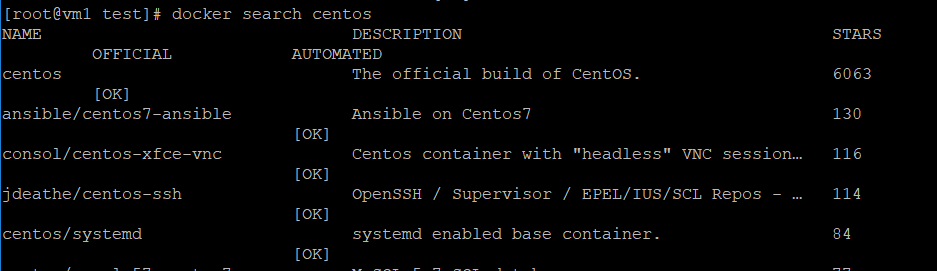
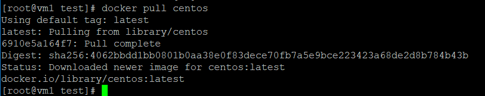
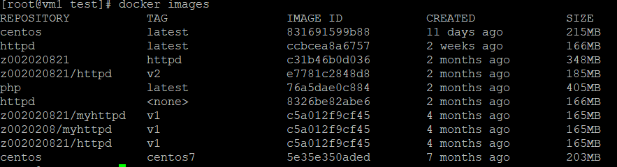
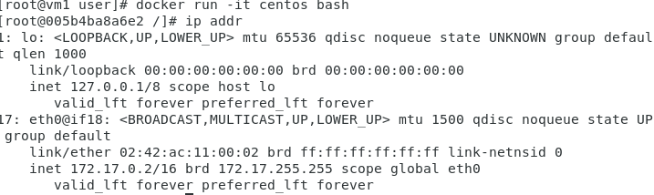
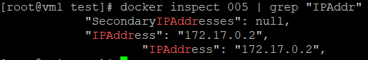
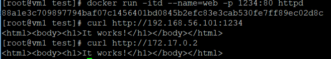

# Docker&Dockerfile練習
## Docker指令
* 查看Docker目前資訊
    ```
    [root@vm1 test]# docker info
    Client:
    Debug Mode: false

    Server:
    Containers: 6
    Running: 1
    Paused: 0
    Stopped: 5
    Images: 9
    Server Version: 19.03.8
    Storage Driver: overlay2
    Backing Filesystem: <unknown>
    Supports d_type: true
    Native Overlay Diff: true
    Logging Driver: json-file
    Cgroup Driver: cgroupfs
    Plugins:
    Volume: local
    Network: bridge host ipvlan macvlan null overlay
    Log: awslogs fluentd gcplogs gelf journald json-file local logentries splunk syslog
    Swarm: inactive
    Runtimes: runc
    Default Runtime: runc
    Init Binary: docker-init
    containerd version: 7ad184331fa3e55e52b890ea95e65ba581ae3429
    runc version: dc9208a3303feef5b3839f4323d9beb36df0a9dd
    init version: fec3683
    Security Options:
    seccomp
    Profile: default
    Kernel Version: 3.10.0-1062.12.1.el7.x86_64
    Operating System: CentOS Linux 7 (Core)
    OSType: linux
    Architecture: x86_64
    CPUs: 1
    Total Memory: 1.795GiB
    Name: vm1
    ID: 3A7O:MOMO:X3O2:Q6J4:KLJY:VVHE:MW3C:2QPF:CDCK:MKLE:6PLS:WRD5
    Docker Root Dir: /var/lib/docker
    Debug Mode: false
    Username: z002020821
    Registry: https://index.docker.io/v1/
    Labels:
    Experimental: false
    Insecure Registries:
    127.0.0.0/8
    Live Restore Enabled: false
    ```
* 搜尋Docker Hub上的鏡像檔
    * star數量越多代表來源可信度越高

* 下載鏡像檔



* 查看鏡像檔



>* 可以利用Kubernetes(K8S)來管理Docker
>* Kubernetes(K8S)用於自動部署、擴充和管理「容器化應用程式」的開源系統。

* 啟動鏡像產生容器
    ```docker run [參數] [要執行的鏡像名稱] [要執行的動作]```
    * 常用參數
        * `-i`:互動
        * `-t`:終端
        * `-d`:背景執行
        * `-p`:所使用port
        * ` --name`:指定容器名稱
        * `-v`:將資料夾或檔案映射到容器裡 
* 查看容器
    * 查看正在執行容器
    ```docker ps```
    * 查看全部容器
    ```docker ps -a```

* 刪除容器
    * 刪除1個容器
    ``` docker rm -f [容器Process ID]```
    * 刪除全部容器
    ```docker rm -f $(docker ps -a -q)```
* 查看容器相關資訊
    ```docker inspect [容器Process ID]```

* 查看容器IP的方式
    1.進入容器輸入"ip addr"指令
    
    2.利用"docker inspect [容器Process ID] | grep "IPAddress"\"
    
    >* 想要在容器裡使用ifconfig的話，要安裝"net-tool" 

* 把目前鏡像內容儲存產生新的鏡像
    ```docker commit [容器Process ID] [新鏡像的名稱]```

    * 新產生的鏡像只會儲存被更改過的內容，但它會計算先前的鏡像的大小

        ```
        [root@vm1 test]# docker images | grep centos
        centos               latest              831691599b88        11 days ago         215MB
        centos               centos7             5e35e350aded        7 months ago        203MB
        ```

* 將容器停止
    ```docker stop [容器Process ID]```
* 將httpd取名為web並將本機端1234port映射到容器的80port

 

## Dockerfile
* 製作image方式
    1.先下載別人的image,在進行修改產生新的image
    2.製作Dockerfile
### 腳本內容
```
    [root@vm1 user]# cat Dockerfile
    FROM centos:centos7
    RUN yum -y install httpd
    EXPOSE 80
    ADD index.html /var/www/html
```
### 執行結果

```
[root@vm1 user]# docker build -t z002020821:httpd .
Sending build context to Docker daemon  139.1MB
Step 1/4 : FROM centos:centos7
 ---> 5e35e350aded
Step 2/4 : RUN yum -y install httpd
 ---> Using cache
 ---> db78daa6a762
Step 3/4 : EXPOSE 80
 ---> Using cache
 ---> d52b1a6e6087
Step 4/4 : ADD index.html /var/www/html
 ---> Using cache
 ---> c31b46b0d036
Successfully built c31b46b0d036
Successfully tagged z002020821:httpd
```
> **.** 記得要寫，代表目前所在目錄

## rsync: 用來複製與備份檔案的工具

* rsyns進行的通訊協定方式
    * ssh
    * rsync本身
* 指令架構
    ``` rsync [參數] [來源檔案] [目的檔案]```
    * 參數
        `-a`:遞迴備份所有子目錄下的目錄與檔案，保留連結檔、檔案的擁有者、群組、權限以及時間戳記
        `-v`:輸出比較詳細的訊息
        `-h`:將數字以比較容易閱讀的格式輸出
        `-e`:指定遠端登入(預設為ssh)
        `-z`:啟用壓縮
        `--delete`:同步刪除檔案
> 和inotify一起使用可以進行實時同步

---
參考資料:
* [Linux 使用 rsync 遠端檔案同步與備份工具教學與範例](https://blog.gtwang.org/linux/rsync-local-remote-file-synchronization-commands/)
* [Linux运维：rsync+inotify实时同步](https://segmentfault.com/a/1190000018096553)


