# ansible基本操作(2)
> 延續上週內容
## 常用模組
### script
* 可以在伺服器端撰寫腳本，在客戶端執行
    >在撰寫腳本時一定要把解譯器寫上去，不然有可能會出現錯誤

    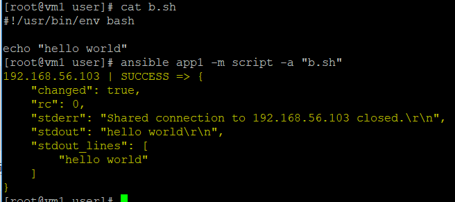
### yum
* 伺服器端在遠端幫客戶端安裝軟體

    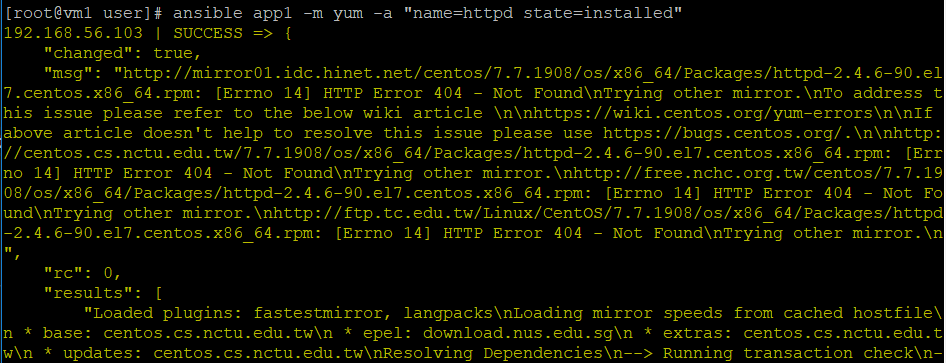
* 參數
    * `name`:要安裝的軟體名稱
    * `state`
        * 安裝:installd、present和lastest
        * 移除:removed和absent
### service
* 操控客戶端軟體狀態，例如開啟和關閉
    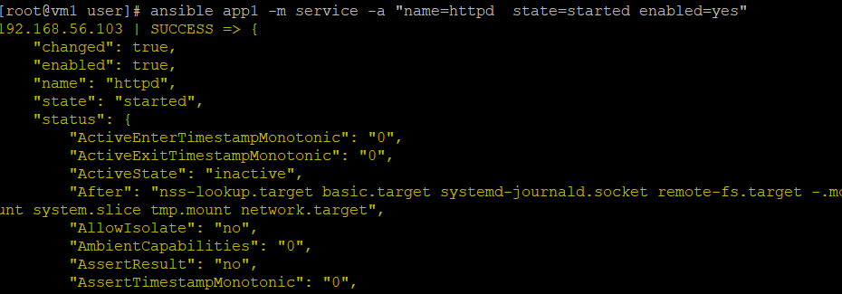
* 參數
    * `name`:操作軟體名稱
    * `state`:執行動作
        * 開啟:started
        * 關閉:stopped
        * 重啟:restarted
    * `enabled`:一開機就啟動，用bool(yes和no)定義
### copy
* 將伺服器端的檔案複製到客戶端
    >只能針對一個檔案進行拷貝，要傳輸多個檔案時要使用tar打包
    * 執行
        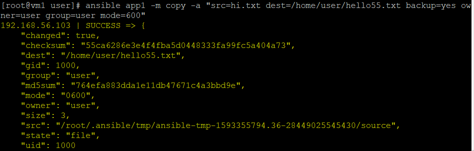
    * 結果
        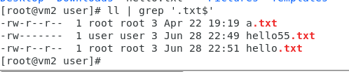
* 參數
    * `backup`:當檔案存在時是否要取代檔案內容，用bool(yes和no)定義。backup預設為*no*，將檔案內容直接覆蓋
    * `src`:檔案複製的來源
    * `dest`:檔案複製的目的地，可以寫絕對路徑或相對路徑(寫絕對路徑比較好)
    * `owner`:複製檔案擁有者
    * `mode`:複製檔案的權限
### fetch
* 將客戶端的檔案複製到伺服器端
    >只能針對一個檔案進行拷貝，要傳輸多個檔案時要使用tar打包

    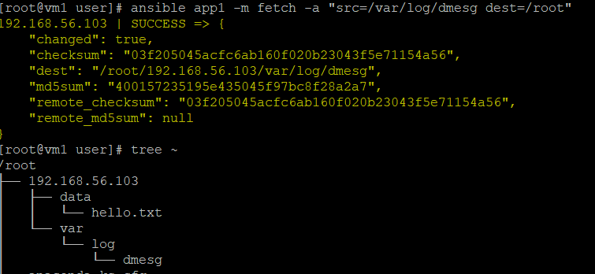
### file
* 修改檔案設定和配置
    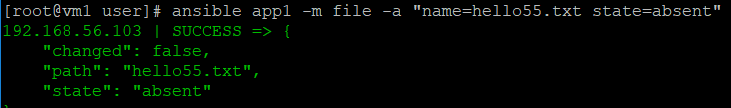
### user
* 對使用者進行管理
    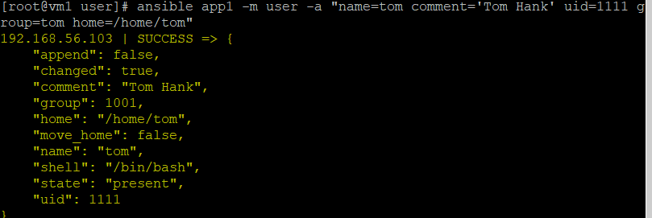
### group
* 對群組進行管理
    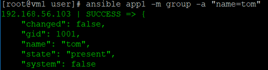

* 補充 - getent
    * 查看系統資料庫的相關紀錄
        ```
        [root@vm1 user]# getent passwd user
        user:x:1000:1000:user:/home/user:/bin/bash
        ```
## playbook
>現今最常使用的配置格式為*json*和*yaml*，ansible的playbook使用yaml的格式
* 執行playbook方式
    `ansible-playbook [檔案名稱]`
    * 可以在執行之前，在原先的指令上加上`-c`作為檢查
* 範例1. hello world
    * 腳本內容
        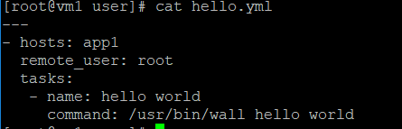
    * 執行
        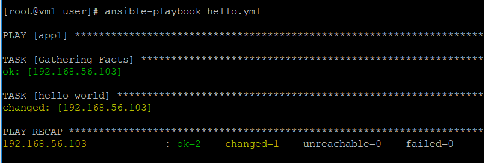
    * 結果
        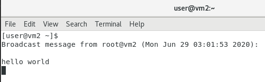
* 範例2. 1.yml
    * 腳本內容
        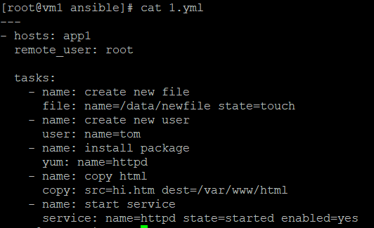
        >就算做相同的事情，還是要給他另外命名
    * 執行
        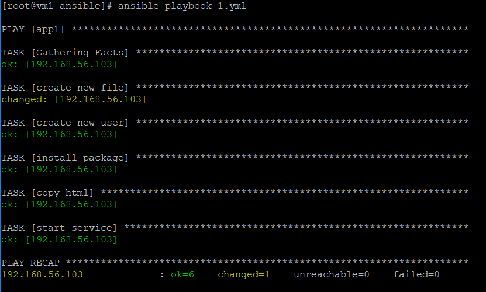

---
參考資料
* [學長的筆記](https://github.com/istar0me/linux-note/blob/107-2/Ansible.md)
* [ansible之shell和script模块-村里的男孩-51CTO博客](https://blog.51cto.com/noodle/1769474)
* [linux 之getent命令- IT閱讀 - ITREAD01.COM](https://www.itread01.com/articles/1476610536.html)