# ansible playbook(2)
>延續上周課程
* 範例3.從某項工作開始執行
    * 腳本內容
        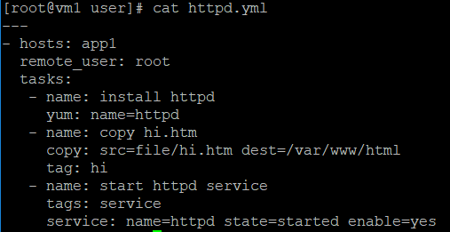
    * 執行
        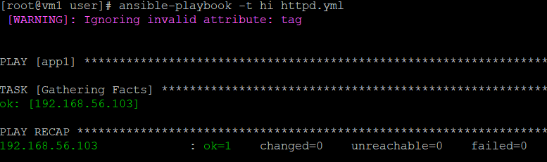
* 範例4.從命令列傳參數
    * 腳本內容
        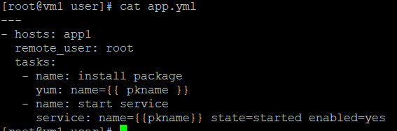
    * 執行
        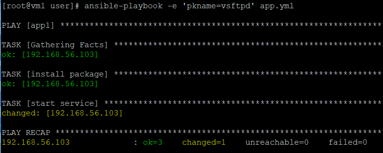
        >想要傳遞參數必須加上`-e`
* 範例5.更改主機名稱
    * 編輯/etc/ansible/hosts
        
    * 腳本內容
        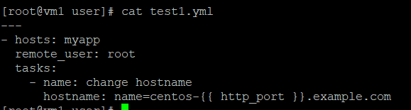
    * 執行
        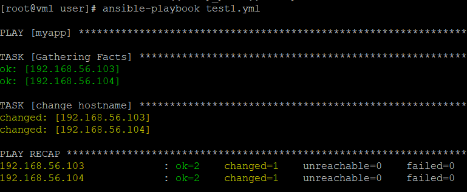
    * 結果
        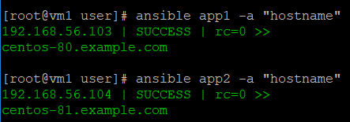
* 範例6.設立相同變數更改主機名稱
    * 編輯/etc/ansible/hosts
        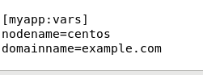
    * 腳本內容
        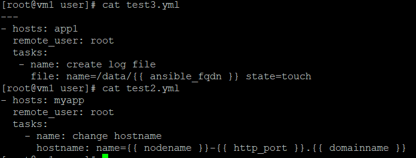
    * 執行結果
        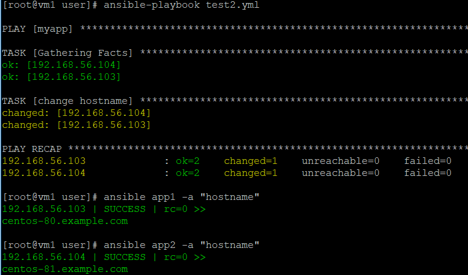
    > 當系統定義的變數和手動定義的變數發生衝突時，手動設定的變數權重比系統定義的變數還大
* 範例7.產生記錄檔
    * 腳本內容
        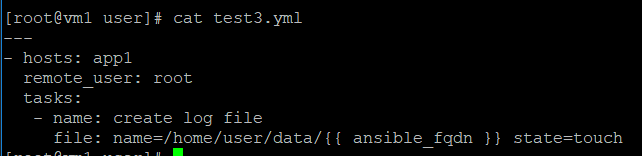
    >*fqdn*為完整網域名稱
    * 執行結果
        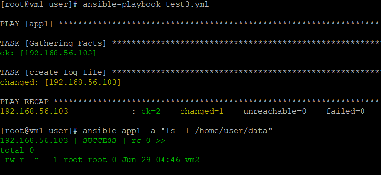
* 範例8.連結外部檔案
    * 腳本內容
        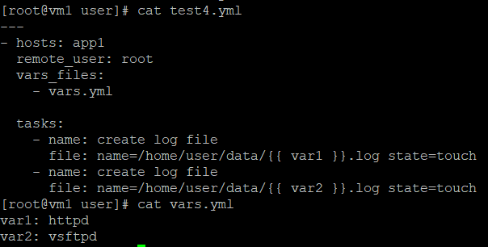
    * 執行結果
        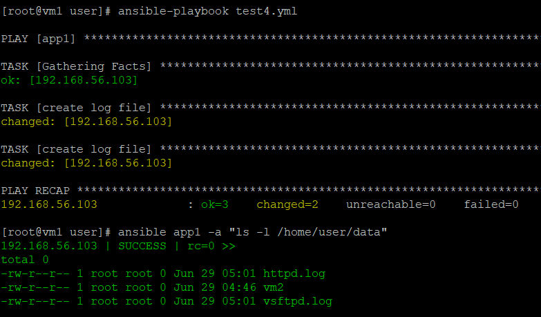
* 範例9.套用模板
    * 步驟
        1.建立templates
        2.複製/etc/httpd/conf/httpd.conf到templates下
        3.將httpd.conf重新命名為`httpd.conf.j2`
        > [Jinja2](http://docs.jinkan.org/docs/jinja2/)是一個模板引擎

        4.將httpd.conf.j2的Listen 80改成`Listen {{ http_port }}`
    * 腳本內容
        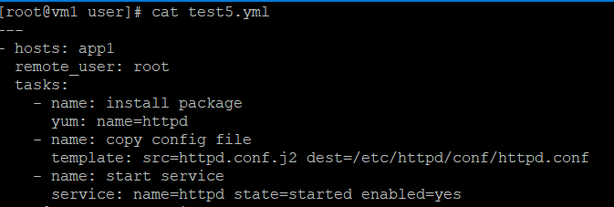
    * 執行
        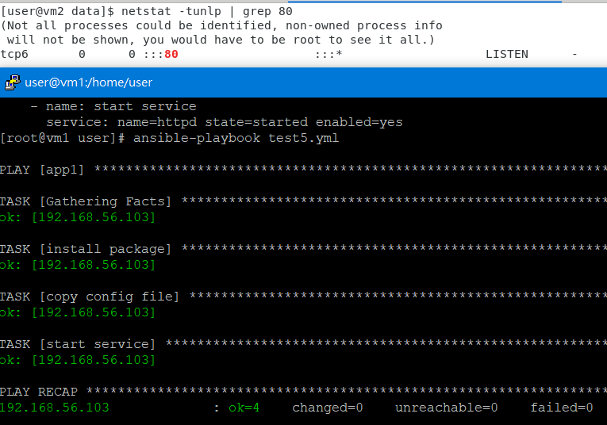
* 範例10.設立條件
    * 腳本內容
        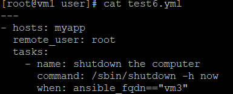
    * 執行
        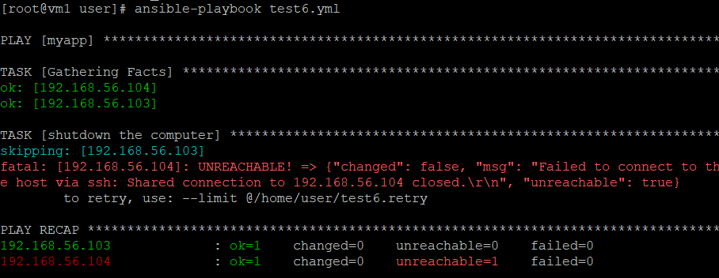
* 範例11.with_item用法
    * 腳本內容
        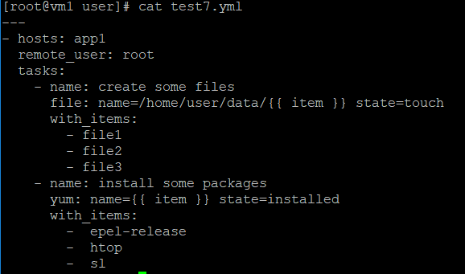
    * 執行
        
---
參考資料:
* [學長的筆記](https://github.com/istar0me/linux-note/blob/107-2/Ansible.md)
