# ansible playbook(3)&zabbix
## role
* 將很多的playbook所整合在一起
* 每一個playbooK內容為單一行為
* 整個架構之中最重要的檔案為main.yml，因為他負責和每個檔案進行連接
* 執行方式與playbook一樣
> [Ansible Galaxy](https://galaxy.ansible.com/)是一些有能力的人把他們所做的配置所上傳到這個地方，讓有需要的人可以下載修改
## zabbix
* 以網頁為介面的企業級監控軟體
* 監控對象十分廣泛，例如一般主機和網路設備
### 監控端安裝zabbix
* step 1. 到官網去選擇平台
    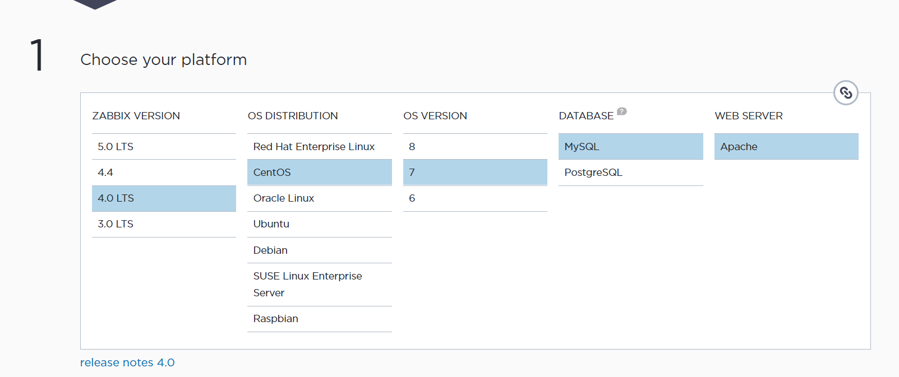
    >盡量選擇LTS(長期維護)的版本
* step 2. 安裝zabbix的儲存中心
    ```
    rpm -Uvh https://repo.zabbix.com/zabbix/4.0/rhel/7/x86_64/zabbix-release-4.0-2.el7.noarch.rpm
    yum clean all
    ```
* step 3. 安裝zabbix伺服器資料庫、網頁介面資料庫和agent
    ```
    yum install zabbix-server-mysql zabbix-web-mysql zabbix-agent -y
    ```
* step 4. 安裝資料庫並啟動
    ```
    yum install mariadb mariadb-server -y
    systemctl start mariadb
    systemctl enable mariadb
    mysqladmin -uroot passwd   //password設為centos
    mysql -uroot -pcentos      //登入資料庫
    //創建資料庫zabbix給zabbix所連接使用，預設字符編碼為utf8
    MariaDB [(none)]> create database zabbix character set utf8 collate utf8_bin;
    //授權zabbix帳戶訪問zabbix資料庫，密碼為'zabbix'
    MariaDB [(none)]> grant all privileges on zabbix.* to zabbix@localhost identified by  'zabbix';  
    ```
* step 5. 設置zabbix服務
    ```
    //將zabbix資料導入到創建zabbix資料庫中
    zcat /usr/share/doc/zabbix-server-mysql*/create.sql.gz | mysql -uzabbix -pzabbix zabbix 
    ```
    >* 導入成功畫面
    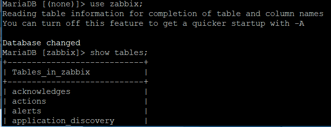
    ```
    // 將zabbix_server.conf複製備份再進行設定
    cp /etc/zabbix/zabbix_server.conf /etc/zabbix/zabbix_server.conf.bak
    gedit /etc/zabbix/zabbix_server.conf
    //更改檔案內容，根據先前在資料庫所做的設定進行修改
    DBName=zabbix 
    DBUser=zabbix
    DBPasswd=zabbix
    ```
    > * 修改畫面
    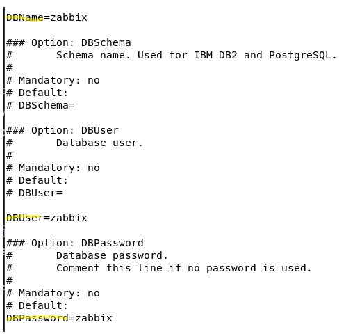
    ```
    //將zabbix_agentd.conf複製備份再進行設定
    cp /etc/zabbix/zabbix_agentd.conf /etc/zabbix/zabbix_agentd.conf.bak
    gedit /etc/zabbix/zabbix_agentd.conf
    //更改檔案內容
    Server=127.0.0.1 
    ServerActive=127.0.0.1
    Hostname=vm1
    //更改/etc/httpd/conf.d/zabbix.conf
    gedit /etc/httpd/conf.d/zabbix.conf
    php_value date.timezone Asia/Taipei
    ```
    >* 修改畫面
    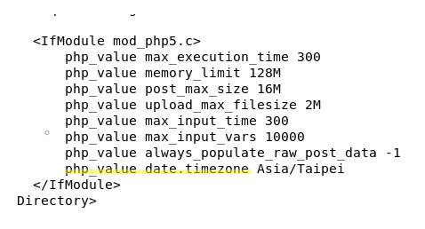
* step 6. 網頁介面安裝
    >先確認httpd、zabbix-server和zabbix-agent是否已經打開並設置一開機就啟動
    * 打開瀏覽器，打上*server的ip位置/zabbix*
        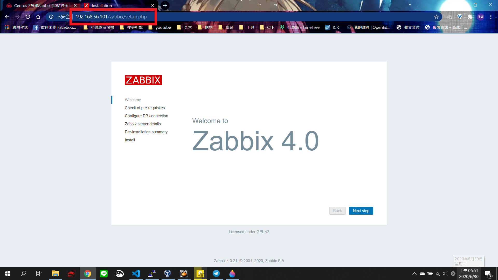
    * 確認是否全為OK
        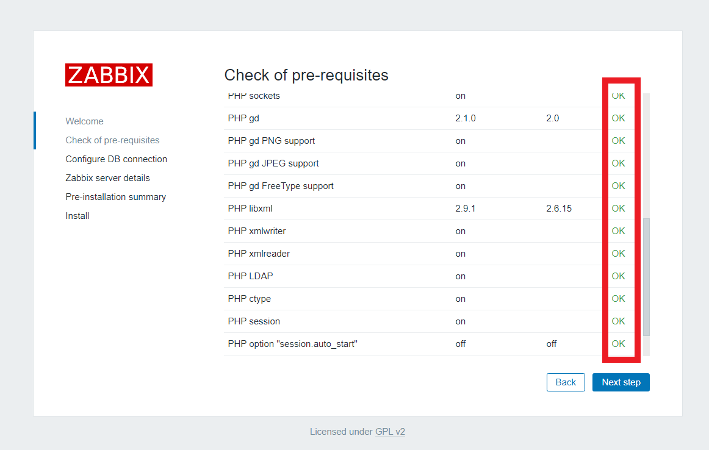
    * 設定port和密碼(密碼為zabbix)
        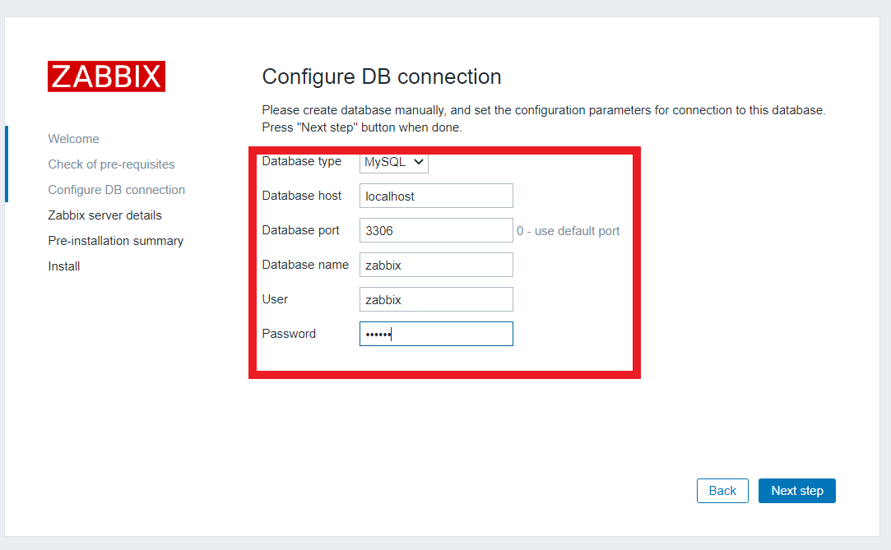
    * 設定server名稱
        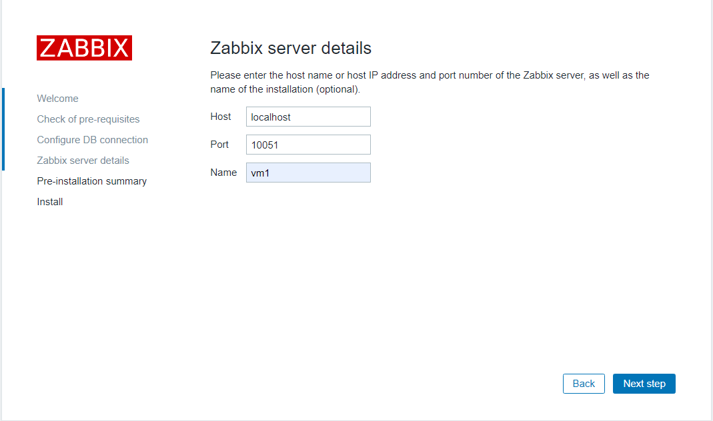
    * 確認設定資料是否正確
        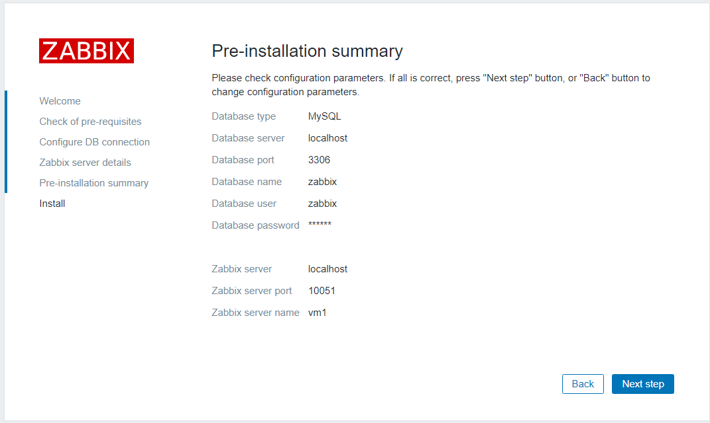
    * 完成
        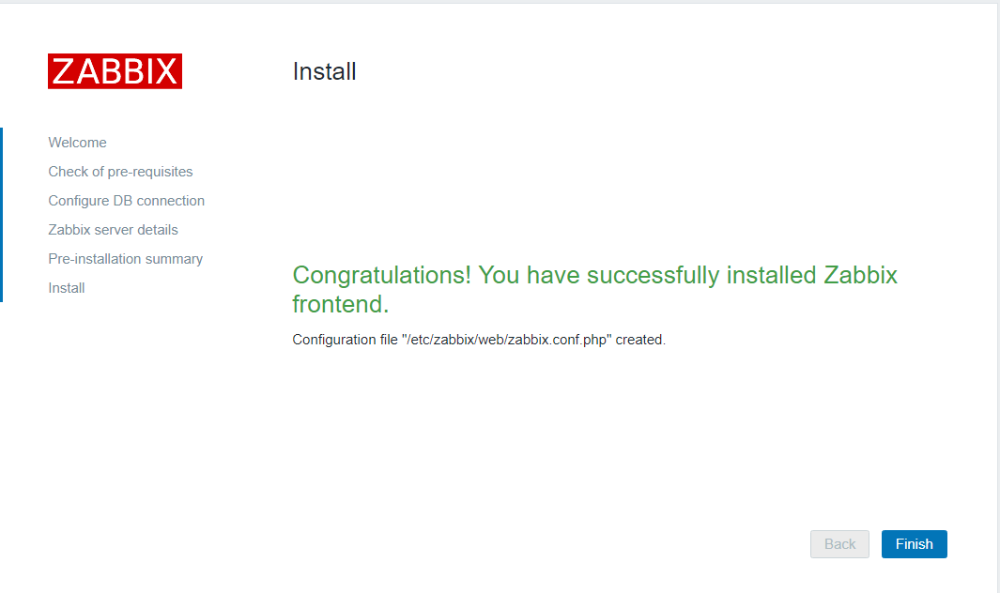
    * 使用預設帳號密碼登入
        >帳號為Admin，密碼為zabbix
    * 登入頁面
        >確認System information的Zabbix server is running是否為**Yes**

        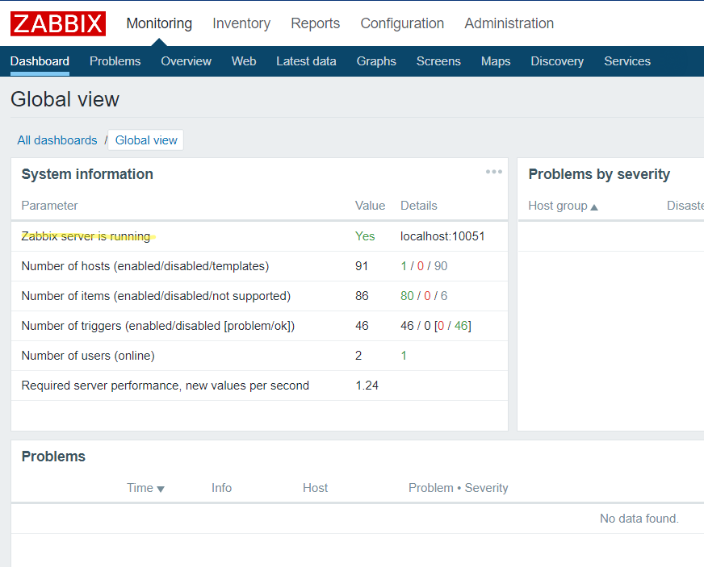
* step 7. 測試安裝是否成功
    * 點選**Monitoring**中的**Latest data**加入以下內容
        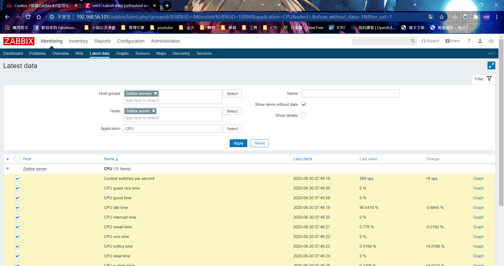
    * 點選**Display graph**看是否有產生圖
        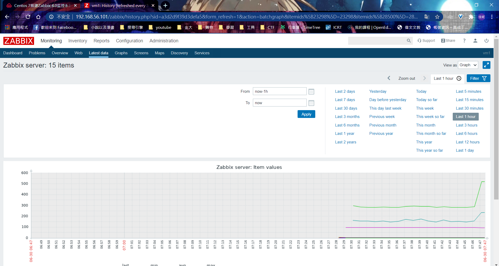

### 被監控端安裝zabbix
* step 1. 安裝zabbix的儲存中心
    ```
    rpm -Uvh https://repo.zabbix.com/zabbix/4.0/rhel/7/x86_64/zabbix-release-4.0-2.el7.noarch.rpm
    yum clean all
    ```
* step 2. 安裝zabbix-agent
    ```
    yum install zabbix-agent -y
    ```
* step 3. 設置zabbix-agent服務
    ```
    //將zabbix_agentd.conf複製備份再進行設定
    cp /etc/zabbix/zabbix_agentd.conf /etc/zabbix/zabbix_agentd.conf.bak
    gedit /etc/zabbix/zabbix_agentd.conf
    //更改檔案內容
    Server=192.168.56.101
    ServerActive=192.168.56.101
    Hostname=vm2
    //啟動zabbix-agent
    systemctl start zabbix-agent
    systemctl enable zabbix-agent
    ```
* step 4. 確認是否開啟 10050 port
    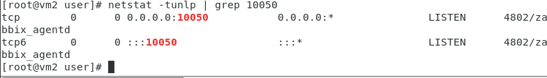
* step 5. 加入到zabbix-server中
    > 回到監控端去操作
    * 點選**Configuration**中的**Host**，並點選 **Create host**去新增
    * 設置Hosts
        >記得要按下**Add**，Host才會被加入

        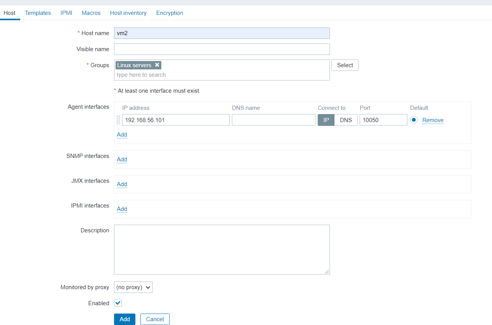
    * 設置完成
        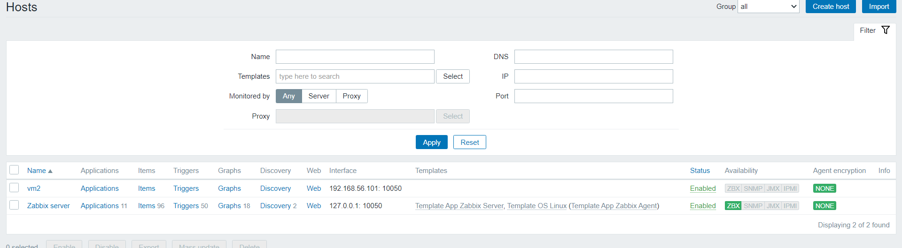
* step 6. 利用模板新增vm2的監控項
    * 點選**vm2**切換到**Templates**
        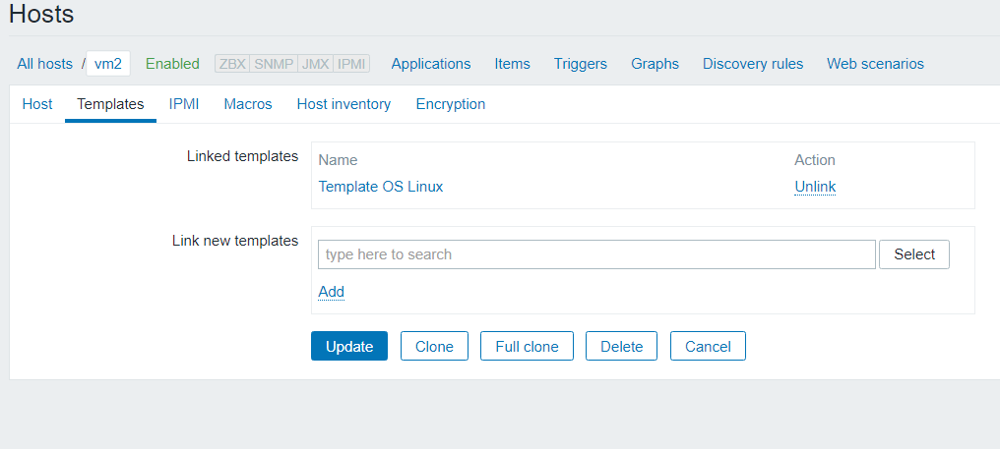
    >記得要按**add**之後再上傳
    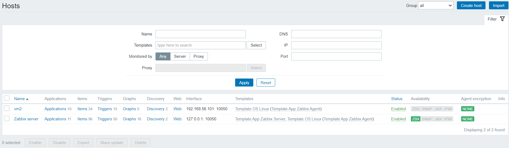

---
參考資料
* [Centos 7搭建Zabbix 4.0监控系统](https://m.yisu.com/zixun/15159.html)


    


