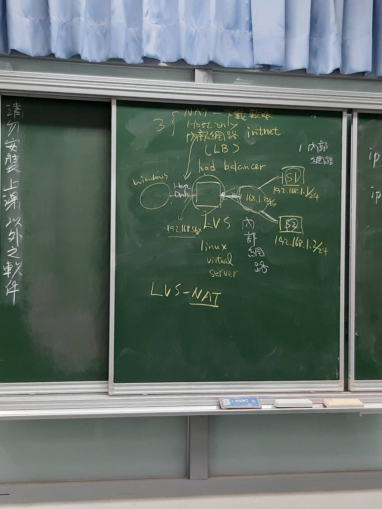
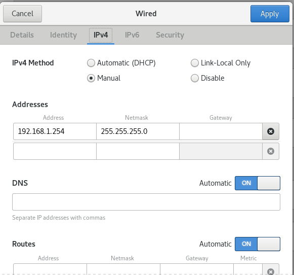
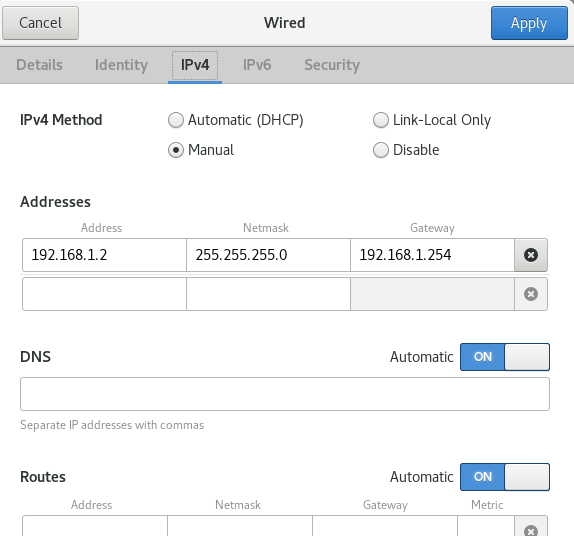
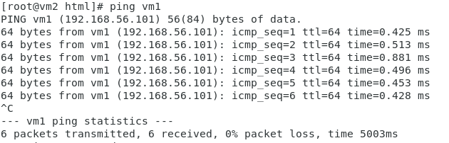
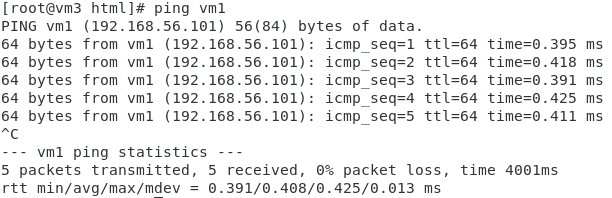
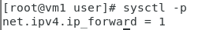
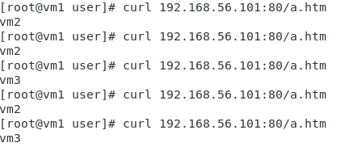

# 負載均衡器(利用LVS-NAT架構)

> LVS:Linux Virtual Server

## 環境架構



* LVS:vm1 S1:vm2 S2:vm3

## 網路卡配置

* LVS

    1. NAT --> 下載軟體

    2. Host only (192.168.56.101)

    3. 內部網路 (intnet) (192.168.1.254/24)

    > 只需更動內部網路的網卡就好，不用更動其他的網卡

    

* S1,S2 --> 內部網路

> S1:192.168.1.1/24, S2:192.168.1.2/24



## 檢查連線

* windows --> LVS

    ```
    C:\Users\GE62VR 7RF>ping 192.168.56.101

    Ping 192.168.56.101 (使用 32 位元組的資料):
    回覆自 192.168.56.101: 位元組=32 時間<1ms TTL=64
    回覆自 192.168.56.101: 位元組=32 時間<1ms TTL=64
    回覆自 192.168.56.101: 位元組=32 時間<1ms TTL=64
    回覆自 192.168.56.101: 位元組=32 時間<1ms TTL=64

    192.168.56.101 的 Ping 統計資料:
        封包: 已傳送 = 4，已收到 = 4, 已遺失 = 0 (0% 遺失)，
    大約的來回時間 (毫秒):
        最小值 = 0ms，最大值 = 0ms，平均 = 0ms
    ```
* S1(vm2) --> LVS(vm1)



* S2(vm3) --> LVS(vm1)



## 環境設定

### S1&S2

1. 確認httpd是否開啟

2. 在 /var/www/html建立a.htm

* S1

    ``` echo "vm2" > a.htm ```
* S2

    ``` echo "vm3" > a.htm ```

3. 確認是否可以成功連接a.htm

### LVS

1. 安裝ipvsadm

    ``` yum install ipvsadm ```

2. 載入ipvs到核心裡

    ``` modprobe ip_vs ```

3. 查看ipvsadm規則

    ``` ipvsadm -L ```

4. 啟動路由功能

    * 暫時性(下次開機就消失)

        ``` echo 1 > /proc/sys/net/ipv4/ip_forward ```

    * 永久性

    1. 編輯 /etc/sysctl.conf

        ``` net.ipv4.ip_forward=1 ```

    2. 保存設定

        ``` sysctl -p ```

        

5. 增加虛擬服務器
    
    ``` ipvsadm -A -t 192.168.56.101:80 -s rr ```

6. 指派後端伺服器

    * S1

        ``` ipvsadm -a -t 192.168.56.101:80 -r 192.168.1.1:80 -m ```

    * S2

        ``` ipvsadm -a -t 192.168.56.101:80 -r 192.168.1.2:80 -m ```

* ipvsadm 指令详解 (https://www.jianshu.com/p/18d0d7169289) 

7. 測試結果



    


