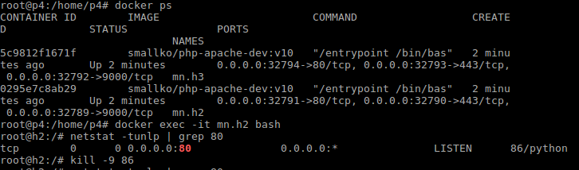
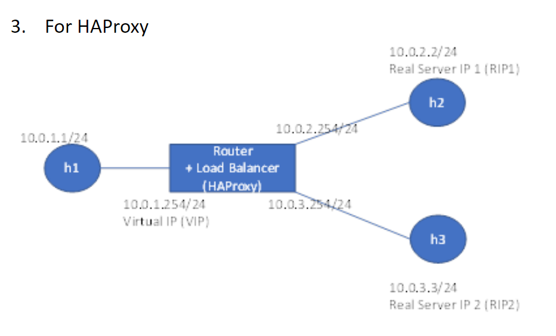
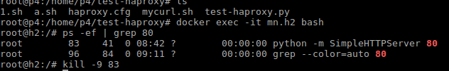

# 負載均衡器 (HAProxy)

> 延續上週的負載均衡器

## 進行連線測試

> LVS架構不會自動去偵測節點是否存活，HAProxy擁有錯誤檢查

### 腳本內容
* /home/p4/test-LVS/mycurl.sh
```
#!/bin/bash


ok=/tmp/ok.txt

fail=/tmp/fail.txt

# 將資料清空
>$ok

>$fail

#利用curl進行100次連線，把所顯示的內容丟到/dev/null裡
for i in {1..100}

do
        curl --connect-timeout 1 http://10.0.1.254/a.htm &>/dev/null

        if [ $? -eq 0 ]; then

                echo "curl ok" >> $ok

        else

                echo "curl fail" >> $fail

        fi

done


echo "all finish..."

#計算成功和失敗的次數
yes=`wc -l $ok`

no=`wc -l $fail`

echo "ok:" $yes

echo "fail:" $no

```
### 執行結果(1)

```
mininet> h1 bash mycurl.sh
all finish...
ok: 100 /tmp/ok.txt
fail: 0 /tmp/fail.txt
```
### 執行結果(2)

* 先將其中一個節點kill掉

    

* 執行結果

```
mininet> h1 bash mycurl.sh
all finish...
ok: 50 /tmp/ok.txt
fail: 50 /tmp/fail.txt
```
## HAProxy

### 環境架設



### HAProxy安裝

* 安裝HAProxy
    ```apt install haproxy -y```

* 查看HAProxy版本
    ```haproxy -v```
### 腳本內容

* HAProxy測試檔(/home/p4/test-haproxy/test-haproxy.py)

    ```
    #!/usr/bin/env python
    from mininet.net import Containernet
    from mininet.cli import CLI
    from mininet.link import Link,TCLink,Intf
    from mininet.log import setLogLevel
    from mininet.node import Docker
    from time import sleep
    from datetime import datetime
    import time


    if '__main__' == __name__:
    setLogLevel('info')
    net = Containernet (link=TCLink)
    h1 = net.addHost('h1',ip="10.0.1.1/24")
    r = net.addHost('r')
    h2 = net.addDocker('h2', mac = '00:00:00:00:02:02', ip="10.0.2.2/24", dimage="smallko/php-apache-dev:v10",cpu_period=50000, cpu_quota=1000)
    h3 = net.addDocker('h3', mac = '00:00:00:00:03:03', ip="10.0.3.3/24", dimage="smallko/php-apache-dev:v10",cpu_period=50000, cpu_quota=1000)

    Link(h1, r)
    Link(r, h2)
    Link(r, h3)

    net.build()
    h1,h2,h3,r,=net.get('h1','h2','h3','r')
    r.cmd("ifconfig r-eth0 0")
    r.cmd("ifconfig r-eth1 0")
    r.cmd("ifconfig r-eth2 0")

    r.cmd("echo 1 > /proc/sys/net/ipv4/ip_forward")
    r.cmd("ip addr add 10.0.1.254/24 brd + dev r-eth0")
    r.cmd("ip addr add 10.0.2.254/24 brd + dev r-eth1")
    r.cmd("ip addr add 10.0.3.254/24 brd + dev r-eth2")

    r.cmd("iptables -t nat -A POSTROUTING -s 10.0.2.0/24 -o r-eth0  -j MASQUERADE")
    r.cmd("iptables -t nat -A POSTROUTING -s 10.0.3.0/24 -o r-eth0  -j MASQUERADE")

    h1.cmd("ip route add default via 10.0.1.254")
    h2.cmd("ip route del default")
    h2.cmd("ip route add default via 10.0.2.254")
    h2.cmd("cd /var/www/html; echo h2 > a.htm ; python -m SimpleHTTPServer 80 &")
    h3.cmd("ip route del default")
    h3.cmd("ip route add default via 10.0.3.254")
    h3.cmd("cd /var/www/html; echo h3 > a.htm ; python -m SimpleHTTPServer 80 &")

    CLI(net)
    net.stop()
    ```
* HAProxy配置檔(/home/p4/test-haproxy/haproxy.cfg)
    ```
    listen test

    bind 10.0.1.254:80

    mode tcp

    balance static-rr

    balance roundrobin

    server web1 10.0.2.2:80 check weight 1 check inter 1s

    server web2 10.0.3.3:80 check weight 1 check inter 1s

    ```

### HAProxy確認節點是否存活


    1.haproxy先對節點做三向交握
    2.一旦haproxy接收到了節點所傳送來的封包就中止連線

> RST為 *中止連線* 的意思

### 執行結果

* 先將其中一個節點kill掉

    

* 執行結果

    ```
    mininet> h1 bash mycurl.sh
    all finish...
    ok: 100 /tmp/ok.txt
    fail: 0 /tmp/fail.txt
    ```

### 將檔案進行格式轉換

* 在unix環境安裝dos2unix
 ``` apt install dos2unix```

* 在windows環境進行轉換

## sed(stream editor)
> 可以用來進行檔案中的字串編輯

### 範例

* sed '/^$/d' mycurl.sh
> 未加參數結果只會在螢幕上顯示，不會更動檔案內容

* 刪除檔案裡的空白行內容
    `sed -i '/^$/d' mycurl.sh`
    * `-i`:直接更改檔案內容
    * `^$`:'^'意思為以...開頭，而'$'意思是以...結尾。兩個放在一起是代表空白行
    * `d` :刪除

* 刪除檔案中的指定行內容
    * 刪除第20行
        `sed -i '20d' /home/p4/passwd`
    * 刪除第20和23行
        `sed -i '20,23d' /home/p4/passwd`

* 指定刪除檔案中以ntp開頭的行內容
    `sed -i '/^ntp/d' /home/p4/passwd`

* 指定刪除從第10行到以user開頭的行的內容
    `sed -i '10,/^user/d' /home/p4/passwd`

* 指定列出檔案中特定行
    `sed -n '23p' /home/p4/passwd`
    * `-n`:將經過sed處理過的顯示出來
    * ` p`:列印

* 在指定行的下一行增加內容
     ```
    root@p4:/home/p4# sed -i '/^lp/a 12345' passwd
    root@p4:/home/p4# cat -n passwd
     1  root:x:0:0:root:/root:/bin/bash
     2  games:x:5:60:games:/usr/games:/usr/sbin/nologin
     3  man:x:6:12:man:/var/cache/man:/usr/sbin/nologin
     4  lp:x:7:7:lp:/var/spool/lpd:/usr/sbin/nologin
     5  12345
     6  mail:x:8:8:mail:/var/mail:/usr/sbin/nologin
    ```
* 在指定行的上一行增加內容
    ```
    root@p4:/home/p4# sed -i '/^man/i 12345aaa' passwd
    root@p4:/home/p4# cat -n passwd
     1  root:x:0:0:root:/root:/bin/bash
     2  games:x:5:60:games:/usr/games:/usr/sbin/nologin
     3  12345aaa
     4  man:x:6:12:man:/var/cache/man:/usr/sbin/nologin
     5  lp:x:7:7:lp:/var/spool/lpd:/usr/sbin/nologin
     6  12345
     7  mail:x:8:8:mail:/var/mail:/usr/sbin/nologin
    ```
* 取代指定行的內容
    ```
    root@p4:/home/p4# sed -i '/^man/c 12345bbb' passwd
    root@p4:/home/p4# cat -n passwd
     1  root:x:0:0:root:/root:/bin/bash
     2  games:x:5:60:games:/usr/games:/usr/sbin/nologin
     3  12345aaa
     4  12345bbb
     5  lp:x:7:7:lp:/var/spool/lpd:/usr/sbin/nologin
     6  12345
     7  mail:x:8:8:mail:/var/mail:/usr/sbin/nologin
    ```
* 刪除帶有特殊字元的行的內容
    * 原先內容
        ```
        root@p4:/home/p4# cat -n passwd
        1  root:x:0:0:root:/root:/bin/bash
        2  games:x:5:60:games:/usr/games:/usr/sbin/nologin
        3  12345aaa
        4  12345bbb
        5  lp:x:7:7:lp:/var/spool/lpd:/usr/sbin/nologin
        6  12345
        7  mail:x:8:8:mail:/var/mail:/usr/sbin/nologin
        8  /*1234fd5bbb
        9  33333
        10  56565ads*/
        ``` 
    * 刪除後內容
        ```
        root@p4:/home/p4# sed -i '/^\//,/\/$/d' passwd
        root@p4:/home/p4# cat -n passwd
        1  root:x:0:0:root:/root:/bin/bash
        2  games:x:5:60:games:/usr/games:/usr/sbin/nologin
        3  12345aaa
        4  12345bbb
        5  lp:x:7:7:lp:/var/spool/lpd:/usr/sbin/nologin
        6  12345
        7  mail:x:8:8:mail:/var/mail:/usr/sbin/nologin
        ```
    > 先把外面的框框寫好再填裡面的內容

* 將指定行的特定內容全部大小寫轉換取代
    ```
    root@p4:/home/p4# sed -i 's/mail/MAIL/g' passwd
    root@p4:/home/p4# cat -n passwd
     1  root:x:0:0:root:/root:/bin/bash
     2  games:x:5:60:games:/usr/games:/usr/sbin/nologin
     3  12345aaa
     4  12345bbb
     5  lp:x:7:7:lp:/var/spool/lpd:/usr/sbin/nologin
     6  12345
     7  MAIL:x:8:8:MAIL:/var/MAIL:/usr/sbin/nologin
    ```
    > 要記得在尾端加上**g**才會全部取代

* 在指定行前面加上'#'註解
    ```
    root@p4:/home/p4# sed -i 's/^game/#&/' passwd
    root@p4:/home/p4# cat -n passwd
     1  root:x:0:0:root:/root:/bin/bash
     2  #games:x:5:60:games:/usr/games:/usr/sbin/nologin
     3  12345aaa
     4  12345bbb
     5  lp:x:7:7:lp:/var/spool/lpd:/usr/sbin/nologin
     6  12345
     7  MAIL:x:8:8:MAIL:/var/MAIL:/usr/sbin/nologin
    ```
---
參考資料:
* [柯老師的網頁](http://csie.nqu.edu.tw/smallko/sdn/lvs_haproxy.htm)
* [Linux中sed 和awk的用法詳解| 程式前沿](https://codertw.com/%E5%89%8D%E7%AB%AF%E9%96%8B%E7%99%BC/392291/)
