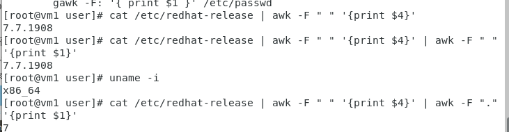
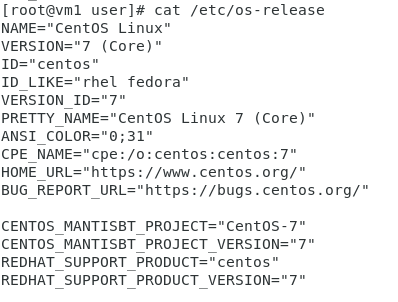
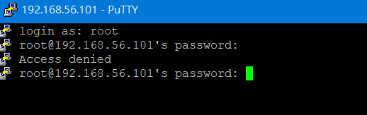

# Linux 系統優化

> 根據[Linux 系統優化（腳本）-每日頭條](https://kknews.cc/zh-tw/news/4kbb5qg.html)作為腳本基礎

## 腳本內容(1)
```
   #!/bin/bash 
    #author junxi by 
    #this script is only for CentOS 7.x 
    #check the OS 
    platform=`uname -i` 
    if [ $platform != "x86_64" ];then 
    echo "this script is only for 64bit Operating System !"
    exit 1 
    fi
    echo "the platform is ok" 
    cat << EOF 
    +---------------------------------------+ 
    | your system is CentOS 7 x86_64        | 
    | start optimizing.......               | 
    +---------------------------------------+ 
    EOF

```
* 在Centos 7之前的作業系統可能是32位元或64位元，在7之後基本是為64位元，因此要注意位元的不同做出相對應系統版本的配置 
* 資料比對
    字串 : 使用"=="或"!="等**符號**進行比對
    數值 : 使用"eq"或"ne"等**參數**進行比對

### uname:查詢 Linux 系統核心資訊

> 其他請看[linux uname指令介紹
](http://code-notes-blog.blogspot.com/2017/09/linux-uname.html)

` -s `: 印出系統內核名稱
` -i `: 印出硬體平台類型
` -a `: 會印出系統的所有的資訊，會忽略未知的處理器與未知的硬件平台
 > 如果看見系統如果看見系統架構為i386、i486和i586就是為32位元



### 查詢 Linux 發行版與版本

> 在 /etc目錄下，檔名為 **\*-release** 都是系統版本資訊檔。裡面放有系統版本名稱跟號碼，其中os-release的內容是最為詳細的。



### EOF

EOF是 *End Of File* 的縮寫，可以將內容多行顯示在螢幕上。EOF可以自行定義，但絕大部分還是使用EOF作為標籤。

## 腳本內容(2)

### 加入DNS server
```
# Linux DNS的配置都放在/etc/resolv.conf下
cat >> /etc/resolv.conf << EOF
nameserver 8.8.8.8
nameserver 9.9.9.9
EOF
```

### 更改yum來源

* 將yum來源設置成hinet，並在網頁伺服器放置yum來源配置檔

```
vim /var/www/html/CentOS-Base.repo
[base]
name=CentOS-$releasever - Base
#mirrorlist=http://mirrorlist.centos.org/?release=$releasever&arch=$basearch&repo=os
baseurl=http://mirror01.idc.hinet.net/CentOS/$releasever/os/$basearch/
gpgcheck=1
gpgkey=file:///etc/pki/rpm-gpg/RPM-GPG-KEY-CentOS-7

#released updates 
[updates]
name=CentOS-$releasever - Updates
#mirrorlist=http://mirrorlist.centos.org/?release=$releasever&arch=$basearch&repo=updates
baseurl=http://mirror01.idc.hinet.net/CentOS/$releasever/updates/$basearch/
gpgcheck=1
gpgkey=file:///etc/pki/rpm-gpg/RPM-GPG-KEY-CentOS-7

#additional packages that may be useful
[extras]
name=CentOS-$releasever - Extras
#mirrorlist=http://mirrorlist.centos.org/?release=$releasever&arch=$basearch&repo=extras
baseurl=http://mirror01.idc.hinet.net/CentOS/$releasever/extras/$basearch/
gpgcheck=1
gpgkey=file:///etc/pki/rpm-gpg/RPM-GPG-KEY-CentOS-7

#additional packages that extend functionality of existing packages
[centosplus]
name=CentOS-$releasever - Plus
#mirrorlist=http://mirrorlist.centos.org/?release=$releasever&arch=$basearch&repo=centosplus
baseurl=http://mirror01.idc.hinet.net/CentOS/$releasever/centosplus/$basearch/
gpgcheck=1
enabled=0
gpgkey=file:///etc/pki/rpm-gpg/RPM-GPG-KEY-CentOS-7

#contrib - packages by Centos Users
[contrib]
name=CentOS-$releasever - Contrib
#mirrorlist=http://mirrorlist.centos.org/?release=$releasever&arch=$basearch&repo=contrib
baseurl=http://mirror01.idc.hinet.net/CentOS/$releasever/contrib/$basearch/
gpgcheck=1
enabled=0
gpgkey=file:///etc/pki/rpm-gpg/RPM-GPG-KEY-CentOS-7
```

* 更新yum來源配置檔
 ```
mv /etc/yum.repos.d/CentOS-Base.repo /etc/yum.repos.d/CentOS-Base.repo.bak
wget -O /etc/yum.repos.d/CentOS-Base.repo http://127.0.0.1/CentOS-Base.repo
wget -O /etc/yum.repos.d/epel.repo http://mirrors.aliyun.com/repo/epel-7.repo
yum clean
yum makecache
 ```

### 更新時區並同步時間

```
#更新時區
yum -y install ntp
timedatectl set-timezone Asis/Taipei
/usr/sbin/ntpdate tock.stdtime.gov.tw

#同步時間
echo "*4***/usr/sbin/ntpdate tock.stdtime.gov.tw > /dev/null 2>&1" >> /var/spool/cron/root
```
    
### 限制檔案最大打開文件數量

```
echo "ulimit -SHn 102400 >> /etc/rc.local"
cat >> /etc/security/limits.conf << EOF
*soft nofile 655350
*hard nofile 655350
 EOF
```
* /etc/rc.local:開機時所自動執行的檔案配置檔
* /etc/security/limits.conf:設置資源限制配置檔
* ulimit:用於控制shell程序的資源
    * `-S`:設置軟資源限制，設置後可以增加，但是不能超過硬資源設置
    * `-H`:設置硬資源限制，一旦設置不能增加。
    * `-n`:可以打開最大文件描述符的數量
> 其他參數用法請看[linux ulimit命令@ 主要步驟的部落格:: 痞客邦::](https://q248269673.pixnet.net/blog/post/66596238)

### 禁用selinux和關閉防火牆

```
#禁用selinux
sed -i 's/SELINUX=enforcing/SELINUX=disabled/' /etc/selinux/config
setenforce 0
#關閉防火牆
systemctl disable firewalld.service
systemctl stop firewalld.service
```
### 設定禁止超級使用者遠端登入
```
sed -i 's/#PermitRootLogin yes/PermitRootLogin no/' /etc/ssh/sshd_config
systemctl restart sshd
```


---
參考資料:
* [Linux 系統優化（腳本）-每日頭條](https://kknews.cc/zh-tw/news/4kbb5qg.html)
* [linux uname指令介紹](http://code-notes-blog.blogspot.com/2017/09/linux-uname.html)
* [如何查詢Linux 的發行版名稱與版本？ - G. T. Wang](https://blog.gtwang.org/linux/find-linux-distribution-name-version-number/)
* [在 CentOS 7 將 yum base repo 改為 hinet | 窮得只剩技術](https://blog.iphpo.com/blog/2018/01/%E5%9C%A8-centos-7-%E5%B0%87-yum-base-repo-%E6%94%B9%E7%82%BA-hinet/)
* [Linux 設定 NTP 同步系統時間，自動網路校時教學 - G. T. Wang ](https://blog.gtwang.org/linux/linux-ntp-installation-and-configuration-tutorial/)
* [ CentOS Linux 更改系統時區指令教學 - G. T. Wang](https://blog.gtwang.org/linux/centos-linux-change-system-timezone-command-tutorial/)
* [linux ulimit命令@ 主要步驟的部落格:: 痞客邦::](https://q248269673.pixnet.net/blog/post/66596238)


