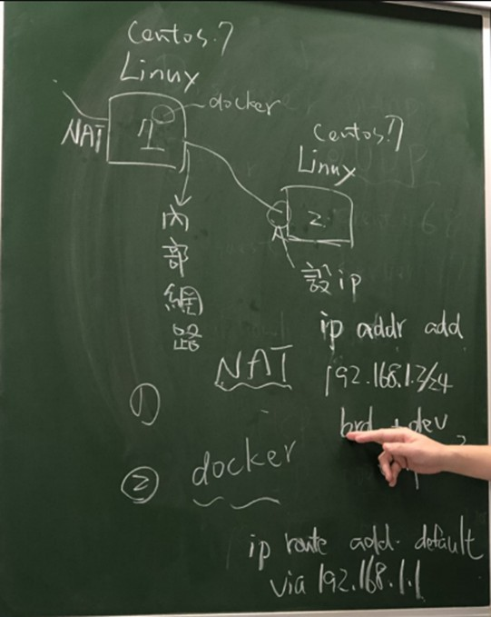
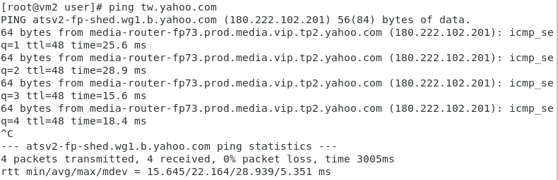
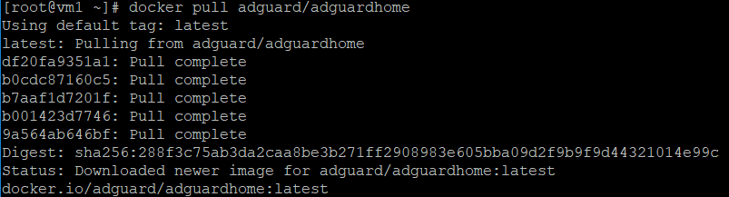
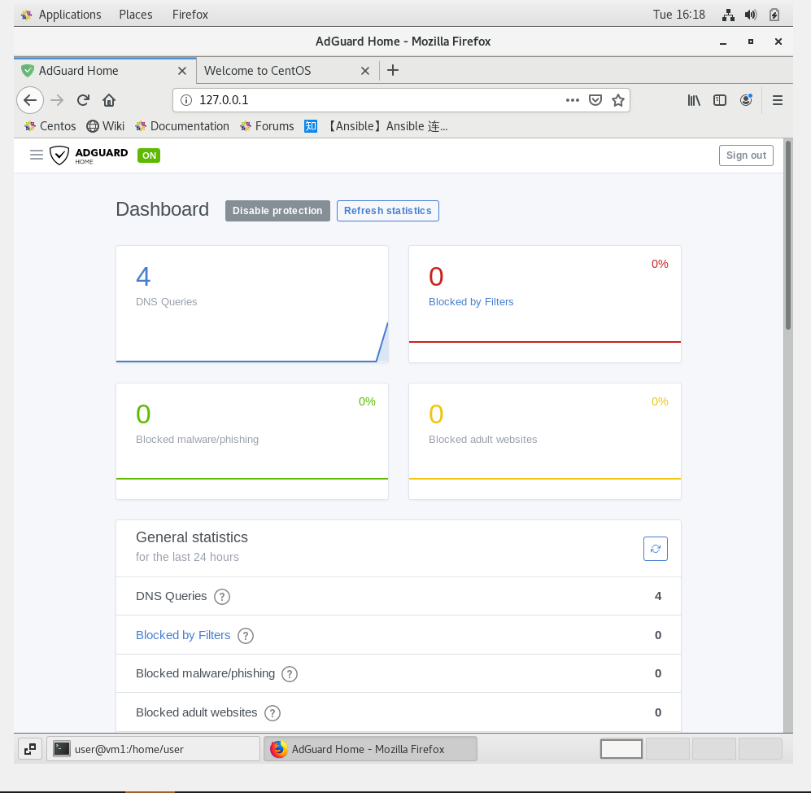

# 利用docker將youtube廣告移除

## Step1 -- NAT轉換

 

### 網路卡設定
> 設定完成，記得測試是否可以互ping和連結外部網路

* vm1
    * NAT(enp0s3)
    * Host-Only(enp0s8)
    * 內部網路(192.168.1.1)(enp0s9)
* vm2
    * 內部網路(192.168.1.2)(enp0s3)
    * 設定內定路由(192.168.1.1)並加入到/etc/resolve.conf

### vm1轉發設定
* 設定轉發功能(暫時)
    ```
    echo 1 > /proc/sys/net/ipv4/ip_forward
    ```
* 允許新連線封包
    ```
    iptables -A FORWARD -o enp0s3 -i enp0s9 -s 192.168.1.0/24 -m conntrack --ctstate NEW -j ACCEPT
    ```
    * `A`:append
    * `o`:output
    * `i`:input
    * `s`:source
    * `j`:jump
* 允許連線成立封包
    ```sh
    iptables -A FORWARD -m conntrack --ctstate ESTABLISHED,RELAED -j ACCEPT
    ```
* 將IP進行轉換
    ```sh
    iptables -t nat -A POSTROUTING -o enp0s3 -s 192.168.1.0/24 -j MASQUERADE
    ```
    * `t`:table
    * `nat`:位置轉換
    * `POSTROUTING`:在進行路由判斷之後所要進行的規則

### 結果


## Step2 -- Docker-Adguard

### 下載Adguard
> 已安裝完docker並擁有dockerhub帳號
* 登入dockerhub
    > 由於docker政策更改，必須先登入docker hub才能下載安裝

    * ```docker login```

* 創建資料夾
    * ``` mkdir -p /my/own/workdir```
    * ``` mkdir -p /my/own/confdir```
* 安裝Adguard
    * ```docker pull adguard/adguardhome```
     
* 啟動docker-Adguard鏡像
    * ```sh
        docker run --name adguardhome -v /my/own/workdir:/opt/adguardhome/work -v /my/own/confdir:/opt/adguardhome/conf -p 53:53/tcp -p 53:53/udp -p 67:67/udp -p 68:68/tcp -p 68:68/udp -p 80:80/tcp -p 443:443/tcp -p 853:853/tcp -p 3000:3000/tcp -d adguard/adguardhome
        ```
    > 根據錯誤訊息關閉port號並將docker行程刪除再重新啟動
* 設定Adguard
    > 根據[Synology Docker 架設 AdGuard Home DNS 伺服器](https://www.sakamoto.blog/synology-adguard-home-dns/)設定
    * 完成畫面
    
* 編輯vm1的/etc/resolve.conf
    
---
參考資料
* [鳥哥的Linux 私房菜-- Linux 防火牆與NAT 伺服器](http://linux.vbird.org/linux_server/0250simple_firewall.php)
* [Synology Docker 架設 AdGuard Home DNS 伺服器](https://www.sakamoto.blog/synology-adguard-home-dns/)


