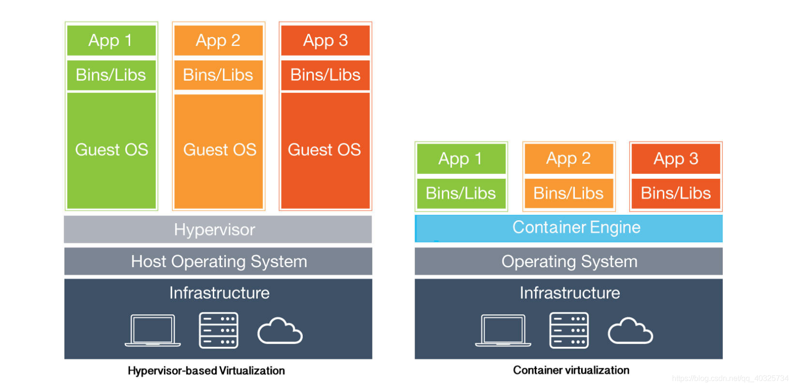
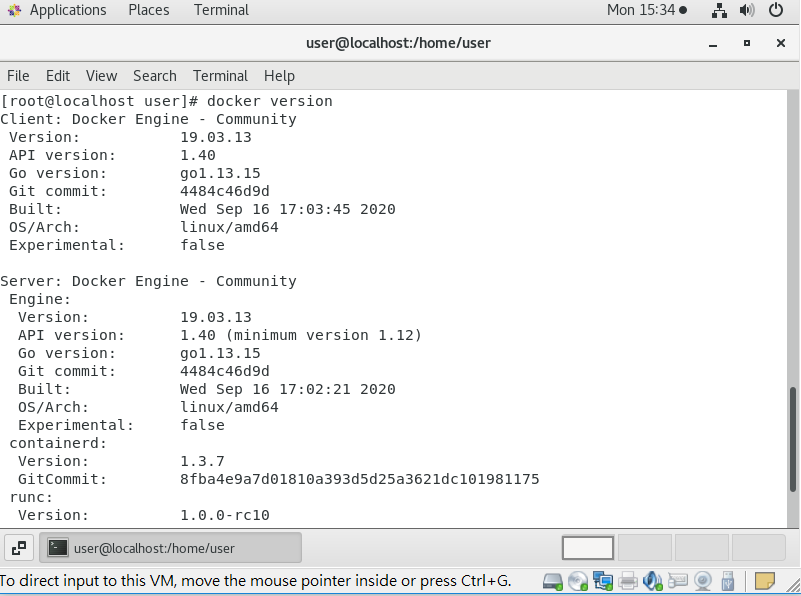

[toc]

# Docker 基本操作(1)

## 容器V.S.虛擬機



* 容器:共用Host OS，因此不須額外安裝作業系統
* 虛擬機:擁有完整的硬體，必須安裝作業系統(Guest OS)才能執行應用程式

## Docker
> 實作輕量級作業系統虛擬化技術

### Docker 基礎技術

* LXC(Linux Container)
* auft(advanced multi-layered unification filesystem):
    * 一個檔案系統的更動採用分層疊架的方式
    * 更動檔案系統後，這個變動就成為一層
    * 每一層只記錄與上一層的差異

### 命名空間(namespace)
> 每個容器都為一個隔離環境，因此使用Linux核心上一些資料隔離功能來讓容器獨立。namespace為其中之一的功能。

|命名空間|功能|
|:-----:|:-----:|
|MNT (Mount)|管理檔案系統的掛載點 (mount point)|
|PID (Process)|隔離執行程序|
|NET (Network)|管理網路介面|
|IPC (Inter-process communication)|管理執行程序之間的通訊資源|
|UTS (Host name)|隔離系統核心版本與識別碼|
|CGROUPS|限制、隔離、累計各執行程序的資源用量|
|User ID (User)|提供權限隔離與使用者身分區隔|

### Docker 優點

* 容器啟動速度快，啟動速度以秒為單位
* 系統資源使用率高，可同時執行上千個容器
* 消耗硬碟容量少，檔案大小以MB為單位

### Docker 安裝
> 根據[官網](https://docs.docker.com/engine/install/centos/)進行安裝

* 安裝REPOSITORY
```sh
yum install -y yum-utils
yum-config-manager \
    --add-repo \
    https://download.docker.com/linux/centos/docker-ce.repo
```

* 安裝Docker Engine

```sh
yum install docker-ce docker-ce-cli containerd.io
```

* 啟動 Docker

```sh
systemctl start docker
```

### Docker Compose 安裝

* 安裝Docker Compose

    ```sh
    curl -L "https://github.com/docker/compose/releases/download/1.27.4/docker-compose-$(uname -s)-$(uname -m)" -o /usr/local/bin/docker-compose
    ```
    * `-L`:請求跟隨網頁重定位
    * `-o`:取得網頁內容, 輸出至檔案

* 增加權限

    ```sh
    chmod +x /usr/local/bin/docker-compose
    ```

### Docker 指令

* 查看Docker版本

```sh
docker version # 顯示Docker完整資訊
```


```sh
docker -v # 顯示目前Docker版本
```

```sh
[root@localhost user]# docker -v
Docker version 19.03.13, build 4484c46d9d
```

* 帳號登入
> 未指定倉庫位置，預設為登入docker hub

```sh
docker login [倉庫IP:倉庫port號]
```

* 下載鏡像
> 如果無法從docker hub直接下載鏡像，必須登入docker hub帳號才能進行下載

```sh
docker pull [所要下載的鏡像名]
```

* 查看鏡像

    ```sh
    docker images
    ``` 

* 容器執行 — 在此執行httpd

    ```sh
    docker run -itd --name=myhttpd -p 8080:80 httpd
    ```
    * `-i`:讓標準輸入保持打開
    * `-t`:配置一個虛擬的終端機
    * `-d`:背景執行
    * `-p`:本機端port號對應到容器port號

* 進入正在執行的容器
    ```sh
    docker exec -it [容器ID] [所要執行的殼層]
    ```
    >若只是離開容器回到本機端，但容器還是要繼續執行，可以使用`ctrl+q+p`來離開

* 查看容器行程

    ```sh
    docker ps [參數]
    ```
    * `-a`: 查看全部行程
    * `-q`: 只顯示ID

* 刪除容器

    ```sh
    docker rm [參數] [要刪除的容器IP或容器名稱]
    ```
    * `-f`:強制刪除正在運行的容器

> 一次刪除全部容器可以使用```docker rm -f $(docker ps -aq)```

* 刪除鏡像
```
docker rmi [參數] [要刪除的鏡像IP或鏡像名稱]
```

* 加上標籤

```sh
docker tag SOURCE_IMAGE[:TAG] TARGET_IMAGE[:TAG]
```

* 上傳鏡像

```
docker push IMAGE[:TAG]
```

### 補充

* 完整鏡像命名方式為```倉儲來源位置 / 帳號 / 鏡像名稱 : 標籤```
    * 如果是官方所發布的鏡像，可將倉儲來源位置和帳號省略
    * 如果標籤為 **lastest**，可將標籤省略

---
# 參考資料
* [docker容器 — 台部落](https://www.twblogs.net/a/5c544513bd9eee06ef364425?lang=zh-cn)
* [《Docker —— 從入門到實踐­》正體中文版](https://philipzheng.gitbook.io/docker_practice/introduction/why)
* [為何在 Docker 中執行特權容器不是個好主意? —— 資安趨勢部落格](https://blog.trendmicro.com.tw/?p=62986)
* [Install Docker Engine on CentOS — docker docs](https://docs.docker.com/engine/install/centos/)
* [Install Docker Compose — docker docs](https://docs.docker.com/compose/install/)
* [Docker Container 指令：Docker run & Docker exec — 靖.技場](https://www.jinnsblog.com/2018/10/docker-container-command.html)

