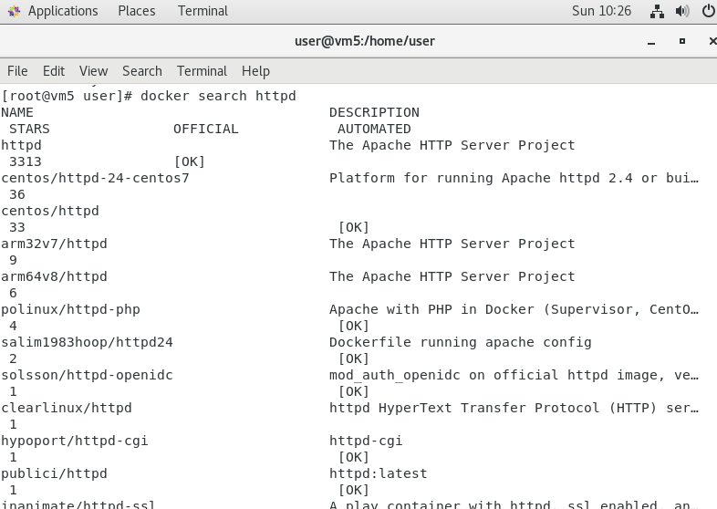
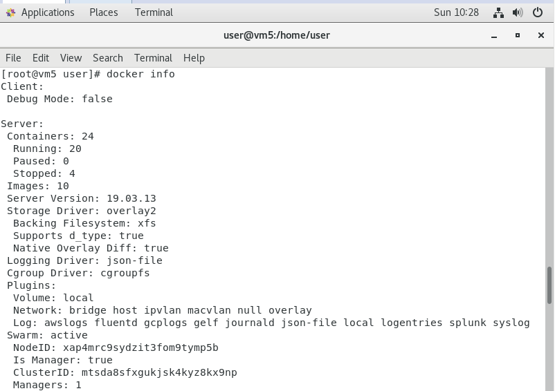

[toc]
# Docker 基本操作(2)

## Docker 指令
>延續上周內容

* Docker所存放位置為`/var/lib/docker`

* 查詢鏡像
> 如要下載請選擇星星數目較多的，會比較好

```sh
docker search [欲使用的鏡像檔]
```



* 查看容器資訊

```sh
docker info
```


* 啟動停止中的容器

```sh
docker start [容器ID]
```

* 停止執行中的容器，但不佔有記憶體，服務中斷

```sh
docker stop [容器ID]
```

* 將容器環境存成鏡像檔

```sh
docker commit  [要儲存的容器ID或名字] [鏡像檔的名字:版本]
```

---
## 使用容器環境
>當本機端因為所安裝的軟體版本無法相容，而導致某些服務無法啟動或使用，就可以使用容器來建置環境

### C

* 下載gcc鏡像檔

```sh
docker pull gcc
```

* 新增/data資料夾並新增hello.c
```sh
#include <stdlib.h>
#include <stdio.h>

int main(){
    printf("hello world\n");
    return 0;
}
```
* 新增gcc容器

    ```sh
    [root@vm5 data]# docker run -it -v /data:/data gcc:latest bash
    ```
    * `-v`:將本地端資料夾掛載到容器資料夾

* 編譯hello.c

```sh
root@9ed887e8f64d:/# gcc -o /data/hello /data/hello.c
```

* 執行/data/hello

```sh
root@9ed887e8f64d:/# cd data
root@9ed887e8f64d:/data# ls
hello  hello.c
root@9ed887e8f64d:/data# ./hello
hello world
```

---
# 參考資料
* [全面易懂的Docker指令大全 - joshhu](https://joshhu.gitbooks.io/dockercommands/content/Containers/ContainersBasic.html)