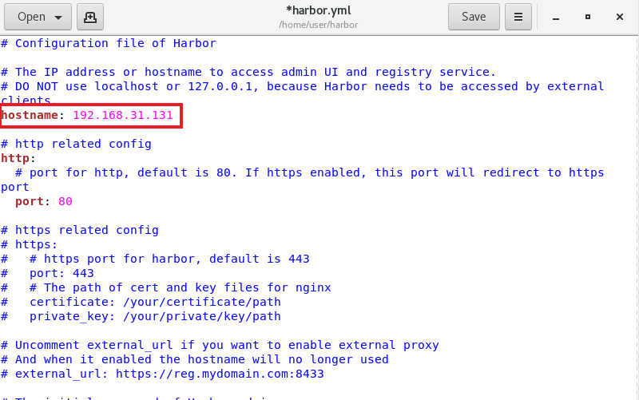
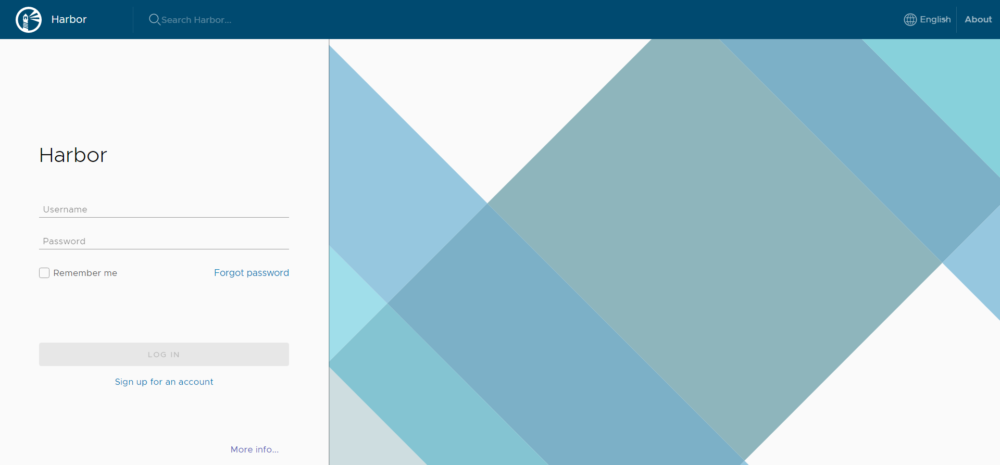
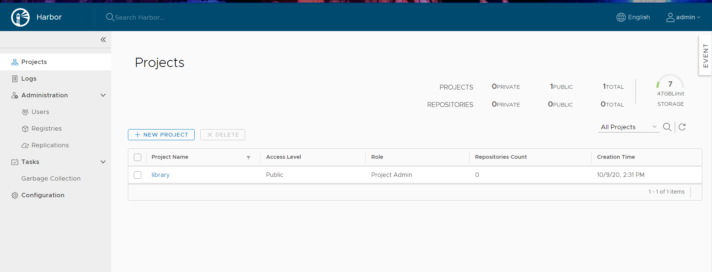
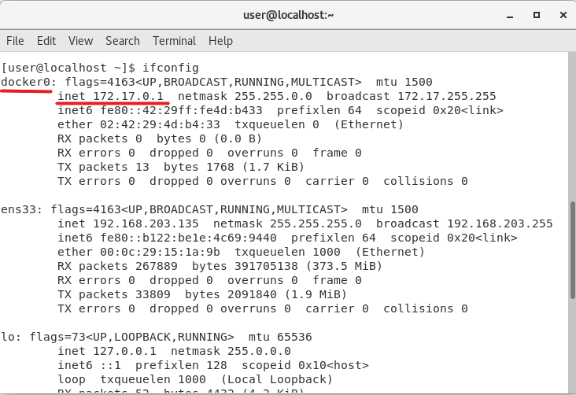
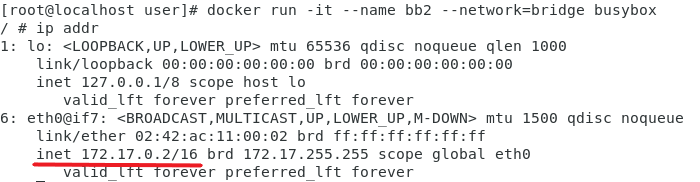
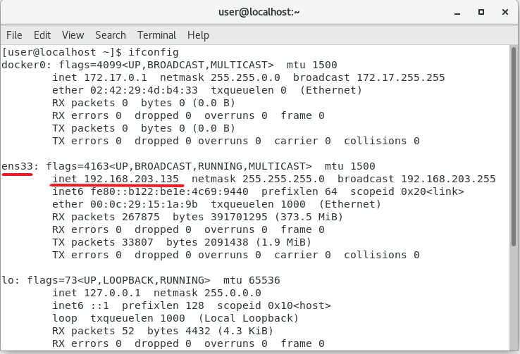
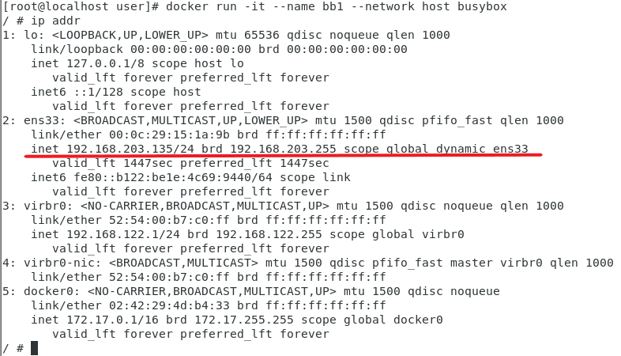
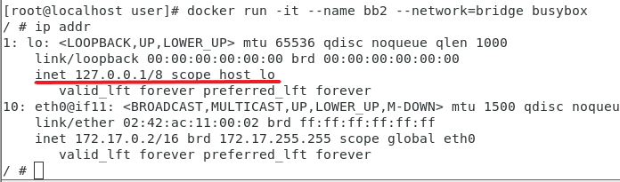
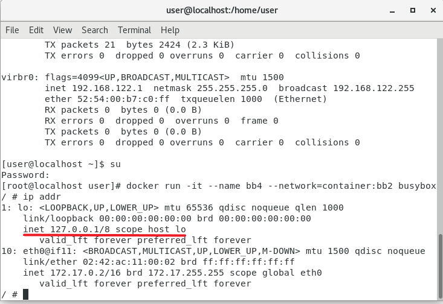
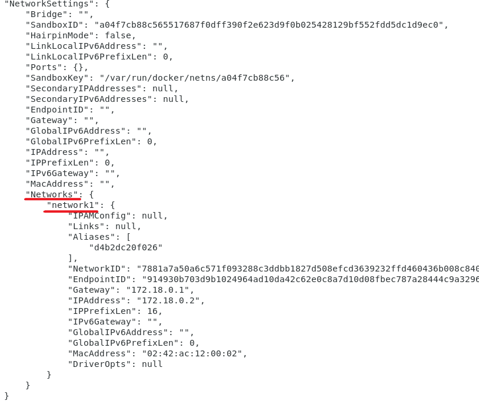

[toc]
# 備份Docker鏡像
> 將鏡像輸出成tar包
```sh
docker save -o [輸出tar檔名] [欲輸出image檔名]
```
* `o`:輸出檔案

# 建立Docker的私有倉儲--使用Harbor
>在此安裝[1.9.0](https://github.com/goharbor/harbor/releases/tag/v1.9.0)的版本

## 安裝Harbor的image

* 下載壓縮檔並解壓縮
```sh
wget https://storage.googleapis.com/harbor-releases/release-1.9.0/harbor-offline-installer-v1.9.0.tgz
```

* 進入**harbor**更改**harbor.yml**內容
>在此只更改本機端IP



* 執行**install.sh**檔案

```sh
sh install.sh
```

* 增加/etc/docker/daemon.json內容
>將IP設為所要連線的IP，在此為本機端

```sh
{
"insecure-registries":["192.168.31.131"]
}
```

* 重新啟動**daemon**和**docker**

```sh
systemctl daemon-reload
systemctl restart docker
```

## 登入圖形化介面
>輸入在**harbor.yml**中所修改IP進入Harbor主頁面

* Harbor主畫面
    >用預設管理者帳號和密碼進行登入
    預設帳號&密碼:admin;Harbor12345

    

* 登入後畫面



## 上傳檔案到Harbor
> 可以在Project>想要上傳的資料庫>Repositories>PUSH IMAGE找到如何上傳

* 對要上傳的image進行標籤註記

```sh
docker tag [所要上傳的image檔名:版本] [虛擬機IP/所要儲存的資料夾/image檔名]
```

* 登入Harbor
> 如果未指定登入位置，預設登入位置為Docker Hub

```sh
docker login 虛擬機IP
```

* 檔案上傳
```sh
docker push [虛擬機IP/所要儲存的資料夾/image檔名]
```

---
# Docker 網路

## Docker 網路類別
>可以分成四類
* Bridge(預設)
* Host
* Container
* None

### 實際操作
* Bridge
> 為容器產生一個新的IP

```sh
[root@localhost user]# docker run -it --name bb2 --network=bridge busybox
```

> 實驗畫面
> * 虛擬機

> * 容器


* Host
> 容器與虛擬機擁有相同IP

```sh
[root@localhost user]# docker run -it --name bb1 --network host busybox
```

> 實驗畫面
> * 虛擬機

> * 容器


* Container
>使兩個容器存在在同一個Loopback，通常使用在集群中

```sh
[root@localhost user]# docker run -it --name bb4 --network=container:bb2 busybox
```

> 實驗結果
> * bb2

> * bb4


* None
> 不為容器產生任何IP
```sh
docker run -it --name bb3 --network=none busybox
```
> * 實驗結果
>
> ```sh
> [root@localhost user]# docker run -it --name bb3 --network=none busybox
>    / # ip addr
>   1: lo: <LOOPBACK,UP,LOWER_UP> mtu 65536 qdisc noqueue qlen 1000
>        link/loopback 00:00:00:00:00:00 brd 00:00:00:00:00:00
>        inet 127.0.0.1/8 scope host lo
>        valid_lft forever preferred_lft forever
>    ```

### 自訂義網路

* 創建網路
>預設為*Bridge*

```sh
docker network [欲創造網路名稱]
```

* 查看所有網路

```sh
[root@localhost user]# docker network ls
NETWORK ID          NAME                DRIVER              SCOPE
2ebdde35c5e7        bridge              bridge              local
be19f94bdc67        host                host                local
7881a7a50a6c        network1            bridge              local
30f8c8c5174e        none                null                local
```

* 創建容器

```sh
[root@localhost user]# docker run -it --name=bb5 --network=network1 busybox
```

* 查看容器所有資訊
>從中找到**NetworkSettings**查看網路資訊

```sh
docker inspect [容器ID/名稱]
```




---
# 參考資料
* [Day9：如何備份Docker Image 為tar 檔- iT 邦幫忙::一起幫忙](https://ithelp.ithome.com.tw/articles/10191387)
* [Docker網路管理（容器的四種網路模式） - IT閱讀](https://www.itread01.com/content/1542573736.html)
* [Docker 網路模式詳解及容器間網路通訊- CodingNote.cc](https://codingnote.cc/zh-tw/p/189940/)
