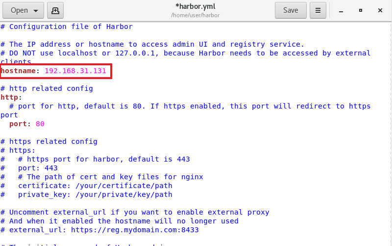
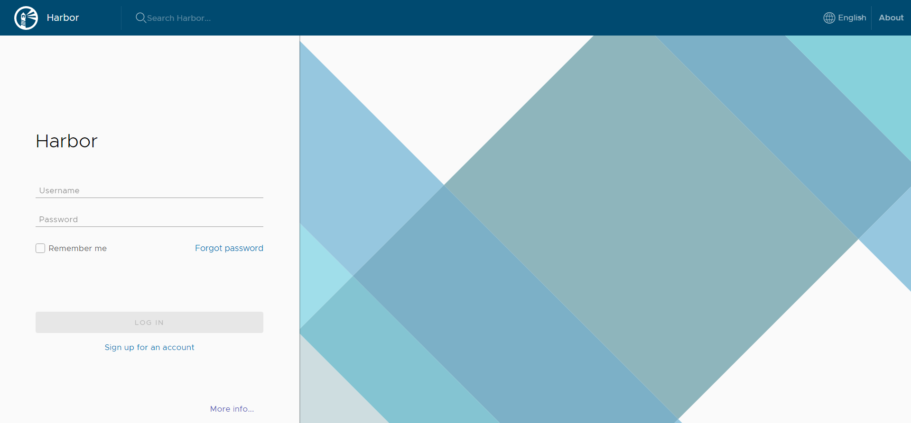
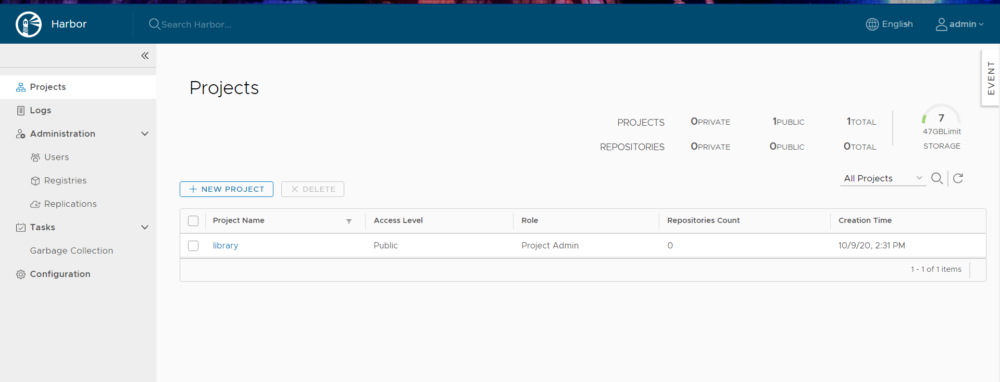

# 備份Docker鏡像
> 將鏡像輸出成tar包
```sh
docker save -o 輸出tar檔名 欲輸出image檔名
```
`o`:輸出檔案

# 建立Docker的私有倉儲--使用Harbor
>在此安裝[1.9.0](https://github.com/goharbor/harbor/releases/tag/v1.9.0)的版本

## 安裝Harbor的image
* 下載壓縮檔並解壓縮
```sh
wget https://storage.googleapis.com/harbor-releases/release-1.9.0/harbor-offline-installer-v1.9.0.tgz
```
* 進入**harbor**更改**harbor.yml**內容
>在此只更改本機端IP


* 執行**install.sh**檔案
```sh
sh install.sh
```
* 增加/etc/docker/daemon.json內容
>將IP設為本機端IP
```sh
{
"insecure-registries":["192.168.31.131"]
}
```
* 重新啟動**daemon**和**docker**
```sh
systemctl daemon-reload
```
```sh
systemctl restart docker
```
## 登入圖形化介面
>輸入在**harbor.yml**中所修改IP進入Harbor主頁面
* Harbor主畫面
    >用預設管理者帳號和密碼進行登入
    預設帳號&密碼:admin;Harbor12345

    

* 登入後畫面


## 上傳檔案到Harbor
> 可以在Project>想要上傳的資料庫>Repositories>PUSH IMAGE找到如何上傳

* 對要上傳的image進行標籤註記
```sh
docker tag [所要上傳的image檔名:版本] [虛擬機IP/所要儲存的資料夾/image檔名]
```
* 登入Harbor
> 如果未指定登入位置，預設登入位置為Docker Hub
```sh
docker login 虛擬機IP
```
* 檔案上傳
```sh
docker push [虛擬機IP/所要儲存的資料夾/image檔名]
```

# Docker 網路

## Docker 網路類別
>可以分成四類
* hosh
* bridge
* none
* container(用在群集裡)


---
### 參考資料
[Day9：如何備份Docker Image 為tar 檔- iT 邦幫忙::一起幫忙](https://ithelp.ithome.com.tw/articles/10191387)
