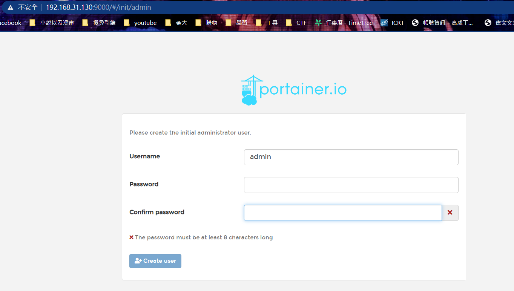
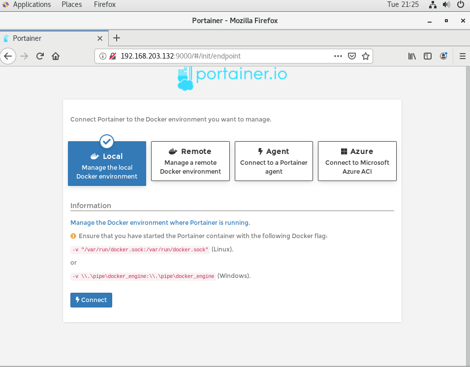
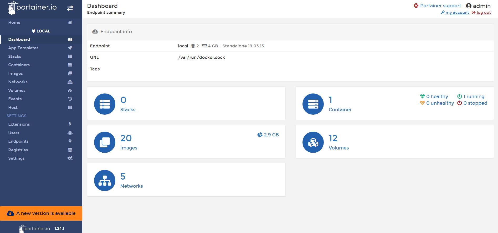

## Docker 網路
* docker容器之間連結
> 後建立的容器可以連結到先建立的容器，而先建立的容器無法連結到後建立的容器
```sh
docker run --link [容器名稱/容器ID]
```
---
## Docker volume
>將容器上所做的更動以檔案方式保存下來，以達成容器間檔案共享與保存

* 建立Docker volume
```sh
docker volume create [volume名稱]
```
* 查看Docker volume 清單
```sh
docker volume ls
```
* 查看 Docker volume 在虛擬機中所存放檔案位置
```sh
docker inspect [容器的ID或名稱]
```
---
## Portainer
>為一管理Docker環境的圖形化工具
* 安裝Portainer
```sh
docker run -d -p 9000:9000 --restart=always --name portainer -v /var/run/docker.sock:/var/run/docker.sock -v /Users/lee/dev/docker_file/portainer/data:/data docker.io/portainer/portainer
```
* 進入Portainer
>連結虛擬機IP:9000
>此處密碼為之後登入密碼


* 選擇連結環境
> 本地(在此選擇)


* 進入畫面

---
## Dockerfile
>用來建立鏡像檔，並且將多個動作建立在同一個鏡像檔中

* 編輯Dockerfile
> 參數運用看[Docker – Dockerfile 指令教學，含範例解說 -- 靖.技場](https://www.jinnsblog.com/2018/12/docker-dockerfile-guide.html)

* 建立鏡像檔
```sh
docker build [參數] [所要建立鏡像檔名稱]:[tag] .
```
* `-t`: 指定映像檔名稱、標籤
* `-f`: 指定Dockerfile的位置 
* `.` : Dockerfile所儲存目錄，*.*儲存在目前目錄

---
# 參考資料
* [Docker volume 簡單用法| 只放拖鞋的鞋櫃](https://julianchu.net/2016/04/19-docker.html)
* [Docker – Dockerfile 指令教學，含範例解說 -- 靖.技場](https://www.jinnsblog.com/2018/12/docker-dockerfile-guide.html)