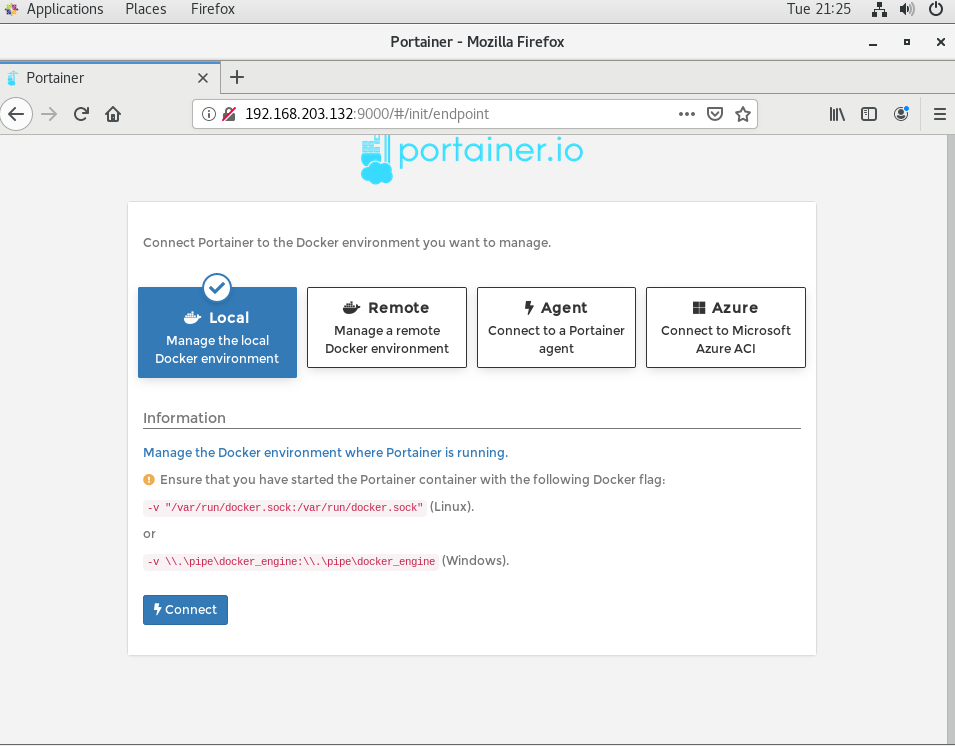
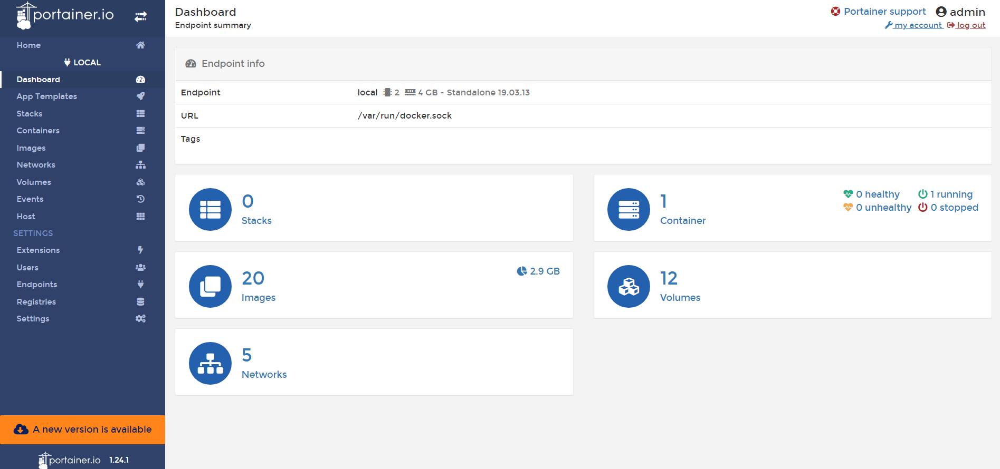

## Docker 網路
* docker容器之間連結
> 目的端可以連結到來源端，而來源端無法連結到目的端
```sh
docker run --link [容器名稱/容器ID]
```
---
## Docker volume
>為了方便管理Docker資料
* 建立Docker volume
```sh
docker volume create [volume名稱]
```
* 查看Docker volume 清單
```sh
docker volume ls
```
---
## Portainer
>為一管理Docker環境的圖形化工具
* 安裝Portainer
```sh
docker run -d -p 9000:9000 --restart=always --name portainer -v /var/run/docker.sock:/var/run/docker.sock -v /Users/lee/dev/docker_file/portainer/data:/data docker.io/portainer/portainer
```
* 進入Portainer
>連結虛擬機IP:9000
>此處密碼為之後登入密碼


* 選擇連結環境
> 本地(在此選擇)


* 進入畫面

---
## DockerFile
>可一次在image中進行多個動作的安裝

---
### 參考資料:
* 