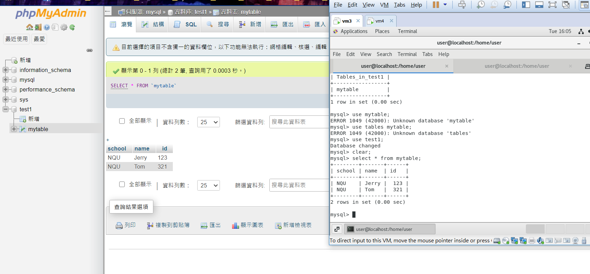
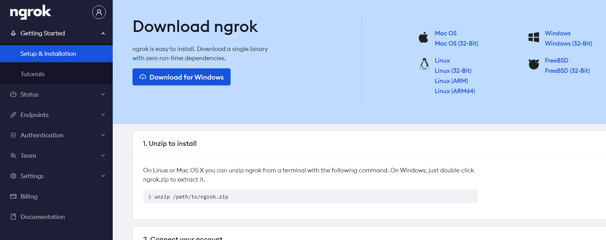
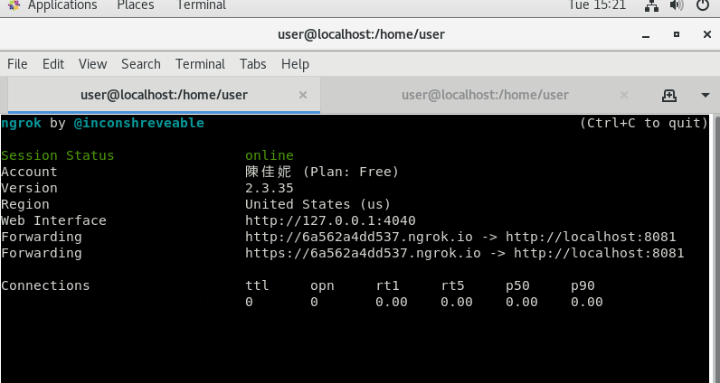
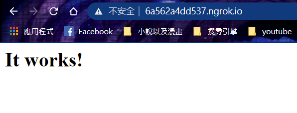

# Docker應用
### 在docker上執行Mysql & phpMyAdmin
#### 安裝 mysql & phpMyAdmin 鏡像檔
* Mysql
```sh
docker run -itd --name mysql -p 3306:3306 -e MYSQL_ROOT_PASSWORD=root mysql:5.7.24
```
* phpMyAdmin
```sh
docker run --name phpmyadmin -d --link mysql -e PMA_HOST="mysql" -p 8080:80 phpmyadmin/phpmyadmin
```
#### 測試

---
### Ngrok
> 讓本地網頁可以讓外部網路所連線
#### 安裝 Ngrok
* 在[官網](https://ngrok.com/)註冊帳號
* 進入頁面
    
* 下載檔案並解壓縮
* 編譯**ngrok**
```sh
./ngrok authtoken [自己的token]
```
#### 測試
* 開啟httpd
```sh
[root@localhost user]# docker run -d -p 8081:80 httpd
2d7b773392b8d543db666ef2b24e3f0fe031bddb4245865492413ab901def525
[root@localhost curl 127.0.0.1:8081
<html><body><h1>It works!</h1></body></html>
```
* 映射 8081 port號
```sh
./ngrok http 8081
```
* 連線畫面
    
* 測試畫面
    
---
### Iris(1)
* train_model.py
```sh
# coding: utf-8
import pickle
from sklearn import datasets
from sklearn.model_selection import train_test_split
from sklearn import tree

# simple demo for traing and saving model
iris=datasets.load_iris()
x=iris.data
y=iris.target

#labels for iris dataset
labels ={
  0: "setosa",
  1: "versicolor",
  2: "virginica"
}

x_train, x_test, y_train, y_test = train_test_split(x, y, test_size=.25)
classifier=tree.DecisionTreeClassifier()
classifier.fit(x_train,y_train)
predictions=classifier.predict(x_test)

#export the model
model_name = 'model.pkl'
print("finished training and dump the model as {0}".format(model_name))
pickle.dump(classifier, open(model_name,'wb'))
```
* server.py
```sh
# coding: utf-8
import pickle

from flask import Flask, request, jsonify

app = Flask(__name__)

# Load the model
model = pickle.load(open('model.pkl', 'rb'))
labels = {
  0: "versicolor",   
  1: "setosa",
  2: "virginica"
}

@app.route('/api', methods=['POST'])
def predict():
    # Get the data from the POST request.
    data = request.get_json(force = True)
    predict = model.predict(data['feature'])
    return jsonify(predict[0].tolist())

if __name__ == '__main__':
    app.run(debug = True, host = '0.0.0.0')
```
* client.py
```sh
# coding: utf-8
import requests
# Change the value of experience that you want to test
url = 'http://192.168.31.78:5000/api'
feature = [[5.8, 4.0, 1.2, 0.2]]
labels ={
  0: "setosa",
  1: "versicolor",
  2: "virginica"
}

r = requests.post(url,json={'feature': feature})
print(labels[r.json()])
```
---
### 參考資料
* [利用 Docker 架起 phpMyAdmin + MySQL (MAC) -- IT邦幫忙](https://ithelp.ithome.com.tw/articles/10200754)
* [ngrok讓外部能夠連到localhost的網站及服務](https://blog.alantsai.net/posts/2018/04/devtooltips-5-ngrok-allow-public-to-access-localhost-website-and-sql-server#WizKMOutline_1525065134863862)
* [通过 Flask, Docker, Jenkins 和 Kubernets 部署机器学习模型](http://wulc.me/2019/04/19/%E9%80%9A%E8%BF%87%20Flask,%20Docker,%20Jenkins%20%E5%92%8C%20Kubernets%20%E9%83%A8%E7%BD%B2%E6%9C%BA%E5%99%A8%E5%AD%A6%E4%B9%A0%E6%A8%A1%E5%9E%8B/)