# Gitlab-CICD(1)

## Iris(2)
>延續上週內容

### 安裝"nitincypher/docker-ubuntu-python-pip"鏡像
```
docker pull nitincypher/docker-ubuntu-python-pip
```
### 建立Dockerfile
```
FROM nitincypher/docker-ubuntu-python-pip

COPY ./requirements.txt /app/requirements.txt

WORKDIR /app

RUN pip install -r requirements.txt

COPY server.py /app

COPY train_model.py /app

CMD python /app/train_model.py && python /app/server.py

```
### 建立鏡像檔
```
docker bulid -t iris:1.0 .
```
* `-t`:標籤建立
* `.`:所在目前資料夾建立
### 執行&測試
```
[root@localhost iris]# docker run -itd -p 5000:5000 iris:1.0
f3fb1d5d361ff632077b1e342e478943cb1056bfaab73c71a2ab1a5ad0cc2cca
[root@localhost iris]# python client.py 
setosa
```
---
## 與Gitlab建立CI/CD
> CI:Continuous Integration
> CD:Continuous Deployment
### 與Gitlab建立ssh連線
* 產生ssh金鑰
  > 所生成的金鑰檔案會存放在 **~/.ssh**裡
    ```sh
    [root@localhost user]# ls ~/.ssh
    id_rsa  id_rsa.pub
    ```

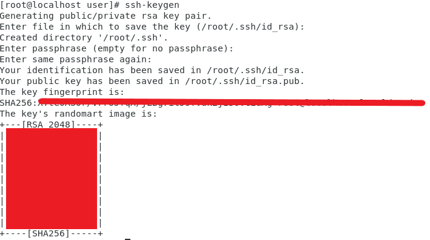

* 在Gitlab進行設定
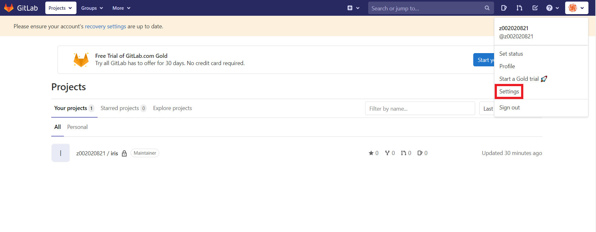
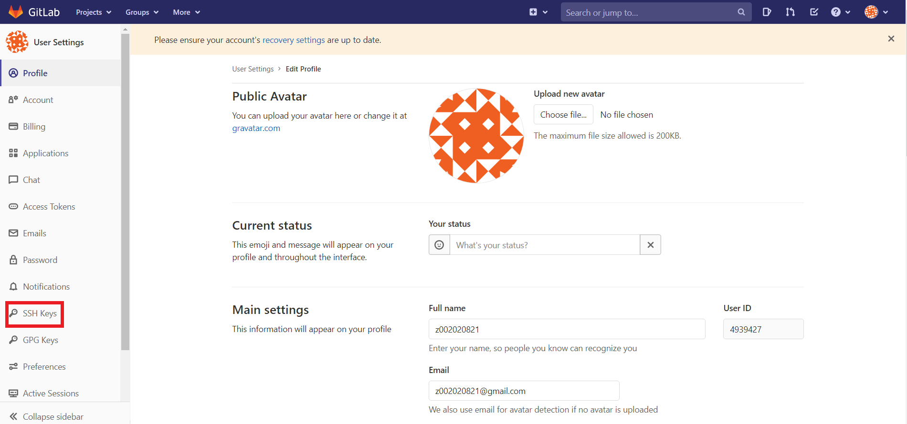

* 複製 **~/.ssh/id_rsa.pub** 內容到Gitlab
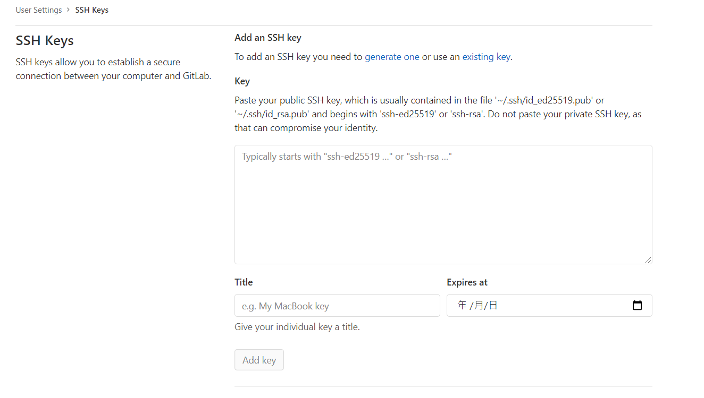
* 完成畫面
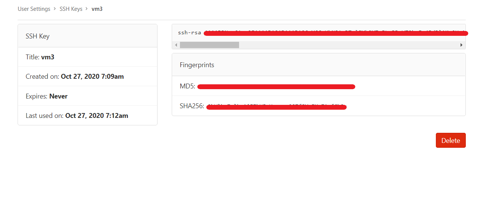

### 安裝gitlab-runner
>在目的端安裝
* 下載 **gitlab-runner**
```sh
[root@localhost .ssh]# curl -L --output /usr/local/bin/gitlab-runner https://gitlab-runner-downloads.s3.amazonaws.com/latest/binaries/gitlab-runner-linux-amd64
  % Total    % Received % Xferd  Average Speed   Time    Time     Time  Current
                                 Dload  Upload   Total   Spent    Left  Speed
100 35.3M  100 35.3M    0     0  1065k      0  0:00:33  0:00:33 --:--:-- 1375k

```
* 加入可執行權限
```sh
[root@localhost .ssh]# chmod +x /usr/local/bin/gitlab-runner
```
* 增加使用者
```sh
[root@localhost .ssh]# useradd --comment 'GitLab Runner' --create-home gitlab-runner --shell /bin/bash
```
* 修改使用者權限
```sh
[root@localhost .ssh]# usermod -aG docker gitlab-runner
```
`-G`:變更使用者次要群組

* 安裝gitlab-runner
```sh
[root@localhost ~]# gitlab-runner install --user=gitlab-runner --working-directory=/home/gitlab-runner
Runtime platform                                    arch=amd64 os=linux pid=4944 revision=ece86343 version=13.5.0
```
* 執行gitlab-runner
```sh
[root@localhost ~]# gitlab-runner start
Runtime platform                                    arch=amd64 os=linux pid=5000 revision=ece86343 version=13.5.0
```
### gitlab-runner設定
> token取得方式
    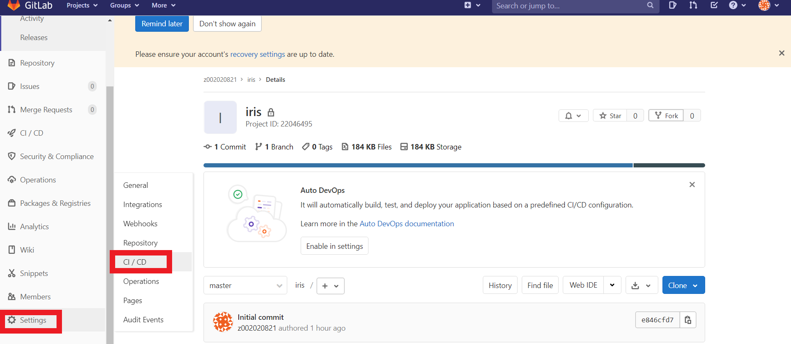
    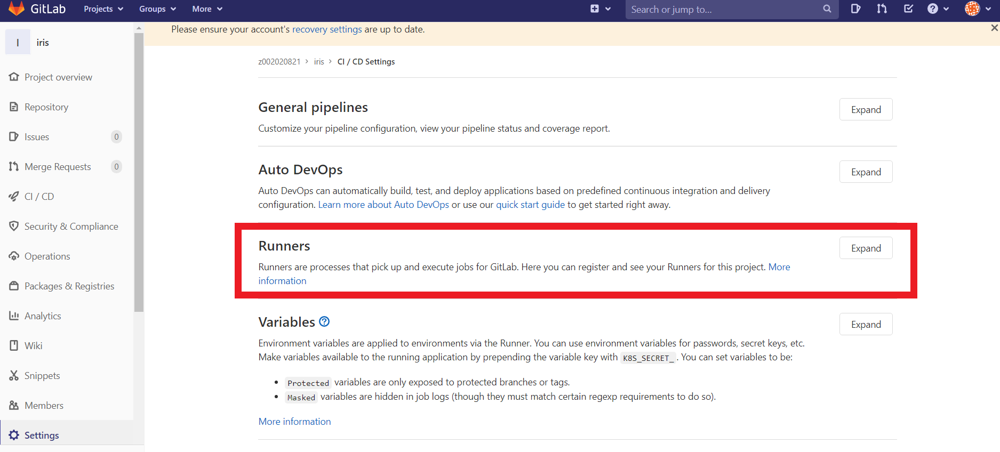

* gitlab-runner註冊
```sh
[root@localhost ~]# gitlab-runner register
Runtime platform                                    arch=amd64 os=linux pid=5447 revision=ece86343 version=13.5.0
Running in system-mode.                            
                                                   
Please enter the gitlab-ci coordinator URL (e.g. https://gitlab.com/):
https://gitlab.com/
Please enter the gitlab-ci token for this runner:
"此專案的token"
Please enter the gitlab-ci description for this runner:
[localhost.localdomain]: vm4.local-runner
Please enter the gitlab-ci tags for this runner (comma separated):
vm4
Registering runner... succeeded                     runner="此專案的token"
Please enter the executor: docker-ssh+machine, docker, docker-ssh, parallels, virtualbox, kubernetes, custom, shell, ssh, docker+machine:
shell
Runner registered successfully. Feel free to start it, but if it's running already the config should be automatically reloaded! 

```
* 關閉**Share runner**功能
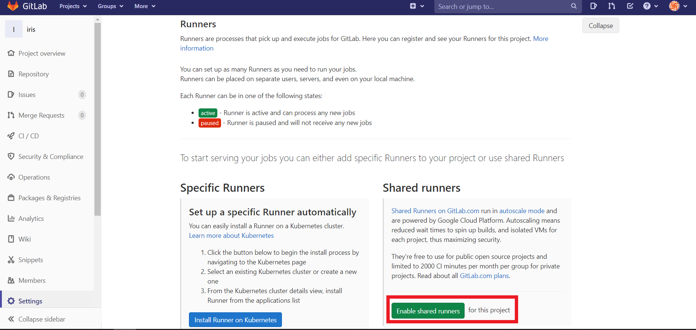
* 完成畫面
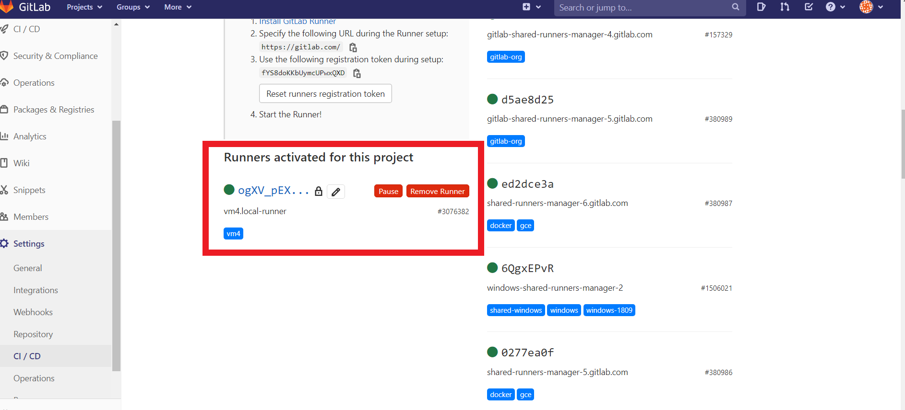

### 上傳檔案
* 編輯 **.gitlab-ci.yml**
> 在來源端(vm3)編輯
```sh
stages:
  - deploy

docker-deploy:
  stage: deploy
  script:
    - docker build -t iris .
    - if [ $(docker ps -aq --filter name=iris) ]; then docker rm -f iris; fi
    - docker run -d -p 5000:5000 --name iris iris
  tags:
    - vm4
```
* 上傳檔案至gitlab
```sh
[root@localhost iris]# git add .gitlab-ci.yml
[root@localhost iris]# git commit -m "submit .gitlab-ci.yml"
[master a779a6f] submit .gitlab-ci.yml
 1 file changed, 11 insertions(+)
 create mode 100644 .gitlab-ci.yml
[root@localhost iris]# git push -u origin master
Counting objects: 4, done.
Delta compression using up to 2 threads.
Compressing objects: 100% (3/3), done.
Writing objects: 100% (3/3), 421 bytes | 0 bytes/s, done.
Total 3 (delta 1), reused 0 (delta 0)
To git@gitlab.com:z002020821/iris.git
   e846cfd..a779a6f  master -> master
Branch master set up to track remote branch master from origin.
```
* 成功畫面

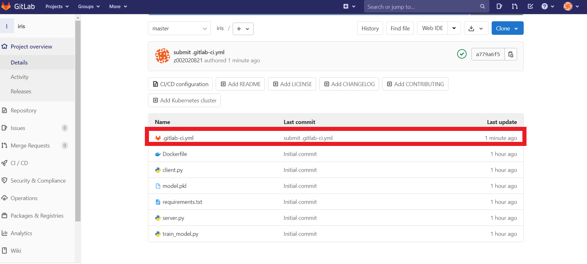

### 確認連線建立

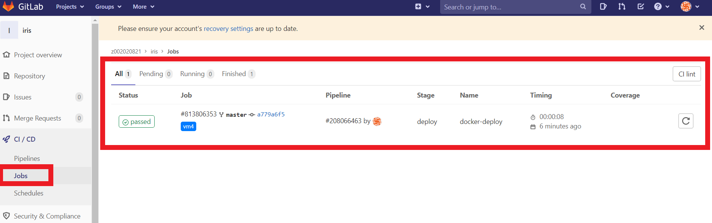

### 測試
>在vm3上操作
* 更改 **.gitlab-ci.yml**檔案
```sh
stages:
  - deploy

docker-deploy:
  stage: deploy
  script:
    - docker build -t iris .
    - if [ $(docker ps -aq --filter name=iris) ]; then docker rm -f iris; fi
    - docker run -d -p 5001:5000 --name iris iris
  tags:
    - vm4
```
* 重新推送
```sh
[root@localhost iris]# git add .gitlab-ci.yml
[root@localhost iris]# git commit -m "submit .gitlab-ci.yml"
[master 84f6836] submit .gitlab-ci.yml
 1 file changed, 1 insertion(+), 1 deletion(-)
[root@localhost iris]# git push -u origin master
Counting objects: 5, done.
Delta compression using up to 2 threads.
Compressing objects: 100% (3/3), done.
Writing objects: 100% (3/3), 288 bytes | 0 bytes/s, done.
Total 3 (delta 2), reused 0 (delta 0)
To git@gitlab.com:z002020821/iris.git
   a779a6f..84f6836  master -> master
Branch master set up to track remote branch master from origin.
```
* 完成畫面
> 在vm4上查看 

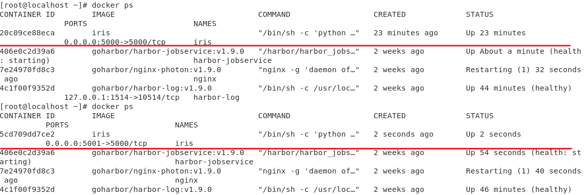
---
# 參考資料
* [通过 Flask, Docker, Jenkins 和 Kubernets 部署机器学习模型](http://wulc.me/2019/04/19/%E9%80%9A%E8%BF%87%20Flask,%20Docker,%20Jenkins%20%E5%92%8C%20Kubernets%20%E9%83%A8%E7%BD%B2%E6%9C%BA%E5%99%A8%E5%AD%A6%E4%B9%A0%E6%A8%A1%E5%9E%8B/)
