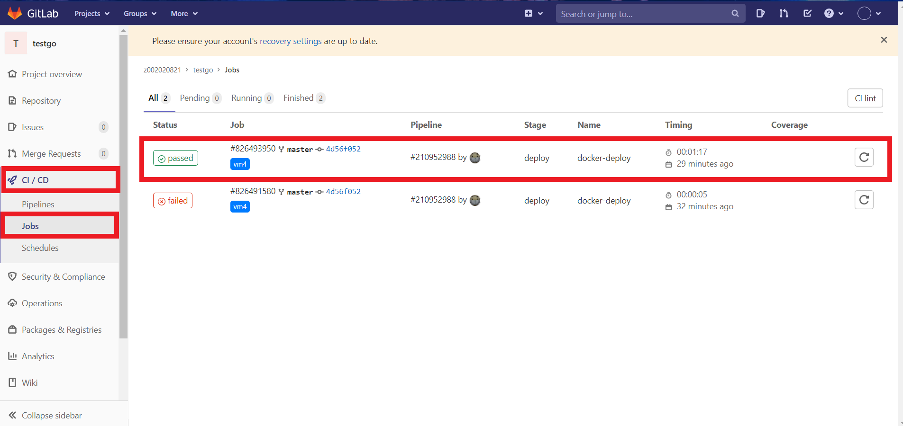
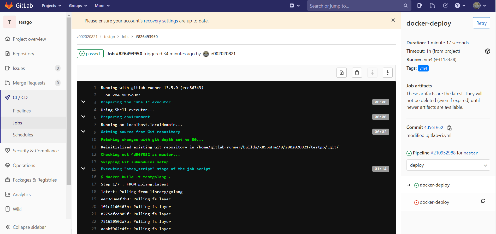
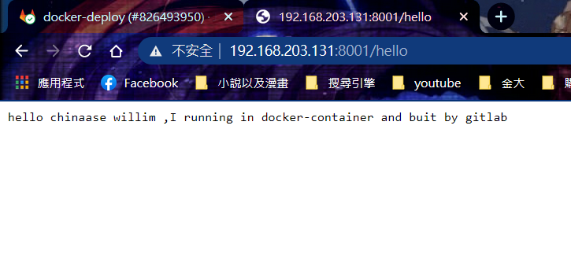
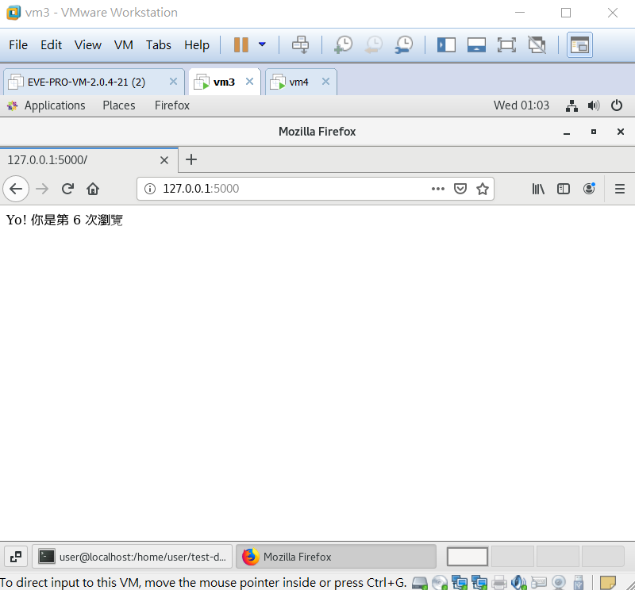

[toc]
# Gitlab-CICD(2)

## 與Gitlab建立CI/CD
>延續上週內容，以建立web server作為範例

### 本地端建立鏡像檔
* 下載**gitlab-cicd**檔案
```sh
git clone https://github.com/yangshun2005/gitlab-cicd.git
```
* 建立Docker Image
```sh
docker build -t testgo:1:0 .
```
* 測試是否能正常運作
```sh
[root@localhost testgolang]# curl 192.168.203.132:8001/hello
hello chinaase willim ,I running in docker-container and buit by gitlab
```
### 與gitlab產生ssh連線
>在另一台機器上操作(vm4)
* [詳細資訊請按上週筆記](../20201027_上課筆記.md)

### 與專案進行連結
>在另一台機器上操作(vm4)

* 執行**gitlab-runner**
```sh
[root@localhost .ssh]# gitlab-runner start
Runtime platform                                    arch=amd64 os=linux pid=3721 revision=ece86343 version=13.5.0
```
* gitlab-runner註冊
```sh
[root@localhost .ssh]# gitlab-runner register
Runtime platform                                    arch=amd64 os=linux pid=4262 revision=ece86343 version=13.5.0
Running in system-mode.                            
                                                   
Please enter the gitlab-ci coordinator URL (e.g. https://gitlab.com/):
https://gitlab.com/
Please enter the gitlab-ci token for this runner:
"此專案的token"
Please enter the gitlab-ci description for this runner:
[localhost.localdomain]: vm4
Please enter the gitlab-ci tags for this runner (comma separated):
vm4
Registering runner... succeeded                     runner=sGVAkTej
Please enter the executor: shell, virtualbox, docker+machine, kubernetes, docker, docker-ssh, parallels, custom, ssh, docker-ssh+machine:
shell
Runner registered successfully. Feel free to start it, but if it's running already the config should be automatically reloaded! 
```
### 確認連結狀態




### 測試



---

## Docker Compose
>可同時管理執行多個容器，以建置web server作為範例
* app.py

```sh
import time
import redis
from flask import Flask

app = Flask(__name__)
cache = redis.Redis(host='redis', port=6379)

def get_hit_count():
     retries = 5
     while True:
         try:
             return cache.incr('hits')
         except redis.exceptions.ConnectionError as exc:
             if retries == 0:
                 raise exc
             retries -= 1
             time.sleep(0.5)

@app.route('/')
def get_index():
     count = get_hit_count()
     return 'Yo! 你是第 {} 次瀏覽\n'.format(count)

if __name__ == "__main__":
     app.run(host="0.0.0.0", debug=True)
```
* Dockerfile
```sh
FROM python
ADD . /code 
WORKDIR /code 
RUN pip install -r requirements.txt
CMD ["python", "app.py"]
```
* requirements.txt
```sh
flask
redis
```
* docker-compose.yml
> 此範例所要產生的容器設定

```sh
version: '3' #所要建立的版本
services:
 web:
     build: . #建立在此目錄下
     ports:
     - "5000:5000" #本機端和容器的port對應
     volumes:
     - .:/code #本機端和容器的資料夾對應
 redis:
     image: "redis:alpine" #鏡像來源
```
* 執行**docker-compose**
>所生成的容器會在原先檔案名稱之前加上檔案所在目錄的名稱

```sh
[root@localhost test-dockercompose]# docker-compose up -d
Creating network "test-dockercompose_default" with the default driver
Creating test-dockercompose_web_1   ... done
Creating test-dockercompose_redis_1 ... done
```

* 確認docker-compose是否成功開啟

```sh
[root@localhost test-dockercompose]# docker ps | grep test-docker*
18edc3112135        redis:alpine                                        "docker-entrypoint.s…"   9 seconds ago       Up 6 seconds                       6379/tcp                    test-dockercompose_redis_1
2f9f752c4048        test-dockercompose_web                              "python app.py"          9 seconds ago       Up 6 seconds                       0.0.0.0:5000->5000/tcp      test-dockercompose_web_1
```
* 執行結果



---
# 參考資料
* [yangshun2005/gitlab-cicd](https://github.com/yangshun2005/gitlab-cicd)
* [Docker Compose 建置 Web service 起步走入門教學](https://blog.techbridge.cc/2018/09/07/docker-compose-tutorial-intro/)

