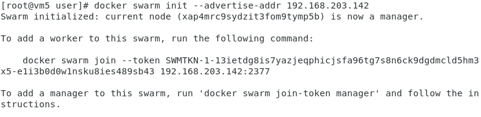
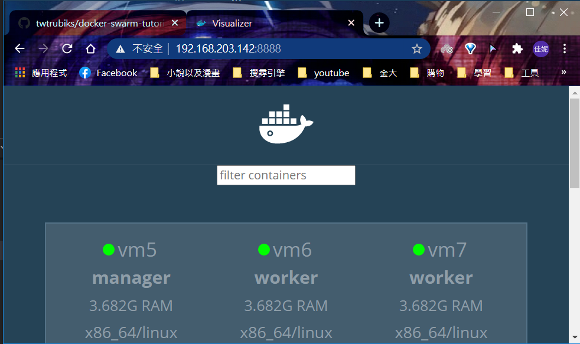
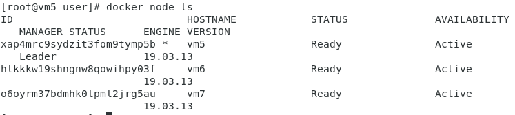
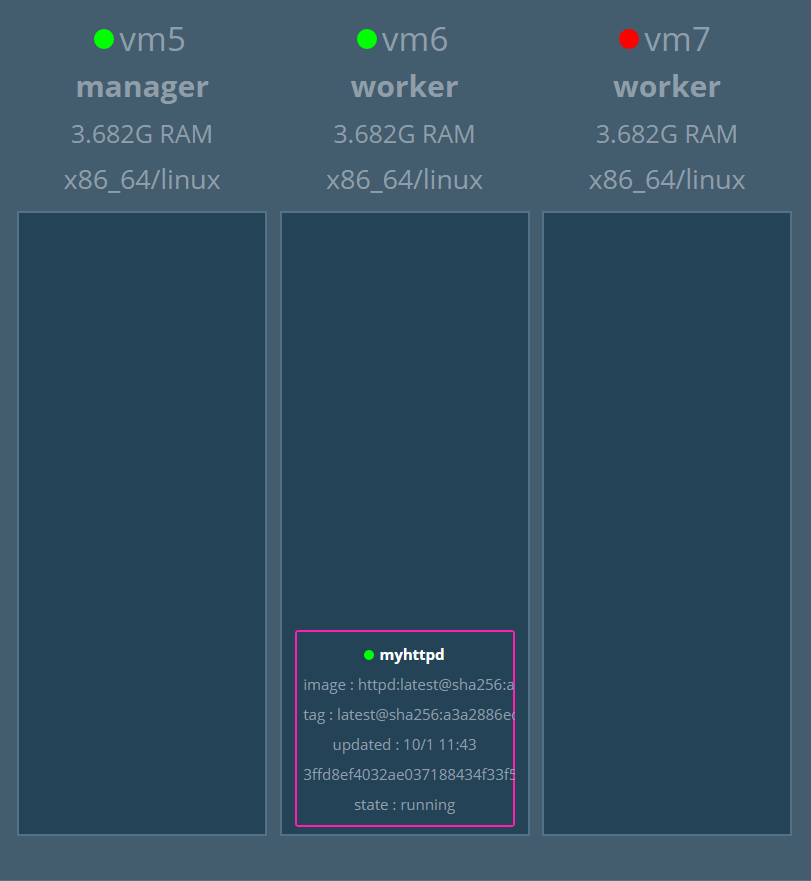
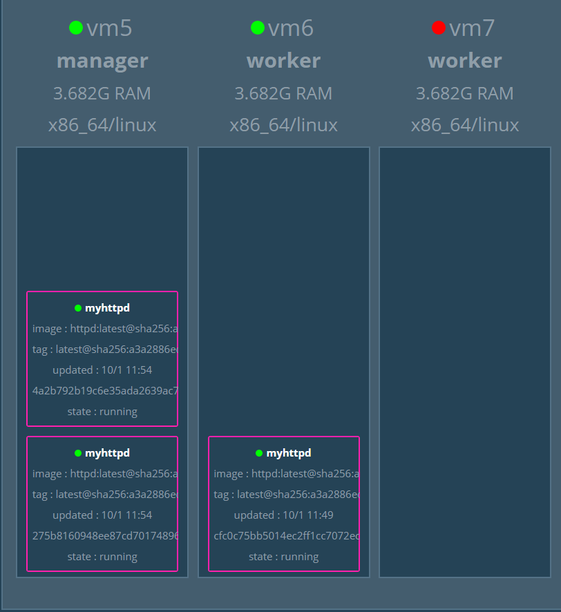
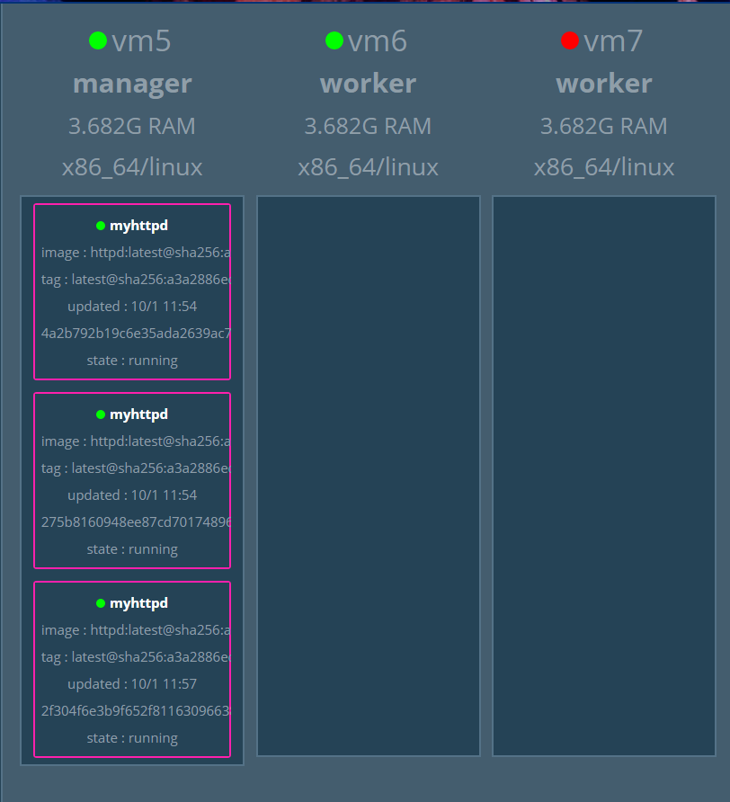

# Docker swarm(1)
> 需要三台虛擬機(vm5, vm6, vm7)

## 前置作業

### 更改虛擬機hostname
>方便分辨虛擬機

```sh
[root@localhost user]# hostnamectl set-hostname vm5 
[root@localhost user]# bash
```
### 修改/etc/hosts
> **/etc/hosts**儲存了主機名和IP位址的對映關係

```sh
127.0.0.1   localhost localhost.localdomain localhost4 localhost4.localdomain4
::1         localhost localhost.localdomain localhost6 localhost6.localdomain6
#增加vm5,vm6,vm7的主機名稱和IP
192.168.203.142 vm5
192.168.203.143 vm6
192.168.203.144 vm7
```
## Docker Swarm Visualizer
> 可以將Docker Swarm視覺化的套件
### 安裝Docker Swarm Visualizer
>必須先登入Docker Hub

```sh
docker pull dockersamples/visualizer
```
### 初始化Docker Swarm 
> 在哪一台虛擬機進行初始化，那台虛擬機就是leader

```sh
docker swarm init --advertise-addr [此台虛擬機的ip]
```



### 啟動Docker Swarm

```sh
docker run -itd -p 8888:8080 -e HOST=192.168.203.142 -e PORT=8080 -v /var/run/docker.sock:/var/run/docker.sock --name visualizer dockersamples/visualizer
```

* 在瀏覽器開啟畫面



### Docker Swarm 操作

* 查看節點



* 移除節點
```sh
docker node rm [欲刪除的節點]
```

* 離開集群
> 如果是master，要加上`--force`
```sh
docker swarm leave
```

* 創建服務

```sh
[root@vm5 data]# docker service create --name=myhttpd httpd
xml2pc19ensq9fb1dm7aqjyj5
overall progress: 1 out of 1 tasks 
1/1: running   
verify: Service converged 
```


* 查看服務內容

```sh
docker service inspect [服務名]
```
* 刪除服務
```sh
docker service rm [容器名]
```

* 更新服務
>在此新增對外IP

```sh
[root@vm5 data]# docker service update --publish-add 8763:80 myhttpd 
myhttpd
overall progress: 1 out of 1 tasks 
1/1: running   
verify: Service converged 
```


* 增加服務數量

```sh
[root@vm5 data]# docker service scale myhttpd=3 
myhttpd scaled to 3
overall progress: 3 out of 3 tasks 
1/3: running   
2/3: running   
3/3: running   
verify: Service converged 
```



* 查看服務

```sh
[root@vm5 data]# docker service ls
ID                  NAME                MODE                REPLICAS            IMAGE               PORTS
xml2pc19ensq        myhttpd             replicated          3/3                 httpd:latest        *:8763->80/tcp
```

* 節點維護
> 調度程序不會向節點分派任務

```sh
[root@vm5 data]# docker node update --availability drain vm6
vm6
```


---
# 參考資料
* [twtrubiks/docker-swarm-tutorial](https://github.com/twtrubiks/docker-swarm-tutorial#docker-machine-%E6%95%99%E5%AD%B8)
* [Docker Swarm 日常运维命令笔记- 散尽浮华- 博客园](https://www.cnblogs.com/kevingrace/p/9947909.html)