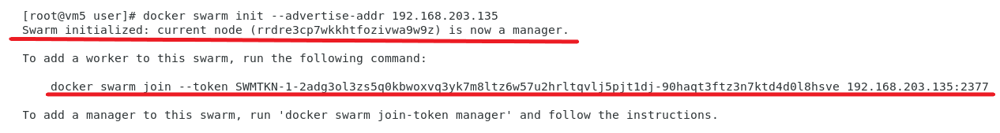

# Docker swarm
> 需要三台虛擬機(vm3, vm4, vm5)
## 前置作業
### 更改虛擬機hostname
>方便分辨虛擬機

```sh
[root@localhost user]# hostnamectl set-hostname vm5 
[root@localhost user]# bash
[root@vm5 user]#

```
### 修改/etc/hosts
> **/etc/hosts**儲存了主機名和IP位址的對映關係
```sh
127.0.0.1   localhost localhost.localdomain localhost4 localhost4.localdomain4
::1         localhost localhost.localdomain localhost6 localhost6.localdomain6
#增加vm3,vm4,vm5的主機名稱和IP
192.168.203.132 vm3 
192.168.203.136 vm4
192.168.203.135 vm5
```
## Docker Swarm Visualizer
> 可以將Docker Swarm視覺化的套件
### 安裝Docker Swarm Visualizer
>必須先登入Docker Hub

```sh
docker pull dockersamples/visualizer
```
### 初始化Docker Swarm Visualizer
> 在哪一台虛擬機進行初始化，那台虛擬機就是leader

```sh
docker swarm init --advertise-addr [此台虛擬機的ip]
```

>
---
### 參考資料
* [twtrubiks/docker-swarm-tutorial](https://github.com/twtrubiks/docker-swarm-tutorial#docker-machine-%E6%95%99%E5%AD%B8)