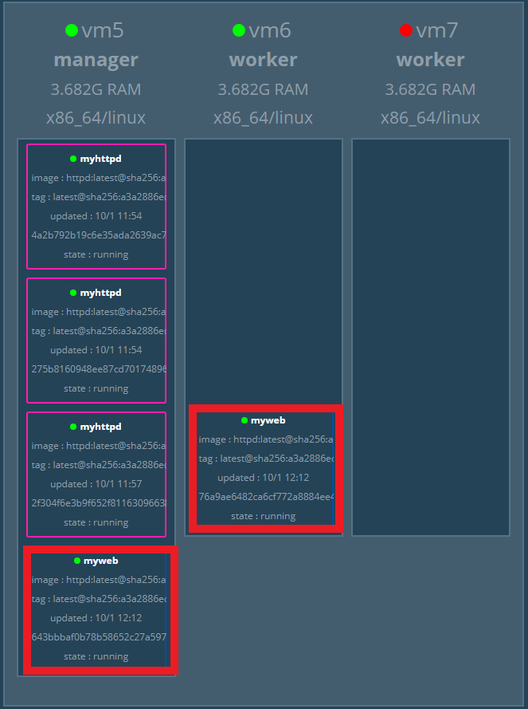

# Docker Swarm(2)

[toc]
## Replicas v.s Global mode

* Replicas : 複製服務分配給節點
* Global mode :在每一個節點上至少要跑一個副本

### Global mode
>在創建服務時，未指定**mode=global**，就默認為**Replicas**

```sh
docker service create --mode global --name myweb -p 8080:80 httpd
```

* 結果



---

## Rolling update v.s Rollback

* Rolling update:不須將服務一個個下線進行更新

* Rollback:回復更新之前的狀態

### Rolling update

* 創建服務

```sh
docker service create --name web --replicas 3 -p 8000:80 httpd:2.4.43
```


* 進行更新

    ```sh
    docker service update --update-parallelism 2 --update-delay 10s --image httpd:2.4.46 web
    ```
    * `update-parallelism` : 一次更新的數量

    * `update-delay` : 每次更新之間的延遲時間

* 結果


### Rollback

```sh
docker service update --rollback web
```

* 結果


---

## label
>用來分類服務的環境

### 新增節點標籤

```sh
[root@vm5 data]# docker node update --label-add env=test vm5
vm5
[root@vm5 data]# docker node update --label-add env=proc vm6
vm6
```


### 新增服務標籤

```sh
docker service create --constraint node.labels.env==test --replicas 2 --name web -p 8000:80 httpd
```

* 結果


### 移除服務標籤

```sh
docker service update --constraint-rm node.labels.env==test web
```

* 結果


### 移除節點標籤

```sh
docker node update --label-rm env vm5
```


---
# 參考資料
* [docker（11、Docker Swarm4）11、副本数量（replicated 和 global ）12、Label 控制 Service 的位置 13、如何配置 Health Check](https://blog.csdn.net/cojn52/article/details/106187071)