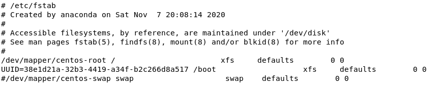
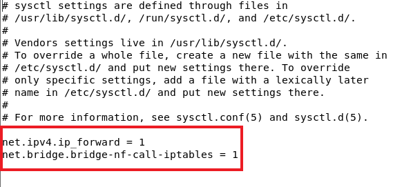
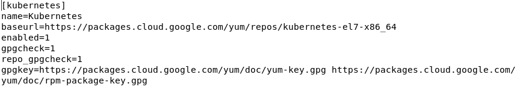

# Kubernetes (K8S)

## K8S建立方式
> 有兩種建立方式，在此使用**kubeadm**建立
* 利用 **kubeadm** 安裝(較為容易)
* 手動安裝(較為困難)
---
## K8S安裝
### 環境架設
|IP Address|Hostname|所扮演的角色|
|:----:|:----:|:----:|
|192.168.203.132|vm3|Worker Node|
|192.168.203.136|vm4|Worker Node|
|192.168.203.137|vm5|Master Node|

### 所有機器安裝

* 安裝常用工具

```sh
yum install wget net-tools -y
```

* 修改機器Hostname

```sh
hostnamectl set-hostname [機器名稱]
```

* 修改 **/etc/hosts**

```sh
127.0.0.1   localhost localhost.localdomain localhost4 localhost4.localdomain4
::1         localhost localhost.localdomain localhost6 localhost6.localdomain6
192.168.203.132 vm3
192.168.203.136 vm4
192.168.203.137 vm5
```

* 檢查防火牆與SELINUX是否關閉

```sh
[root@vm5 user]# getenforce
Disabled
[root@vm5 user]# systemctl status firewalld
● firewalld.service - firewalld - dynamic firewall daemon
   Loaded: loaded (/usr/lib/systemd/system/firewalld.service; disabled; vendor preset: enabled)
   Active: inactive (dead)
     Docs: man:firewalld(1)
```

* 關閉swapon
> 修改 **/etc/fstab**檔案，完成後重新啟動機器



* 修改 **/etc/sysctl.conf**
>設定在開機時自動載入Kernel變數



* 重新載入Kernel變數
    > 有兩種方式
    * 方法一 - 重新載入所有相關檔案
    ```sh
    sysctl --system
    ```

    * 方法二 -  重新載入/etc/sysctl.conf設定
    ```sh
    sysctl -p
    ```

* 暫時開啟IPv4轉發功能

```sh
[root@vm5 user]# echo 1 > /proc/sys/net/ipv4/ip_forward
```

* 確認Docker版本
> 因為不同版本的K8S所支援的Docker版本也不同，所以不要亂更新!!!

```sh
[root@vm5 user]# docker --version
Docker version 19.03.13, build 4484c46d9d
```

* 加入**docker-ce**與**K8S**的yum資源並重新整理
>由於先前已安裝過docker-ce，不需再次安裝

```sh
[root@vm5 user]# yum install -y yum-utils device-mapper-persistent-data lvm2
[root@vm5 user]# gedit /etc/yum.repos.d/kubernetes.repo
```

```sh
[root@vm5 user]# yum clean all && yum repolist
```

* 安裝**K8S**並設定開機時就自動啟動

```sh
[root@vm5 user]# yum install kubelet-1.15.2 kubectl-1.15.2 kubeadm-1.15.2 --nogpgcheck --disableexcludes=kubernetes
[root@vm5 user]# systemctl enable kubelet
```
### Master 設定
* 對Master進行初始化
```sh
[root@vm5 user]# kubeadm init --apiserver-advertise-address=192.168.203.137 --pod-network-cidr=10.244.0.0/16 --service-cidr=10.96.0.0/12 --kubernetes-version=v1.15.2 --cri-socket="/var/run/dockershim.sock"
```

* 執行結果
>Token只會生成一次，因此要小心保管

```sh
Your Kubernetes control-plane has initialized successfully!
To start using your cluster, you need to run the following as a regular user:
  mkdir -p $HOME/.kube
  sudo cp -i /etc/kubernetes/admin.conf $HOME/.kube/config
  sudo chown $(id -u):$(id -g) $HOME/.kube/config

You should now deploy a pod network to the cluster.
Run "kubectl apply -f [podnetwork].yaml" with one of the options listed at:
  https://kubernetes.io/docs/concepts/cluster-administration/addons/
Then you can join any number of worker nodes by running the following on each as root:

kubeadm join 192.168.203.137:6443 --token 5m638r.ojq6va8whmcqgv4b     --discovery-token-ca-cert-hash sha256:267593169f632e44c1921038312754910ede1546fd094493a8c83bcc137d214b
```

* 根據上方內容進行操作

```sh
[root@vm5 user]# mkdir -p $HOME/.kube
[root@vm5 user]# cp -i /etc/kubernetes/admin.conf $HOME/.kube/config
[root@vm5 user]# chown $(id -u):$(id -g) $HOME/.kube/config
```

* 安裝CNI元件
> CNI(Container Network Interface)，在此使用flannel

```sh
[root@vm5 user]# kubectl apply -f https://raw.githubusercontent.com/coreos/flannel/master/Documentation/kube-flannel.yml
```
### Worker Node 設定
```sh
[root@vm3 user]# kubeadm join 192.168.203.137:6443 --token 5m638r.ojq6va8whmcqgv4b     --discovery-token-ca-cert-hash sha256:267593169f632e44c1921038312754910ede1546fd094493a8c83bcc137d214b
```
---
### 參考資料
* [CentOS 7.6上安裝 Kubernetes（一）叢集佈署](https://blog.tomy168.com/2019/08/centos-76-kubernetes.html)
* [sysctl 讀取/ 修改Kernel 變數 - Linux 技術手札](https://www.opencli.com/linux/sysctl-read-modify-kernel-var)
* [常見CNI (Container Network Interface) Plugin 介紹|Hwchiu Learning Note](https://www.hwchiu.com/cni-compare.html)
* [kubernetes 與CNI 的互動| Hwchiu Learning Note](https://www.hwchiu.com/kubernetes-cni.html)