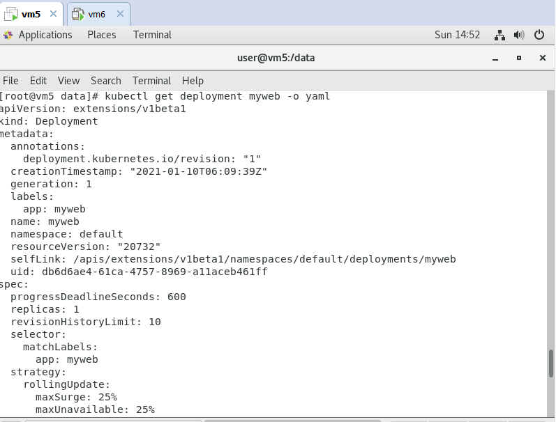
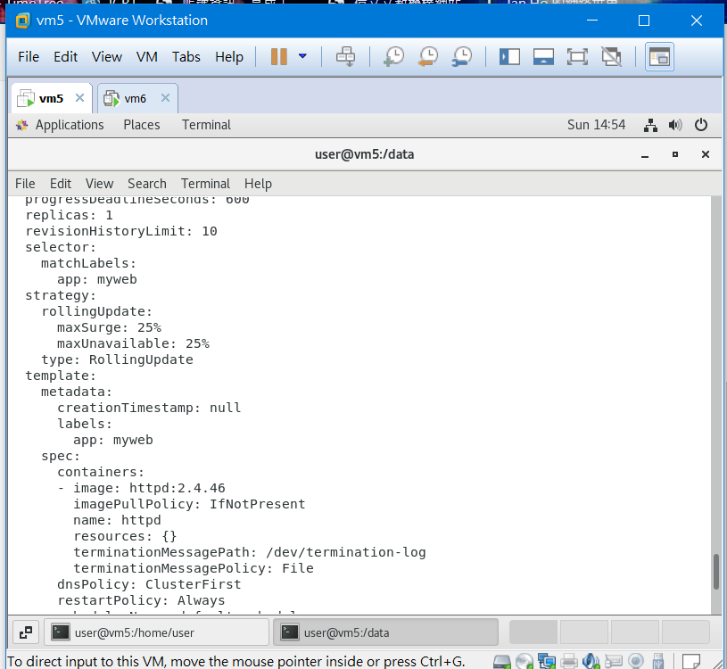

# k8s 基本操作

## k8s 指令

* 新增deployment

```sh
kubectl create deployment myweb --image=httpd:2.4.43
```

* 讓pod擁有對外IP

```sh
kubectl expose deployment myweb --type=“NodePort” --port=80
```

* 查看service(svc)

```sh
kubectl get svc
```

* 增加pod
```sh
kubectl scale deployment myweb --replicas 3
```

* 查看deployment的配置檔
>以*yaml檔*的方式輸出

```sh
kubectl get deployment myweb -o yaml
```



* 更新鏡像檔
> 會先產生新的pod，再把舊的pod刪除

```sh
kubecyl set image deployment myweb httpd=httpd:2.4.46
```



* rollback

```sh
kubectl rollout undo deployment myweb
```
* 查詢pod

```sh
[root@vm5 data]# kubectl get pods
NAME                    READY   STATUS    RESTARTS   AGE
myweb-dcb5bb9d4-bntkj   1/1     Running   0          4m3s
```

* 進入容器內進行操作

```sh
[root@vm5 data]# kubectl exec myweb-dcb5bb9d4-bntkj -it -- bash 
root@myweb-dcb5bb9d4-bntkj:/usr/local/apache2# 
```