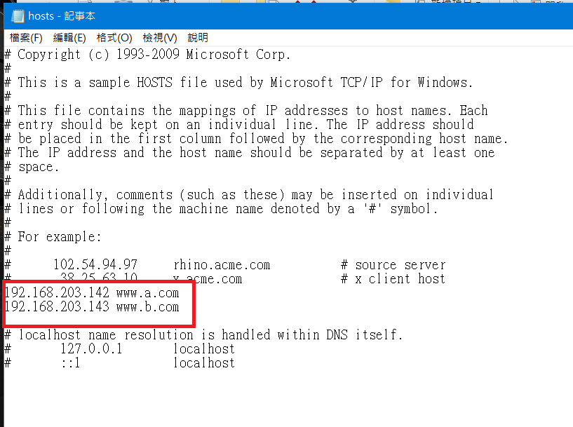

[toc]
# k8s-ingress

### 部署ingress
> 檔案由老師提供

* 安裝service
```sh
[root@vm5 test-ingress-nginx]# kubectl apply -f service-nodeport.yaml 
service/ingress-nginx created
```
* 創建ingress
```sh
[root@vm5 test-ingress-nginx]# kubectl apply -f mandatory.yaml 
namespace/ingress-nginx created
configmap/nginx-configuration created
configmap/tcp-services created
configmap/udp-services created
serviceaccount/nginx-ingress-serviceaccount created
clusterrole.rbac.authorization.k8s.io/nginx-ingress-clusterrole created
role.rbac.authorization.k8s.io/nginx-ingress-role created
rolebinding.rbac.authorization.k8s.io/nginx-ingress-role-nisa-binding created
clusterrolebinding.rbac.authorization.k8s.io/nginx-ingress-clusterrole-nisa-binding created
deployment.apps/nginx-ingress-controller created
limitrange/ingress-nginx created
```
* 查看ingress是否部屬成功
```sh
[root@vm5 test-ingress-nginx]# kubectl get svc -n ingress-nginx
NAME            TYPE       CLUSTER-IP       EXTERNAL-IP   PORT(S)                      AGE
ingress-nginx   NodePort   10.108.214.219   <none>        80:31080/TCP,443:30515/TCP   7m48s
[root@vm5 test-ingress-nginx]# kubectl get pods -n ingress-nginx 
NAME                                        READY   STATUS    RESTARTS   AGE
nginx-ingress-controller-7fcf8df75d-bgvjj   1/1     Running   0          13m
```
### 利用ingress實現負載均衡

* 編輯 ingress-httpd.yaml 檔案

```sh
apiVersion: apps/v1
kind: Deployment
metadata:
  name: httpd
  labels:
    app: httpd
spec:
  selector:
    matchLabels:
      app: httpd
  replicas: 2	
  template:
    metadata:
      labels:
        app: httpd
    spec:
      containers:
      - name: httpd
        image: httpd:2.4.46
        ports:
        - containerPort: 80
---
apiVersion: v1
kind: Service
metadata:
  name: httpd
spec:
  selector:
    app: httpd
  ports:
    - protocol: TCP
      port: 80
      targetPort: 80

```

* 創建Pod與service

```sh
kubectl apply -f httpd.yaml
kubectl apply -f ingress-httpd.yaml 
```

* 查看ingress

```sh
kubectl get ingress
```

### 修改`C:/Windows/System32/drivers/etc/hosts`



---
# 參考資料
* [kubernetes系列09—Ingress控制器详解](https://www.cnblogs.com/along21/p/10333086.html)


