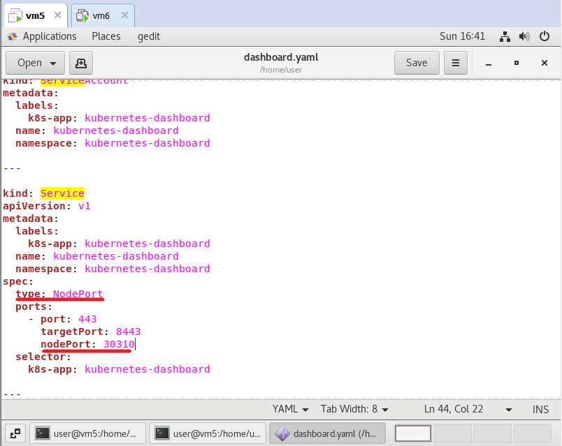

# dashboard & helm (v3)

## dashboard 安裝

### 編輯 dashboard.yaml
> 檔案由老師提供



### 編輯 admin-role.yaml

```sh
kind: ClusterRoleBinding
apiVersion: rbac.authorization.k8s.io/v1                                                                           
metadata:
  name: admin
  annotations:
    rbac.authorization.kubernetes.io/autoupdate: "true"
roleRef:
  kind: ClusterRole
  name: cluster-admin
  apiGroup: rbac.authorization.k8s.io
subjects:
- kind: ServiceAccount
  name: admin
  namespace: kube-system'
---
apiVersion: v1
kind: ServiceAccount
metadata:
  name: admin
  namespace: kube-system
  labels:
    kubernetes.io/cluster-service: "true"
    addonmanager.kubernetes.io/mode: Reconcile 
```

### 建立dashboard.yaml

```sh
kubectl apply -p dashboard.yaml
```

### 查看命名空間

```sh
kubectl get all -n kubernetes-dashboard
```
### 建立admin-role.yaml

```sh
kubectl apply -f admin-role.yaml
```

### 生成金鑰

```sh
kubectl -n kube-system describe secret $(kubectl -n kube-system get secret | grep admin | awk '{print $1}') | grep token: | awk -F : '{print $2}' | xargs echo
```

## helm

### 安裝helm

* 下載並解壓縮檔案
```sh
wget https://get.helm.sh/helm-v3.4.2-linux-amd64.tar.gz
tar xvfz helm-v3.4.2-linux-amd64.tar.gz
```
* 將helm 搬移到/usr/local/bin
```sh
cd linux-amd64/
mv helm /usr/local/bin
```
* 查看版本
```sh
helm version
```
```sh
[root@vm5 linux-amd64]# helm version
version.BuildInfo{Version:"v3.4.2", GitCommit:"23dd3af5e19a02d4f4baa5b2f242645a1a3af629", GitTreeState:"clean", GoVersion:"go1.14.13"}
```

* 初始化

```sh
helm repo add stable https://charts.helm.sh/stable
```

### helm 基本指令

* 顯示已加入的倉庫

```sh
[root@vm5 linux-amd64]# helm repo list
NAME  	URL                          
stable	https://charts.helm.sh/stable
```

* 新增倉庫
> 在此使用阿里雲

```sh
[root@vm5 linux-amd64]# helm repo add aliyun https://kubernetes.oss-cn-hangzhou.aliyuncs.com/charts
"aliyun" has been added to your repositories
```

* 刪除倉庫

```sh
[root@vm5 linux-amd64]# helm repo remove aliyun
"aliyun" has been removed from your repositories
```

* 更新倉庫資訊

```sh
[root@vm5 linux-amd64]# helm repo update
Hang tight while we grab the latest from your chart repositories...
...Successfully got an update from the "stable" chart repository
Update Complete. ⎈Happy Helming!⎈
```

* 搜尋在倉庫裡的chart

```sh
[root@vm5 linux-amd64]# helm search repo mysql
NAME                            	CHART VERSION	APP VERSION	DESCRIPTION                                       
stable/mysql                    	1.6.9        	5.7.30     	DEPRECATED - Fast, reliable, scalable, and easy...
stable/mysqldump                	2.6.2        	2.4.1      	DEPRECATED! - A Helm chart to help backup MySQL...
stable/prometheus-mysql-exporter	0.7.1        	v0.11.0    	DEPRECATED A Helm chart for prometheus mysql ex...
stable/percona                  	1.2.3        	5.7.26     	DEPRECATED - free, fully compatible, enhanced, ...
stable/percona-xtradb-cluster   	1.0.8        	5.7.19     	DEPRECATED - free, fully compatible, enhanced, ...
stable/phpmyadmin               	4.3.5        	5.0.1      	DEPRECATED phpMyAdmin is an mysql administratio...
stable/gcloud-sqlproxy          	0.6.1        	1.11       	DEPRECATED Google Cloud SQL Proxy                 
stable/mariadb                  	7.3.14       	10.3.22    	DEPRECATED Fast, reliable, scalable, and easy t...
```

* 安裝chart

```sh
helm install stable/mysql --generate-name
```

* 查看佈署的chart

```sh
[root@vm5 linux-amd64]# helm ls
NAME            	NAMESPACE	REVISION	UPDATED                                	STATUS  	CHART      	APP VERSION
mysql-1610270187	default  	1       	2021-01-10 17:16:30.77991066 +0800 CST 	deployed	mysql-1.6.9	5.7.30     
mysql-1610270299	default  	1       	2021-01-10 17:18:22.415662332 +0800 CST	deployed	mysql-1.6.9	5.7.30   
```
* 刪除chart

```sh
[root@vm5 linux-amd64]# helm uninstall mysql-1610270187
release "mysql-1610270187" uninstalled
```

### 手動建立chart

* 創建chart

```sh
[root@vm5 linux-amd64]# helm create abc
Creating abc
[root@vm5 linux-amd64]# cd abc/templates/
[root@vm5 templates]# rm -rf *
```

* 編輯 deployment.yaml

```sh
apiVersion: apps/v1
kind: Deployment
metadata:
  creationTimestamp: null
  labels:
    app: web1
  name: web1
spec:
  replicas: 1
  selector:
    matchLabels:
      app: web1
  strategy: {}
  template:
    metadata:
      creationTimestamp: null
      labels:
        app: web1
    spec:
      containers:
      - image: httpd:2.4.46
        name: httpd
        resources: {}
status: {}
```

* 編輯service.yaml

```sh
apiVersion: v1
kind: Service
metadata:
  creationTimestamp: null
  labels:
    app: web1
  name: web1
spec:
  ports:
  - port: 80
    protocol: TCP
    targetPort: 80
  selector:
    app: web1
  type: NodePort
status:
  loadBalancer: {}   
```

* 安裝abc

```sh
[root@vm5 linux-amd64]# helm install abc --generate-name
NAME: abc-1610270884
LAST DEPLOYED: Sun Jan 10 17:28:04 2021
NAMESPACE: default
STATUS: deployed
REVISION: 1
TEST SUITE: None
```

* 查看chart

```sh
[root@vm5 linux-amd64]# helm ls
NAME            	NAMESPACE	REVISION	UPDATED                                	STATUS  	CHART      	APP VERSION
abc-1610270884  	default  	1       	2021-01-10 17:28:04.476635873 +0800 CST	deployed	abc-0.1.0  	1.16.0     
mysql-1610270299	default  	1       	2021-01-10 17:18:22.415662332 +0800 CST	deployed	mysql-1.6.9	5.7.30     
[root@vm5 linux-amd64]# kubectl get svc
NAME               TYPE        CLUSTER-IP       EXTERNAL-IP   PORT(S)        AGE
httpd              ClusterIP   10.111.114.111   <none>        80/TCP         84m
kubernetes         ClusterIP   10.96.0.1        <none>        443/TCP        5d5h
mysql-1610270299   ClusterIP   10.106.124.131   <none>        3306/TCP       10m
web1               NodePort    10.102.94.252    <none>        80:31336/TCP   30s
```

---
# 參考資料
* [Helm | Quickstart Guide](https://helm.sh/docs/intro/quickstart/)