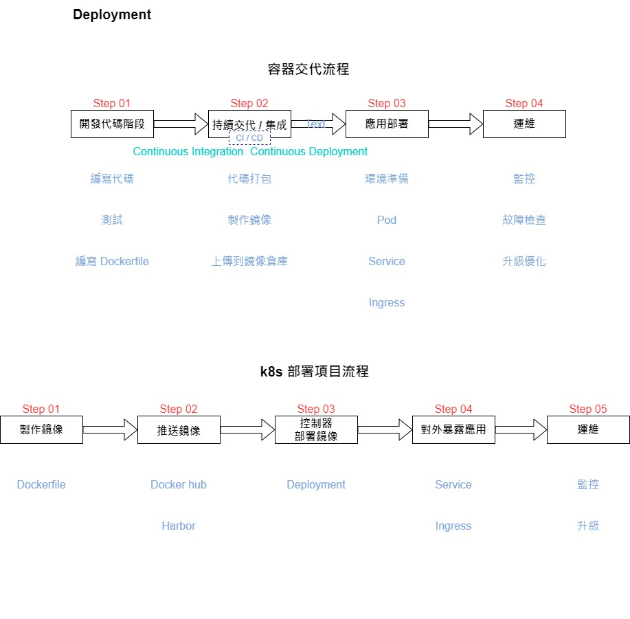
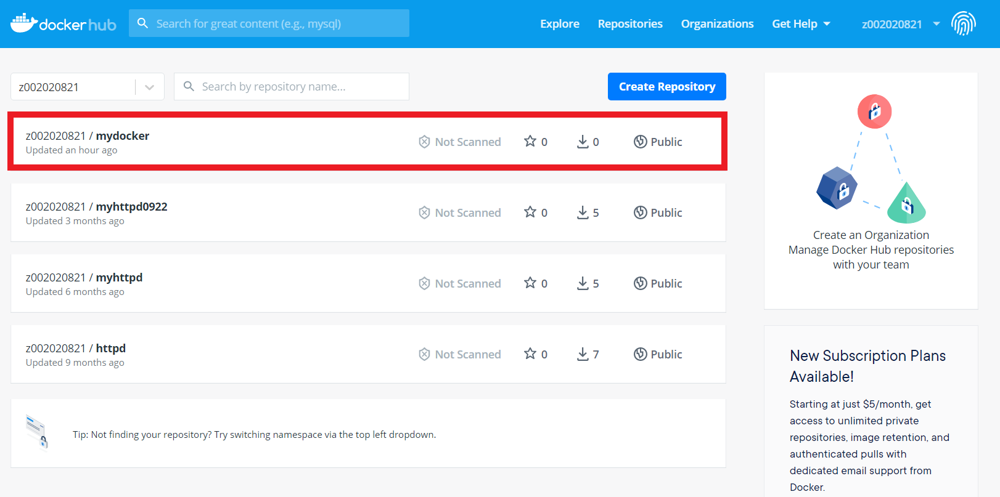
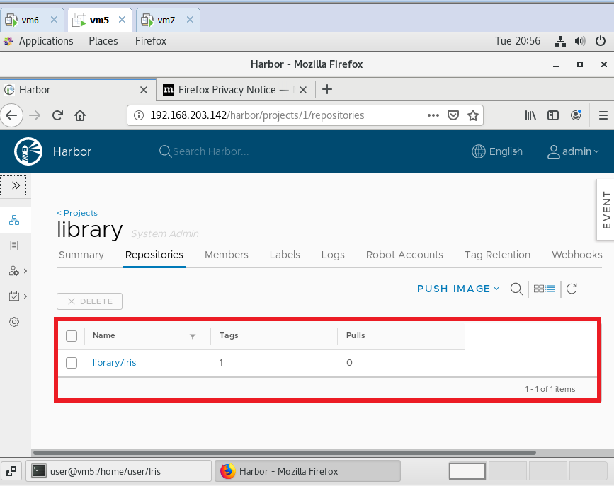

# 期末作業

## Deployment



### 編寫程式

* main.py

```sh
from flask import Flask

app = Flask(__name__)


@app.route('/')
def hello_world():
    return 'Flask Dockerized'


if __name__ == "__main__":
    app.run(debug=True, host='0.0.0.0', port=8888)
```

* requirements.txt

```sh
Click==7.0
Flask==1.1.1
itsdangerous==1.1.0
Jinja2==2.10.3
MarkupSafe==1.1.1
Werkzeug==0.16.0
```

### 編寫Dockerfile

```sh
FROM python:3.7.2-stretch

WORKDIR /app

ADD . /app

RUN pip install -r requirements.txt

CMD python main.py

```

### 代碼打包&製作鏡像

```sh
docker build -t mydocker:1.0.0 .
```

### 測試

```sh
[root@vm5 mydocker]# docker run -d -p 8001:8888 --name mydocker mydocker:1.0.0
ae611211606370726fec992eb518c07f15d3dbe3562d1a62cfaf47aebb7dd586
[root@vm5 mydocker]# curl 127.0.0.1:8001
Flask Dockerized
```

### 為鏡像打上標籤

* 查看鏡像ID

```sh
[root@vm5 mydocker]# docker images | grep mydocker
mydocker                             1.0.0               18cc309f40c3        2 minutes ago       938MB
```

* 為鏡像打上標籤

```sh
[root@vm5 mydocker]# docker tag 18c z002020821/mydocker:1.0.0
```

### 上傳到鏡像倉庫
> 在這上傳到**docker hub**

```sh
[root@vm5 mydocker]# docker push z002020821/mydocker:1.0.0
```




### 取得鏡像設定檔

```sh
[root@vm5 mydocker]# kubectl create deployment mydocker --image=z002020821/mydocker:1.0.0 --dry-run -o yaml > mydocker-deployment.yaml
```

* mydocker-deployment.yaml

```sh
apiVersion: apps/v1
kind: Deployment
metadata:
  creationTimestamp: null
  labels:
    app: mydocker
  name: mydocker
spec:
  replicas: 2
  selector:
    matchLabels:
      app: mydocker
  strategy: {}
  template:
    metadata:
      creationTimestamp: null
      labels:
        app: mydocker
    spec:
      containers:
      - image: z002020821/mydocker:1.0.0
        name: mydocker
        resources: {}
status: {}
```

### 編譯mydocker-deployment.yaml

```sh
[root@vm5 mydocker]# kubectl apply -f mydocker-deployment.yaml 
```

### 測試

* 查看pod內容

```sh
[root@vm5 mydocker]# kubectl get pods -o wide
NAME                        READY   STATUS    RESTARTS   AGE   IP           NODE   NOMINATED NODE   READINESS GATES
mydocker-7449df9fc6-bntkj   1/1     Running   0          15m   172.17.0.4   vm6    <none>           <none>
mydocker-7449df9fc6-mcg7b   1/1     Running   0          15m   172.17.0.4   vm7    <none>           <none>
```

* 取得對外port號

```sh
[root@vm5 mydocker]# kubectl get svc
NAME         TYPE        CLUSTER-IP       EXTERNAL-IP   PORT(S)          AGE
kubernetes   ClusterIP   10.96.0.1        <none>        443/TCP          173m
mydocker     NodePort    10.105.189.171   <none>        8888:30281/TCP   7m42s
```

* 測試

```sh
[root@vm5 mydocker]# curl 192.168.203.143:30281
Flask Dockerized[root@vm5 mydocker]# curl 192.168.203.144:30281
Flask Dockerized[root@vm5 mydocker]# 
```
---

## 將鏡像上傳至harbor
> 將先前所練習過的Iris上傳至harbor

* 查看鏡像ID

```sh
[root@vm5 Iris]# docker images | grep iris
iris                                   1.0                        e246cfc39c3e        36 seconds ago      922MB
``` 

* 為鏡像打上標籤

```sh
[root@vm5 Iris]# docker tag e24 192.168.203.142/library/iris:1.0
```

* 登入harbor
```sh
[root@vm5 Iris]# docker login 192.168.203.142
Username: admin
Password: 
WARNING! Your password will be stored unencrypted in /root/.docker/config.json.
Configure a credential helper to remove this warning. See
https://docs.docker.com/engine/reference/commandline/login/#credentials-store

Login Succeeded
```

* 結果




