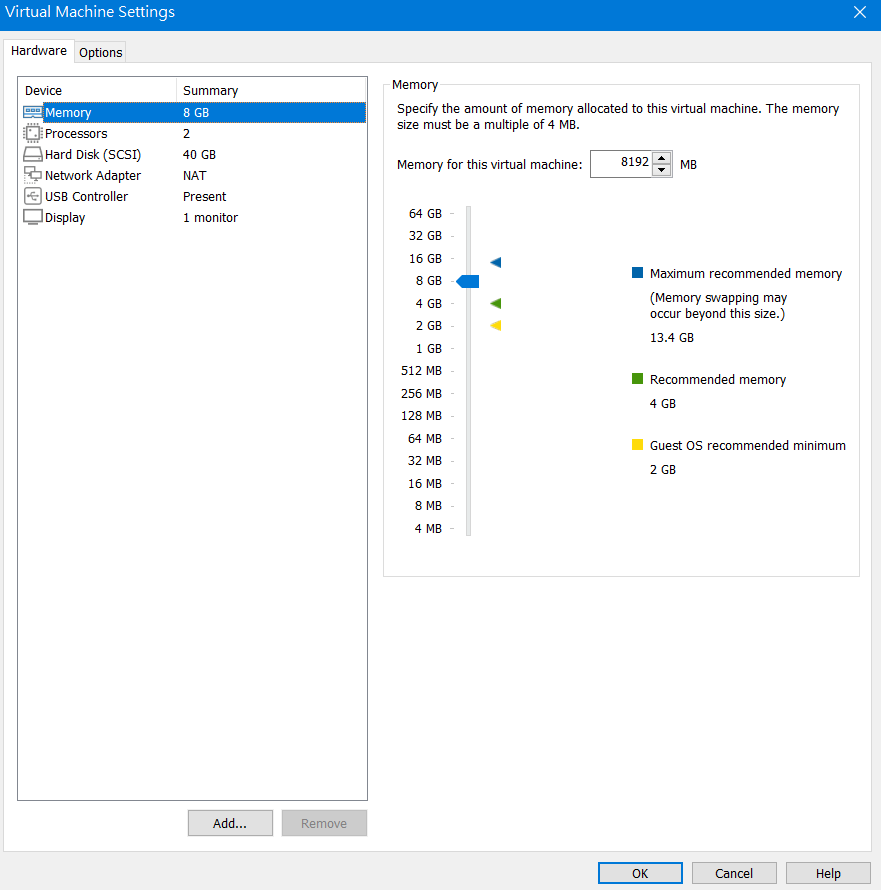
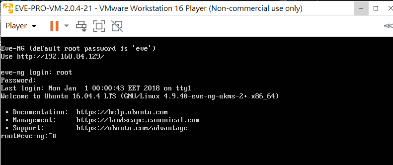
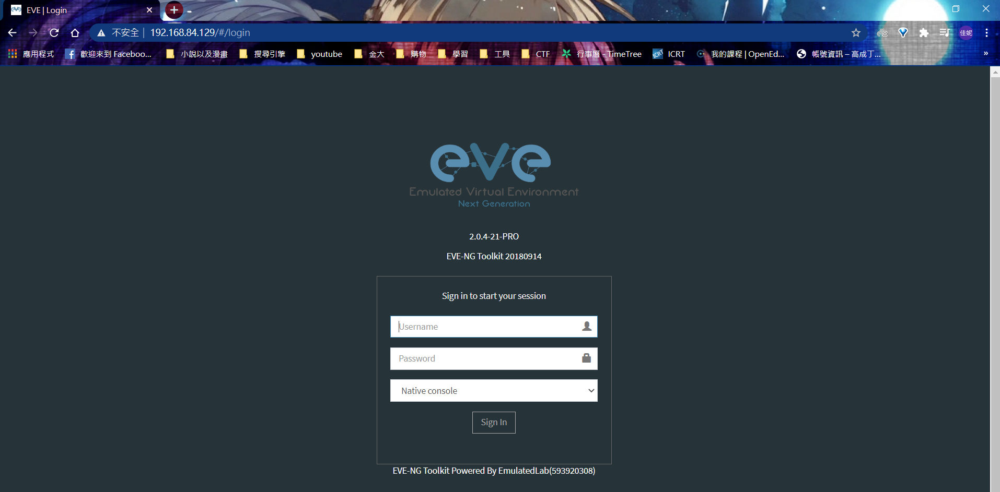
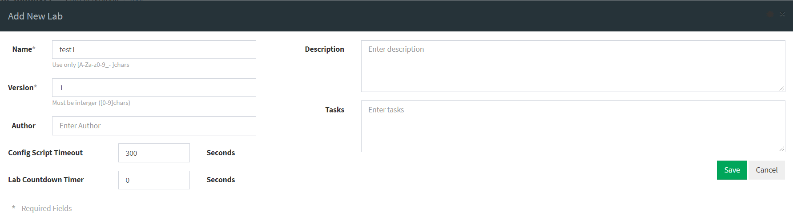
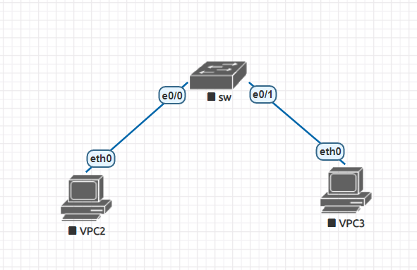
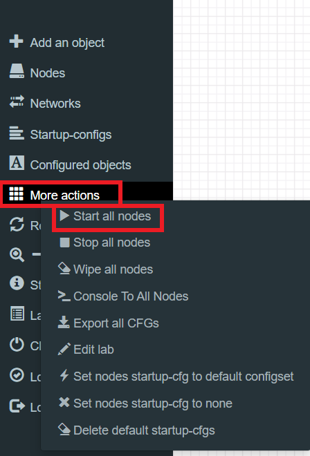
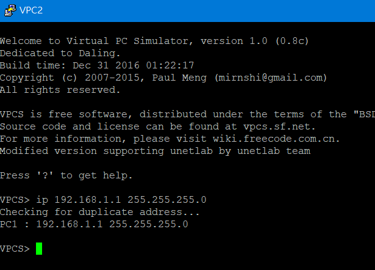
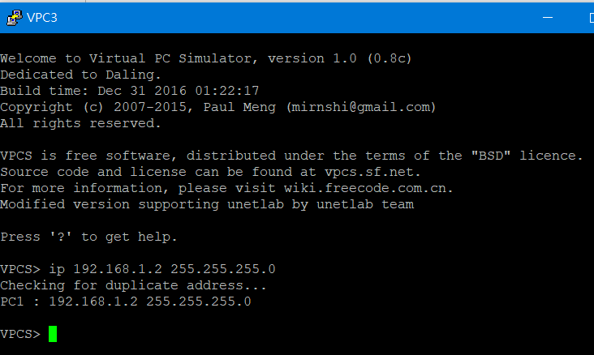
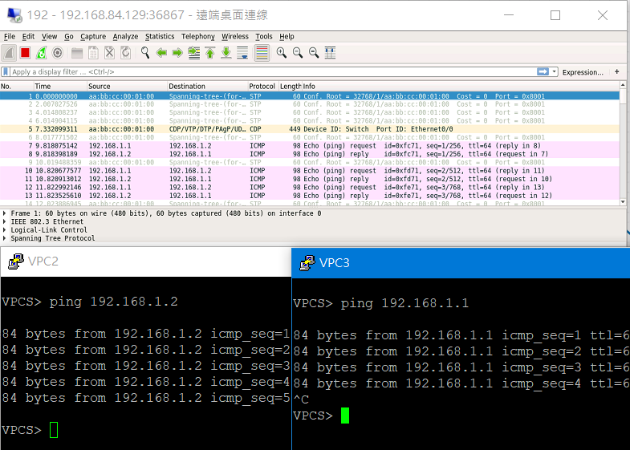

# EVE-EG(Emulated Virtual Environment)
> ios檔由老師提供

## 虛擬機設定
* 記憶體:4-8G(最少為2G)
* 核心數:2
* 網路卡:NAT



## 文字介面 


## 圖形化介面
> 根據文字介面的IP進入圖形化介面

* 登入畫面


## 實驗環境
* 創建lab


* 節點類型

    

    |名稱|類別|屬性|數量|
    |----|----|----|----|
    |sw  |Cisco IOL| switch(L2) |1|
    |VPC |Virtual PC|Desktop|2|
    > IOL:Ios On Linux

* 節點設置
    > 安裝putty和WireShark以方便進行節點設定
    * 將節點全部啟動，進行節點設置
        > 可以使用*More actions*中的*Start all nodes*一次開啟節點

        

    * 節點內容

        名稱|IP|遮罩|
        |----|--|----|
        |VPC2|192.168.1.1|255.255.255.0|
        |VPC3|192.168.1.2|255.255.255.0|
* 設置畫面
    * VPC2
    
    * VPC3
    
* 結果
    > 利用WireShark查看e0/0端口是否有封包進行傳輸
    

* 離開環境
    * 關閉所有節點
        >可以使用*More actions*中的*Stop all nodes*一次關閉

        
    * 關閉lab並登出圖形化介面
    * **正常**關閉虛擬機
    > 不正常關機會使得EVE-NG的資料庫設定跑掉，造成無法登入圖形化介面

    ```shutdown -h now```
---
### 參考資料
[Jan Ho的網路世界-EVE-EG Emulated Virtual Environment Next Generation](https://www.jannet.hk/zh-Hant/post/eve-ng/)


