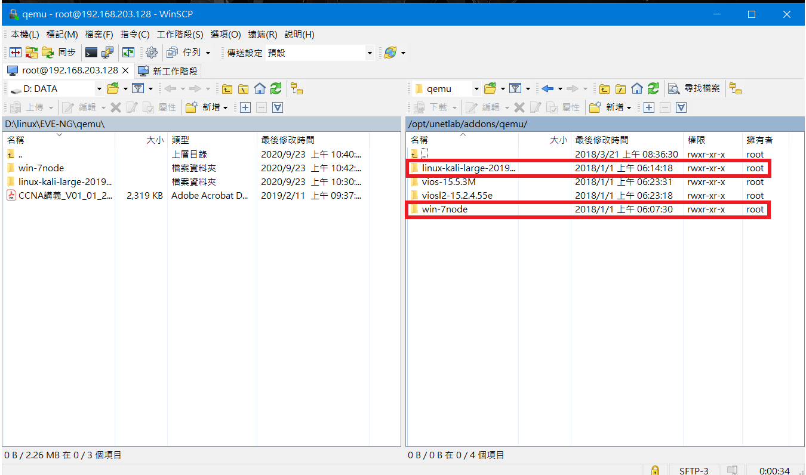
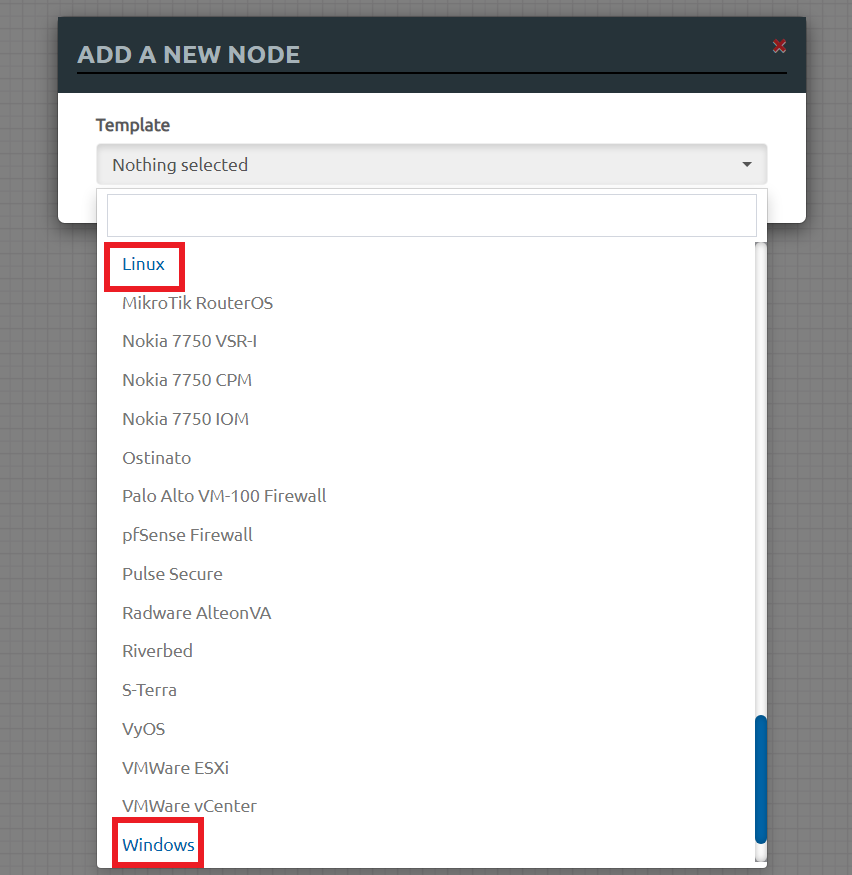

# 中間人攻擊

## 增加節點類別
### 鏡像類別
>可以分成3類
* Qemu
* IOL
* Dynamips
### 增加Node鏡像
> 以下為增加Qemu鏡像，若要加入其他Qemu鏡像方式，可在[EVE-NG官網](https://www.eve-ng.net/index.php/documentation/howtos/howto-create-own-linux-host-image/)找到

* 透過WinSCP將要加入的鏡像檔放置在虛擬機`/opt/unetlab/addons/qemu`目錄下



* 加上固定權限

```sh
/opt/unetlab/wrappers/unl_wrapper -a fixpermissions
```

* 完成畫面



---
## 中間人攻擊
### 實驗環境

---
### 參考資料
* [EVE(虚拟仿真)网络模拟器如何导入Dynamips、IOL和Qemu格式的镜像--知乎](https://zhuanlan.zhihu.com/p/137472418)
* 

    
