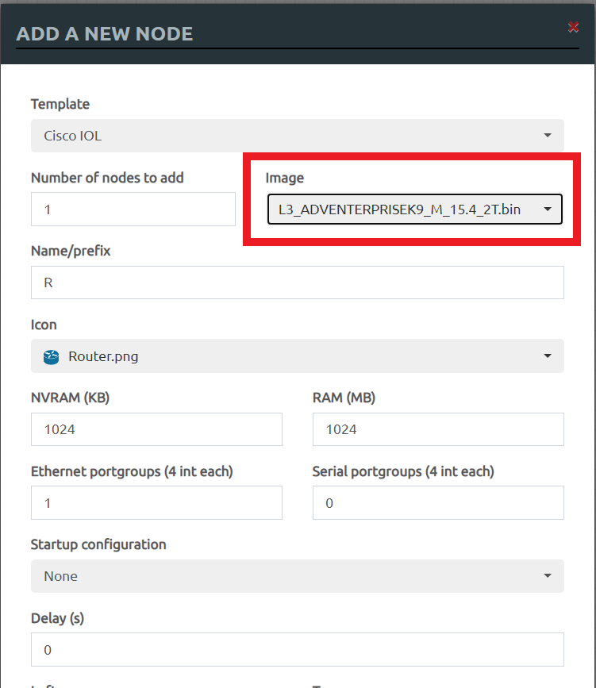
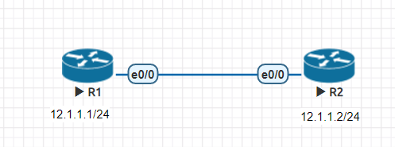
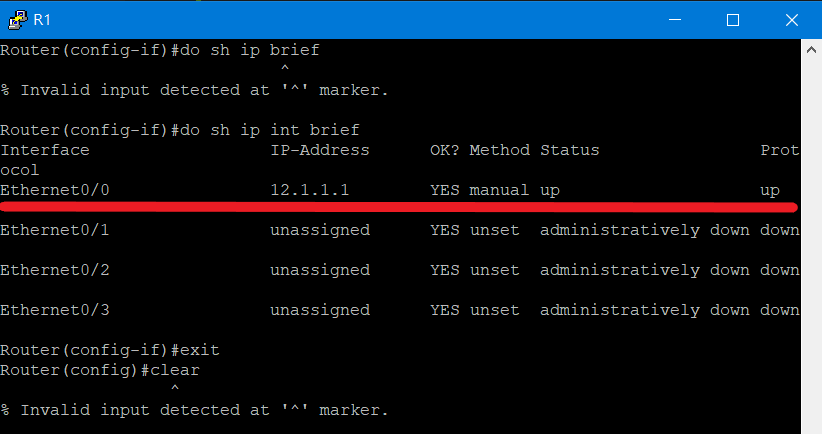
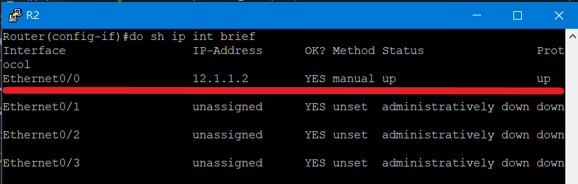
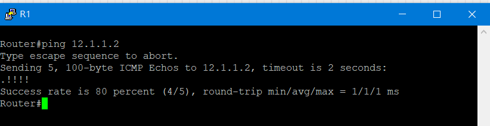
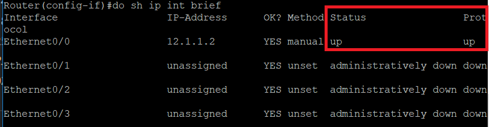
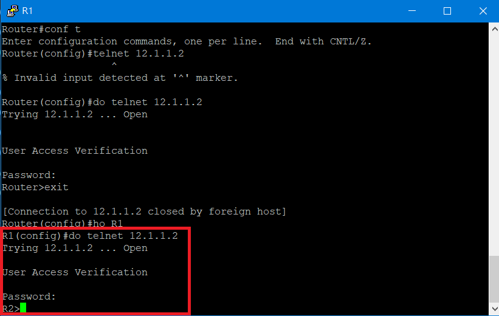
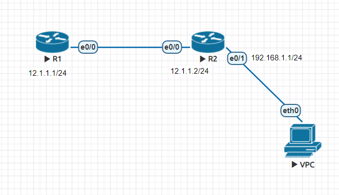
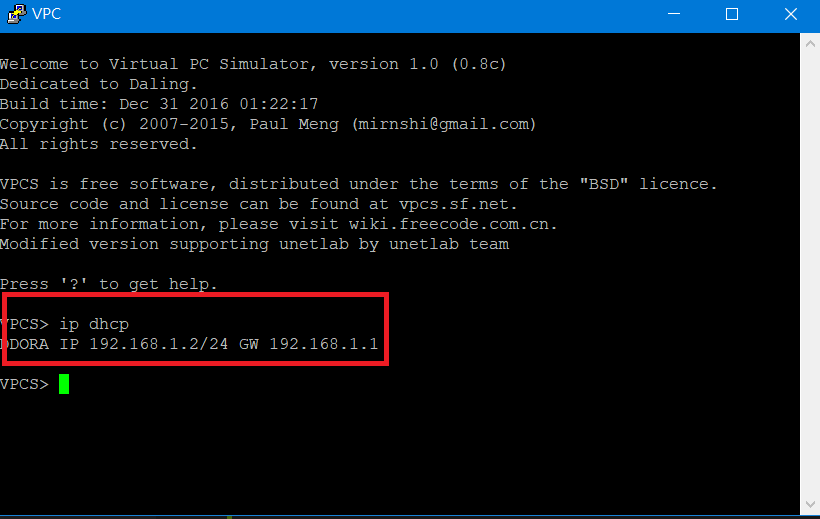
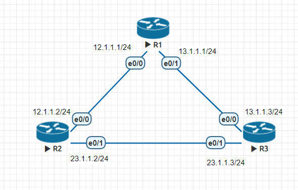

# Cisco Router 設定

## 新增Router
>和新增switch方式一樣，但要選擇L3的設備



## Router 設定

### 實驗環境



### 設定IP

* R1

```sh
Router(config)#int e0/0                             #進入介面卡設定
Router(config-if)#ip addr 12.1.1.1 255.255.255.0    # 設定IP與遮罩
Router(config-if)#no shut                           #開啟介面卡
```

* R2

```sh
Router(config)#int e0/0
Router(config-if)#ip addr 12.1.1.2 255.255.255.0
Router(config-if)#no shut
```

### 查看IP設定
> 可以在特權模式使用`show ip interface brief`查看

* R1



* R2



### 測試
> R1(12.1.1.1) ping R2(12.1.1.2)



### 補充

* 如果無法ping成功的話，可以利用`show ip interface brief`查看*status*和*protocol*是否**up**



* 在指令前面加上`no`將會執行指令的相反動作

* 如果要快速終止動作，可以使用`ctrl+shift+6`

* 在進行ping動作時，第一個封包會失敗是因為arp尚未解析完
---

## 建立telnet連線
>延續上方實驗，在R1和R2上進行相同操作

```sh
line vty 0 4
password cisco
login
transport input telnet
```

### 測試

* R1使用telnet與R2連線



## DHCP 練習

### 實驗環境



### DHCP設定
> 在R2上進行設定

* IP設定

```sh
R2(config)#int e0/1
R2(config-if)#ip addr 192.168.1.1 255.255.255.0
R2(config-if)#no sh
R2(config-if)#exit
```

* 設置DHCP

```sh
R2(config)#ip dhcp pool DHCP
R2(dhcp-config)#network 192.168.1.0
R2(dhcp-config)#default-router 192.168.1.1
R2(dhcp-config)#dns-server 8.8.8.8
```

### 測試
> VPC生成IP



---

## Administrative Distance (AD) 管理距離
> 管理距離越短，權重越大

|Routing Protocol|AD值|
|:----:|:----:|
|直接連接|0|
|靜態路由|1|
|EIGRP|90|
|OSPF|110|
|RIP|120|

### 實驗環境



### IP設定

* R1

```sh
R1(config)#int e0/0
R1(config-if)#ip addr 12.1.1.1 255.255.255.0
R1(config-if)#no sh
R1(config-if)#int e0/1
R1(config-if)#ip addr 13.1.1.1 255.255.255.0
R1(config-if)#no sh
```

* R2

```sh
R2(config)#int e0/0
R2(config-if)#ip addr 12.1.1.2 255.255.255.0
R2(config-if)#no sh
R2(config-if)#int e0/1
R2(config-if)#ip addr 23.1.1.2 255.255.255.0
R2(config-if)#no sh
```

* R3

```sh
R3(config)#int e0/0
R3(config-if)#ip addr 13.1.1.3 255.255.255.0
R3(config-if)#no sh
R3(config-if)#int e0/1
R3(config-if)#ip addr 23.1.1.3 255.255.255.0
R3(config-if)#no sh
```
### AD值設定

* R1

```sh
R1(config)#ip route 23.1.1.0 255.255.255.0 e0/0 12.1.1.2
R1(config)#ip route 23.1.1.0 255.255.255.0 e0/1 13.1.1.3
```

* R2

```sh
R2(config-if)#ip route 13.1.1.0 255.255.255.0 e0/0 12.1.1.1 10
R2(config)#ip route 13.1.1.0 255.255.255.0 e0/1 23.1.1.3
```

* R3

```sh
R3(config-if)#ip route 12.1.1.0 255.255.255.0 e0/0 13.1.1.1 10
R3(config)#ip route 12.1.1.0 255.255.255.0 e0/1 23.1.1.2
```
---
### 參考資料
* [Cisco router基本設定 — 小鋼炮筆記](https://giboss.pixnet.net/blog/post/26807628)
* [Administrative Distance (AD) 管理距離 - Jan Ho 的網路世界](https://www.jannet.hk/zh-Hant/post/administrative-distance-ad/)


