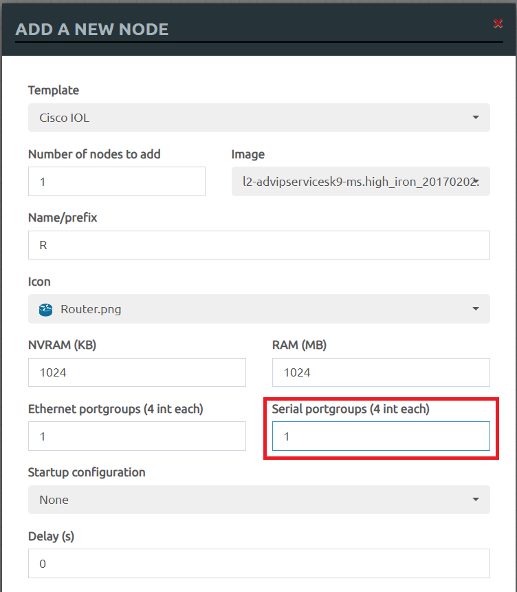
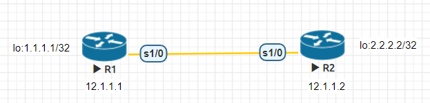
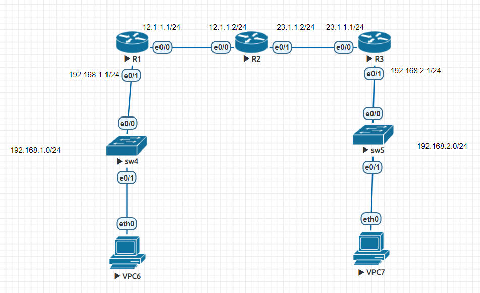
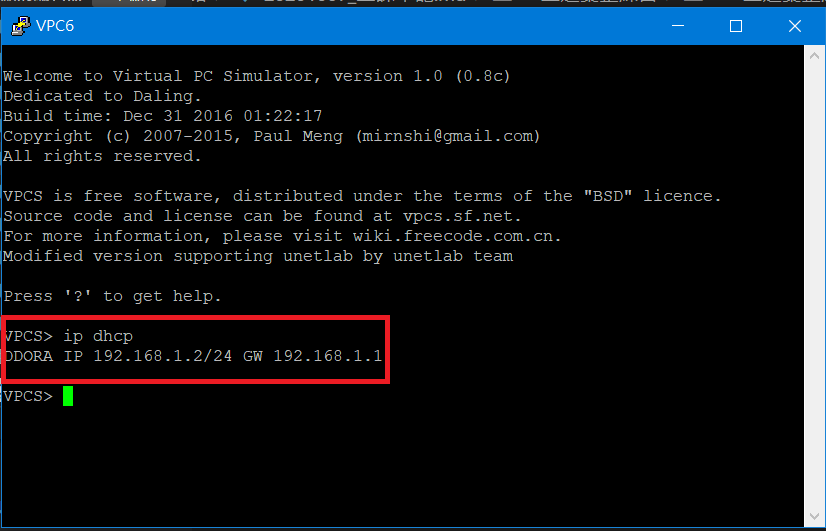
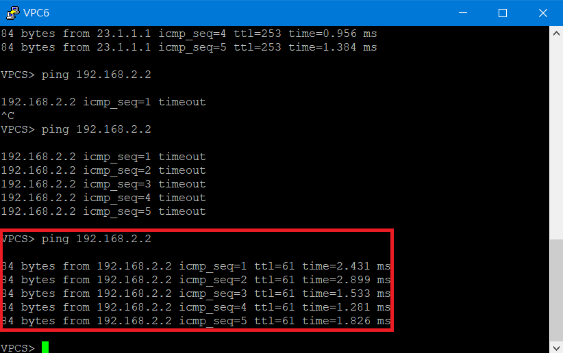

# 上週彙整練習

## 序列埠(Serial Port)

### 在Router上增加Serial Port



### 實驗環境



### IP設定

* R1

```sh
R1(config)#int s1/0
R1(config-if)#ip addr 12.1.1.1 255.255.255.252
R1(config-if)#clock rate 64000
R1(config-if)#no sh
R1(config-if)#int lo 0
R1(config-if)#ip addr 1.1.1.1 255.255.255.255
```

* R2

```sh
R2(config)#int s1/0
R2(config-if)#ip addr 12.1.1.2 255.255.255.252
R2(config-if)#clock rate 64000
R2(config-if)#no sh
R2(config-if)#int lo 0
R2(config-if)#ip addr 2.2.2.2 255.255.255.255
```

### 增加路由

* R1

```sh
R1(config-if)#ip route 2.2.2.2 255.255.255.255 s1/0
```

* R2

```sh
R2(config-if)#ip route 1.1.1.1 255.255.255.255 s1/0
```

### 測試
> R1(1.1.1.1) ping R2(2.2.2.2)

```sh
R1(config)#do ping 2.2.2.2 source 1.1.1.1
Type escape sequence to abort.
Sending 5, 100-byte ICMP Echos to 2.2.2.2, timeout is 2 seconds:
Packet sent with a source address of 1.1.1.1
!!!!!
Success rate is 100 percent (5/5), round-trip min/avg/max = 8/9/11 ms
```

### 補充

* 靜態路由設定

    * 直接從指定interface進行傳輸

    ```sh
    ip route [network] [netmask] [interface] [可以通往network下一個IP]
    ```

    * 需二次查尋所要前往的interface才能進行傳輸

    ```sh
    ip route [network] [netmask] [可以通往network下一個IP]
    ```

    * 無法進行傳輸
    > 由於Serial Port由於是**點對點**傳輸，因此可以使用此種方式

    ```sh
    ip route [network] [netmask] [interface]
    ```
---

## 上週彙整練習

### 實驗環境


### IP設定

* R1

```sh
R1(config)#int e0/1
R1(config-if)#ip addr 192.168.1.1 255.255.255.0
R1(config-if)#no shut
R1(config-if)#int e0/0
R1(config-if)#ip addr 12.1.1.1 255.255.255.0
R1(config-if)#no shut
R1(config-if)#exit
```

* R2

```sh
R2(config)#int e0/0
R2(config-if)#ip addr 12.1.1.2 255.255.255.0
R2(config-if)#no shut
R2(config-if)#int e0/1
R2(config-if)#ip addr 23.1.1.2 255.255.255.0
R2(config-if)#no shut
R2(config-if)#ip route 192.168.1.0 255.255.255.0 e0/0 12.1.1.1
R2(config)#ip route 192.168.2.0 255.255.255.0 e0/1 23.1.1.1
```

* R3

```sh
R3(config)#int e0/1
R3(config-if)#ip addr 192.168.2.1 255.255.255.0
R3(config-if)#no shut
R3(config-if)#int e0/0
R3(config-if)#ip addr 23.1.1.1 255.255.255.0
R3(config-if)#no shut
R3(config-if)#exit
```
### DHCP設定

* R1

```sh
R1(config)#ip dhcp pool DHCP
R1(dhcp-config)#network 192.168.1.0 /24
R1(dhcp-config)#default-router 192.168.1.1
R1(dhcp-config)#dns-server 8.8.8.8
R1(dhcp-config)#exit
R1(config)#ip route 23.1.1.0 255.255.255.0 e0/0 12.1.1.2
```

* R3

```sh
R3(config)#ip dhcp pool DHCP2
R3(dhcp-config)#network 192.168.2.0 /24
R3(dhcp-config)#default-router 192.168.2.1
R3(dhcp-config)#dns-server 8.8.8.8
R3(dhcp-config)#exit
R3(config)#ip route 12.1.1.0 255.255.255.0 e0/0 23.1.1.2
R3(config)#ip route 192.168.1.0 255.255.255.0 e0/0 23.1.1.2
```

### 測試

* VPC6



* VPC7


* VPC6 ping VPC7


