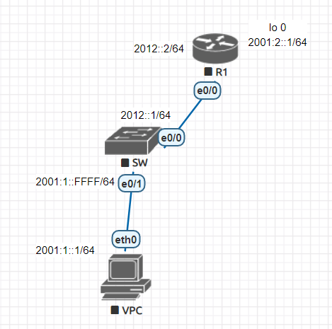
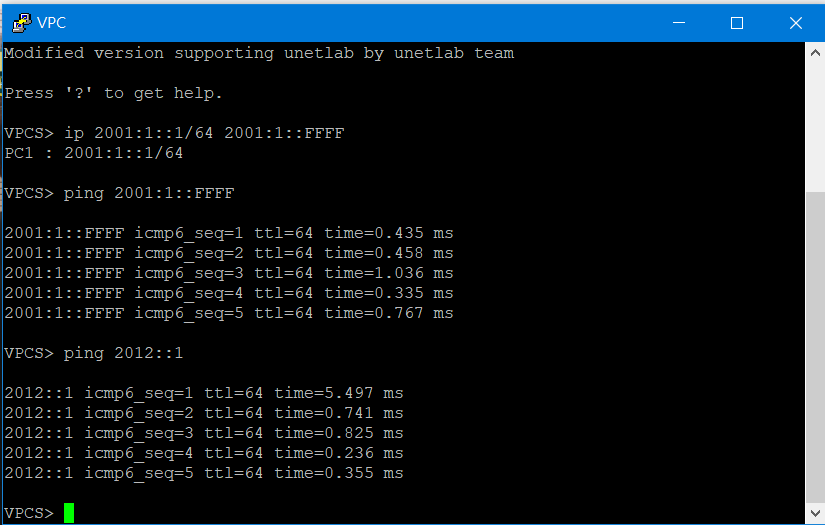
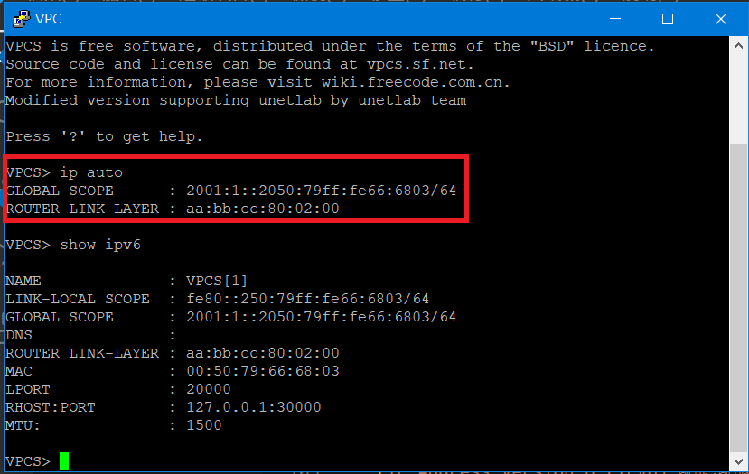
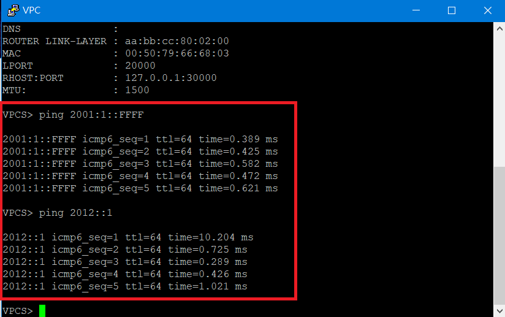
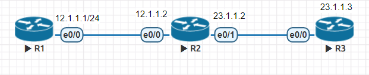

# 認識IPv6 & Routing(延續上周內容)

## ipv6實驗
>讓L2的Switch擁有L3的Switch功能

### 實驗環境



### Router

* 啟動IPv6 Routing功能
    ```ipv6 unicast-routing```
* 增加IPv6路由
    ```ipv6 route 2001:1::/64 2012::1```
* 切換到Loopback 0端口
    ```int lo 0```
* 在Loopback 0設定IP
    ```ipv6 addr 2001:2::1/64```
* 切換到e0/0端口
    ```int e0/0```
* 設定IP
    ```ipv6 addr 2012::2/64```

### L2 Switch

* 啟動IPv6 Routing功能
    ```ipv6 unicast-routing```
* 增加IPv6路由
    ```ipv6 route ::/0 2012::2```
* 切換到e0/0端口
    ```int e0/0```
* 啟用L3交換功能
    >Switch預設為L2交換功能，因此不須特別設定L2交換功能

    ```no switchport```
* 啟動IPv6
    ```ipv6 enable```
* 設置IP
    ```ipv6 addr 2012::1/64```
* 永久啟動
    ```no shut```
* 設定內定路由
    > **"::"** 代表全部都是**0**

    ``` ipv6 route ::/0 2012:2```
    
### VLAN
> 在Switch設置VLAN 10

* 創造VLAN 10
    ```vlan 10```
* 設置VLAN 10介面
    ```int vlan 10```
* 啟動IPv6
    ```ipv6 enable```
* 設置IP
    ```ipv6 addr 2001:1::FFFF/64```
* 永久啟動
    ```no shut```
* 切換端口
    ```int e0/1```
* 告訴Switch此port號為**access port**
    ```switchport mode access vlan 10```

### VPC

* 設定IP位置

```sh
ip 2001:1::1/64 2001:1::FFFF
```

### 測試



---
## ipv6取得IP方法
>有兩種方式

* 全狀態式(Stateful Address Autoconfiguration) : 透過 DHCPv6取得

* 無狀態式(Stateless Address Autoconfiguration , SLAAC)

## 使用SLAAC取得ipv6的IP

### 實驗環境

* 與先前環境相同

### 設置將抑制取消

```sh
Switch(config)#int vlan 10
Switch(config-if)#no ipv6 nd suppress-ra
```

### VPC取得ipv6的IP



### 測試



---

## 動態路由協定

### 架構種類
>有三種

* 距離向量

* 連線狀態

* 混合式

### RIPv1 

### 實驗環境



### IP設定

* R1

```sh
R1(config)#int e0/0
R1(config-if)#ip addr 12.1.1.1 255.255.255.0
R1(config-if)#no shut
R1(config-if)#exit
```

* R2

```sh
R2(config)#int e0/0
R2(config-if)#ip addr 12.1.1.2 255.255.255.0
R2(config-if)#no shut
R2(config-if)#int e0/1
R2(config-if)#ip addr 23.1.1.2 255.255.255.0
R2(config-if)#no shut
R2(config-if)#exit
```

* R3

```sh
R3(config)#int e0/0
R3(config-if)#ip addr 23.1.1.3 255.255.255.0
R3(config-if)#no shut
R3(config-if)#exit
```

### RIPv2 設定

* R1

```sh
R1(config)#router rip
R1(config-router)#network 12.0.0.0
```

* R2

```sh
R2(config)#router rip
R2(config-router)#network 12.0.0.0
R2(config-router)#network 23.0.0.0
```

* R3

```sh
R3(config)#router rip
R3(config-router)#network 23.0.0.0
```

---
### 參考資料
* [IP Address Version 6 (IPv6) 網際網路協定--Jan Ho 的網路世界](https://www.jannet.hk/zh-Hant/post/IP-Address-Version-6-IPv6/)
* [switchport_百度百科](https://baike.baidu.com/item/switchport)
* [IPv6自動組態配置(IPv6 Auto configuration) - 傲笑紅塵路](https://www.lijyyh.com/2012/04/ipv6ipv6-auto-configuration.html)
* [Dynamic Trunking Protocol (DTP) 動態中繼協定 - Jan Ho 的網絡世界](https://www.jannet.hk/zh-Hant/post/dynamic-trunking-protocol-dtp/)
