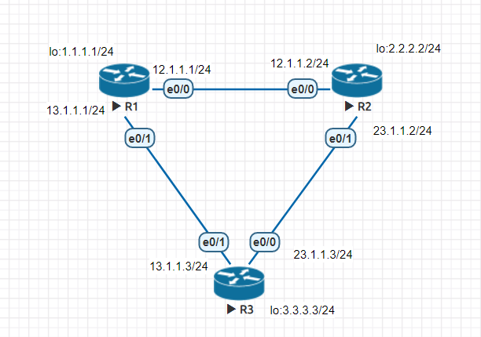
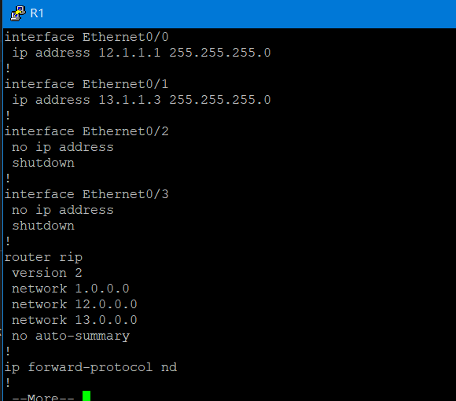
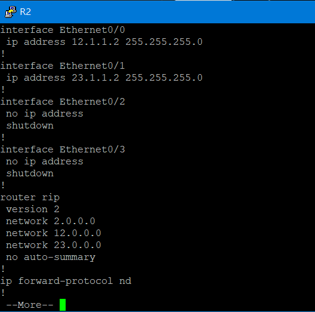
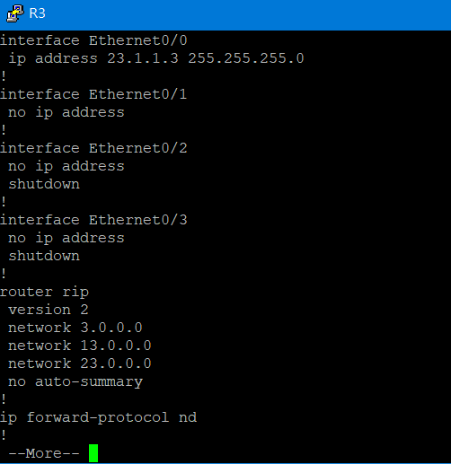
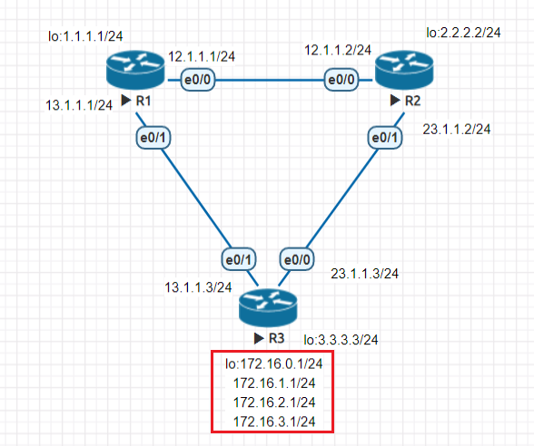
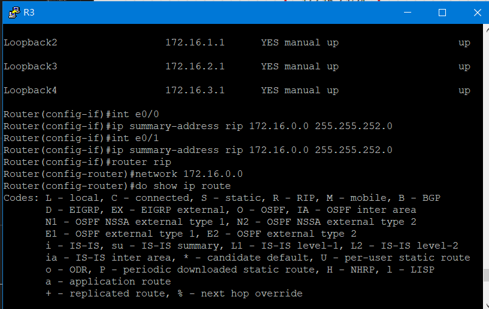
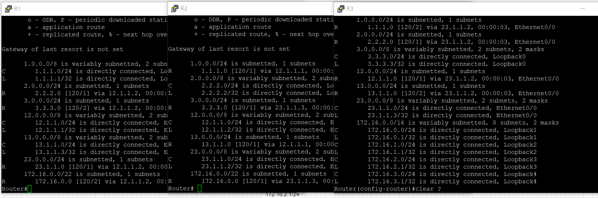
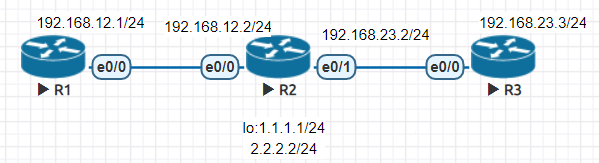
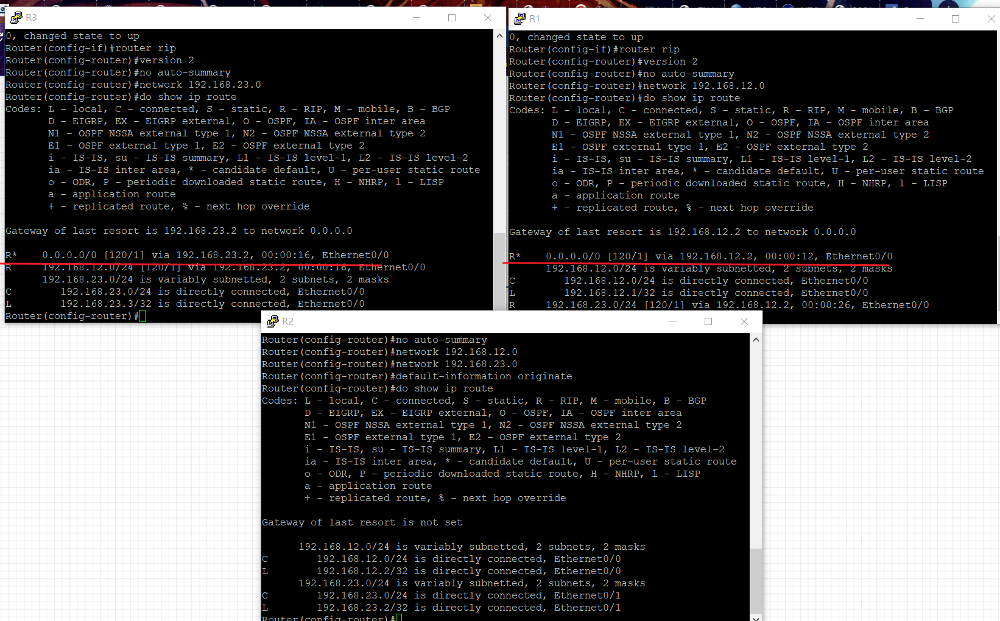

# 動態路由協定--RIP

### RIP版本差異

|     |V1|V2|
|:-----:|:-----:|:-----:|
|Layer|Application|Application|
|VLSM&CIDR|X|O|
|AD|120|120|
|Metrics|hop count|hop count|
|update method|broadcast 255.255.255.255|multicast 244.0.0.9|
|Auto summany|X|O|

### RIPv2
#### 實驗環境


#### 環境設定
* 為每一Router根據上圖設置相對應的IP和Loopback
* 設定**RIP**
```
router rip  #進入"router rip"介面
version 2   #選擇"V2"版本
no auto-summary #關閉自動彙總功能
```
* 初始化界面
>以R1為例，在**router rip**介面操作
```sh
network 1.1.1.1
network 12.1.1.0
network 13.1.1.0
```
#### 設定內容
>可以使用**show run**指令查看內容

* R1



* R2



* R3



#### 測試


### RIP-Summarization

#### 實驗環境
> 延續先前實驗



#### 環境設定
> 在R3上設定

* 增加上圖圈起的Loopback
* 設定Summary
>在R3的e0/0和e0/1介面都要設定

```sh
ip summary-address rip 172.16.0.0 255.255.252.0
```

* 初始化界面

```sh
router rip
network 172.16.0.0
```



#### 測試



---
### Default-information originate

#### 實驗環境



#### 環境設定

* 依照上圖所示增加IP

* 設定RIP並初始化界面

* 加入以下指令即可完成

```sh
default-information originate
```

#### 測試



#### 延伸
>如果在此環境中再多增加一個新節點，也會擁有相同的內定路由，這是因為原先所設定的節點會將內定路由擴展給新增加的節點

---
### 參考資料
* [Routing Information Protocol(RIP) 路由信息協定- Jan Ho 的網路世界](https://www.jannet.hk/zh-Hant/post/routing-information-protocol-rip)


