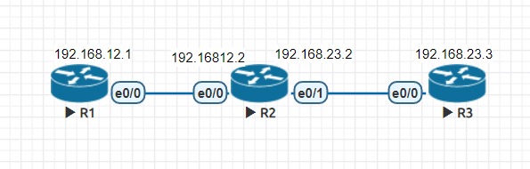
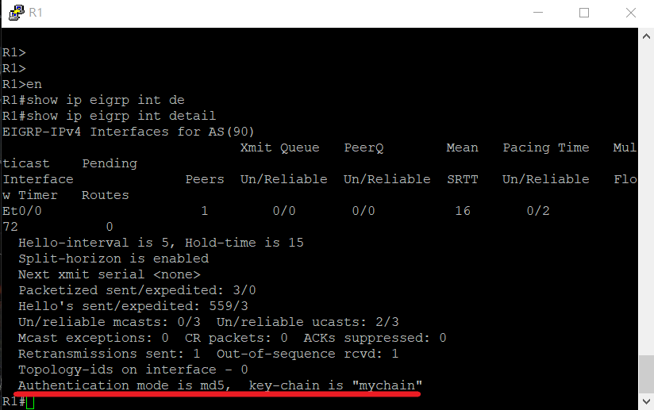
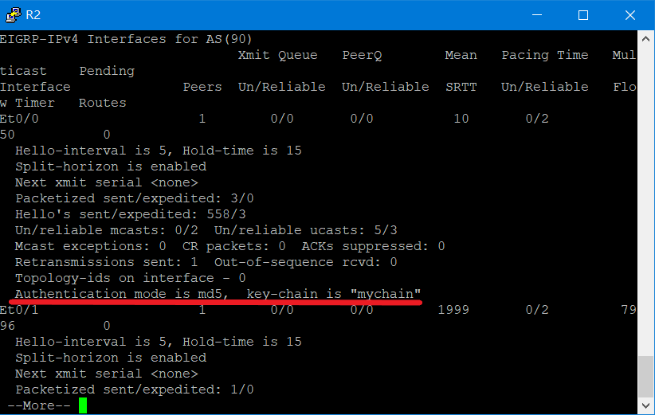

# EIGRP(Enhance Interior Gateway Routing Protocol)
> 由Cisco所提出，只能在Cisco產品中所使用

### 特色
* 採用**DUAL Algorithm**
* 高級的Distance vector或Mixed
* IP header Protocol:88
* VLSM(Variable Length Subnet Mask) & CIDR
* metrics:Bandwidth、Delay、load、Reliability、MTU
* trigger update 244.0.0.10
* 增量更新、可靠更新

### 封包類型

* Hello: 用於建立和維持Neighbor hood
* Update: 用於傳送路由條目
* Ack: 用於實現可靠傳輸
* Query: 用於路由器丟失時，向鄰居發送路由請求
* Reply: 收道路由請求，給予回覆

### 資訊存放表格

* 鄰居表 (Neighbor Table)
* 拓撲表 (Topology Table)
* 路由表 (Routing Table)

#### 查看表格

* 鄰居表 (Neighbor Table)

```sh
R1(config-router)#do show ip eigrp ne
EIGRP-IPv4 Neighbors for AS(90)
H   Address                 Interface              Hold Uptime   SRTT   RTO  Q  Seq
                                                   (sec)         (ms)       Cnt Num
0   192.168.12.2            Et0/0                    11 00:02:12   10   100  0  3
```

* 拓撲表 (Topology Table)

```sh
R1(config-router)#do show ip eigrp topo
EIGRP-IPv4 Topology Table for AS(90)/ID(192.168.12.1)
Codes: P - Passive, A - Active, U - Update, Q - Query, R - Reply,
       r - reply Status, s - sia Status

P 192.168.23.0/24, 1 successors, FD is 307200
        via 192.168.12.2 (307200/281600), Ethernet0/0
P 192.168.12.0/24, 1 successors, FD is 281600
        via Connected, Ethernet0/0

```

* 路由表 (Routing Table)

```sh
R1(config-router)#do show ip route eigrp
Codes: L - local, C - connected, S - static, R - RIP, M - mobile, B - BGP
       D - EIGRP, EX - EIGRP external, O - OSPF, IA - OSPF inter area
       N1 - OSPF NSSA external type 1, N2 - OSPF NSSA external type 2
       E1 - OSPF external type 1, E2 - OSPF external type 2
       i - IS-IS, su - IS-IS summary, L1 - IS-IS level-1, L2 - IS-IS level-2
       ia - IS-IS inter area, * - candidate default, U - per-user static route
       o - ODR, P - periodic downloaded static route, H - NHRP, l - LISP
       a - application route
       + - replicated route, % - next hop override

Gateway of last resort is not set

D     192.168.23.0/24 [90/307200] via 192.168.12.2, 00:04:13, Ethernet0/0
```
### 實驗

#### 實驗環境



#### 設備設定

* R1
```sh
Router(config)#hostname R1
R1(config)#int e0/0
R1(config-if)#ip addr 192.168.12.1 255.255.255.0
R1(config-if)#no shut
R1(config)#router eigrp 90
R1(config-router)#network 192.168.12.0 0.0.0.255
```

* R2

```sh
Router(config)#hostname R2
R2(config)#int e0/0
R2(config-if)#ip addr 192.168.12.2 255.255.255.0
R2(config-if)#no shut
R2(config-if)#int e0/1
R2(config-if)#ip addr 192.168.23.2 255.255.255.0
R2(config-if)#no shut
R2(config)#router eigrp 90
R2(config-router)#network 192.168.12.0 0.0.0.255
R2(config-router)#network 192.168.23.0 0.0.0.255
```

* R3

```sh
Router(config)#int e0/0
Router(config-if)#ip addr 192.168.23.3 255.255.255.0
Router(config-if)#no shut
Router(config-if)#hostname R3
R3(config)#router eigrp 90
R3(config-router)#network 192.168.23.0 0.0.0.255
```

---
### Authentication
> 在Neighbor之間設置密碼，以R1和R2作為範例

#### 設備設定

* R1

```sh
R1(config)#key chain mychain
R1(config-keychain)#key 90
R1(config-keychain-key)#key-string cisco
R1(config-keychain-key)#int e0/0
R1(config-if)#ip authentication key-chain eigrp 90 mychain
R1(config-if)#ip authentication mode eigrp 90 md5
```

* R2

```sh
R2(config)#key chain mychain
R2(config-keychain)#key 90
R2(config-keychain-key)#key-string cisco
R2(config-keychain-key)#int e0/0
R2(config-if)#ip authentication key-chain eigrp 90 mychain
R2(config-if)#ip authentication mode eigrp 90 md5
```

#### 實驗結果

* R1



* R2



---
### 補充
* 各個協定的AD值

    |協定|AD值|
    |:----:|:----:|
    |static|1|
    |EIGRP|90|
    |OSPF|110|
    |RIP|120|
* RIPv2:244.0.0.9
---
### 參考資料
* [Enhance Interior Gateway Routing Protocol(EIGRP)增強型內部網關路由協定 -- Jan Ho 的網絡世界](https://www.jannet.hk/zh-Hant/post/enhanced-interior-gateway-routing-protocol-eigrp/)      
