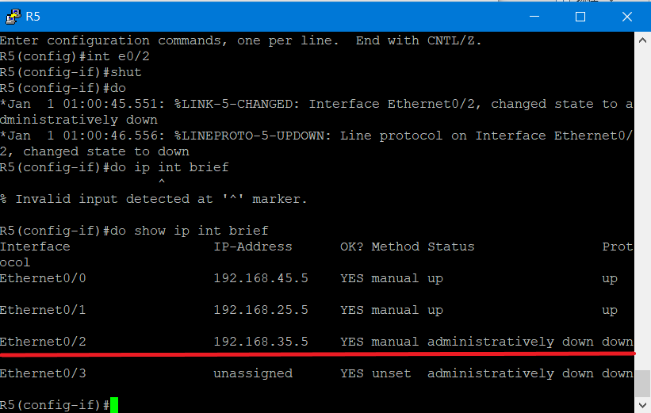

# 期中作業
## 題目
1. Static routing

2. 讓h1,h2透過DHCP Sercer取得IP和相關資訊, h1可 ping h2

3. 使用RIP和EIGRP讓192.168.1.1可ping 192.168.2.1

4. 使用浮動路由，讓R1和R2斷線後
H1 -> R1 -> R3 -> R2 -> H2

## 結果
1. Static routing

* vpc1 -> vpc2(request)

* vpc2 -> vpc1(response)

2. 讓h1,h2透過DHCP Sercer取得IP和相關資訊, h1可 ping h2

* DHCP設定

    * R1

    

    * R2

    

* 自動生成VPC3和VPC4的IP

    * VPC3

    

    * VPC4

    

* VPC3 ping VPC4

3. 使用RIP和EIGRP讓192.168.1.1可ping 192.168.2.1

* RIP設定

    * R1

    

    * R2

    

    * R3

    

    * R1 ping R3

    

* EIGRP設定

    * R1

    

    * R2
    
    

    * R3
    
    

    * R1 ping R3

    

4. 使用浮動路由，讓R1和R2斷線後
H1 -> R1 -> R3 -> R2 -> H2

* 設定路由(未斷線)

    * R3(題目的R1)

    

    * R4(題目的R3)

    

    * R5(題目的R2)

    

    * R1 ping R2(未斷線)

    

* 設定路由(已斷線)

    * R3(題目的R1)

    

    * R5(題目的R2)

    

    

    * R1 ping R2(已斷線)

    

