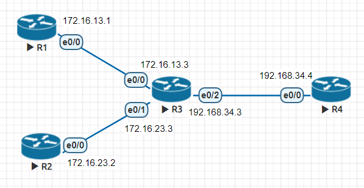
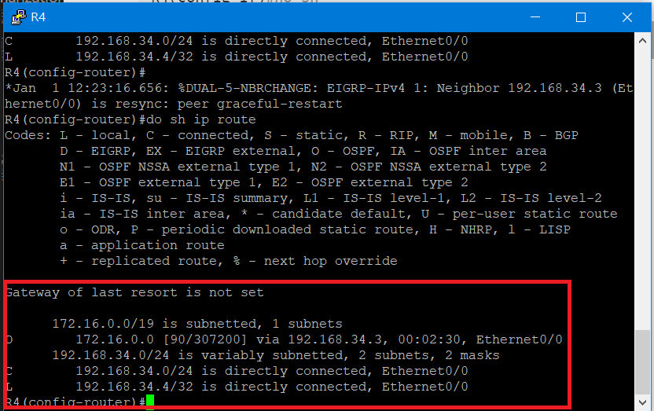
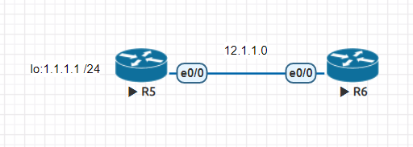
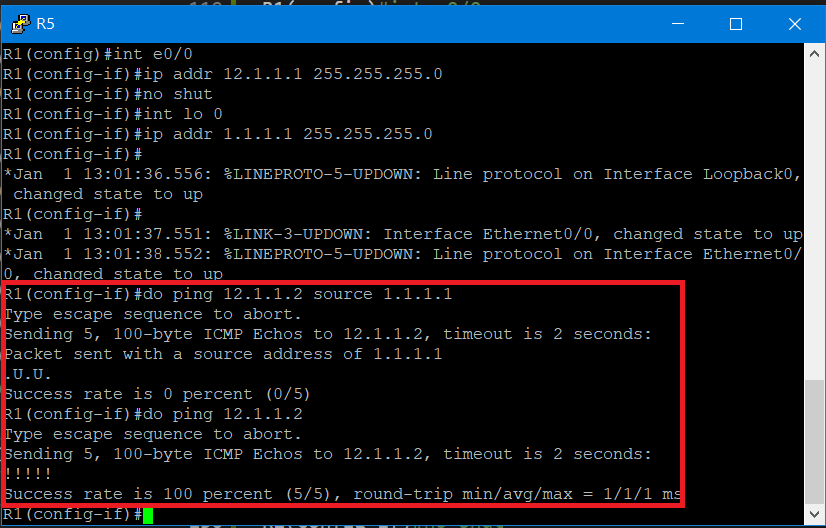

# EIGRP & ACL

## EIGRP

### metric 計算

* 公式 =```(K1 * BW * 256 + (K2 * BW ) / (256 – load) + K3 * delay * 256 ) * (K5 / (reliability + K4))```

    * 預設 K1 = 1, K2 = 0, K3 = 1, K4 = 0, K5 = 0

    * 簡化公式=```(BW + delay) * 256```

    * BW = 10^7 / interface bandwidth (Kbit)

    * delay = interface delay (usec) / 10

### 路徑選擇

* AD (Advertised Distance) : 下一個節點到目的地的距離
* FD (Feasible Distance) : 從自己到目的地的最小值
* FD 的 Path 成為 Successor，並放入路由表
* AD 小於 FD 的 Path 則成為 Feasible successor，作為 Successor 的備用

### summarization

* 實驗環境



* IP和路由設定

    * R1

    ```sh
    R1(config)#int e0/0
    R1(config-if)#ip addr 172.16.13.1 255.255.255.0
    R1(config-if)#no sh
    R1(config-if)#router eigrp 1
    R1(config-router)#network 172.16.13.0 0.0.0.255
    R1(config-router)#no auto-summary
    ```

    * R2

    ```sh
    R2(config)#int e0/0
    R2(config-if)#ip addr 172.16.23.2 255.255.255.0
    R2(config-if)#no sh
    R2(config-if)#router eigrp 1
    R2(config-router)#network 172.16.23.0 0.0.0.255
    R2(config-router)#no auto-summary
    ```

    * R3
    ```sh
    Router(config)#int e0/0
    Router(config-if)#ip addr 172.16.13.3 255.255.255.0
    Router(config-if)#no sh
    Router(config)#int e0/1
    Router(config-if)#ip addr 172.16.23.3 255.255.255.0
    Router(config-if)#no sh
    Router(config-if)#int e0/2
    Router(config-if)#ip addr 192.168.34.3 255.255.255.0
    Router(config-if)#no sh
    Router(config-if)#router eigrp 1
    Router(config-router)#network 172.16.13.0 0.0.0.255
    Router(config-router)#no auto-summary
    Router(config-router)#network 172.16.23.0 0.0.0.255
    Router(config-router)#network 172.16.23.0 0.0.0.255
    Router(config-router)#network 192.168.34.0 0.0.0.255
    ```

    * R4
    ```sh
    R4(config)#int e0/0
    R4(config-if)#ip addr 192.168.34.4 255.255.255.0
    R4(config-if)#no sh
    R4(config-if)#router eigrp 1
    R4(config-router)#network 192.168.34.0 0.0.0.255
    R4(config-router)#no auto-summary
    ```

* 進行路由表匯整
>在R3上進行設定

```sh
Router(config-router)#int e0/2
Router(config-if)#ip summary-address eigrp 1 172.16.0.0 255.255.224.0
```

* 結果



## 存取控制清單(Access Control List, ACL)
>功能為簡易防火牆的製作和資料過濾

### ACL條件

* 從嚴條件 : 最後一筆是`Deny any`,表示以上條件都不符合，則拒絕通過
* 從寬條件：最後一筆是`Permit any`，表示以上條件都不符合，則允許通過

### ACL種類

* 標準式 : 只有檢視封包中的來源位置來決定是否讓封包通過，編號`1-99`,`1300-1999`
* 延伸式 : 比對封包的內容較多，編號`100-199`,`2000-2699`
* 名稱式 : 以名稱命名

### 實驗環境



### IP設定
> R5設定為R1，R6設定為R2

* R5

```sh
R1(config)#int e0/0
R1(config-if)#ip addr 12.1.1.1 255.255.255.0
R1(config-if)#no shut
R1(config-if)#int lo 0
R1(config-if)#ip addr 1.1.1.1 255.255.255.0
R1(config-if)#
```

* R6

```sh
R2(config)#ip route 1.1.1.0 255.255.255.0 e0/0 12.1.1.1
R2(config)#access-list 1 deny host 1.1.1.1
R2(config)#access-list 1 permit any
R2(config)#int e0/0
R2(config-if)#ip access-group 1 in
R2(config-if)#ip addr 12.1.1.2 255.255.255.0
R2(config-if)#no shut
```

### 測試



---
### 參考資料
* [Enhanced Interior Gateway Routing Protocol (EIGRP) 增強型內部網關路由協定 — Jan Ho的網路世界](https://www.jannet.hk/zh-Hant/post/enhanced-interior-gateway-routing-protocol-eigrp/)
* [9-5 封包過濾表 – 存取控制清單|翻轉工作室](http://www.tsnien.idv.tw/Manager_WebBook/chap9/9-5%20%E5%B0%81%E5%8C%85%E9%81%8E%E6%BF%BE%E8%A1%A8%20%E2%80%93%20ACL.html)