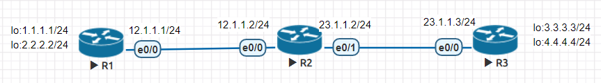
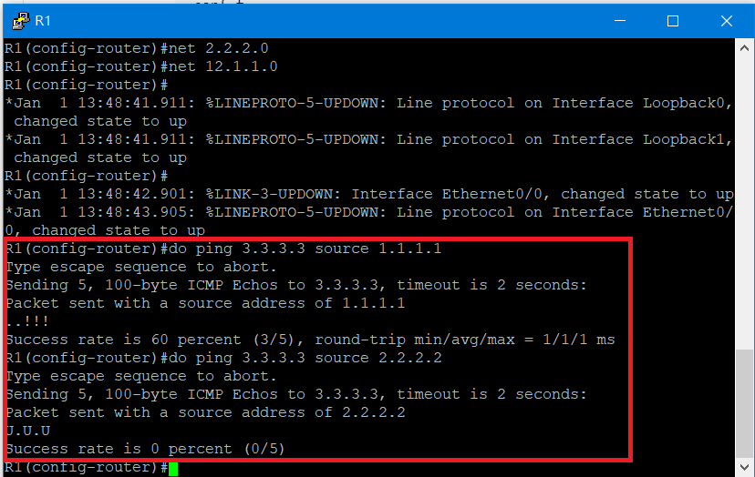
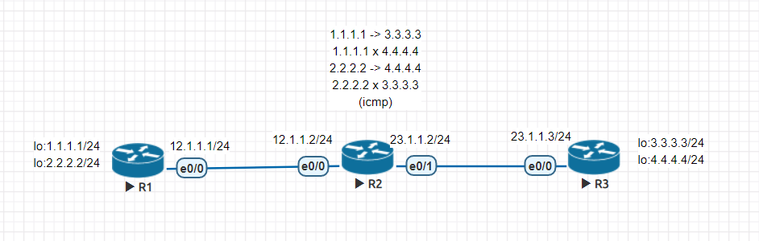
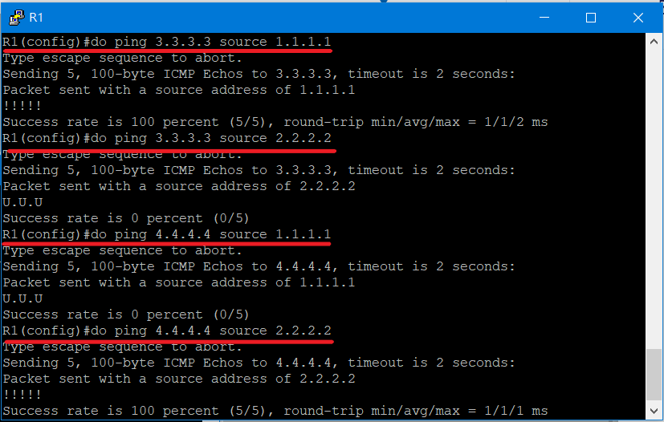
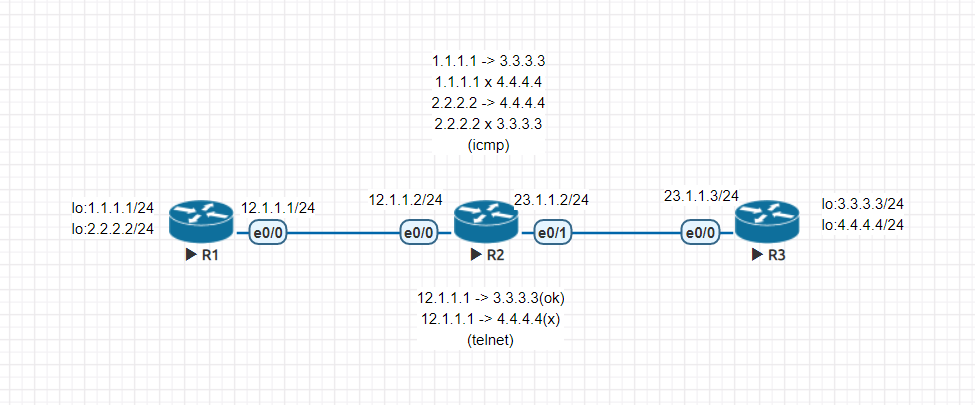
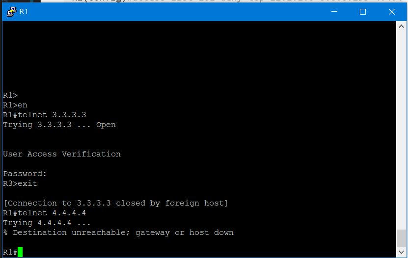
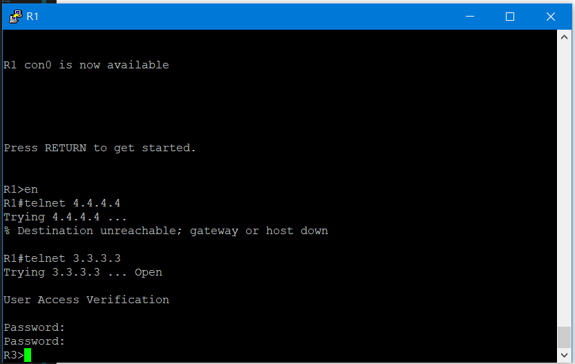
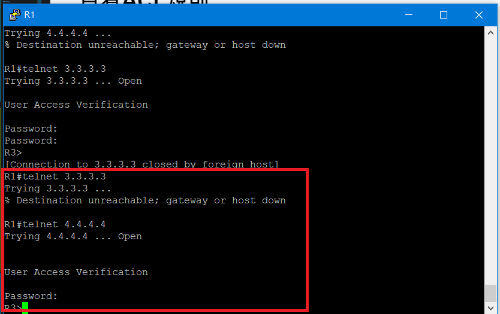

# ACL(2)
>延續上週內容

## 標準型
> 設定進出口越接近，目的地越好

### 實驗環境



### IP與路由設定

* R1

```sh
R1(config)#int e0/0
R1(config-if)#ip addr 12.1.1.1 255.255.255.0
R1(config-if)#no shut
R1(config-if)#int lo 0
R1(config-if)#ip addr 1.1.1.1 255.255.255.0
R1(config-if)#int lo 1
R1(config-if)#ip addr 2.2.2.2 255.255.255.0
R1(config-if)#router rip
R1(config-router)#version 2
R1(config-router)#net 1.1.1.0
R1(config-router)#net 2.2.2.0
R1(config-router)#net 12.1.1.0
```

* R2

```sh
R2(config)#int e0/0
R2(config-if)#ip addr 12.1.1.2 255.255.255.0
R2(config-if)#no shut
R2(config-if)#int e0/1
R2(config-if)#ip addr 23.1.1.2 255.255.255.0
R2(config-if)#no shut
R2(config-if)#router rip
R2(config-router)#version 2
R2(config-router)#net 12.1.1.0
R2(config-router)#net 23.1.1.0
```

### R3設定

* 設定黑白名單
> 設定完黑名單，要記得設定```access-list 1 permit any```，因為ACL預設為過濾掉所有封包

```sh
R3(config)#access-list 1 deny 2.2.2.0 0.0.0.255
R3(config)#access-list 1 permit any
R3(config)#access-list 1 permit 1.1.1.0 0.0.0.255
```

* 設定IP

```sh
#設定入口為0/0
R3(config)#int e0/0
R3(config-if)#ip access-group 1 in             
R3(config-if)#ip addr 23.1.1.3 255.255.255.0
R3(config-if)#no shut
R3(config-if)#int lo 0
R3(config-if)#ip addr 3.3.3.3 255.255.255.0
R3(config-if)#int lo 1
R3(config-if)#ip addr 4.4.4.4 255.255.255.0
```

* 設定路由

```sh
R3(config-if)#router rip
R3(config-router)#version 2
R3(config-router)#net 3.3.3.0
R3(config-router)#net 4.4.4.0
R3(config-router)#net 23.1.1.0
```

### 測試



---

## 擴充型(1)
>進出口越靠近來源端越好，因為可以在一開始就可以把不允許通過的封包過濾掉

### 實驗環境
>在R2進行icmp設定



### IP與路由設定

* R1
```sh
R1(config)#int e0/0
R1(config-if)#ip addr 12.1.1.1 255.255.255.0
R1(config-if)#no shut
R1(config-if)#int lo 0
R1(config-if)#ip addr 1.1.1.1 255.255.255.0
R1(config-if)#int lo 1
R1(config-if)#ip addr 2.2.2.2 255.255.255.0
R1(config-if)#router rip
R1(config-router)#version 2
R1(config-router)#net 1.1.1.0
R1(config-router)#net 2.2.2.0
R1(config-router)#net 12.1.1.0
```

* R3

```sh
R3(config)#int e0/0
R3(config-if)#ip addr 23.1.1.3 255.255.255.0
R3(config-if)#no shut
R3(config-if)#int lo 0
R3(config-if)#ip addr 3.3.3.3 255.255.255.0
R3(config-if)#int lo 1
R3(config-if)#ip addr 4.4.4.4 255.255.255.0
R3(config-if)#router rip
R3(config-router)#version 2
R3(config-router)#net 3.3.3.0
R3(config-router)#net 4.4.4.0
R3(config-router)#net 23.1.1.0
```

### R2設定

* 設定黑名單

```sh
R2(config)#access-list 100 deny icmp 1.1.1.0 0.0.0.255 4.4.4.0 0.0.0.255
R2(config)#access-list 100 deny icmp 2.2.2.0 0.0.0.255 3.3.3.0 0.0.0.255
R2(config)#access-list 100 permit ip any any
```

* 設定白名單

```sh
R2(config)#access-list 100 permit icmp 1.1.1.0 0.0.0.255 3.3.3.0 0.0.0.255
R2(config)#access-list 100 permit icmp 2.2.2.0 0.0.0.255 4.4.4.0 0.0.0.255
```

* 設定IP

```sh
R2(config)#int e0/0
R2(config-if)#ip access-group 100 in
R2(config-if)#ip addr 12.1.1.2 255.255.255.0
R2(config-if)#no shut
R2(config-if)#int e0/1
R2(config-if)#ip addr 23.1.1.2 255.255.255.0
R2(config-if)#no shut
```

* 設定IP與路由

```sh
R2(config-if)#router rip
R2(config-router)#version 2
R2(config-router)#net 12.1.1.0
R2(config-router)#net 23.1.1.0
```

### 結果



## 擴充型(2)
>延續上方實驗

### 實驗環境



### 增加telnet黑白名單
>在R2進行操作

```sh
R2(config)#access-list 101 deny tcp 12.1.1.0 0.0.0.255 4.4.4.0 0.0.0.255 eq 23
R2(config)#access-list 101 permit tcp any any eq 23
R2(config)#$ 101 permit tcp 12.1.1.0 0.0.0.255 3.3.3.0 0.0.0.255 eq 23
R2(config)#int e0/1
R2(config-if)#ip access-group 101 out
```
### 設定telnet
>在R3上進行設定

```sh
R3(config)#line vty 0 4
R3(config-line)#password cisco
R3(config-line)#login
R3(config-line)#transport input telnet
```

### 結果



---

## 名稱型(1)
>可以插入規則

### 實驗環境
>延伸上個實驗


### R2設定

* 新增黑白名單

```sh
R2(config-if)#ip access-list extended telnet-acl
R2(config-ext-nacl)#deny tcp any 4.4.4.0 0.0.0.255 eq 23
R2(config-ext-nacl)#permit ip any any
```

* 指定介面

```sh
R2(config-ext-nacl)#int e0/1
R2(config-if)#ip access-group telnet-acl out
```

### 查看ACL規則

```sh
R2(config-if)#do sh access-list
Extended IP access list 100
    10 deny icmp 1.1.1.0 0.0.0.255 4.4.4.0 0.0.0.255 (5 matches)
    20 deny icmp 2.2.2.0 0.0.0.255 3.3.3.0 0.0.0.255 (5 matches)
    30 permit ip any any (335 matches)
    40 permit icmp 1.1.1.0 0.0.0.255 3.3.3.0 0.0.0.255
    50 permit icmp 2.2.2.0 0.0.0.255 4.4.4.0 0.0.0.255
Extended IP access list telnet-acl
    10 deny tcp any 4.4.4.0 0.0.0.255 eq telnet (1 match)
    20 permit ip any any (24 matches)
```
### 測試



## 名稱式(2)
>更改telnet規則

### 修改telnet規則
> 在R2上操作

```sh
R2(config-if)#ip access-list extended telnet-acl
R2(config-ext-nacl)#no 10
R2(config-ext-nacl)#5 deny tcp any 3.3.3.0 0.0.0.255 eq 23
```

### 查看ACL規則

```sh
R2(config-ext-nacl)#do sh access-list
Extended IP access list 100
    10 deny icmp 1.1.1.0 0.0.0.255 4.4.4.0 0.0.0.255 (5 matches)
    20 deny icmp 2.2.2.0 0.0.0.255 3.3.3.0 0.0.0.255 (5 matches)
    30 permit ip any any (355 matches)
    40 permit icmp 1.1.1.0 0.0.0.255 3.3.3.0 0.0.0.255
    50 permit icmp 2.2.2.0 0.0.0.255 4.4.4.0 0.0.0.255
Extended IP access list telnet-acl
    5 deny tcp any 3.3.3.0 0.0.0.255 eq telnet
    20 permit ip any any (26 matches)
```

### 測試



---
### 參考資料
* [9-5 封包過濾表 – 存取控制清單|翻轉工作室](http://www.tsnien.idv.tw/Manager_WebBook/chap9/9-5%20%E5%B0%81%E5%8C%85%E9%81%8E%E6%BF%BE%E8%A1%A8%20%E2%80%93%20ACL.html)