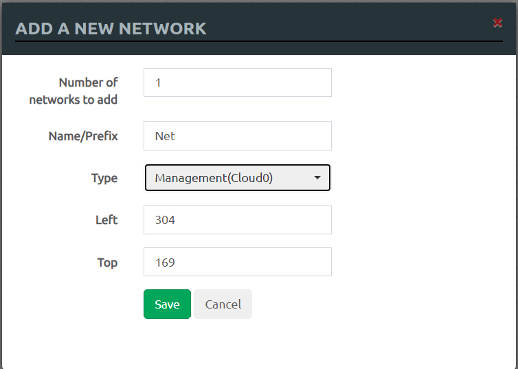
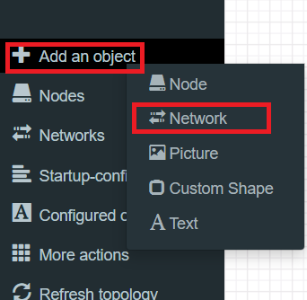
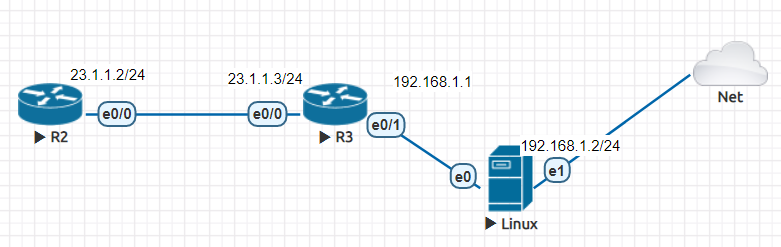
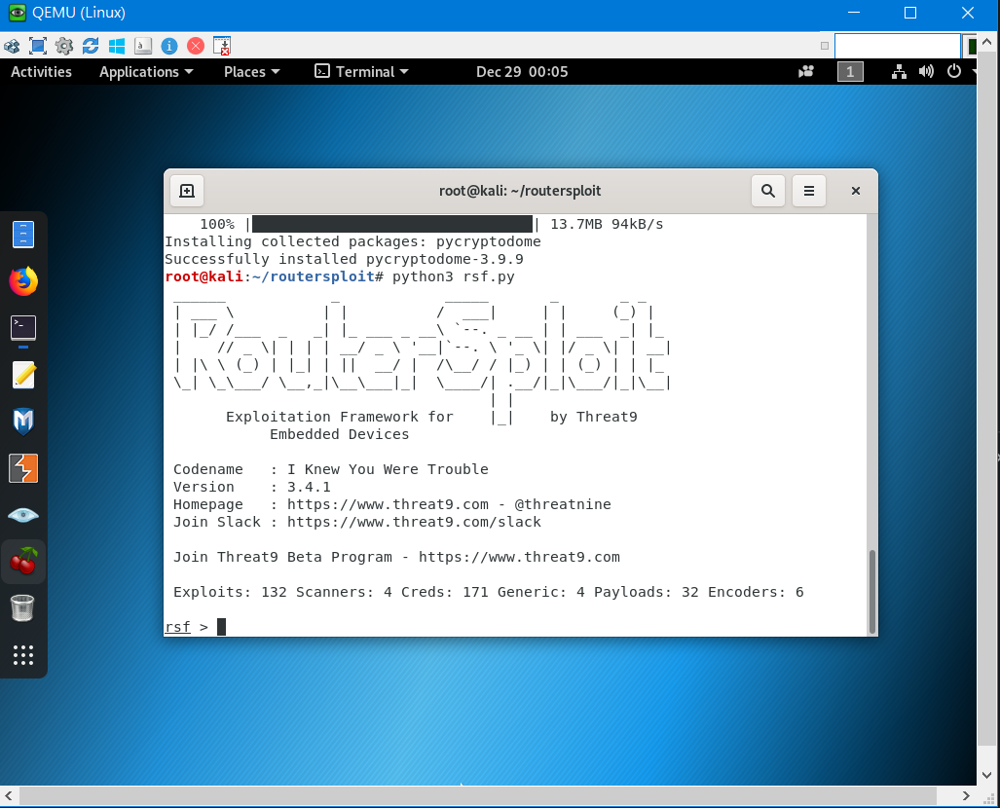
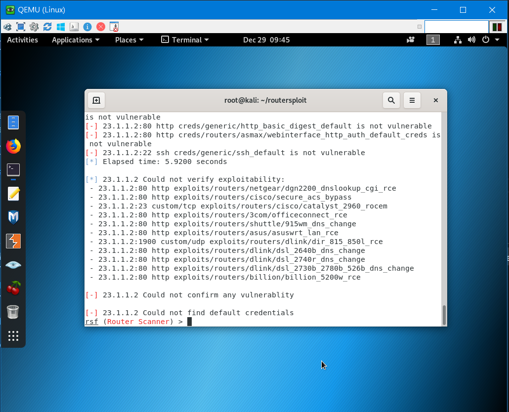
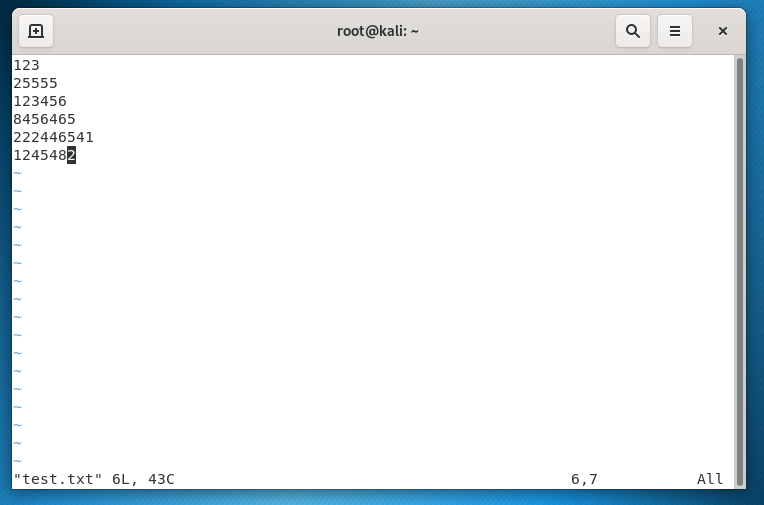

# Secure shell(ssh)

## 與外部網路連接
>將**Type**更改為**Management(Cloud0)**



> 可以在**Add an object**中的**Network**找到


---
## 利用工具破解ssh密碼

### routerspliot實驗環境



### router設定

#### IP與路由設定
* R2

```sh
R2(config)#int e0/0
R2(config-if)#ip addr 23.1.1.2 255.255.255.0
R2(config-if)#no sh
R2(config-if)#exit
R2(config)#router rip
R2(config-router)#version 2
R2(config-router)#network 23.1.1.0
R2(config-router)#no auto-summary
```

* R3

```sh
R3(config)#int e0/0
R3(config-if)#ip addr 23.1.1.3 255.255.255.0
R3(config-if)#no sh
R3(config-if)#int e0/1
R3(config-if)#ip addr 192.168.1.1 255.255.255.0
R3(config-if)#no sh
R3(config-if)#router rip
R3(config-router)#version 2
R3(config-router)#network 23.1.1.0
R3(config-router)#network 192.168.1.0
```

#### ssh設定
> 在R2上進行操作

```sh
R2(config)#ip doamin-name test.com
R2(config)#ip ssh version 2
Please create RSA keys to enable SSH (and of atleast 768 bits for SSH v2).
R2(config)#crypto key generate rsa
The name for the keys will be: R2.test.com
Choose the size of the key modulus in the range of 360 to 4096 for your
  General Purpose Keys. Choosing a key modulus greater than 512 may take
  a few minutes.

How many bits in the modulus [512]: 1024
% Generating 1024 bit RSA keys, keys will be non-exportable...
[OK] (elapsed time was 0 seconds)

R2(config)#
*Dec 31 22:14:30.442: %SSH-5-ENABLED: SSH 2.0 has been enabled
R2(config)#username root privilege 15 password 123456
R2(config)#line vty 0 4
R2(config-line)#login local
R2(config-line)#transport input ssh
```

#### ssh測試

```sh
R3#ssh -l root 23.1.1.2
```

### routerspliot 安裝 

* 更新時間與軟體

```sh
systemctl restart ntp
timedatectl set-timezone Asia/Taipei
apt update
```

* 安裝routerspliot

```sh
git clone https://github.com/reverse-shell/routersploit
cd routersploit
python3 -m pip install -r requirements.txt
python3 rsf.py
``` 
* 安裝完成畫面



### routerspliot 操作

```sh
use scanners/routers/router_scan
set target 23.1.1.2
run
```
### 測試



### hydra

#### 準備測試檔



### 測試


####


### 參考資料
* [routersploit 掃 router 設備漏洞/弱點](https://ssorc.tw/7397/routersploit-%E6%8E%83-router-%E8%A8%AD%E5%82%99%E6%BC%8F%E6%B4%9E-%E5%BC%B1%E9%BB%9E/)
* [Cisco設定遠端連線(Telnet & SSH)](https://sites.google.com/a/james-tw.com/j-note/cisco/cisco-she-ding-yuan-duan-lian-xian-telnet-ssh)
* [[筆記]Cisco基本指令-啟用SSH](https://david50.pixnet.net/blog/post/45217866-%5B%E7%AD%86%E8%A8%98%5Dcisco%E5%9F%BA%E6%9C%AC%E6%8C%87%E4%BB%A4-%E5%95%9F%E7%94%A8ssh)


