# VRF & NAT

## VRF(Virtual routing and forwarding)
>屬於Layer3的網路虛擬化，目的是為了將路由表進行資料隔離，以提高資料的安全性

### 實驗環境

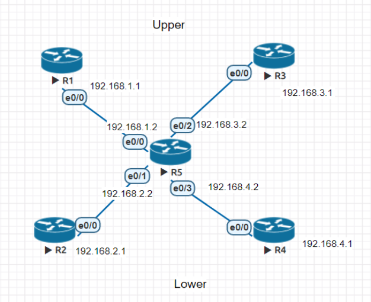

### 根據上圖設定IP

* R5 設定

|介面|IP|VRF|
|:---:|:---:|:---:|
|e0/0|192.168.1.2|Upper|
|e0/1|192.168.2.2|Lower|
|e0/2|192.168.3.2|Upper|
|e0/3|192.168.4.2|Lower|

* 其餘機器設定

|機器名稱|IP|VRF|
|:---:|:---:|:---:|
|R1|192.168.1.1|Upper|
|R2|192.168.2.1|Lower|
|R3|192.168.3.1|Upper|
|R4|192.168.4.1|Lower|

### 進行VRF設定
> 在R5上進行設定

* 創建 VRF - Upper&Lower

```sh
R5(config)#ip vrf Upper
R5(config-vrf)#exit
R5(config)#ip vrf Lower
R5(config-vrf)#exit
```

* 在介面上設定VRF
> 1.原先所設定的IP，會因設置VRF而取消，因此須重行進行設定
> 2.一旦完成VRF設定，就不能進行更改

```sh
# 設定e0/0
R5(config)#int e0/0
R5(config-if)#ip vrf forwarding Upper
% Interface Ethernet0/0 IPv4 disabled and address(es) removed due to enabling VRF Upper
R5(config-if)#ip addr 192.168.1.2 255.255.255.0
R5(config-if)#no sh
# 設定e0/1
R5(config)#int e0/1
R5(config-if)#ip vrf forwarding Lower
R5(config-if)#ip addr 192.168.2.2 255.255.255.0
R5(config-if)#no sh
# 設定e0/2
R5(config-if)#int e0/2
R5(config-if)#ip vrf forwarding Upper
R5(config-if)#ip addr 192.168.3.2 255.255.255.0
R5(config-if)#no sh
# 設定e0/3
R5(config-if)#int e0/3
R5(config-if)#ip vrf forwarding Lower
R5(config-if)#ip addr 192.168.4.2 255.255.255.0
R5(config-if)#no sh
```
### 查詢路由表

* Upper

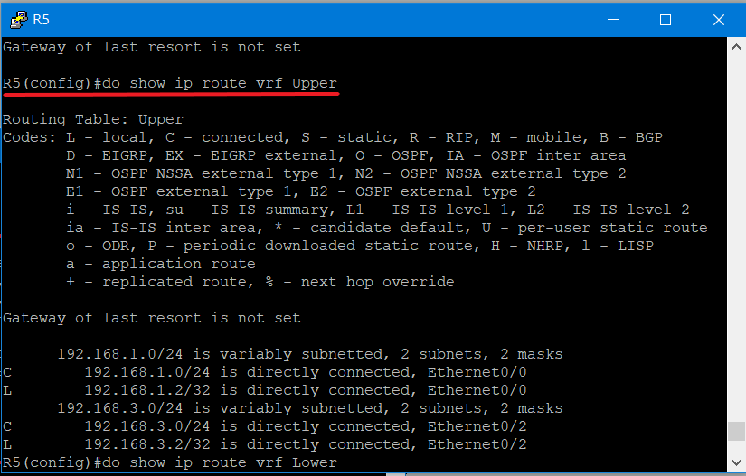

* Lower

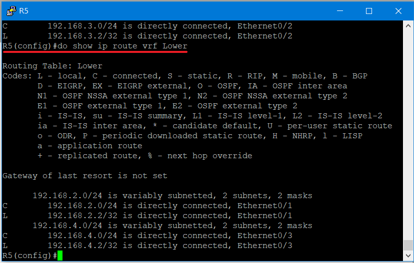

>由於設定了vrf，因此會使原先的路由表消失
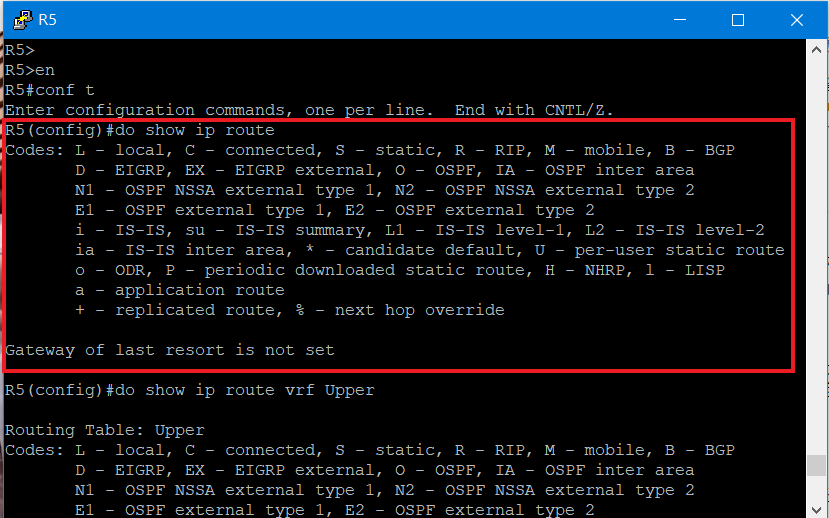

### 測試

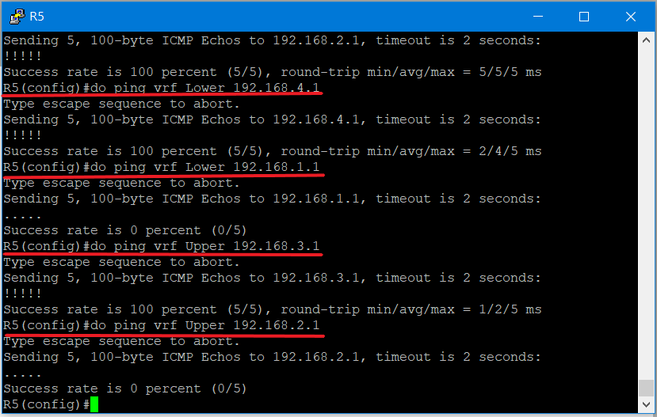

---
## NAT(Network Address Translation)
>為了解決ipv4位址不足而所提出

### NAT 種類

* Dynamic NAT(DAT):多個私有IP映射到多個公有IP，為多對多方式，缺點為需要準備大量公有IP位址

* Port NAT(PAT):多個私有IP映射到一個私有IP，為多對一方式，目前最常使用

* Static NAT:比較少用，是將私有IP映射到公有IP，採取一對一方式，運用在伺服器架設

|NAT種類|映射方式|
|:-----:|:-----:|
|Dynamic NAT(DAT)|多對多|
|Port NAT(PAT)|多對一|
|Static NAT|一對一|

---

### DAT實驗環境

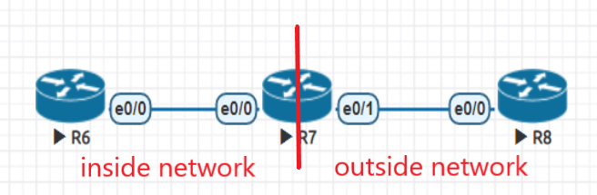

* inside network

|機器(介面)|IP|
|:---:|:---:|
|R6(lo 0)|192.168.1.1|
|R6(lo 1)|192.168.2.1|
|R6(e0/0)|12.1.1.1|
|R7(e0/0)|12.1.1.2|

* outside network

|機器(介面)|IP|
|:---:|:---:|
|R7(e0/1)|23.1.1.2|
|R8(e0/0)|23.1.1.3|
|R8(lo 0)|3.3.3.3|
|R8(lo 1)|8.8.8.8|

#### IP設定

* R6

```sh
R6(config)#int lo 0
R6(config-if)#ip addr 192.168.1.1 255.255.255.0
R6(config-if)#no sh
R6(config-if)#int lo 1
R6(config-if)#ip addr 192.168.2.1 255.255.255.0
R6(config-if)#no sh
R6(config-if)#int e0/0
R6(config-if)#ip addr 12.1.1.1 255.255.255.0
R6(config-if)#no sh
```

* R7

```sh
R7(config)#int e0/0
R7(config-if)#ip addr 12.1.1.2 255.255.255.0
R7(config-if)#no sh
R7(config-if)#int e0/1
R7(config-if)#ip addr 23.1.1.2 255.255.255.0
R7(config-if)#no sh
```

* R8

```sh
R8(config)#int lo 0
R8(config-if)#ip addr 3.3.3.3 255.255.255.255
R8(config-if)#no sh
R8(config-if)#int lo 1
R8(config-if)#ip addr 8.8.8.8 255.255.255.255
R8(config-if)#no sh
R8(config-if)#int e0/0
R8(config-if)#ip addr 23.1.1.3 255.255.255.0
R8(config-if)#no sh
```

#### DAT設定
> 在R7上面操作

* 設定內定路由

```sh
R7(config)#ip route 0.0.0.0 0.0.0.0 23.1.1.3
R7(config)#ip route 192.168.1.0 255.255.255.0 12.1.1.1
R7(config)#ip route 192.168.2.0 255.255.255.0 12.1.1.1
```

* 設定感興趣流

```sh
R7(config)#access-list 1 permit 192.168.1.0 0.0.0.255
R7(config)#access-list 2 permit 192.168.2.0 0.0.0.255
```

* 設定DAT的IP範圍與遮罩 

```sh
R7(config)#ip nat pool DNAT 23.1.1.100 23.1.1.200 netmask 255.255.255.0
```

* 設置入口端與出口端

```sh
R7(config)#int e0/0
R7(config-if)#ip nat inside
R7(config-if)#int e0/1
R7(config-if)#ip nat outside
```

* 套用DAT設定

```sh
R7(config)#ip nat inside source list 1 pool DNAT
R7(config)#ip nat inside source list 2 pool DNAT
```

* 查看nat轉換的對應IP

```sh
R7(config)#do show ip nat translations
Pro Inside global      Inside local       Outside local      Outside global
--- 23.1.1.100         192.168.1.1        ---                ---
--- 23.1.1.101         192.168.2.1        ---                ---
```

* 查看nat轉換的統計資料

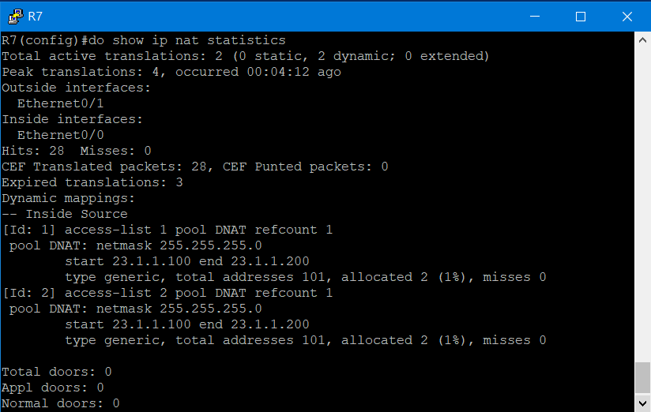

### 測試

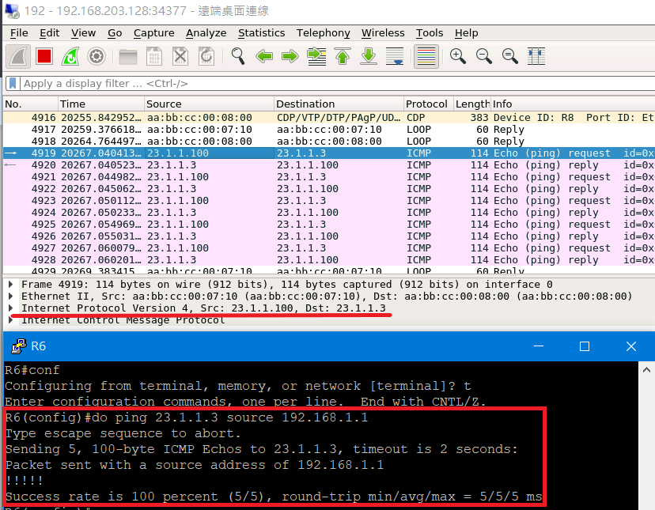

---

### PAT實驗環境
> 和DAT實驗環境相同


#### PAT設定
> 在R7上設定

* 設定感興趣流

```sh
R7(config)#access-list 1 permit 192.168.1.0 0.0.0.255
R7(config)#access-list 2 permit 192.168.2.0 0.0.0.255
```

* 設置入口端與出口端

```sh
R7(config)#int e0/0
R7(config-if)#ip nat inside
R7(config-if)#int e0/1
R7(config-if)#ip nat outside
```

* 設置PAT範圍與遮罩

```sh
R7(config)#ip nat pool PAT 23.1.1.2 23.1.1.2 netmask 255.255.255.0
```

* 套用PAT設定

```sh
R7(config)#ip nat inside source list 1 pool PAT overload
R7(config)#ip nat inside source list 2 pool PAT overload
```
> **overload** 代表會重複使用同一IP

### 測試(1)
> 由於**ping**是屬於第三層icmp的部分，所以沒有port號

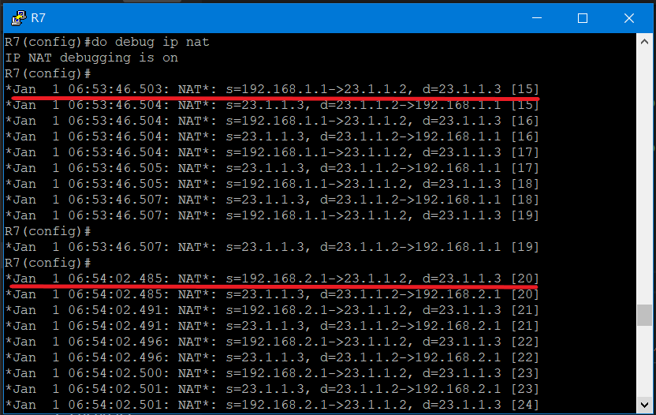

### 測試(2)
> 利用telnet進行測試，由於ping沒有port號，所以使用架設kail-linux來進行telnet測試

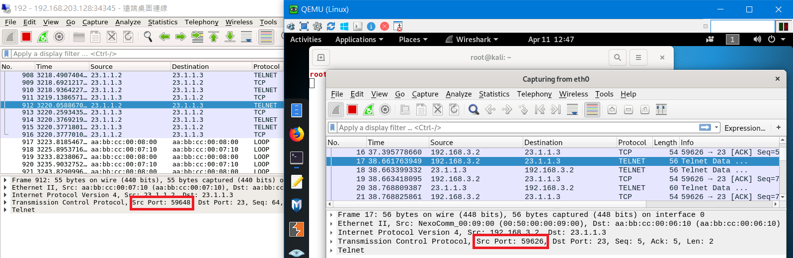

> 當封包到了R7進行NAT轉換時，不只將IP進行更換還會將port號進行更改，因此src port會不同

---
### static NAT實驗環境
> 將R6設置成telnet的server，其餘IP設定與先前實驗不變

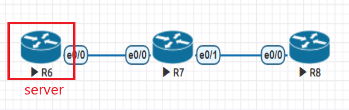

#### static NAT設定

* 設置telnet的server
> 在R6進行操作

```sh
R6(config)#line vty 0 4
R6(config-line)#password cisco
R6(config-line)#login
R6(config-line)#transport input telnet
```

* 設置入口端與出口端

```sh
R7(config)#int e0/0
R7(config-if)#ip nat inside
R7(config-if)#int e0/1
R7(config-if)#ip nat outside
```

* 設定static NAT
> 當使用telnet連線23.1.1.10時，會將轉換到12.1.1.1

```sh
R7(config)#ip nat inside source static 12.1.1.1 23.1.1.10
```

* 查看nat轉換的對應IP
```sh
R7(config)#do sh ip nat translations
Pro Inside global      Inside local       Outside local      Outside global
--- 23.1.1.10          12.1.1.1           ---                ---
```
### 測試

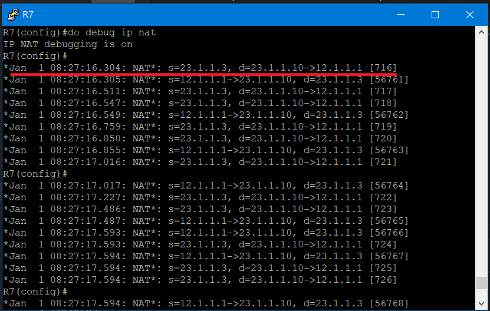

---
### 參考資料
* [太閤實驗棧 一鍵解鎖VRF知識架構](https://kknews.cc/zh-tw/code/4j9pp6q.html)
* [Network Address Translation (NAT) 網路位址轉換](https://www.jannet.hk/zh-Hant/post/network-address-translation-nat/)