# VLAN & VTP

## VLAN(Virtual LAN)
> 為Layer2的網路虛擬化。可以將一個LAN以邏輯方式劃分成多個LAN，以達到資料安全並且也能減少網路效能

## 實驗一

### 實驗環境

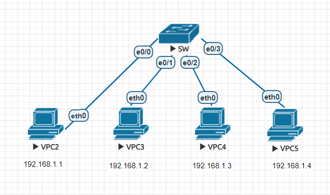

|名稱|IP|vlan|
|:-----:|:-----:|:-----:|
|VPC2|192.168.1.1|vlan 10|
|VPC3|192.168.1.2|vlan 10|
|VPC4|192.168.1.3|vlan 20|
|VPC5|192.168.1.4|vlan 20|

### 創建 vlan10 & vlan20

```sh
Switch(config)#vlan 10
Switch(config-vlan)#name vlan10
Switch(config-vlan)#exit
Switch(config)#vlan 20
Switch(config-vlan)#name vlan20
Switch(config-vlan)#exit
```

### 查看VLAN是否創建成功

```sh
Switch(config)#do show vlan brief

VLAN Name                             Status    Ports
---- -------------------------------- --------- -------------------------------
1    default                          active    Et0/0, Et0/1, Et0/2, Et0/3
10   vlan10                           active
20   vlan20                           active
1002 fddi-default                     act/unsup
1003 token-ring-default               act/unsup
1004 fddinet-default                  act/unsup
1005 trnet-default                    act/unsup
```

### 將VPC加入VLAN中

```sh
Switch(config)#int e0/0
Switch(config-if)#switchport mode access
Switch(config-if)#switchport access vlan 10
Switch(config-if)#exit
Switch(config)#int e0/1
Switch(config-if)#switchport mode access
Switch(config-if)#switchport access vlan 10
Switch(config-if)#int e0/2
Switch(config-if)#switchport mode access
Switch(config-if)#switchport access vlan 20
Switch(config-if)#exit
Switch(config)#int e0/3
Switch(config-if)#switchport mode access
Switch(config-if)#switchport access vlan 20
Switch(config-if)#do show vlan brief
```
> 補充
如果在同一台機器中進行相同設定，可以使用以下操作

```sh
Switch(config)#int range e0/0,e0/1
Switch(config-if-range)#switchport mode access
Switch(config-if-range)#switchport access vlan 10
Switch(config-if-range)#exit
Switch(config)#int range e0/2,e0/3
Switch(config-if-range)#switchport mode access
Switch(config-if-range)#switchport access vlan 20
```

### 查看是否成功加入VLAN

```sh
VLAN Name                             Status    Ports
---- -------------------------------- --------- -------------------------------
1    default                          active
10   vlan10                           active    Et0/0, Et0/1
20   vlan20                           active    Et0/2, Et0/3
1002 fddi-default                     act/unsup
1003 token-ring-default               act/unsup
1004 fddinet-default                  act/unsup
1005 trnet-default                    act/unsup
```
### 測試
> 利用VPC2(192.168.1.1)ping其他VPC，結果VPC2只能與在同一VLAN的VLAN3(192.168.1.2)進行連線

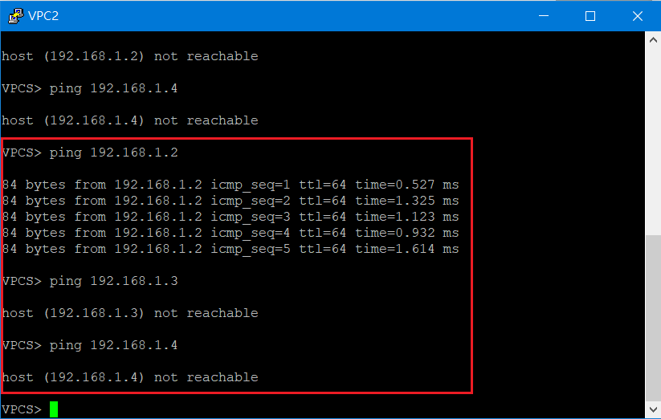

## 實驗二
> 使用兩條連線，在兩台switch間建立VLAN

### 實驗環境

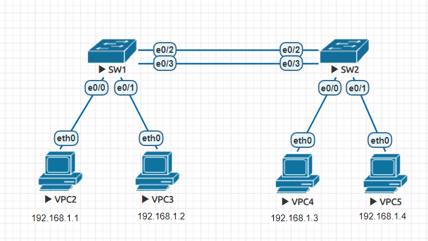

|名稱|IP|vlan|傳輸路徑(SW1-SW2)|
|:-----:|:-----:|:-----:|:-----:|
|VPC2|192.168.1.1|vlan 10|e0/2 - e0/2|
|VPC3|192.168.1.2|vlan 20|e0/3 - e0/3|
|VPC4|192.168.1.3|vlan 10|e0/2 - e0/2|
|VPC5|192.168.1.4|vlan 20|e0/3 - e0/3|

### 查看是否成功加入VLAN

* SW1
> e0/0和e0/2介面屬於vlan10，e0/1和e0/3介面屬於vlan20

```sh
Switch(config-if-range)#do show vlan brief

VLAN Name                             Status    Ports
---- -------------------------------- --------- -------------------------------
1    default                          active
10   vlan10                           active    Et0/0, Et0/2
20   vlan20                           active    Et0/1, Et0/3
1002 fddi-default                     act/unsup
1003 token-ring-default               act/unsup
1004 fddinet-default                  act/unsup
1005 trnet-default                    act/unsup

```

* SW2
>e0/0和e0/2介面屬於vlan10，e0/1和e0/3介面屬於vlan20

```sh
Switch(config-if-range)#do show vlan brief

VLAN Name                             Status    Ports
---- -------------------------------- --------- -------------------------------
1    default                          active
10   vlan10                           active    Et0/0, Et0/2
20   vlan20                           active    Et0/1, Et0/3
1002 fddi-default                     act/unsup
1003 token-ring-default               act/unsup
1004 fddinet-default                  act/unsup
1005 trnet-default                    act/unsup
```
### 測試

* 利用VPC2(192.168.1.1)ping其他VPC

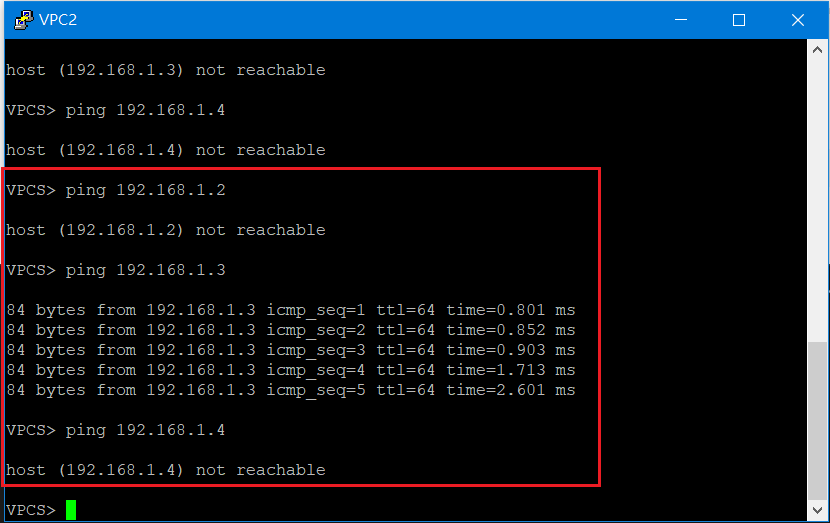

* 利用VPC3(192.168.1.2)ping其他VPC

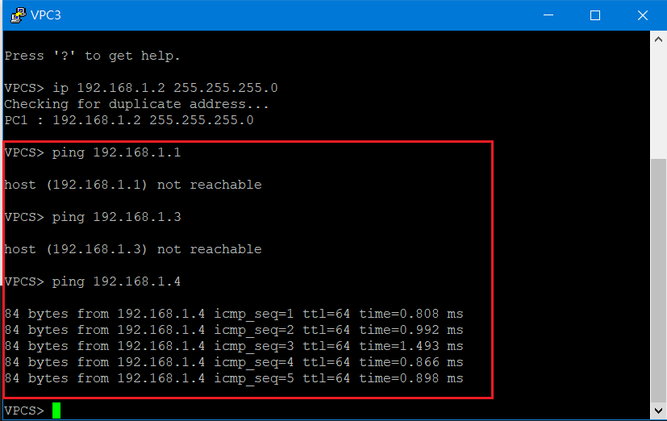

## 實驗三
> 延續實驗二，使用trunk定並使用802.1q協定來進行vlan設定

### 實驗環境

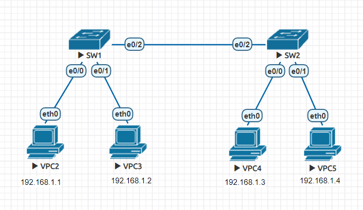

|名稱|IP|vlan|
|:-----:|:-----:|:-----:|
|VPC2|192.168.1.1|vlan 10|
|VPC3|192.168.1.2|vlan 20|
|VPC4|192.168.1.3|vlan 10|
|VPC5|192.168.1.4|vlan 20|

### 將VPC加入VLAN
> 兩台switch都須做相同操作

* SW1

```sh
SW1(config)#int e0/0
SW1(config-if)#switchport mode access
SW1(config-if)#switchport access vlan 10
SW1(config-if)#exit
SW1(config)#int e0/1
SW1(config-if)#switchport mode access
SW1(config-if)#switchport access vlan 20
SW1(config-if)#exit

```

* SW2

```sh
SW2(config)#int e0/0
SW2(config-if)#switchport mode access
SW2(config-if)#switchport access vlan 10
SW2(config-if)#exit
SW2(config)#int e0/1
SW2(config-if)#switchport mode access
SW2(config-if)#switchport access vlan 20
```

### 查看VPC是否與VLAN連結成功

* SW1

```sh
SW1(config-if)#do show vlan brief

VLAN Name                             Status    Ports
---- -------------------------------- --------- -------------------------------
1    default                          active    Et0/3
10   vlan10                           active    Et0/0
20   vlan20                           active    Et0/1
1002 fddi-default                     act/unsup
1003 token-ring-default               act/unsup
1004 fddinet-default                  act/unsup
1005 trnet-default                    act/unsup
```

* SW2

```sh
SW2(config-if)#do show vlan brief

VLAN Name                             Status    Ports
---- -------------------------------- --------- -------------------------------
1    default                          active    Et0/3
10   vlan10                           active    Et0/0
20   vlan20                           active    Et0/1
1002 fddi-default                     act/unsup
1003 token-ring-default               act/unsup
1004 fddinet-default                  act/unsup
1005 trnet-default                    act/unsup
```
### 將封包打上VLAN tag
> 切換到兩台switch所連線的介面，進行以下設定，在此以SW1進行操作

```sh
SW1(config-if)#switchport trunk encapsulation dot1q
SW1(config-if)#switchport mode trunk
```
### 查看trunk設定是否成功

```sh
SW1(config-if)#do show int trunk

Port        Mode             Encapsulation  Status        Native vlan
Et0/2       on               802.1q         trunking      1

Port        Vlans allowed on trunk
Et0/2       1-4094

Port        Vlans allowed and active in management domain
Et0/2       1,10,20

Port        Vlans in spanning tree forwarding state and not pruned
Et0/2       none

```
### 測試
>從以下結果可以看見，在封包傳送會將會將標籤加上，以藉此讓封包送達目的端

* VPC2 ping VPC4

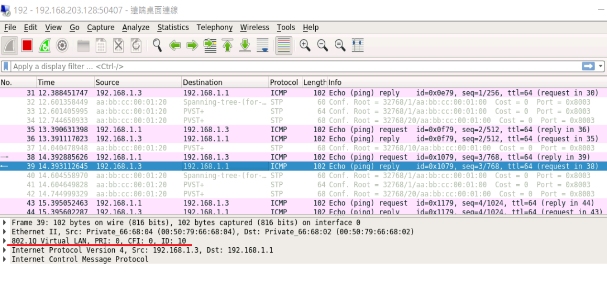

* VPC3 ping VPC5

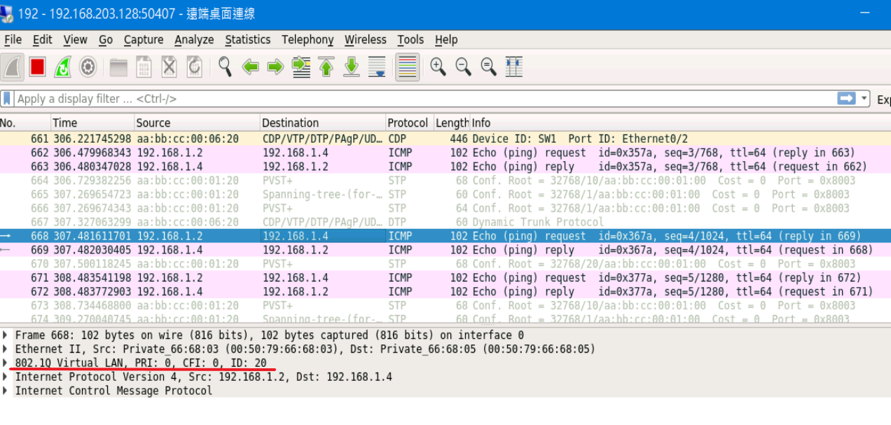


## 實驗四
> 更改預設VLAN，預設VLAN為vlan 1

### 實驗環境

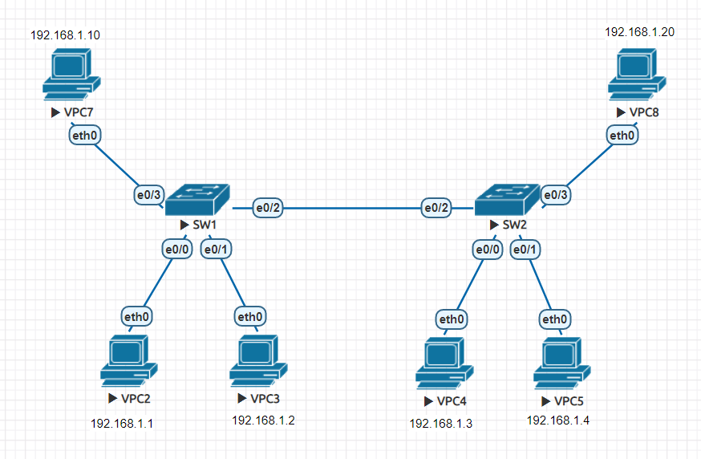

### 加入VPC7和VPC8並設定IP與其可互ping

* VPC8(192.168.1.20) ping VPC7(192.168.1.10)

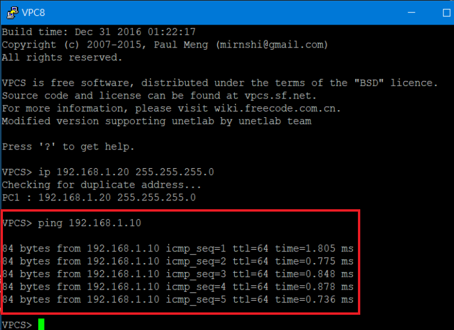

### 查看native vlan
```sh
show int trunk
```
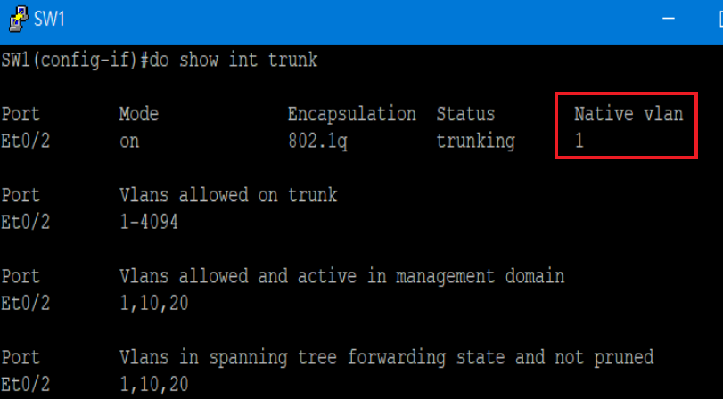

### 設定native VLAN
> 兩台switch都須在所相連的介面進行設定，在此設定為vlan 10
```sh
switchport trunk vlan 10
```
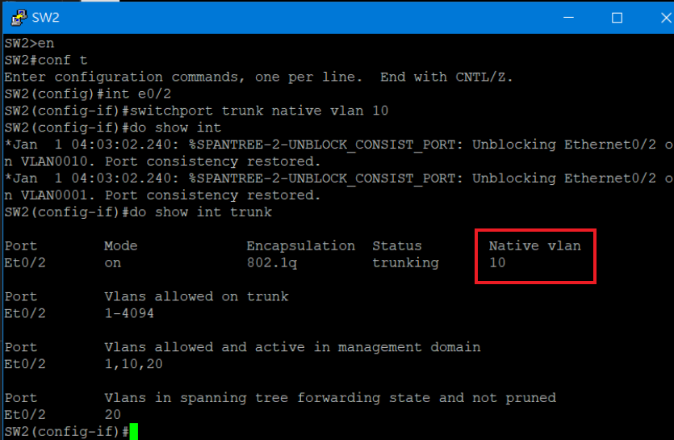
### 測試
> 與native vlan所處相同VLAN，不會打上tag

* VPC2(192.168.1.1) ping VPC4(192.168.1.3)(vlan 10)

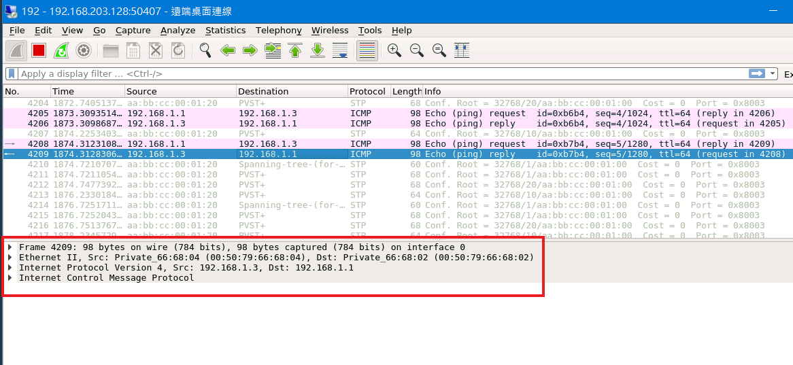

* VPC7(192.168.1.10) ping VPC8(192.168.1.20)(vlan 1)

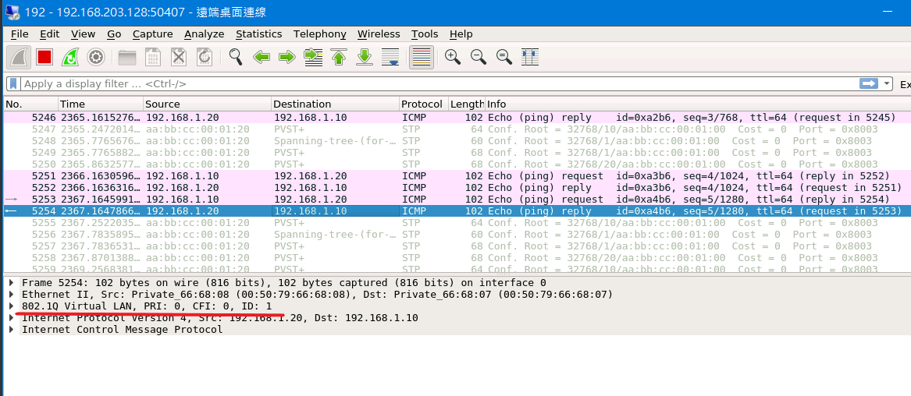

---

## VLAN Trunking Protocol (VTP)
> 為Cisco專利，主要用於VLAN管理。當擁有多台機器需要設定VLAN時，只要有一台設定完成，其他台機器就會自動設定完成。

### VTP mode

* server:能創建、刪除和修改VLAN
* client:不能創建、刪除和修改VLAN，但能學習轉發
* transparenet:能創建、刪除和修改VLAN，但不能學習轉發

### 實驗環境
> vtp操作必須擁有相同的Domain和password

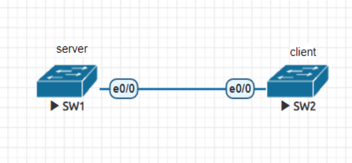

### server 設定
> vtp 預設模式為server

* 設定Domain與password
```sh
SW1(config)#vtp domain mynet
Changing VTP domain name from NULL to mynet
SW1(config)#
*Jan  1 07:02:50.243: %SW_VLAN-6-VTP_DOMAIN_NAME_CHG: VTP domain name changed to mynet.
SW1(config)#vtp password cisco
Setting device VTP password to cisco
```

* 查看vtp狀態與password

```sh
SW1(config)#do show vtp status
VTP Version capable             : 1 to 3
VTP version running             : 1
VTP Domain Name                 : mynet
VTP Pruning Mode                : Disabled
VTP Traps Generation            : Disabled
Device ID                       : aabb.cc80.0100
Configuration last modified by 0.0.0.0 at 0-0-00 00:00:00
Local updater ID is 0.0.0.0 (no valid interface found)

Feature VLAN:
--------------
VTP Operating Mode                : Server
Maximum VLANs supported locally   : 1005
Number of existing VLANs          : 5
Configuration Revision            : 0
MD5 digest                        : 0x4B 0x52 0xA7 0x31 0x24 0x36 0x70 0xC3
                                    0x55 0x0A 0x1F 0xF2 0xF7 0xE6 0x57 0x21
SW1(config)#do show vtp password
VTP Password: cisco
```
### client 設定

* 變換vtp mode

```sh
SW2(config)#vtp mode client
Setting device to VTP Client mode for VLANS.
```

* 設定Domain與password

```sh
SW2(config)#vtp domain mynet
Changing VTP domain name from NULL to mynet
SW2(config)#
*Jan  1 07:06:41.171: %SW_VLAN-6-VTP_DOMAIN_NAME_CHG: VTP domain name changed to mynet.
SW2(config)#vtp password cisco
Setting device VTP password to cisco
```

* 查看vtp狀態與password

```sh
SW2(config)#do show vtp status
VTP Version capable             : 1 to 3
VTP version running             : 1
VTP Domain Name                 : mynet
VTP Pruning Mode                : Disabled
VTP Traps Generation            : Disabled
Device ID                       : aabb.cc80.0200
Configuration last modified by 0.0.0.0 at 0-0-00 00:00:00

Feature VLAN:
--------------
VTP Operating Mode                : Client
Maximum VLANs supported locally   : 1005
Number of existing VLANs          : 5
Configuration Revision            : 0
MD5 digest                        : 0x4B 0x52 0xA7 0x31 0x24 0x36 0x70 0xC3
                                    0x55 0x0A 0x1F 0xF2 0xF7 0xE6 0x57 0x21
SW2(config)#do show vtp password
VTP Password: cisco
```
### 建立VLAN
```sh
SW1(config-vlan)#vlan 10-15,1006
SW1(config-vlan)#do show vlan brief

VLAN Name                             Status    Ports
---- -------------------------------- --------- -------------------------------
1    default                          active    Et0/0, Et0/1, Et0/2, Et0/3
10   VLAN0010                         active
11   VLAN0011                         active
12   VLAN0012                         active
13   VLAN0013                         active
14   VLAN0014                         active
15   VLAN0015                         active
1002 fddi-default                     act/unsup
1003 token-ring-default               act/unsup
1004 fddinet-default                  act/unsup
1005 trnet-default                    act/unsup
1006 VLAN1006                         active
```
### 進行trunk連線
>兩台switch都要進行設定。未進行連線之前，是無法讓client端學習server端的VLAN設定

```sh
SW1(config-vlan)#int e0/0
SW1(config-if)#switchport trunk encapsulation dot1q
SW1(config-if)#switchport mode trunk
```
### 測試
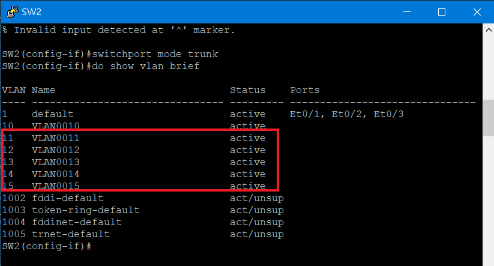

### transparent 操作

* 實驗環境

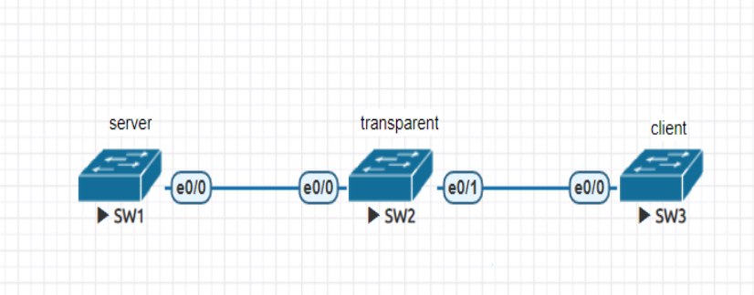

* 變換vtp mode
> 將SW2變換成transparent

```sh
SW2(config)#vtp mode transparent
SW2(config)#do show vtp status
VTP Version capable             : 1 to 3
VTP version running             : 1
VTP Domain Name                 : mynet
VTP Pruning Mode                : Disabled
VTP Traps Generation            : Disabled
Device ID                       : aabb.cc80.0200
Configuration last modified by 0.0.0.0 at 1-1-18 07:08:22

Feature VLAN:
--------------
VTP Operating Mode                : Transparent
Maximum VLANs supported locally   : 1005
Number of existing VLANs          : 15
Configuration Revision            : 0
MD5 digest                        : 0x3D 0xB9 0x11 0x1F 0x4C 0x71 0xDF 0x9B
                                    0x8D 0x18 0x54 0x2F 0x68 0x43 0x70 0xFB
```

* 設定Domain與password
> 在SW3進行相同設定

```sh
SW3(config)#vtp domain mynet
Changing VTP domain name from NULL to mynet
SW3(config)#vtp password cisco
Setting device VTP password to cisco
```
* 建立trunk連線
> 在SW2的e0/1與SW3的e0/0介面進行設定
```sh
SW3(config)#int e0/0
SW3(config-if)#switchport trunk encapsulation dot1q
SW3(config-if)#switchport mode trunk
```
* 測試

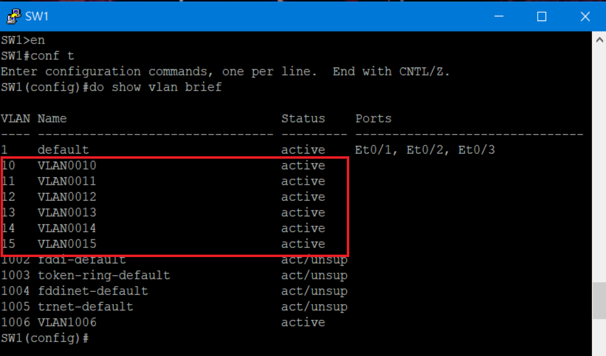

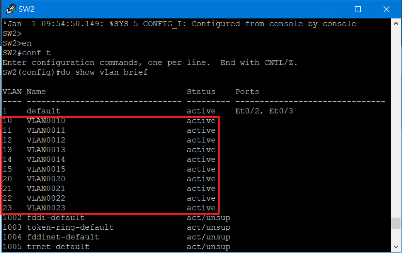

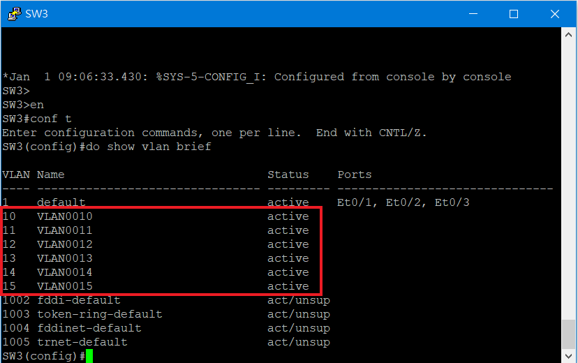

---
### 參考資料
* [隔离广播域的 VLAN 来了 - 以终为始 - 博客园](https://www.cnblogs.com/michael9/p/13360084.html)
* [VLAN Trunking Protocol (VTP) 虛擬區域網絡中繼協定](https://www.jannet.hk/zh-Hant/post/vlan-trunking-protocol-vtp/)