# 單臂路由
>一定要藉由第三層的設備，才能實現

## 使用router實作

### 實驗環境

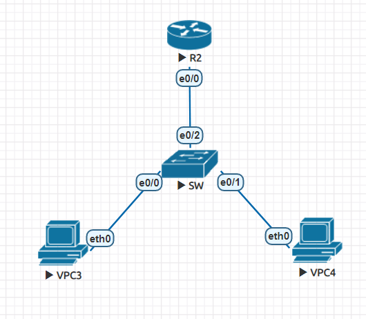

|機器名稱(介面)|IP|vlan|Gateway|
|:-----:|:-----:|:-----:|:-----:|
|VPC3(eth0)|192.168.10.1|vlan 10|192.168.10.254|
|VPC4(eth0)|192.168.20.1|vlan 20|192.168.20.254|
|R2(e0/0.10)|192.168.10.254|vlan 10|X|
|R2(e0/0.20)|192.168.20.254|vlan 20|X|

### 實驗操作

#### 設定VPC的IP與Gateway
> 根據上方表格進行設定

* VPC3

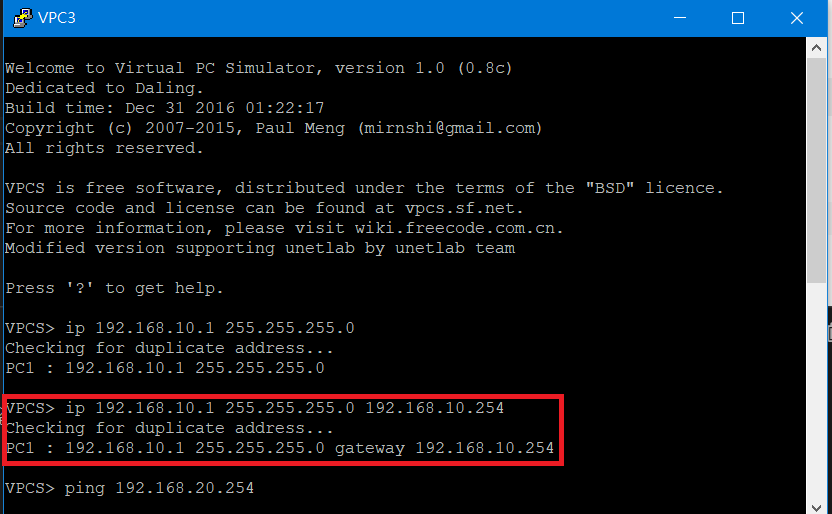

* VPC4

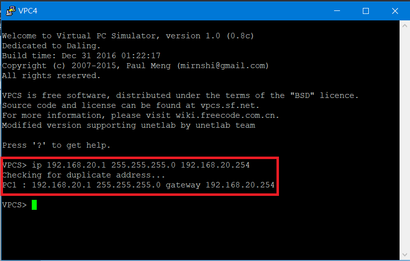

#### 建立vlan

```sh
Switch(config)#vlan 10
Switch(config-vlan)#exit
Switch(config)#vlan 20
Switch(config-vlan)#do show vlan brief

VLAN Name                             Status    Ports
---- -------------------------------- --------- -------------------------------
1    default                          active    Et0/3
10   VLAN0010                         active    Et0/0
20   VLAN0020                         active    Et0/1
1002 fddi-default                     act/unsup
1003 token-ring-default               act/unsup
1004 fddinet-default                  act/unsup
1005 trnet-default                    act/unsup
Switch(config-vlan)#

```
### switch設定

#### 設定switchport

* access mode 
> 在e0/0和e0/1上進行設定

```sh
Switch(config)#int e0/0         # 設定e0/0屬於vlan 10
Switch(config-if)#switchport mode access
Switch(config-if)#switch access vlan 10
Switch(config-if)#int e0/1      # 設定e0/1屬於vlan 20
Switch(config-if)#switchport mode access
Switch(config-if)#switchport access vlan 20
```

* trunk mode
> 在e0/2進行設定

```sh
Switch(config-if)#int e0/2
Switch(config-if)#switchport trunk encapsulation dot1q
Switch(config-if)#switchport mode trunk
```

### R2設定

#### 設定IP

* 設定e0/0介面不要關閉 
```sh
Router(config)#int e0/0
Router(config-if)#no sh
```

* 進入e0/0.10和e0/0.20進行IP設定
```sh 
Router(config-if)#int e0/0.10
Router(config-subif)#encapsulation dot1Q 10
Router(config-subif)#ip addr 192.168.10.254 255.255.255.0
Router(config-subif)#int e0/0.20
Router(config-subif)#encapsulation dot1Q 20
Router(config-subif)#ip addr 192.168.20.254 255.255.255.0
```

### 測試

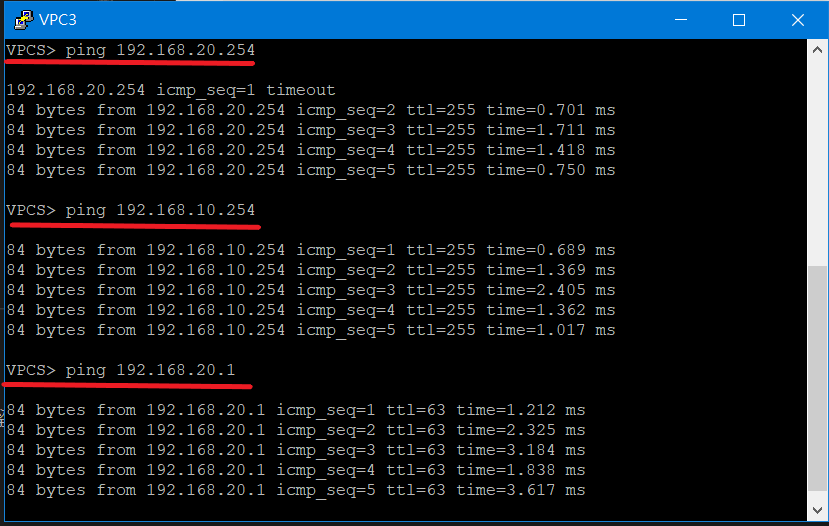

---

## 使用Layer 3 -switch實作

### 實驗環境

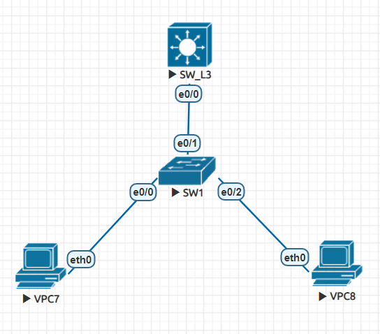

|機器名稱(介面)|IP|vlan|Gateway|
|:-----:|:-----:|:-----:|:-----:|
|VPC3(eth0)|192.168.10.1|vlan 10|192.168.10.254|
|VPC4(eth0)|192.168.20.1|vlan 20|192.168.20.254|
|SW_L3(e0/0)|192.168.10.254|vlan 10|X|
|SW_L3(e0/0)|192.168.20.254|vlan 20|X|

### VPC設定
> VPC設定與先前相同

* VPC7

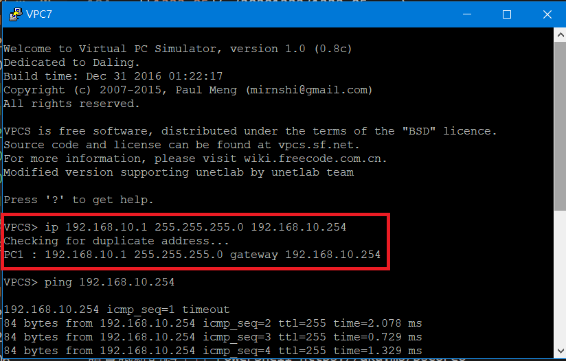

* VPC8


### SW1設定

#### 設定switchport

```sh
SW1(config)#int e0/0
SW1(config-if)#switchport mode access
SW1(config-if)#switchport access vlan 10
SW1(config-if)#int e0/2
SW1(config-if)#switchport mode access
SW1(config-if)#switchport access vlan 20
SW1(config-if)#int e0/1
SW1(config-if)#switchport trunk encapsulation dot1q
SW1(config-if)#switchport mode trunk
```

#### 設定vtp(client)

```sh
SW1(config-if)#vtp mode client
Device mode already VTP Client for VLANS.
SW1(config)#vtp domain ccna
Domain name already set to ccna.
SW1(config)#vtp password cisco
Password already set to cisco
```

### SW_L3 設定

#### 設定switchport

```sh
SW_L3(config-if)#int e0/0
SW_L3(config-if)#switchport trunk encapsulation dot1q
SW_L3(config-if)#switchport mode trunk
```

#### 設置vtp(server)

```sh
SW_L3(config)#vtp mode server
Device mode already VTP Server for VLANS.
SW_L3(config)#vtp domain ccna
Domain name already set to ccna.
SW_L3(config-if)#vtp password cisco
Password already set to cisco
```
#### 開啟路由功能

> 讓交換機擁有第三層的功能

```sh
SW_L3(config)#ip routing
```

#### 設定IP

```sh
SW_L3(config)#int vlan 10
SW_L3(config-if)#ip addr 192.168.10.254 255.255.255.0
SW_L3(config-if)#no sh
SW_L3(config-if)#int vlan 20
SW_L3(config-if)#ip addr 192.168.20.254 255.255.255.0
SW_L3(config-if)#no sh
```

#### 查看IP設定

```sh
SW_L3(config)#do show ip int brief
Interface              IP-Address      OK? Method Status                Protocol
Ethernet0/0            unassigned      YES unset  up                    up
Ethernet0/1            unassigned      YES unset  up                    up
Ethernet0/2            unassigned      YES unset  up                    up
Ethernet0/3            unassigned      YES unset  up                    up
Vlan10                 192.168.10.254  YES manual up                    up
Vlan20                 192.168.20.254  YES manual up                    up
```

### 測試

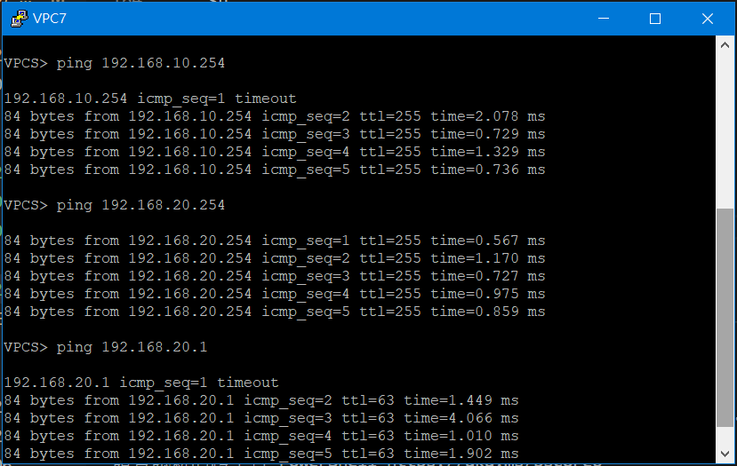

--- 

## 練習

### 實驗環境

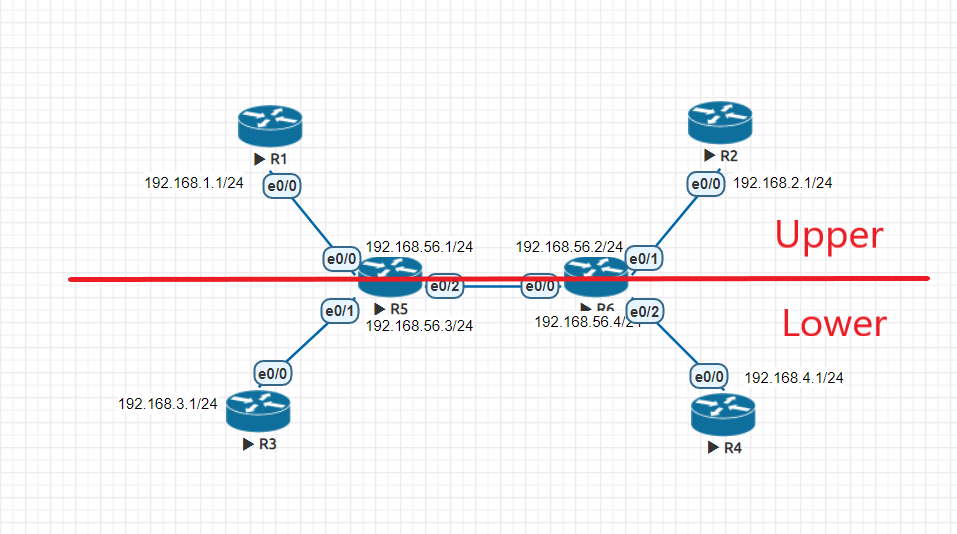

|機器(介面)|IP|VRF|
|:---:|:---:|:---:|
|R1(e0/0)|192.168.1.1|Upper|
|R2(e0/0)|192.168.2.1|Upper|
|R3(e0/0)|192.168.3.1|Lower|
|R4(e0/0)|192.168.4.1|Lower|
|R5(e0/0)|192.168.1.2|Upper|
|R5(e0/1)|192.168.3.2|Lower|
|R5(e0/2.10)|192.168.56.1|Upper|
|R5(e0/2.20)|192.168.56.3|Lower|
|R6(e0/0.10)|192.168.56.2|Upper|
|R6(e0/0.20)|192.168.56.4|Lower|
|R6(e0/1)|192.168.2.2|Upper|
|R6(e0/2)|192.168.4.2|Lower|

### R1-R4 設定

#### IP設定

* R1

```sh
R1(config)#int e0/0
R1(config-if)#ip addr 192.168.1.1 255.255.255.0
R1(config-if)#no sh
```

* R2

```sh
R2(config)#int e0/0
R2(config-if)#ip addr 192.168.2.1 255.255.255.0
R2(config-if)#no sh
```

* R3

```sh
R3(config)#int e0/0
R3(config-if)#ip addr 192.168.3.1 255.255.255.0
R3(config-if)#no sh
```

* R4

```sh
R4(config)#int e0/0
R4(config-if)#ip addr 192.168.4.1 255.255.255.0
R4(config-if)#no sh
```
#### 設定動態路由
> 使用 **ospf**做動態路由設定

* R1

```sh
R1(config)#router ospf 1
R1(config-router)#network 192.168.1.0 0.0.0.255 area 0
```

* R2

```sh
R2(config)#router ospf 1
R2(config-router)#network 192.168.2.0 0.0.0.255 area 0
```

* R3

```sh
R3(config)#router ospf 1
R3(config-router)#network 192.168.3.0 0.0.0.255 area 0
```

* R4 

```sh
R4(config)#int e0/0
R4(config-if)#ip addr 192.168.4.1 255.255.255.0
R4(config-if)#no sh
```

### R5 設定

#### 設定vrf&IP

```sh
R5(config)#ip vrf Upper
R5(config-vrf)#exit
R5(config)#ip vrf Lower
R5(config-vrf)#exit
R5(config)#int e0/0
R5(config-if)#ip vrf forwarding Upper
R5(config-if)#ip addr 192.168.1.2 255.255.255.0
R5(config-if)#no sh
R5(config-if)#int e0/1
R5(config-if)#ip vrf forwarding Lower
R5(config-if)#ip addr 192.168.3.2 255.255.255.0
R5(config-if)#no sh
```

#### IP設定

```sh
R5(config-router)#int e0/2
R5(config-if)#no sh
R5(config-if)#int e0/2.10
R5(config-subif)#encapsulation dot1Q 10
R5(config-subif)#ip vrf for Upper
R5(config-subif)#ip addr 192.168.56.1 255.255.255.0
R5(config-subif)#int e0/2.20
R5(config-subif)#encapsulation dot1Q 20
R5(config-subif)#ip vrf for Lower
R5(config-subif)#ip addr 192.168.56.3 255.255.255.0
```

#### 查看IP狀態

```sh
R5(config-if)#do show ip int brief
Interface                  IP-Address      OK? Method Status                Protocol
Ethernet0/0                192.168.1.2     YES manual up                    up  
Ethernet0/1                192.168.3.2     YES manual up                    up  
Ethernet0/2                unassigned      YES unset  up                    up  
Ethernet0/2.10             192.168.56.1    YES manual up                    up  
Ethernet0/2.20             192.168.56.3    YES manual up                    up  
Ethernet0/3                unassigned      YES unset  administratively down down
```

#### 設定動態路由

```sh
R5(config)#router ospf 1 vrf Upper
R5(config-router)#network 192.168.1.0 0.0.0.255 area 0
R5(config-router)#network 192.168.56.0 0.0.0.255 area 0
R5(config-router)#router ospf 2 vrf Lower
R5(config-router)#network 192.168.3.0 0.0.0.255 area 0
R5(config-router)#network 192.168.56.0 0.0.0.255 area 0
```

#### 查看路由表

* Upper

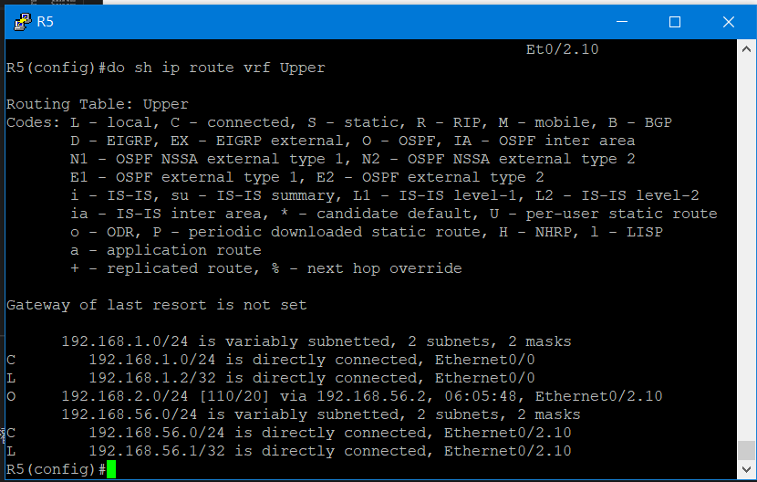

* Lower

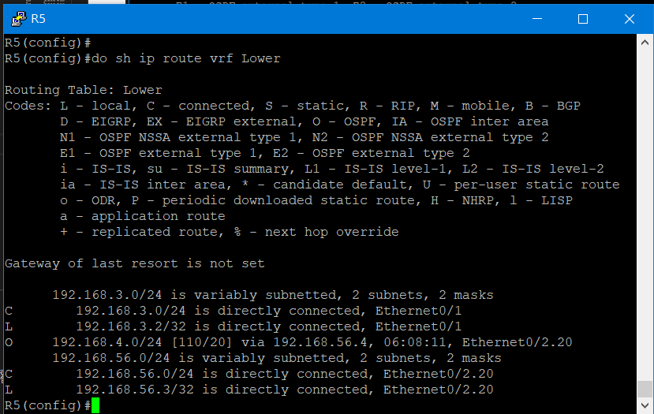

### R6設定

#### 設定vrf&IP

```sh
R6(config)#ip vrf Upper
R6(config-vrf)#exit
R6(config)#ip vrf Lower
R6(config-vrf)#exit
R6(config-if)#int e0/1
R6(config-if)#ip vrf forwarding Upper
R6(config-if)#ip addr 192.168.2.2 255.255.255.0
R6(config-if)#no sh
R6(config-if)#int e0/2
R6(config-if)#ip vrf forwarding Lower
R6(config-if)#ip addr 192.168.4.2 255.255.255.0
R6(config-if)#no sh
```

#### IP設定

```sh
R6(config)#int e0/0
R6(config-if)#no sh
R6(config-if)#int e0/0.10
R6(config-subif)#encapsulation dot1Q 10
R6(config-subif)#ip vrf for Upper
R6(config-subif)#ip addr 192.168.56.2 255.255.255.0
R6(config-subif)#int e0/0.20
R6(config-subif)#ip vrf for Lower
R6(config-subif)#encapsulation dot1Q 20
R6(config-subif)#ip addr 192.168.56.4 255.255.255.0
```

#### 查看IP狀態

```sh
R6(config-if)#do sh ip int brief
Interface                  IP-Address      OK? Method Status                Protocol
Ethernet0/0                unassigned      YES unset  up                    up  
Ethernet0/0.10             192.168.56.2    YES manual up                    up  
Ethernet0/0.20             192.168.56.4    YES manual up                    up  
Ethernet0/1                192.168.2.2     YES manual up                    up  
Ethernet0/2                192.168.4.2     YES manual up                    up  
Ethernet0/3                unassigned      YES unset  administratively down down
```

#### 設定動態路由

```sh
R6(config-subif)#router ospf 1 vrf Upper
R6(config-router)#network 192.168.2.0 0.0.0.255 area 0
R6(config-router)#network 192.168.56.0 0.0.0.255 area 0
R6(config-router)#router ospf 2 vrf Lower
R6(config-router)#network 192.168.4.0 0.0.0.255 area 0
R6(config-router)#network 192.168.56.0 0.0.0.255 area 0
```

#### 查看路由表

* Upper

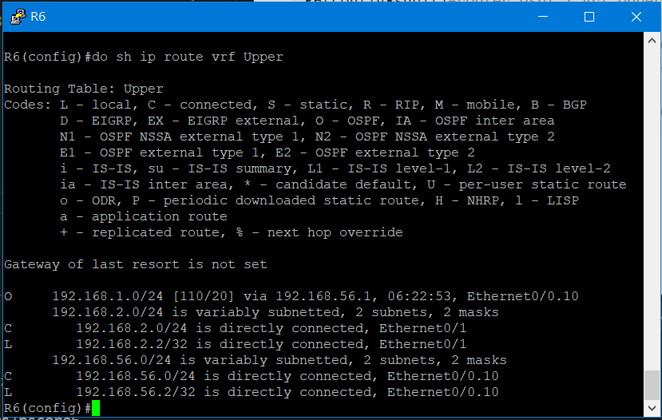

* Lower

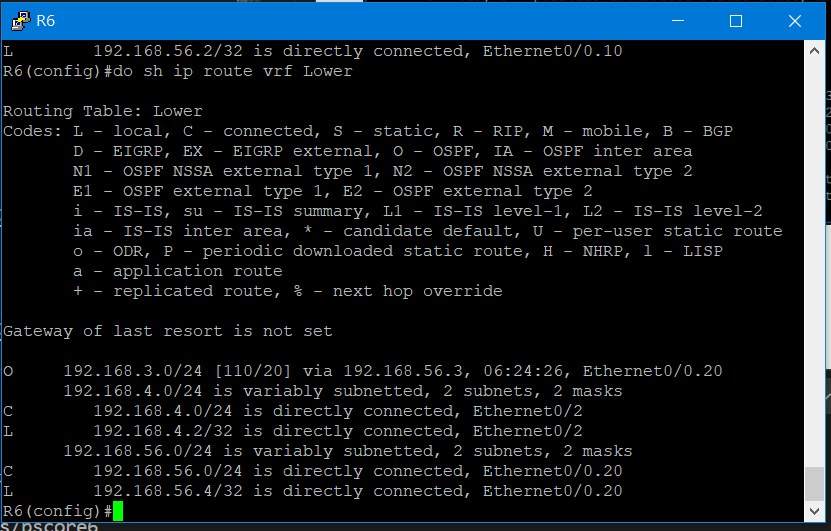

### 測試

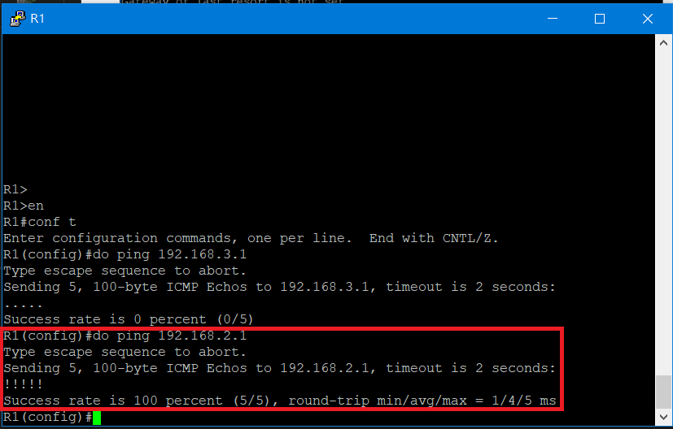

---
### 參考資料
* [同學的筆記](https://github.com/koozu/Note/blob/master/Cisco/20201223.md)
