## Spanning Tree Protocol(stp)

### Forwarding and Address Learning Algorithm

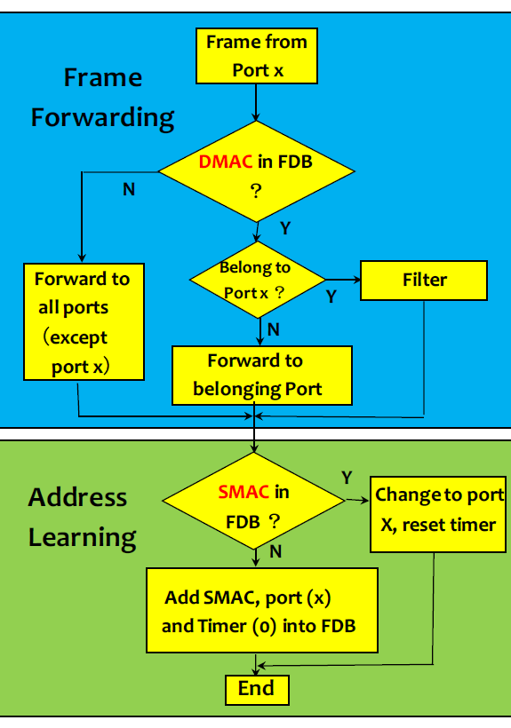

### Spanning Tree Algorithm

1. 找到 Root Bridge
    * priority + MAC address 最小的為Root Bridge
    * priority = 32768(為cisco預設值) + VLAN ID
2. 找到 Root Port
    * 所有Bridge到Root Bridge花費最少成本的port
3. 找到 Designated Port
    * 所有VLAN到Root Bridge花費最少成本的port
    * 其餘為Non-Designated Port

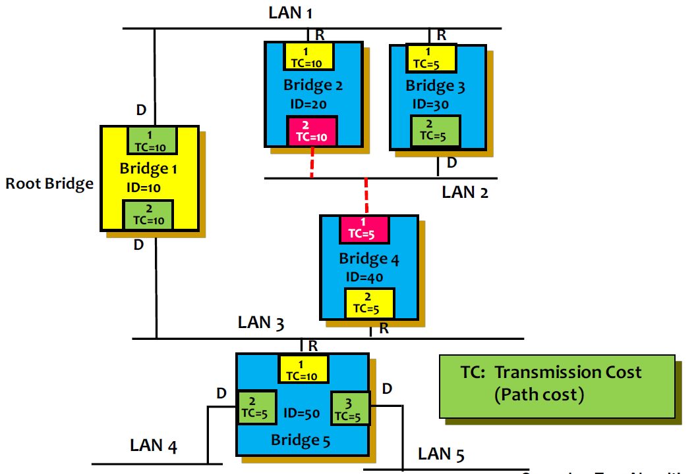

### 實驗環境

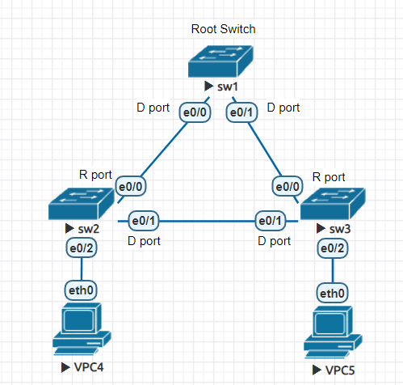

### 顯示
* sw1

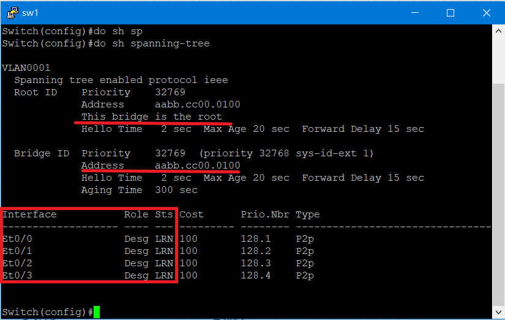

* sw2

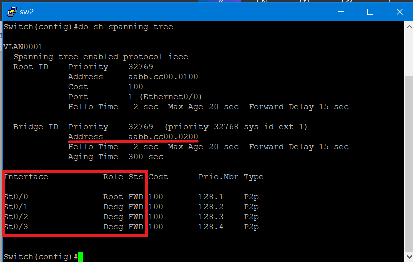

* sw3

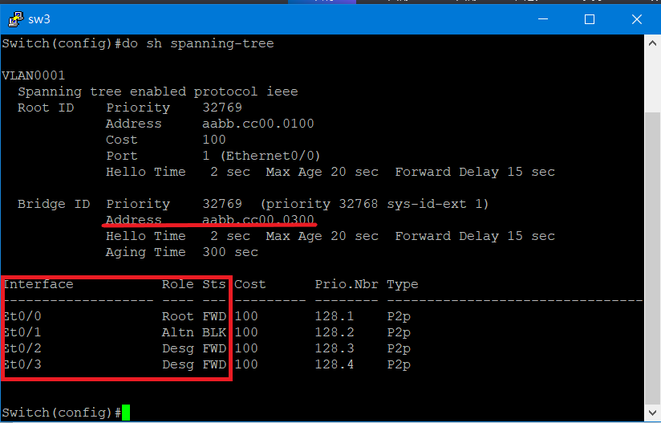

### 測試

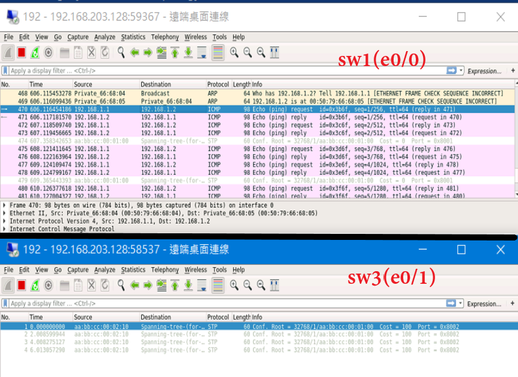

## Etherchannel — Page Aggregation Protocol(PAgP)
> PAgP為cisco專屬

### 實驗環境
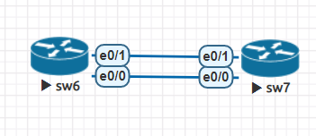

### 實驗設定
> 在sw6和sw7上都要設定

```sh
Switch(config)#int range e0/0-1
Switch(config-if-range)#no sh
Switch(config-if-range)#channel-group 1 mode on
Creating a port-channel interface Port-channel 1
```

## Authentication Authorization Accounting (AAA)
> 利用**tacacs+ server**實現

### 實驗環境

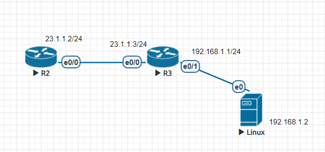

### 安裝tacacs+ server
> 將linux連接net進行設定

* 下載檔案並解壓縮
> 以檔案進行安裝

```sh
wget ftp://ftp.shrubbery.net/pub/tac_plus/tacacs-F4.0.4.28.tar.gz 
tar -zxvf tacacs-F4.0.4.28.tar.gz 
```

* 安裝套件
```sh
apt-get install libwrap0-dev
apt-get install bison
```

* 重新啟動並重新設定IP

* 編譯&安裝

```sh
./configure
make install
```
* 添加 **/usr/lib**到/etc/ld.so.conf
> **/etc/ld.so.conf** 紀錄編譯時所需調動態資料庫的路徑

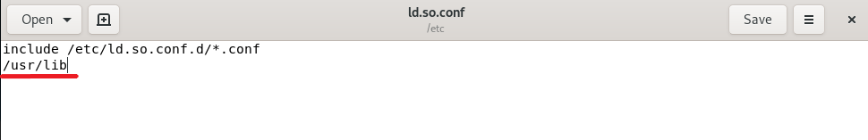 

* 準備設定檔
> 使用 **./tac_pwd**產生privilege層級的enable密碼

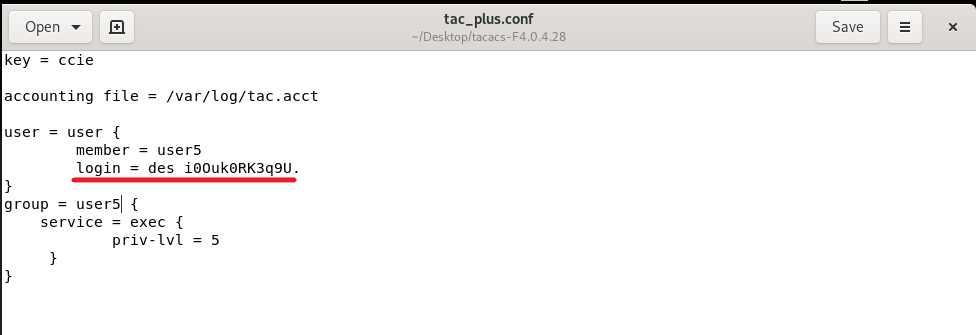

* 新增使用者

```sh
useradd user
passwd user
```
* 執行tacacs+ server

```sh
./tac_plus -C ./tac_plus.conf -E
```
### tacacs+ 設定
>在R3上設定

* 啟動AAA new-mode
```sh
R3(config)#aaa new-model   
``` 
* 設定 tacacs+

```sh           
R3(config)#tacacs server TACACS-SERVER
R3(config-server-tacacs)#address ipv4 192.168.1.2
R3(config-server-tacacs)#key ccie
```
* 設定 Authentication
```sh
R3(config)#aaa authentication login LIST_LOGIN group tacacs+ local
R3(config)#line vty 0 4
R3(config-line)#login authentication LIST_LOGIN
R3(config-line)#transport input telnet
```
### 測試

```sh
R2(config)#do telnet 23.1.1.3
Trying 23.1.1.3 ... Open


User Access Verification

Username: user
Password:

R3>exit

[Connection to 23.1.1.3 closed by foreign host]
```

### 參考資料
--- 
* [EtherChannel (PAgP and LACP) 以太通道](https://www.jannet.hk/zh-Hant/post/etherchannel-pagp-lacp/)
* [Authentication Authorization Accounting (AAA) 認證授權與計費](https://www.jannet.hk/zh-Hant/post/authentication-authorization-accounting-aaa/#network)
* [ubuntu tacacs+ 服務器安裝啓動 - 台部落](https://www.twblogs.net/a/5c220b1bbd9eee16b4a769ce)


