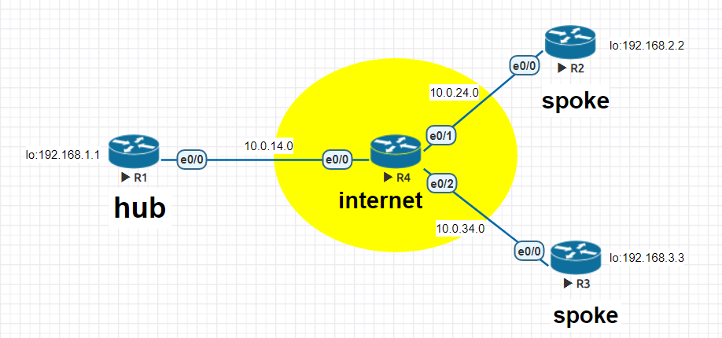
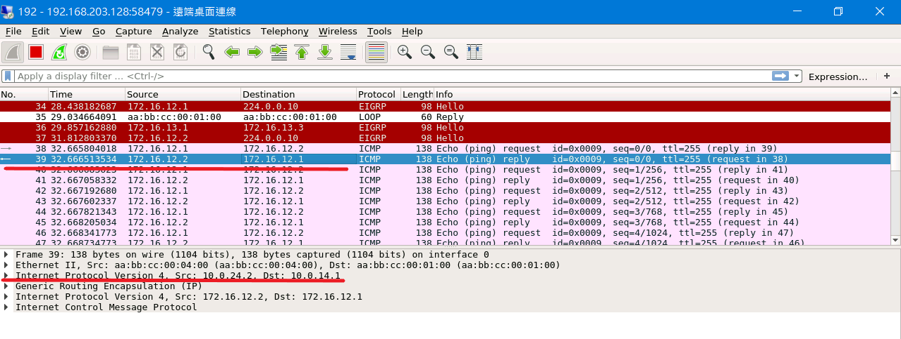
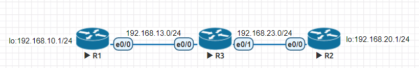
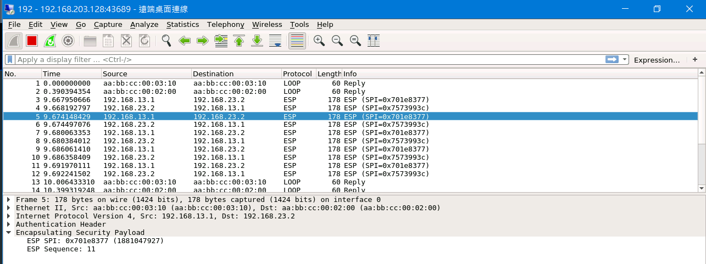

# VPN(Virtual Private Network)

## Generic Routing Encapsulation(GRE)

* 在原有封包上加上一層新的IP資訊

* 屬於點對點的連結，因為在傳輸過程資料沒有加密，所以較不安全

### Hub-to-Spoke Topolgy 實驗環境



* R1

|介面|IP|
|:-----:|:-----:|
|e0/0|10.0.14.1|
|lo|192.168.1.1|
|tun1|172.16.12.1|
|tun2|172.16.13.1|

* R2 

|介面|IP|
|:-----:|:-----:|
|e0/0|10.0.24.2|
|lo|192.168.2.2|
|tul1|172.16.12.2|

* R3

|介面|IP|
|:-----:|:-----:|
|e0/0|10.0.34.3|
|lo|192.168.3.3|
|tun2|172.16.13.3|


* R4

|介面|IP|
|:-----:|:-----:|
|e0/0|10.0.14.4|
|e0/1|10.0.24.4|
|e0/2|10.0.34.4|


### 建立 tunnel

* R1

```sh
int tunnel 12                       # 建立tunnel 12
ip addr 172.16.12.1 255.255.255.0   # 設置tunnel 12起點IP
tunnel source e0/0                  # 設置tunnel 12出口
tunnel destination 10.0.24.2        # 設置tunnel 12目的地IP

int tunnel 13                       # 建立tunnel 13
ip addr 172.16.13.1 255.255.255.0   # 設置tunnel 13起點IP
tunnel source e0/0                  # 設置tunnel 13出口
tunnel destination 10.0.34.3        # 設置tunnel 13目的地IP
```

* R2

```sh
int tunnel 12                       
ip addr 172.16.12.2 255.255.255.0   
tunnel source e0/0                  
tunnel destination 10.0.14.1        
```

* R3

```sh
int tunnel 13                       
ip addr 172.16.13.3 255.255.255.0   
tunnel source e0/0                  
tunnel destination 10.0.14.1        
```

### 設定路由
> 在此設定rip與eigrp作為路由

* R1

```sh
router rip
version 2
no auto-summary
network 10.0.14.0
router eigrp
network 192.168.1.0
network 172.16.12.0 0.0.0.255
network 172.16.13.0 0.0.0.255
```

* R2

```sh
router rip 
version 2
no auto-summary
network 10.0.24.0
router eigrp
network 192.168.2.0
network 172.16.12.0 0.0.0.255
```

* R3

```sh
router rip 
version 2
no auto-summary
network 10.0.34.0
router eigrp
network 192.168.3.0
network 172.16.13.0 0.0.0.255
```

* R4 

```sh
router rip
version 2
no auto-summary
network 10.0.14.0
network 10.0.24.0
network 10.0.34.0
```

### 測試
* R1(172.16.12.1) ping R2(172.16.12.2)



---

## Internet Protocol Security (IPsec)

* 屬於side to side連結

* IPSec利用IKE(Internet Key Exchange)進行連線

* IKE分成兩部分:
    * phase 1:用來傳送秘密金鑰以此來驗證身分
    * phase 2:用來真正傳輸資料

### 實驗環境



* R1 

```sh
R1(config)#int lo 0
R1(config-if)#ip addr 192.168.10.1 255.255.255.0
R1(config-if)#no sh
R1(config-if)#exit
R1(config)#int e0/0
R1(config-if)#ip addr 192.168.13.1 255.255.255.0
R1(config-if)#no sh
R1(config-if)#ip route 0.0.0.0 0.0.0.0 192.168.13.3
```

* R2

```sh
R2(config)#int lo 0
R2(config-if)#ip addr 192.168.20.1 255.255.255.0
R2(config-if)#no sh
R2(config)#int e0/0
R2(config-if)#ip addr 192.168.23.2 255.255.255.0
R2(config-if)#exit
R2(config)#ip route 0.0.0.0 0.0.0.0 192.168.23.3
```

* R3

```sh
R3(config-if)#int e0/0
R3(config-if)#ip addr 192.168.13.3 255.255.255.0
R3(config-if)#no sh
R3(config-if)#int e0/1
R3(config-if)#ip addr 192.168.23.3 255.255.255.0
R3(config-if)#no sh
```


### 設定interesting traffic
>在R1和R2上設定

* R1

```sh
R1(config)#ip access-list extended VPN-Traffic
R1(config-ext-nacl)#permit ip 192.168.10.0 0.0.0.255 192.168.20.0 0.0.0.255
```

* R2

```sh
R2(config)#ip access-list extended VPN-Traffic
R2(config-ext-nacl)#permit ip 192.168.20.0 0.0.0.255 192.168.10.0 0.0.0.255
```

### 設定IKE Phase1 參數
> 在R1和R2上設定

* R1 

```sh
R1(config-ext-nacl)#crypto isakmp policy 1
R1(config-isakmp)#encryption aes
R1(config-isakmp)#hash md5
R1(config-isakmp)#authentication pre-share
R1(config-isakmp)#group 2
R1(config-isakmp)#lifetime 30000
```
* R2

```sh
R2(config)#crypto isakmp policy 1
R2(config-isakmp)#encryption aes
R2(config-isakmp)#hash md5
R2(config-isakmp)#authentication pre-share
R2(config-isakmp)#group 2
R2(config-isakmp)#lifetime 30000
```

### 設定IKE Phase 2 參數
> option可以設定多個，但最多為4個

* R1

```sh
R1(config)#crypto ipsec transform-set TS esp-3des ah-sha-hmac
```

* R2

```sh
R2(config)#crypto ipsec transform-set TS esp-3des ah-sha-hmac
```

### 設定pre-share key

* R1

```sh
R1(config)#crypto isakmp key 6 ccie address 192.168.23.2
```

* R2

```sh
R2(config)#crypto isakmp key 6 ccie address 192.168.13.1
```

### 設定Crypto Map

* R1

```sh
R1(config)#crypto map CMAP 1 ipsec-isakmp
% NOTE: This new crypto map will remain disabled until a peer
        and a valid access list have been configured.
R1(config-crypto-map)#set peer 192.168.23.2
R1(config-crypto-map)#set transform-set TS
R1(config-crypto-map)#match address VPN-Traffic
R1(config-crypto-map)#exit
R1(config)#int e0/0
R1(config-if)#crypto map CMAP
```

* R2

```sh
R2(config)#crypto map CMAP 1 ipsec-isakmp
% NOTE: This new crypto map will remain disabled until a peer
        and a valid access list have been configured.
R2(config-crypto-map)#set peer 192.168.13.1
R2(config-crypto-map)#set transform-set TS
R2(config-crypto-map)#match address VPN-Traffic
R2(config-crypto-map)#exit
R2(config)#int e0/0
R2(config-if)#crypto map CMAP

```
### 結果

* R1(192.168.10.1) ping R2(192.168.20.1)



---

### 參考資料

* [Generic Routing Encapsulation (GRE) 通用路由封裝 — Jan Ho 的網路世界](https://www.jannet.hk/zh-Hant/post/generic-routing-encapsulation-gre/)

* [Internet Protocol Security (IPsec) 網際網路安全協定 — Jan Ho 的網路世界](https://www.jannet.hk/zh-Hant/post/internet-protocol-security-ipsec/)
