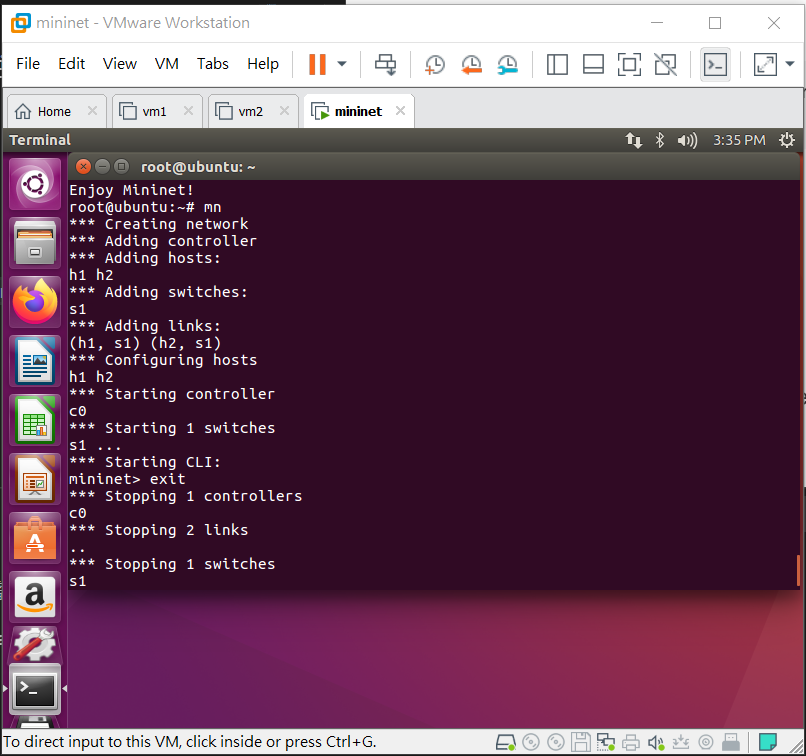
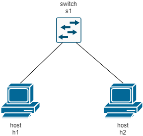
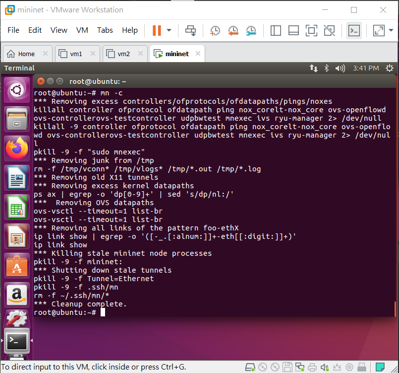
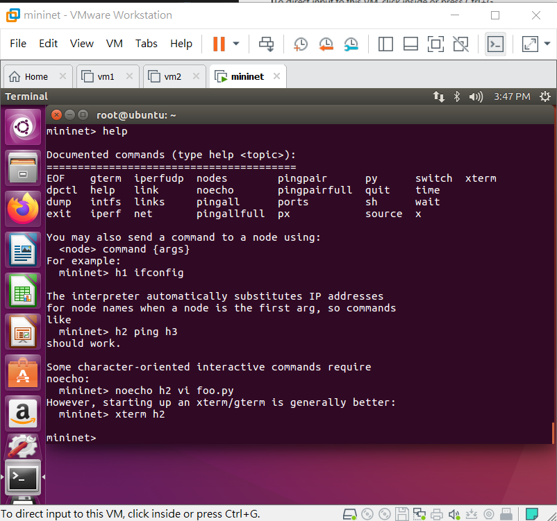
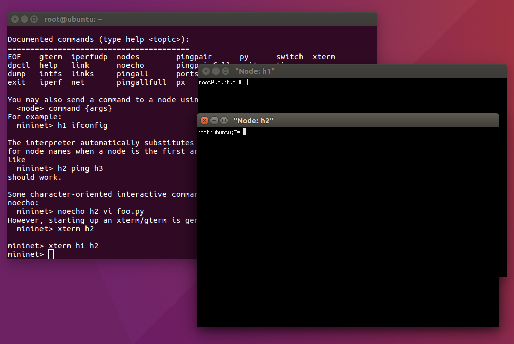
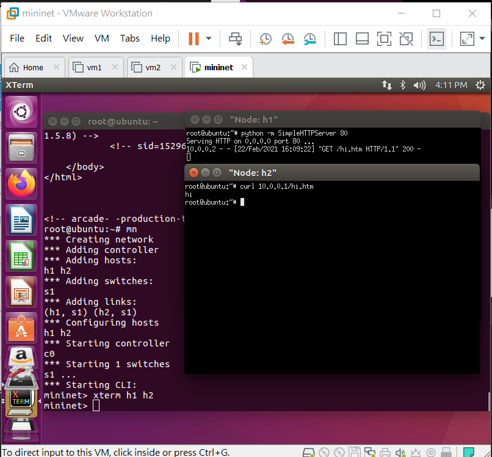

# Mininet安裝&基本指令

## Mininet 安裝

1. 下載 [Ubuntu 16.04](http://ftp.tku.edu.tw/index.php?dir=Linux%2FUbuntu%2Fubuntu-releases%2Fxenial%2F) 並進行安裝
   > 記憶體為2G， 處理器為2核心

2. 安裝mininet

```sh
git clone git://github.com/mininet/mininet
mininet/util/install.sh -a
```
* `-a`: 進行全部安裝套件

## Mininet 基本指令

* `mn` : 啟動Mininet
  


> 網路環境預設如下
> 

* `mn -c` : 清除未正常結束的Mininet環境



* `help` : 顯示可執行動作
  


* `xterm` : 開啟host終端機



* `python -m SimpleHTTPServer 80` : 啟動 www server



* `exit` : 離開Mininet

---
### 參考資料
* [Lab 1-mininet介紹、安裝與使用方法- SDN軟體定義網路](https://sites.google.com/site/sdnruantidingyiwanglu/vmware-xia-zai-yu-an-zhuang/mininet)


