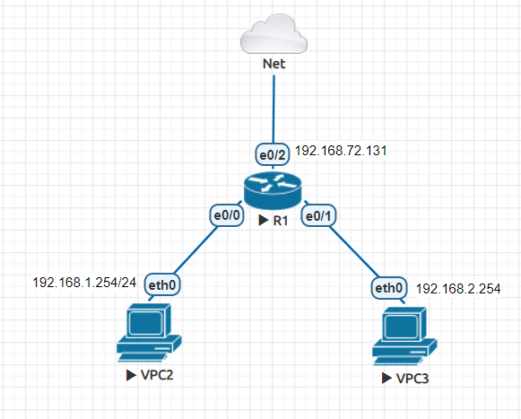
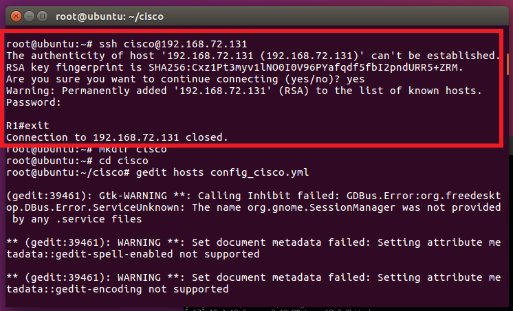
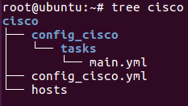
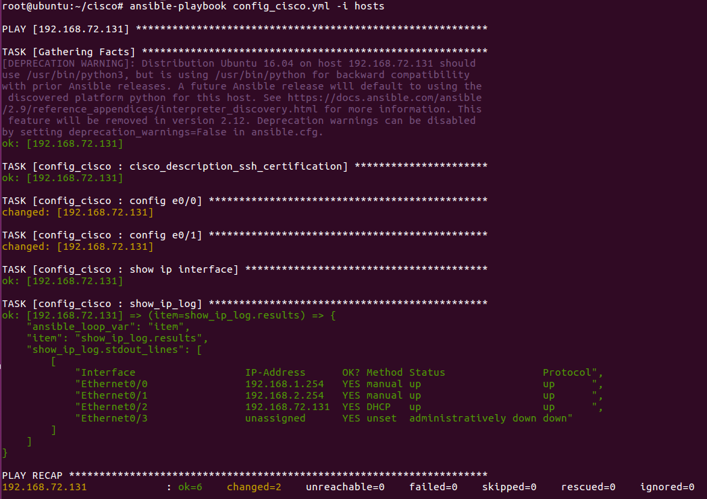
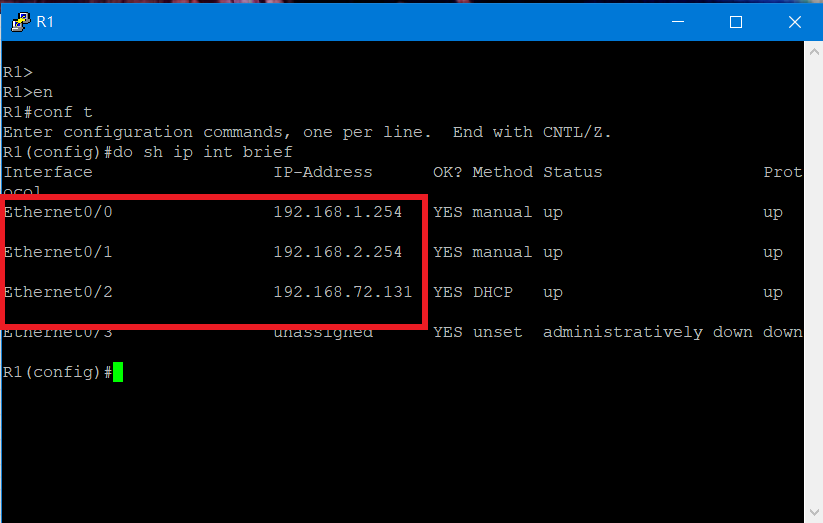
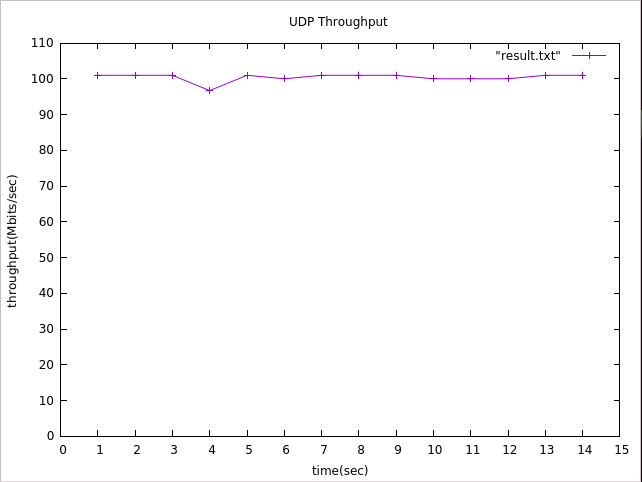

# 自動化佈署EVE環境 & Mininet 內部指令

## 自動化佈署EVE環境

### 實驗環境



### 設定ssh連線
> 在R1進行設定

```sh
username cisco privilege 15 password cisco
ip domain-name test.com
crypto key generate rsa
ip ssh version 2   
line vty 0 4    
login local         
transport input ssh 
```
### 自動取得IP

```sh
R1(config-line)#int e0/2
R1(config-if)#ip addr dhcp
R1(config-if)#no sh
*Dec 31 22:24:37.658: %DHCP-6-ADDRESS_ASSIGN: Interface Ethernet0/2 assigned DHCP address 192.168.72.131, mask 255.255.255.0, hostname R1

R1(config-if)#do show ip int brief
Interface                  IP-Address      OK? Method Status                Protocol
Ethernet0/0                unassigned      YES unset  administratively down down
Ethernet0/1                unassigned      YES unset  administratively down down
Ethernet0/2                192.168.72.131  YES DHCP   up                    up  
Ethernet0/3                unassigned      YES unset  administratively down down
```
> 測試


### Ubuntu安裝ansible

```sh
apt install software-properties-common
apt-add-repository --yes --update ppa:ansible/ansible
apt install ansible
```

### 撰寫playbook
> playbook 檔案架構


* main.yml

```sh
- name: cisco_description_ssh_certification
  set_fact:
    cisco_verification:
      host: "{{cisco_host_ip}}"
      username: "{{ssh_username}}"
      password: "{{ssh_password}}"
      authorize: "{{enable_open}}"
      auth_pass: "{{enable_password}}"

- name: config e0/0
  ios_config:
      provider: "{{cisco_verification}}"
      parents:  interface Ethernet 0/0     
      lines:
        - ip addr 192.168.1.254 255.255.255.0
        - no shut

- name: config e0/1
  ios_config:
      provider: "{{cisco_verification}}"
      parents:  interface Ethernet 0/1     
      lines:
        - ip addr 192.168.2.254 255.255.255.0
        - no shut

- name: show ip interface
  ios_command:
      provider: "{{cisco_verification}}"
      commands: show ip interface brief
  register: show_ip_log

- name: show_ip_log
  debug:
    var: show_ip_log.stdout_lines
  with_items: show_ip_log.results

```
* hosts

```sh
[cisco]
192.168.72.131 ansible_connection=local
```

* config_cisco.yml

```sh
- hosts: 192.168.72.131
  gather_facts: yes
  vars:
    - cisco_host_ip: 192.168.72.131
      ssh_username: cisco
      ssh_password: cisco
      enable_open: yes
      enable_password: cisco
  roles:
     - config_cisco
```

### 執行playbook

```sh
ansible-playbook config_cisco.yml -i hosts
```


### 測試結果



---

## Mininet 內部指令

* `net` : 查看目前網路連結
* `links` : 列出所有節點的連接狀態
* `pingall` : 對所有節點進行ping
* `iperf`: 測量網路效能
  * `-s` : 指定為server
  * `-c` : 指定為client
  * `-i` : 顯示報告間隔(以秒為單位)
  * `-u` : 指定使用udp協定(未寫為tcp)
  * `-p` : 指定udp port
  * `-n` : 設定測試時間
  * `-b` : 設置傳輸大小
  
 ### iperf作業 — 將Udp效能以折線圖表示
 >　使用**gnuplot**進行繪畫

 * 資料收集
> 在h1(client)進行收集
```sh
iperf -c 10.0.0.2  -u -t 15 -i 1 -b 100M  -p 5555 > udp5555
cat udp5555 | grep sec | tr "-" " " | awk '{print $4,$8}'| head -n 14 > result.txt
```
* 進行繪圖
```sh
root@ubuntu:~/cisco# gnuplot

	G N U P L O T
	Version 5.0 patchlevel 3    last modified 2016-02-21 

	Copyright (C) 1986-1993, 1998, 2004, 2007-2016
	Thomas Williams, Colin Kelley and many others

	gnuplot home:     http://www.gnuplot.info
	faq, bugs, etc:   type "help FAQ"
	immediate help:   type "help"  (plot window: hit 'h')

Terminal type set to 'qt'
gnuplot> plot "result.txt"          // 對"result.txt"進行繪圖
gnuplot> set yrange [0:110]         //設定y軸範圍
gnuplot> set ytics 0,10,110         //設定y軸刻度
gnuplot> replot                     //重新繪圖
gnuplot> set xrange [0:15]          //設定x軸範圍
gnuplot> set xtics 0,1,15           //設定x軸刻度
gnuplot> replot
gnuplot> plot "result.txt" with linespoints         //將點進行連線
gnuplot> set xlabel "time(sec)"     //設定x軸名稱
gnuplot> set ylabel "throughput(Mbits/sec)"     //設定y軸名稱
gnuplot> set title "UDP Throughput"     //設定此圖標題
gnuplot> replot
gnuplot> set terminal "gif"             //設定檔案匯出類型
Terminal type set to 'gif'
Options are 'nocrop enhanced size 640,480 font "/usr/share/fonts/truetype/liberation/LiberationSans-Regular.ttf,12" '
gnuplot> set output "result.gif"        //設定匯出檔名
gnuplot> replot
gnuplot> quit
```
* 結果



---
## 參考資料
* [Installing Ansible — Ansible Documentation](https://docs.ansible.com/ansible/latest/installation_guide/intro_installation.html)
* [Iperf使用說明|Martin Chang的部落格](https://m1016c.pixnet.net/blog/post/145780230)