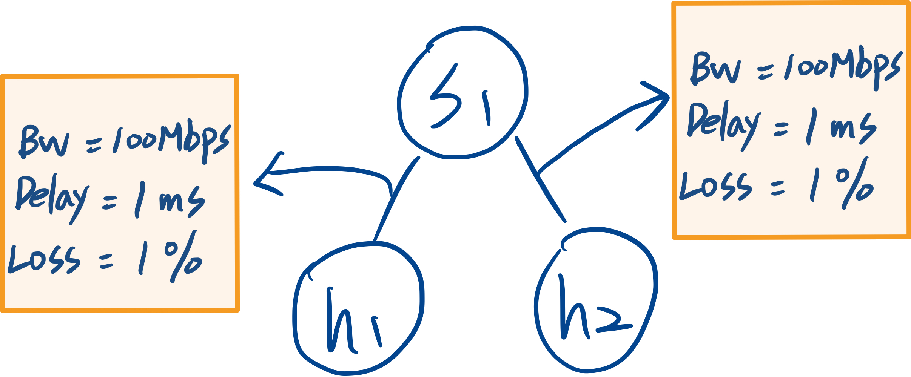
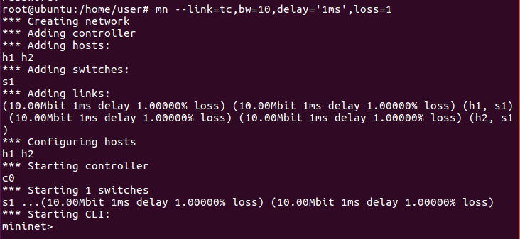
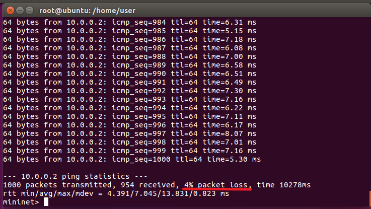
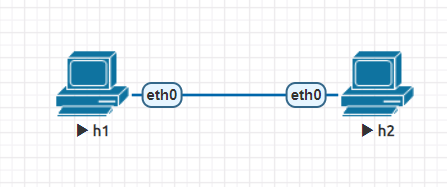
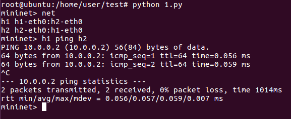
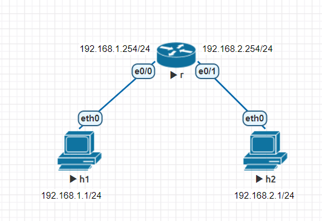
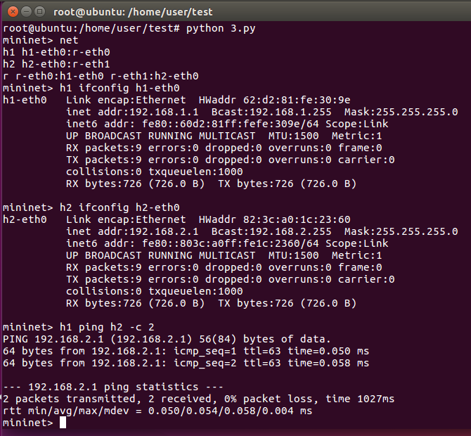
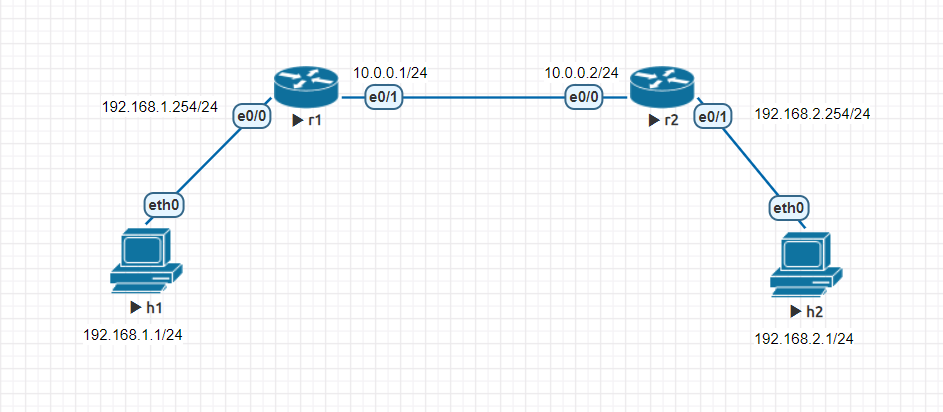
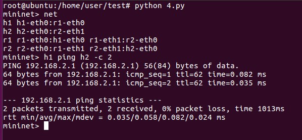

# 使用Mininet模擬網路環境

## 啟動Mininet並定義拓撲

### 環境設定
> 所有連線都會以以下參數進行設定

```sh
mn --link=tc,bw=10,delay='1ms',loss=1
```

* `link=tc`:以tc(traffic control)建立
  > 由**tc**達成以下參數
* `bw`:頻寬
* `delay`:延遲時間
* `loss`:封包遺失率

> 示意圖
> 

### 建立結果



### 補充

* 當h1 ping h2 1000次，封包遺失率為何不等於1%?



* 由於在這個環境設定中，封包傳送每經過一個節點都會遺失1%。當h1經過s1到達h2時，封包已經減少了2次，而ping是一個雙向動作，所以封包回到h1時，封包減少次數為4次。


* 最終總封包傳送率約為96%，這代表約為4%的封包遺失
---
## 使用Mininet架設虛擬網路環境
> 編寫程式碼進行架設

## 實驗一
> 為Mininet最基本的範例

### 實驗環境



### 腳本內容

```sh
#!/usr/bin/env python                       
# mininet是由python建構而成

from mininet.cli import CLI 
# CLI為"command line interface"

from mininet.net import 

from mininet.link import Link,TCLink
# Link沒有預設網路參數，而TCLink有預設參數

if '__main__' == __name__:

  #物件初始化
  net = Mininet(link=TCLink)

  # 建立節點
  h1 = net.addHost('h1')
  h2 = net.addHost('h2')
  
  # 連線建立
  Link(h1, h2)

  # 編譯物件
  net.build()

  CLI(net)
  net.stop()
```

### 實驗結果



## 實驗二

### 網路環境
> 在程式碼中設定IP




### 腳本內容

```sh
#!/usr/bin/env python
from mininet.cli import CLI
from mininet.net import Mininet
from mininet.link import Link,TCLink

if '__main__' == __name__:
  net = Mininet(link=TCLink)
  h1 = net.addHost('h1')
  h2 = net.addHost('h2')
  r = net.addHost('r')
  Link(h1, r)
  Link(h2, r)
  net.build()
  # 重設h1與h2的ip並增加內定路由
  h1.cmd("ifconfig h1-eth0 0")
  h1.cmd("ip addr add 192.168.1.1/24 brd + dev h1-eth0")
  h1.cmd("ip route add default via 192.168.1.254")
  h2.cmd("ifconfig h2-eth0 0")
  h2.cmd("ip addr add 192.168.2.1/24 brd + dev h2-eth0")
  h2.cmd("ip route add default via 192.168.2.254")
  # 重設r1的ip並開啟路由功能
  r.cmd("ifconfig r-eth0 0")
  r.cmd("ifconfig r-eth1 0")
  r.cmd("ip addr add 192.168.1.254/24 brd + dev r-eth0")
  r.cmd("ip addr add 192.168.2.254/24 brd + dev r-eth1")
  r.cmd("echo 1 > /proc/sys/net/ipv4/ip_forward")
  CLI(net)
  net.stop()
```

### 實驗結果




## 實驗三

### 實驗環境



### 腳本內容

```sh
#!/usr/bin/env python
from mininet.cli import CLI
from mininet.net import Mininet
from mininet.link import Link,TCLink

if '__main__' == __name__:
  net = Mininet(link=TCLink)
  h1 = net.addHost('h1')
  h2 = net.addHost('h2')
  r1 = net.addHost('r1')
  r2 = net.addHost('r2')
  Link(h1, r1)
  Link(r1, r2)
  Link(h2, r2)
  net.build()
  h1.cmd("ifconfig h1-eth0 0")
  h1.cmd("ip addr add 192.168.1.1/24 brd + dev h1-eth0")
  h1.cmd("ip route add default via 192.168.1.254")
  h2.cmd("ifconfig h2-eth0 0")
  h2.cmd("ip addr add 192.168.2.1/24 brd + dev h2-eth0")
  h2.cmd("ip route add default via 192.168.2.254")
  r1.cmd("ifconfig r1-eth0 0")
  r1.cmd("ifconfig r1-eth1 0")
  r1.cmd("ip addr add 192.168.1.254/24 brd + dev r1-eth0")
  r1.cmd("ip addr add 10.0.0.1/24 brd + dev r1-eth1")
  r1.cmd("ip route add default via 10.0.0.2")
  r1.cmd("echo 1 > /proc/sys/net/ipv4/ip_forward")
  r2.cmd("ifconfig r2-eth0 0")
  r2.cmd("ifconfig r2-eth1 0")
  r2.cmd("ip addr add 10.0.0.2/24 brd + dev r2-eth0")
  r2.cmd("ip addr add 192.168.2.254/24 brd + dev r2-eth1")
  r2.cmd("ip route add default via 10.0.0.1")
  r2.cmd("echo 1 > /proc/sys/net/ipv4/ip_forward")
  CLI(net)
  net.stop()
```

### 實驗結果



---
### 參考資料
* [Mininet学习指南](https://www.sdnlab.com/11495.html)


