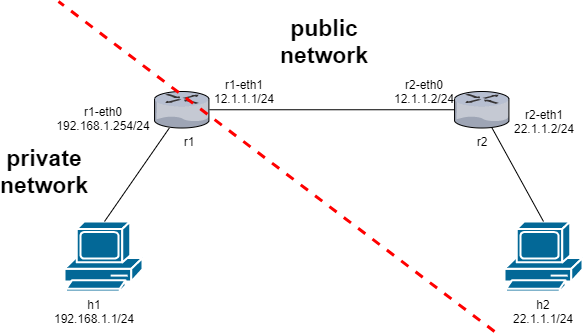
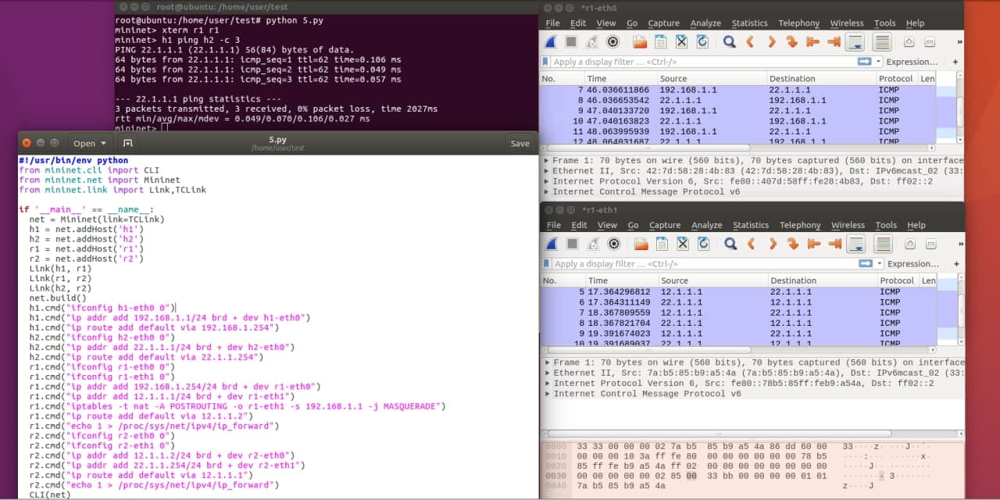
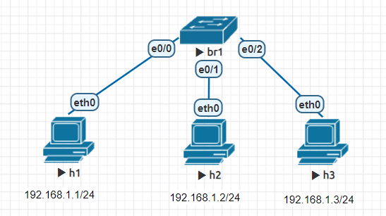
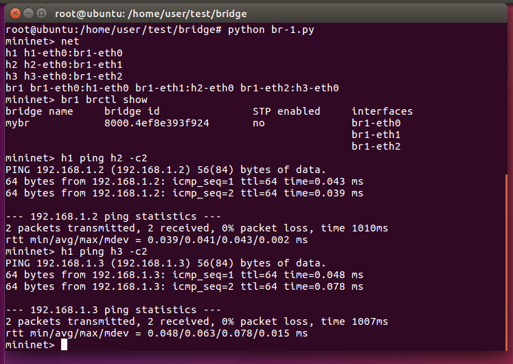
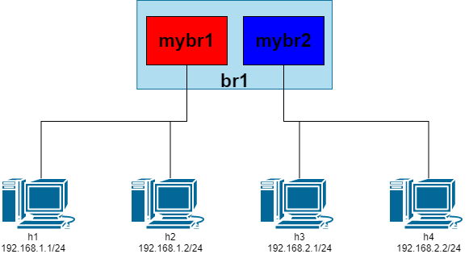
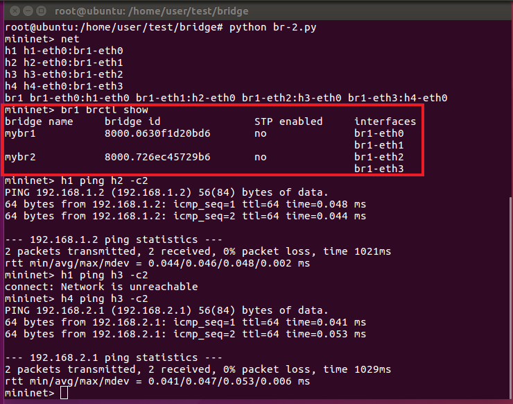
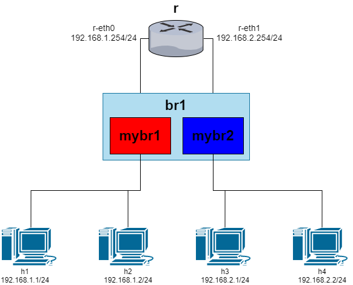
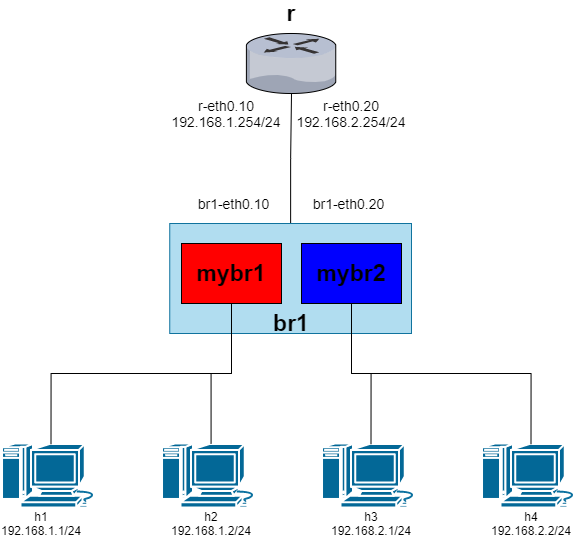
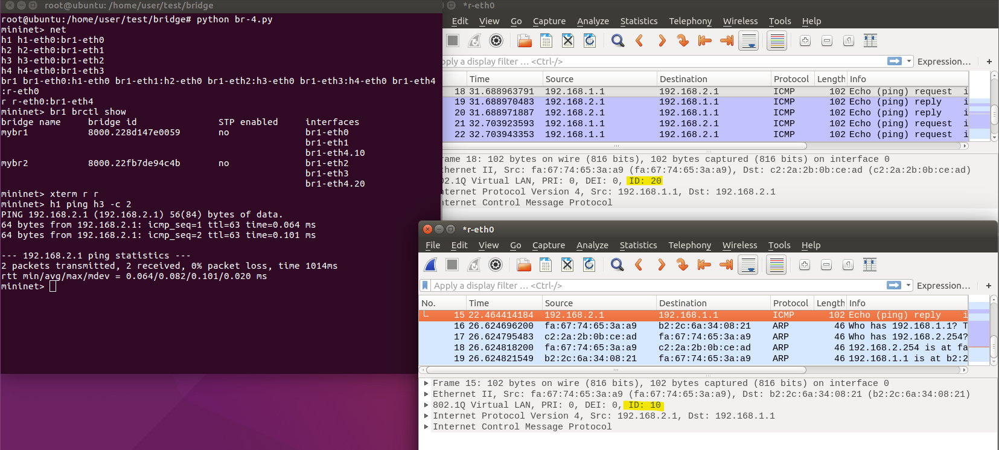

# NAT 轉換 & 在Mininet中加入switch(bridge)(1)

## NAT 轉換

### 實驗環境



### 腳本內容

```sh
#!/usr/bin/env python
from mininet.cli import CLI
from mininet.net import Mininet
from mininet.link import Link,TCLink

if '__main__' == __name__:
  net = Mininet(link=TCLink)
  h1 = net.addHost('h1')
  h2 = net.addHost('h2')
  r1 = net.addHost('r1')
  r2 = net.addHost('r2')
  Link(h1, r1)
  Link(r1, r2)
  Link(h2, r2)
  net.build()
  h1.cmd("ifconfig h1-eth0 0")
  h1.cmd("ip addr add 192.168.1.1/24 brd + dev h1-eth0")
  h1.cmd("ip route add default via 192.168.1.254")
  h2.cmd("ifconfig h2-eth0 0")
  h2.cmd("ip addr add 22.1.1.1/24 brd + dev h2-eth0")
  h2.cmd("ip route add default via 22.1.1.254")
  r1.cmd("ifconfig r1-eth0 0")
  r1.cmd("ifconfig r1-eth1 0")
  r1.cmd("ip addr add 192.168.1.254/24 brd + dev r1-eth0")
  r1.cmd("ip addr add 12.1.1.1/24 brd + dev r1-eth1")
  # 增加 iptables中的 nat table規則，讓h1-eth0的ip(192.168.1.1)轉換成r1-eth0的ip(12.1.1.1)
  r1.cmd("iptables -t nat -A POSTROUTING -o r1-eth1 -s 192.168.1.1 -j MASQUERADE")
  r1.cmd("ip route add default via 12.1.1.2")
  r1.cmd("echo 1 > /proc/sys/net/ipv4/ip_forward")
  r2.cmd("ifconfig r2-eth0 0")
  r2.cmd("ifconfig r2-eth1 0")
  r2.cmd("ip addr add 12.1.1.2/24 brd + dev r2-eth0")
  r2.cmd("ip addr add 22.1.1.254/24 brd + dev r2-eth1")
  r2.cmd("ip route add default via 12.1.1.1")
  r2.cmd("echo 1 > /proc/sys/net/ipv4/ip_forward")
  CLI(net)
  net.stop()
```

### 實驗結果



---

## 在Mininet中加入switch(bridge)
> 實驗前需安裝**bridge-utils**
> `apt install bridge-utils`

## 實驗一

### 實驗環境



### 腳本內容

```sh
#!/usr/bin/env python
from mininet.cli import CLI
from mininet.net import Mininet
from mininet.link import Link,TCLink,Intf

if '__main__' == __name__:
  net = Mininet(link=TCLink)
  h1 = net.addHost('h1')
  h2 = net.addHost('h2')
  h3 = net.addHost('h3')
  br1 = net.addHost('br1')
  net.addLink(h1, br1)
  net.addLink(h2, br1)
  net.addLink(h3, br1)
  net.build()
  h1.cmd("ifconfig h1-eth0 0")
  h2.cmd("ifconfig h2-eth0 0")
  h3.cmd("ifconfig h3-eth0 0")
  br1.cmd("ifconfig br1-eth0 0")
  br1.cmd("ifconfig br1-eth1 0")
  br1.cmd("ifconfig br1-eth2 0")
  # 建立bridge與interface
  br1.cmd("brctl addbr mybr")
  br1.cmd("brctl addif mybr br1-eth0")
  br1.cmd("brctl addif mybr br1-eth1")
  br1.cmd("brctl addif mybr br1-eth2")
  br1.cmd("ifconfig mybr up")
  h1.cmd("ip addr add 192.168.1.1/24 brd + dev h1-eth0")
  h2.cmd("ip addr add 192.168.1.2/24 brd + dev h2-eth0")
  h3.cmd("ip addr add 192.168.1.3/24 brd + dev h3-eth0")
  CLI(net)
  net.stop()
```

### 實驗結果



## 實驗二

### 實驗環境



### 腳本內容

```sh
#!/usr/bin/env python
from mininet.cli import CLI
from mininet.net import Mininet
from mininet.link import Link,TCLink,Intf

if '__main__' == __name__:
  net = Mininet(link=TCLink)
  h1 = net.addHost('h1')
  h2 = net.addHost('h2')
  h3 = net.addHost('h3')
  h4 = net.addHost('h4')
  br1 = net.addHost('br1')
  net.addLink(h1, br1)
  net.addLink(h2, br1)
  net.addLink(h3, br1)
  net.addLink(h4, br1)
  net.build()
  h1.cmd("ifconfig h1-eth0 0")
  h2.cmd("ifconfig h2-eth0 0")
  h3.cmd("ifconfig h3-eth0 0")
  br1.cmd("ifconfig br1-eth0 0")
  br1.cmd("ifconfig br1-eth1 0")
  br1.cmd("ifconfig br1-eth2 0")
  br1.cmd("ifconfig br1-eth3 0")
  br1.cmd("brctl addbr mybr1")
  br1.cmd("brctl addbr mybr2")
  br1.cmd("brctl addif mybr1 br1-eth0")
  br1.cmd("brctl addif mybr1 br1-eth1")
  br1.cmd("brctl addif mybr2 br1-eth2")
  br1.cmd("brctl addif mybr2 br1-eth3")
  br1.cmd("ifconfig mybr1 up")
  br1.cmd("ifconfig mybr2 up")
  h1.cmd("ip addr add 192.168.1.1/24 brd + dev h1-eth0")
  h2.cmd("ip addr add 192.168.1.2/24 brd + dev h2-eth0")
  h3.cmd("ip addr add 192.168.2.1/24 brd + dev h3-eth0")
  h4.cmd("ip addr add 192.168.2.2/24 brd + dev h4-eth0")
  CLI(net)
  net.stop()
```

### 實驗結果



## 實驗三

### 實驗環境



### 腳本內容

```sh
#!/usr/bin/env python
from mininet.cli import CLI
from mininet.net import Mininet
from mininet.link import Link,TCLink,Intf

if '__main__' == __name__:
  net = Mininet(link=TCLink)
  h1 = net.addHost('h1')
  h2 = net.addHost('h2')
  h3 = net.addHost('h3')
  h4 = net.addHost('h4')
  br1 = net.addHost('br1')
  r = net.addHost('r')
  net.addLink(h1, br1)
  net.addLink(h2, br1)
  net.addLink(h3, br1)
  net.addLink(h4, br1)
  net.addLink(br1, r)
  net.addLink(br1, r)
  net.build()
  h1.cmd("ifconfig h1-eth0 0")
  h2.cmd("ifconfig h2-eth0 0")
  h3.cmd("ifconfig h3-eth0 0")
  br1.cmd("ifconfig br1-eth0 0")
  br1.cmd("ifconfig br1-eth1 0")
  br1.cmd("ifconfig br1-eth2 0")
  br1.cmd("ifconfig br1-eth3 0")
  br1.cmd("ifconfig br1-eth4 0")
  br1.cmd("ifconfig br1-eth5 0")
  r.cmd("ifconfig r-eth0 0")
  r.cmd("ifconfig r-eth1 0")
  br1.cmd("brctl addbr mybr1")
  br1.cmd("brctl addbr mybr2")
  br1.cmd("brctl addif mybr1 br1-eth0")
  br1.cmd("brctl addif mybr1 br1-eth1")
  br1.cmd("brctl addif mybr1 br1-eth4")
  br1.cmd("brctl addif mybr2 br1-eth2")
  br1.cmd("brctl addif mybr2 br1-eth3")
  br1.cmd("brctl addif mybr2 br1-eth5")
  br1.cmd("ifconfig mybr1 up")
  br1.cmd("ifconfig mybr2 up")
  h1.cmd("ip addr add 192.168.1.1/24 brd + dev h1-eth0")
  h2.cmd("ip addr add 192.168.1.2/24 brd + dev h2-eth0")
  h3.cmd("ip addr add 192.168.2.1/24 brd + dev h3-eth0")
  h4.cmd("ip addr add 192.168.2.2/24 brd + dev h4-eth0")
  r.cmd("ip addr add 192.168.1.254/24 brd + dev r-eth0")
  r.cmd("ip addr add 192.168.2.254/24 brd + dev r-eth1")
  r.cmd("echo 1 > /proc/sys/net/ipv4/ip_forward")
  h1.cmd("ip route add default via 192.168.1.254")
  h2.cmd("ip route add default via 192.168.1.254")
  h3.cmd("ip route add default via 192.168.2.254")
  h4.cmd("ip route add default via 192.168.2.254")
  CLI(net)
  net.stop()
```

### 實驗結果

## 實驗四
> 延續上個實驗，使用**單臂路由**方式進行實驗
> 實驗前需安裝**vlan**
> `apt install vlan`

### 實驗環境



### 腳本內容

```sh
#!/usr/bin/env python
from mininet.cli import CLI
from mininet.net import Mininet
from mininet.link import Link,TCLink,Intf

if '__main__' == __name__:
  net = Mininet(link=TCLink)
  h1 = net.addHost('h1')
  h2 = net.addHost('h2')
  h3 = net.addHost('h3')
  h4 = net.addHost('h4')
  br1 = net.addHost('br1')
  r = net.addHost('r')
  net.addLink(h1, br1)
  net.addLink(h2, br1)
  net.addLink(h3, br1)
  net.addLink(h4, br1)
  net.addLink(br1, r)
  net.build()
  h1.cmd("ifconfig h1-eth0 0")
  h2.cmd("ifconfig h2-eth0 0")
  h3.cmd("ifconfig h3-eth0 0")
  h4.cmd("ifconfig h4-eth0 0")
  br1.cmd("ifconfig br1-eth0 0")
  br1.cmd("ifconfig br1-eth1 0")
  br1.cmd("ifconfig br1-eth2 0")
  br1.cmd("ifconfig br1-eth3 0")
  br1.cmd("ifconfig br1-eth4 0")
  r.cmd("ifconfig r-eth0 0")
  r.cmd("vconfig add r-eth0 10")
  r.cmd("vconfig add r-eth0 20")
  # 建立虛擬介面
  br1.cmd("vconfig add br1-eth4 10")
  br1.cmd("vconfig add br1-eth4 20")
  # 建立 mybr群組
  br1.cmd("brctl addbr mybr1")
  br1.cmd("brctl addbr mybr2")
  br1.cmd("brctl addif mybr1 br1-eth0")
  br1.cmd("brctl addif mybr1 br1-eth1")
  br1.cmd("brctl addif mybr1 br1-eth4.10")
  br1.cmd("brctl addif mybr2 br1-eth2")
  br1.cmd("brctl addif mybr2 br1-eth3")
  br1.cmd("brctl addif mybr2 br1-eth4.20")
  br1.cmd("ifconfig mybr1 up")
  br1.cmd("ifconfig mybr2 up")
  r.cmd("ifconfig r-eth0.10 up")
  r.cmd("ifconfig r-eth0.20 up")
  br1.cmd("ifconfig br1-eth4.10 up")
  br1.cmd("ifconfig br1-eth4.20 up")
  r.cmd("ip addr add 192.168.1.254/24 brd + dev r-eth0.10")
  r.cmd("ip addr add 192.168.2.254/24 brd + dev r-eth0.20")
  r.cmd("echo 1 > /proc/sys/net/ipv4/ip_forward")
  h1.cmd("ip addr add 192.168.1.1/24 brd + dev h1-eth0")
  h2.cmd("ip addr add 192.168.1.2/24 brd + dev h2-eth0")
  h3.cmd("ip addr add 192.168.2.1/24 brd + dev h3-eth0")
  h4.cmd("ip addr add 192.168.2.2/24 brd + dev h4-eth0")
  h1.cmd("ip route add default via 192.168.1.254")
  h2.cmd("ip route add default via 192.168.1.254")
  h3.cmd("ip route add default via 192.168.2.254")
  h4.cmd("ip route add default via 192.168.2.254")
  CLI(net)
  net.stop()
```

### 實驗結果


