## 在Mininet中加入switch(bridge)(2)
> 需先安裝**vlan**
> `apt install vlan`

### 實驗一
> 使用**單臂路由**

### 實驗環境

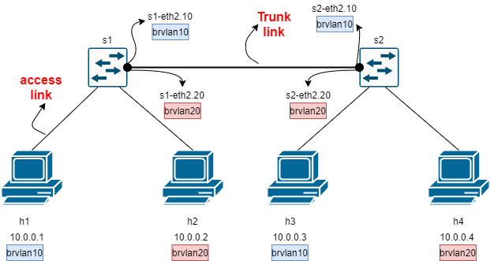

### 程式碼內容

```sh
#!/usr/bin/env python
from mininet.cli import CLI
from mininet.net import Mininet
from mininet.link import Link,TCLink,Intf

if '__main__' == __name__:
  net = Mininet(link=TCLink)
  h1 = net.addHost('h1')
  h2 = net.addHost('h2')
  h3 = net.addHost('h3')
  h4 = net.addHost('h4')
  s1 = net.addHost('s1')
  s2 = net.addHost('s2')
  net.addLink(h1, s1)
  net.addLink(h2, s1)
  net.addLink(h3, s2)
  net.addLink(h4, s2)
  net.addLink(s1, s2)
  net.build()
  # 清除 s1和s2的ip
  s1.cmd("ifconfig s1-eth0 0")
  s1.cmd("ifconfig s1-eth1 0")
  s1.cmd("ifconfig s1-eth2 0")
  s2.cmd("ifconfig s2-eth0 0")
  s2.cmd("ifocnfig s2-eth1 0")
  s2.cmd("ifconfig s2-eth2 0")
  # 建立虛擬介面並啟動
  s1.cmd("vconfig add s1-eth2 10")
  s1.cmd("vconfig add s1-eth2 20")
  s2.cmd("vconfig add s2-eth2 10")
  s2.cmd("vconfig add s2-eth2 20")
  s1.cmd("ifconfig s1-eth2.10 up")
  s1.cmd("ifconfig s1-eth2.20 up")
  s2.cmd("ifconfig s2-eth2.10 up")
  s2.cmd("ifconfig s2-eth2.20 up")
  # 建立 brvlan 並啟動
  s1.cmd("brctl addbr brvlan10")
  s1.cmd("brctl addbr brvlan20")
  s1.cmd("brctl addif brvlan10 s1-eth0")
  s1.cmd("brctl addif brvlan10 s1-eth2.10")
  s1.cmd("brctl addif brvlan20 s1-eth1")
  s1.cmd("brctl addif brvlan20 s1-eth2.20")
  s2.cmd("brctl addbr brvlan10")
  s2.cmd("brctl addbr brvlan20")
  s2.cmd("brctl addif brvlan10 s2-eth0")
  s2.cmd("brctl addif brvlan10 s2-eth2.10")
  s2.cmd("brctl addif brvlan20 s2-eth1")
  s2.cmd("brctl addif brvlan20 s2-eth2.20")
  s1.cmd("ifconfig brvlan10 up")
  s1.cmd("ifconfig brvlan20 up")
  s2.cmd("ifconfig brvlan10 up")
  s2.cmd("ifconfig brvlan20 up")
  # 將 h1~h4 的ip清空並重新設定
  h1.cmd("ifconfig h1-eth0 0")
  h2.cmd("ifconfig h2-eth0 0")
  h3.cmd("ifconfig h3-eth0 0")
  h4.cmd("ifconfig h4-eth0 0")
  h1.cmd("ip addr add 10.0.0.1/24 brd + dev h1-eth0")
  h2.cmd("ip addr add 10.0.0.2/24 brd + dev h2-eth0")
  h3.cmd("ip addr add 10.0.0.3/24 brd + dev h3-eth0")
  h4.cmd("ip addr add 10.0.0.4/24 brd + dev h4-eth0")
  CLI(net)
  net.stop()
```

### 實驗結果

* h1 ping h3
  
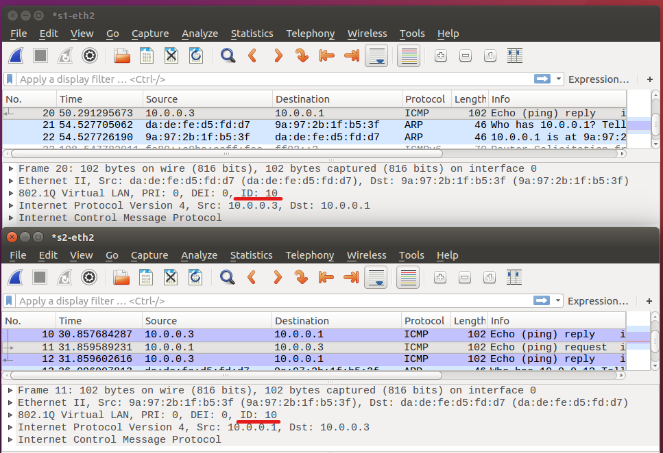

* h2 ping h2

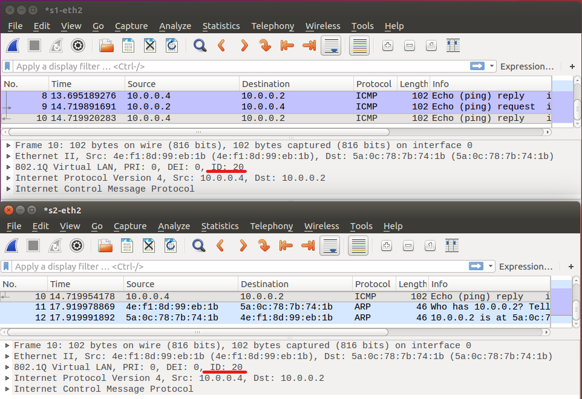

### 實驗二
> 使用**單臂路由**

### 實驗環境
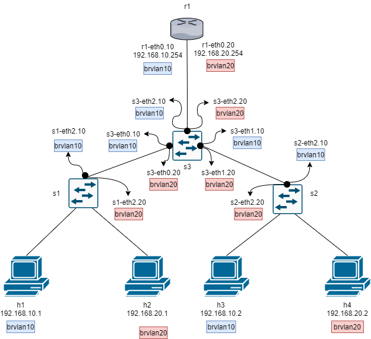

### 程式碼內容

```sh
#!/usr/bin/env python
from mininet.cli import CLI
from mininet.net import Mininet#!/usr/bin/env python
from mininet.cli import CLI
from mininet.net import Mininet
from mininet.link import Link,TCLink,Intf

if '__main__' == __name__:
  net = Mininet(link=TCLink)
  h1 = net.addHost('h1')
  h2 = net.addHost('h2')
  h3 = net.addHost('h3')
  h4 = net.addHost('h4')
  s1 = net.addHost('s1')
  s2 = net.addHost('s2')
  s3 = net.addHost('s3')
  r1 = net.addHost('r1')
  net.addLink(h1, s1)
  net.addLink(h2, s1)
  net.addLink(h3, s2)
  net.addLink(h4, s2)
  net.addLink(s1, s3)
  net.addLink(s2, s3)
  net.addLink(s3, r1)
  net.build()
  # 將所有節點ip清空
  s1.cmd("ifconfig s1-eth0 0")
  s1.cmd("ifconfig s1-eth1 0")
  s1.cmd("ifconfig s1-eth2 0")
  s2.cmd("ifconfig s2-eth0 0")
  s2.cmd("ifocnfig s2-eth1 0")
  s2.cmd("ifconfig s2-eth2 0")
  s3.cmd("ifconfig s3-eth0 0")
  s3.cmd("ifconfig s3-eth1 0")
  s3.cmd("ifconfig s3-eth2 0")
  r1.cmd("ifconfig r1-eth0 0")
  h1.cmd("ifconfig h1-eth0 0")
  h2.cmd("ifconfig h2-eth0 0")
  h3.cmd("ifconfig h3-eth0 0")
  h4.cmd("ifconfig h4-eth0 0")
  # 建立虛擬介面
  s1.cmd("vconfig add s1-eth2 10")
  s1.cmd("vconfig add s1-eth2 20")
  s2.cmd("vconfig add s2-eth2 10")
  s2.cmd("vconfig add s2-eth2 20")
  s3.cmd("vconfig add s3-eth0 10")
  s3.cmd("vconfig add s3-eth0 20")
  s3.cmd("vconfig add s3-eth1 10")
  s3.cmd("vconfig add s3-eth1 20")
  s3.cmd("vconfig add s3-eth2 10")
  s3.cmd("vconfig add s3-eth2 20")
  r1.cmd("vconfig add r1-eth0 10")
  r1.cmd("vconfig add r1-eth0 20")
  # 將虛擬介面啟動
  s1.cmd("ifconfig s1-eth2.10 up")
  s1.cmd("ifconfig s1-eth2.20 up")
  s2.cmd("ifconfig s2-eth2.10 up")
  s2.cmd("ifconfig s2-eth2.20 up")
  s3.cmd("ifconfig s3-eth0.10 up")
  s3.cmd("ifconfig s3-eth0.20 up")
  s3.cmd("ifconfig s3-eth1.10 up")
  s3.cmd("ifconfig s3-eth1.20 up")
  s3.cmd("ifconfig s3-eth2.10 up")
  s3.cmd("ifconfig s3-eth2.20 up")
  r1.cmd("ifconfig r1-eth0.10 up")
  r1.cmd("ifconfig r1-eth0.20 up")
  # 建立 bridge群組並加入介面
  s1.cmd("brctl addbr brvlan10")
  s1.cmd("brctl addbr brvlan20")
  s1.cmd("brctl addif brvlan10 s1-eth0")
  s1.cmd("brctl addif brvlan10 s1-eth2.10")
  s1.cmd("brctl addif brvlan20 s1-eth1")
  s1.cmd("brctl addif brvlan20 s1-eth2.20")
  s2.cmd("brctl addbr brvlan10")
  s2.cmd("brctl addbr brvlan20")
  s2.cmd("brctl addif brvlan10 s2-eth0")
  s2.cmd("brctl addif brvlan10 s2-eth2.10")
  s2.cmd("brctl addif brvlan20 s2-eth1")
  s2.cmd("brctl addif brvlan20 s2-eth2.20")
  s3.cmd("brctl addbr brvlan10")
  s3.cmd("brctl addbr brvlan20")
  s3.cmd("brctl addif brvlan10 s3-eth0.10")
  s3.cmd("brctl addif brvlan10 s3-eth1.10")
  s3.cmd("brctl addif brvlan10 s3-eth2.10")
  s3.cmd("brctl addif brvlan20 s3-eth0.20")
  s3.cmd("brctl addif brvlan20 s3-eth1.20")
  s3.cmd("brctl addif brvlan20 s3-eth2.20")
  # 啟動 bridge群組
  s1.cmd("ifconfig brvlan10 up")
  s1.cmd("ifconfig brvlan20 up")
  s2.cmd("ifconfig brvlan10 up")
  s2.cmd("ifconfig brvlan20 up")
  s3.cmd("ifconfig brvlan10 up")
  s3.cmd("ifconfig brvlan20 up")
  # 設定r1的ip並開啟路由功能
  r1.cmd("ip addr add 192.168.10.254/24 brd + dev r1-eth0.10")
  r1.cmd("ip addr add 192.168.20.254/24 brd + dev r1-eth0.20")
  r1.cmd("echo 1 > /proc/sys/net/ipv4/ip_forward")
  # 設定h1~h4的ip並設定內定路由
  h1.cmd("ip addr add 192.168.10.1/24 brd + dev h1-eth0")
  h1.cmd("ip route add default via 192.168.10.254")
  h2.cmd("ip addr add 192.168.20.1/24 brd + dev h2-eth0")
  h2.cmd("ip route add default via 192.168.20.254")
  h3.cmd("ip addr add 192.168.10.2/24 brd + dev h3-eth0")
  h3.cmd("ip route add default via 192.168.10.254")
  h4.cmd("ip addr add 192.168.20.2/24 brd + dev h4-eth0")
  h3.cmd("ip route add default via 192.168.20.254")
  CLI(net)
  net.stop()
```

### 實驗結果

* h1 ping h2

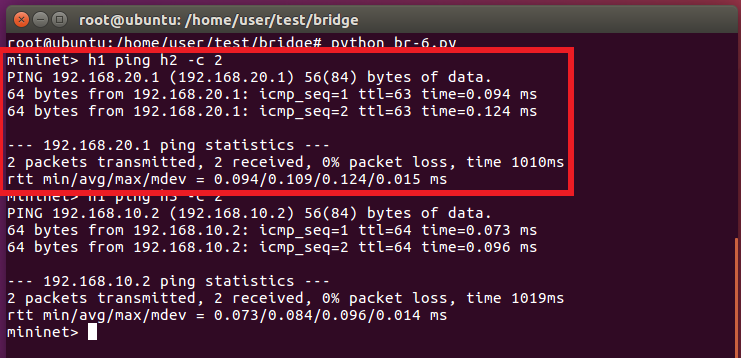

* h1 ping h3

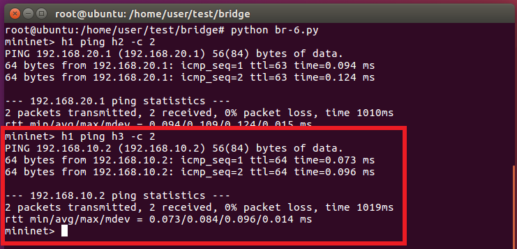

### 利用bridge進行實作Hub

### 實驗環境

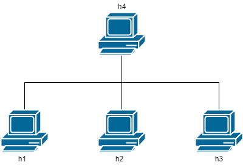

### 程式碼內容

```sh
#!/usr/bin/env python
from mininet.cli import CLI
from mininet.net import Mininet
from mininet.link import Link,TCLink,Intf
 
if '__main__' == __name__:
  net = Mininet(link=TCLink)
  h1 = net.addHost('h1', mac='00:00:00:00:01:00')
  h2 = net.addHost('h2', mac='00:00:00:00:02:00')
  h3 = net.addHost('h3', mac='00:00:00:00:03:00')
  h4 = net.addHost('h4', mac='00:00:00:00:04:00')
  Link(h1, h4)
  Link(h2, h4)
  Link(h3, h4)
  net.build()
  h4.cmd("ifconfig h4-eth0 0")
  h4.cmd("ifconfig h4-eth1 0")
  h4.cmd("ifconfig h4-eth2 0")
  h4.cmd("brctl addbr br0")
  h4.cmd("brctl addif br0 h4-eth0")
  h4.cmd("brctl addif br0 h4-eth1")
  h4.cmd("brctl addif br0 h4-eth2")
  h4.cmd("brctl setageing br0 0")   # address table learning 時間設成0
  h4.cmd("ifconfig br0 up")
  CLI(net)
  net.stop()
```

### 執行結果
* h1 ping h3
  > 在h2開啟wireshark
  
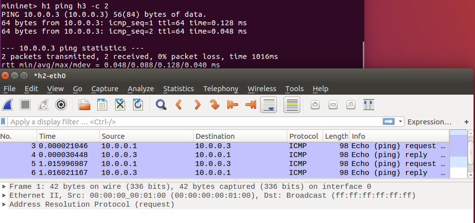
---
## SDN(Software Defined Network)

在傳統的網路環境下，Data plane與Control plane是共用的，屬於分散式管理；在SDN環境下，Data plane與Control plane是分離的，屬於集中式管理。

> * Data plane:資料封包行走的路徑
> * Control plane:路由封包行走的路徑

在SDN中，控制器會透過網路協定去操控網路設備，最常被使用的網路協定是openflow，而懂得openflow的網路設備被稱為openvswitch，簡稱ovs。

### ovs基本指令

* `ovs-ofctl show switch`:查看switch的所有資訊
* `ovs-ofctl dump-flows switch`:查看switch所存在的規則
* `ovs-ofctl add-flow switch 規則`:新增switch規則
* `ovs-ofctl del-flow switch 規則`:刪除switch規則
* `ovs-ofctl del-flows switch`:刪除switch全部規則

###　手動建立ovs規則(1)

* `mn --topo single,2`
  >會建立以下環境
  >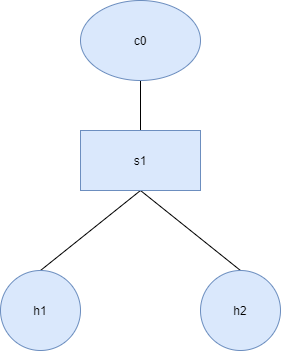 

* `ps -aux | grep controller`
  `kill -9 10754`
:將控制器刪除，為了將規則直接寫入s1中

>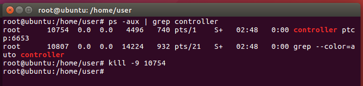

* `ovs-ofctl add-flow s1 in_port=1,actions=output:2`:新增"將進入port 1的封包，傳送至port 2出去"規則
  
* `ovs-ofctl add-flow s1 in_port=2,actions=output:1`:新增"將進入port 2的封包，傳送至port 1出去"規則
  
* `ovs-ofctl dump-flows s1`
  
  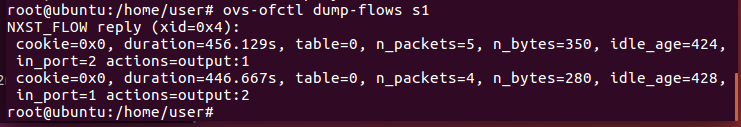
  
  * n_packets:組合此條件的封包總數
  * n_bytes:組合此條件的封包總大小


### 執行結果

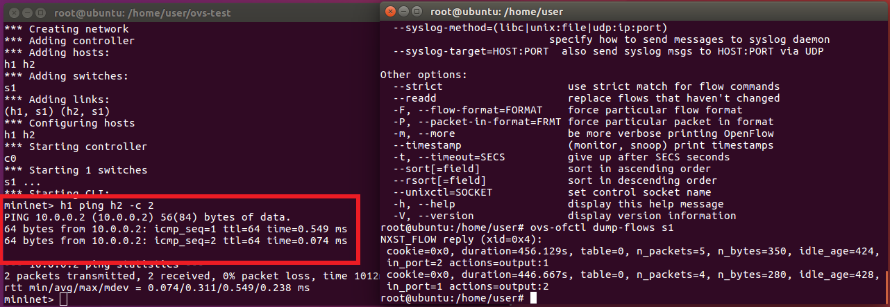

>　為何h1 ping h2 只執行2次，但**n_packet=4或5**?
>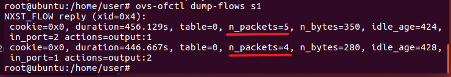
> 在封包真正傳送之前會先發出arp封包來得知封包所要傳送的目的端位置，等到已知目的端位置之後再進行真正的傳輸


### 手動建立ovs規則(2)

* `mn --topo single,3`
  >會建立以下環境
  >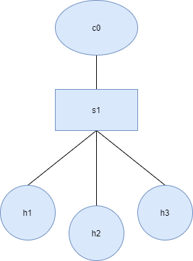

* `ps -aux | grep controller`
  `kill -9 3302`
  : 將控制器刪除
  
>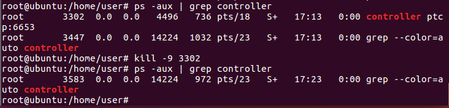

* `ovs-ofctl add-flow s1 in_port=1,arp,actions=output:flood`
  `ovs-ofctl add-flow s1 in_port=2,arp,actions=output:flood`
  `ovs-ofctl add-flow s1 in_port=3,arp,actions=output:flood`
  :將arp的reply封包以**broadcast**方式傳送

  > * 資料傳送之前必須先取得mac address和ip的對照表才能進行傳送，要取得對照表是先利用arp取得目的端的mac address，再以icmp取得目的端的ip
  > * 一般情況arp會先以**broadcast**方式傳送request封包以確認目的端的mac address，目的端再以**unicast**方式將他的mac address以reply封包回傳給來源端。

* `ovs-ofctl add-flow s1 ip,nw_dst=10.0.0.1,actions=output:1`
  
  `ovs-ofctl add-flow s1 ip,nw_dst=10.0.0.2,actions=output:2`

  `ovs-ofctl add-flow s1 ip,nw_dst=10.0.0.3,actions=output:3`
  :將ip封包傳送至相對應的位置

* `ovs-ofctl dump-flow s1`
  
  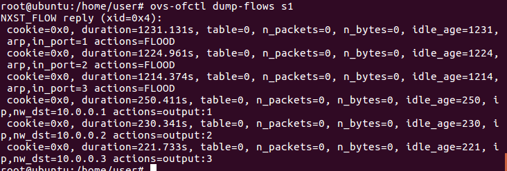

### 執行結果

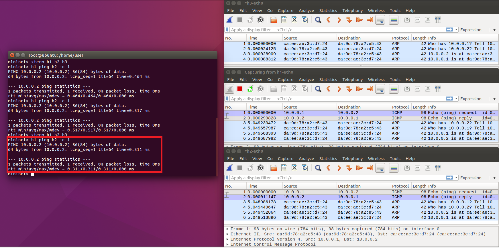

---
### 課程資料
* [YouTube -- mininet-ovs 1](https://youtu.be/QKXuQtd37jU)
