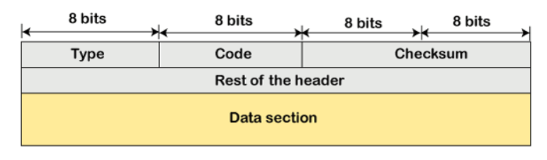

# SDN -- openvswitch

## 實驗一
>利用簡單環境來熟悉arp與icmp的設定

### 觀察規則設定
可以使用以下方式來觀察規則的設定

* 建立環境並執行h1 ping h2


* 查看規則


* 分辨arp與icmp的request和reply封包
  > 透過查看arp packet format中operational欄位內容與icmp message format中type跟code欄位來得知封包是request還是reply
  * arp
    * arp packet format
  
      

    * arp operation code
  
      

  * icmp
    * icmp message format

      

    * icmp type & code
    
    

### 手動設定規則

* 建立環境，將控制器更改為外部控制
  
`mn --controller=remote`

* 建立規則
```sh
# 建立arp規則(request:arp_op=1 reply:arp_op=2)
ovs-ofctl add-flow s1 arp,arp_spa=10.0.0.1,arp_tpa=10.0.0.2,arp_op=1,actions=output:2
ovs-ofctl add-flow s1 arp,arp_spa=10.0.0.2,arp_tpa=10.0.0.1,arp_op=2,actions=output:1

# 建立icmp規則(request:icmp_type=8,icmp_code=0 reply:icmp_type=0,icmp_code=0)
ovs-ofctl add-flow s1 icmp,nw_src=10.0.0.1,nw_dst=10.0.0.2,icmp_type=8,icmp_code=0,actions=output:2
ovs-ofctl add-flow s1 icmp,nw_src=10.0.0.2,nw_dst=10.0.0.1,icmp_type=0,icmp_code=0,actions=output:1
```
> 查看arp規則是否成功建立可以使用`arp -n `指令進行查看

* 執行ping

  * 未加上icmp規則
  
  * 已加上icmp規則
  
>能夠成功進行通訊，arp和icmp的規則都不可缺少

## 實驗二
> 將icmp的request與reply封包以不同路徑進行傳送

### 實驗環境


### 程式碼內容

```sh
#!/usr/bin/env python
from mininet.cli import CLI
from mininet.net import Mininet
from mininet.link import Link,TCLink,Intf
from mininet.node import Controller,RemoteController
 
if '__main__' == __name__:
  net = Mininet(link=TCLink)
  h1 = net.addHost('h1')
  h2 = net.addHost('h2')
  s1 = net.addSwitch('s1')
  s2 = net.addSwitch('s2')
  s3 = net.addSwitch('s3')
  c0 = net.addController('c0', controller=RemoteController)
  net.addLink(h1, s1)
  net.addLink(s1, s2)
  net.addLink(s1, s3)
  net.addLink(s3, s2)
  net.addLink(s2, h2)
  net.build()
  c0.start()
  s1.start([c0])
  s2.start([c0])
  s3.start([c0])

  # rules for s1
  s1.cmd("ovs-ofctl add-flow s1 arp,arp_spa=10.0.0.1,arp_tpa=10.0.0.2,arp_op=1,actions=output:2")
  s1.cmd("ovs-ofctl add-flow s1 arp,arp_spa=10.0.0.2,arp_tpa=10.0.0.1,arp_op=2,actions=output:1")
  s1.cmd("ovs-ofctl add-flow s1 arp,arp_spa=10.0.0.2,arp_tpa=10.0.0.1,arp_op=1,actions=output:1")
  s1.cmd("ovs-ofctl add-flow s1 arp,arp_spa=10.0.0.1,arp_tpa=10.0.0.2,arp_op=2,actions=output:2")
  s1.cmd("ovs-ofctl add-flow s1 icmp,nw_src=10.0.0.1,nw_dst=10.0.0.2,icmp_type=8,icmp_code=0,actions=output:3")
  s1.cmd("ovs-ofctl add-flow s1 icmp,nw_src=10.0.0.2,nw_dst=10.0.0.1,icmp_type=0,icmp_code=0,actions=output:1")

  # rules for s2
  s2.cmd("ovs-ofctl add-flow s2 arp,arp_spa=10.0.0.1,arp_tpa=10.0.0.2,arp_op=1,actions=output:3")
  s2.cmd("ovs-ofctl add-flows arp,arp_spa=10.0.0.2,arp_tpa=10.0.0.1,arp_op=2,actions=output:1")
  s2.cmd("ovs-ofctl add-flow s2 arp,arp_spa=10.0.0.2,arp_tpa=10.0.0.1,arp_op=1,actions=output:1")
  s2.cmd("ovs-ofctl add-flow s2 arp,arp_spa=10.0.0.1,arp_tpa=10.0.0.2,arp_op=2,actions=output:3")
  s2.cmd("ovs-ofctl add-flow s2 icmp,nw_src=10.0.0.1,nw_dst=10.0.0.2,icmp_type=8,icmp_code=0,actions=output:3")
  s2.cmd("ovs-ofctl add-flow s2 icmp,nw_src=10.0.0.2,nw_dst=10.0.0.1,icmp_type=0,icmp_code=0,actions=output:1")

  # rules for s3
  s3.cmd("ovs-ofctl add-flow s3 icmp,nw_src=10.0.0.1,nw_dst=10.0.0.2,icmp_type=8,icmp_code=0,actions=output:2")
  CLI(net)
  net.stop()
```
### 執行結果
* h1 ping h2
>可以使用`tcpdump -i [port]`進行監聽


## 實驗三
>當h1把UDP封包傳給h2時也同時複製一份給h3

### 實驗環境


### 程式碼內容

```sh
#!/usr/bin/env python
from mininet.cli import CLI
from mininet.net import Mininet
from mininet.link import Link,TCLink,Intf
from mininet.node import Controller,RemoteController

if '__main__' == __name__:
  net = Mininet(link=TCLink)

  # 創立節點，並同時設定ip、遮罩與mac address
  h1 = net.addHost('h1', ip="10.0.0.1/24", mac="00:00:00:00:00:01")
  h2 = net.addHost('h2', ip="10.0.0.2/24", mac="00:00:00:00:00:02")
  h3 = net.addHost('h3', ip="10.0.0.3/24", mac="00:00:00:00:00:03")
  s1 = net.addSwitch('s1')
  c0 = net.addController('c0', controller=RemoteController)
  net.addLink(h1, s1)
  net.addLink(h2, s1)
  net.addLink(h3, s1)
  net.build()
  c0.start()
  s1.start([c0])

  # 靜態設定arp
  h1.cmd("arp -s 10.0.0.2 00:00:00:00:00:02")
  h1.cmd("arp -s 10.0.0.3 00:00:00:00:00:03")
  h2.cmd("arp -s 10.0.0.1 00:00:00:00:00:01")
  h2.cmd("arp -s 10.0.0.3 00:00:00:00:00:03")
  h3.cmd("arp -s 10.0.0.1 00:00:00:00:00:01")
  h3.cmd("arp -s 10.0.0.2 00:00:00:00:00:02")
  CLI(net)
  net.stop()
```

### 手動增加規則

```sh
ovs-ofctl add-flow s1 priority=1,ip,nw_dst=10.0.0.1,actions=output:1
ovs-ofctl add-flow s1 priority=1,ip,nw_dst=10.0.0.2,actions=output:2
ovs-ofctl add-flow s1 priority=1,ip,nw_dst=10.0.0.3,actions=output:3
ovs-ofctl add-flow s1 priority=10,udp,nw_dst=10.0.0.2,actions=output:2,output:3
```
>當priority越高，優先權越大；如果priority相同時，會以先建立的規則優先

### 執行結果
> 透過以下動作進行觀察

* h1
  ```iperf -c 10.0.0.2 -u -b 1M -i 1```
* h2
  ```iperf -s -i 1 -u```
* h3開啟wireshark


##　實驗四
延續上一個實驗，讓h1傳送給h2的UDP封包也可以讓h3收到，不需使用wireshark才能觀察是否有送到h3

```sh
#修改目的端的ip和mac address讓封包也能送到h3
ovs-ofctl add-flow s1 priority=100,udp,nw_dst=10.0.0.2,actions=output:2,mod_dl_dst=00:00:00:00:00:03,mod_nw_dst=10.0.0.3,output:3
```

### 實驗結果


### 實驗五
假設h3為一個有問題的設備，可以修改或增加規則將h3所送來的封包丟掉

```sh
# 將來源端為h3的封包丟掉
ovs-ofctl add-flow s1 priority=100,ip,nw_src=10.0.0.3,actions=drop
```
### 實驗結果


## 補充 -- 封包接收判斷

1. 在Mac Layer，如果目的端的Mac address=FF:FF:FF:FF:FF:FF或自己就接收，不是就丟棄
2. 在IP Layer，如果目的端IP=broadcast或自己，並且同時檢查checksum的值，不然就丟棄
3. 在傳輸層，先檢查checksum值是否正確，再確認是否有應用程式的port號可以接收封包，不然就丟棄
---
## 課程資料
* [YouTube -- mininet-ovs 2](https://youtu.be/zQDtEoUrnvQ)
* [YouTube -- mininet-ovs 3](https://youtu.be/z5h7hRPgFAE)

## 圖片來源

* [ARP Packet Format - javatpoint](https://www.javatpoint.com/arp-packet-format)
* [A bit info about ICMP, ping and traceroute - NPLC](https://devnull0.com/2017/09/28/a-bit-info-about-icmp-ping-and-traceroute/)
