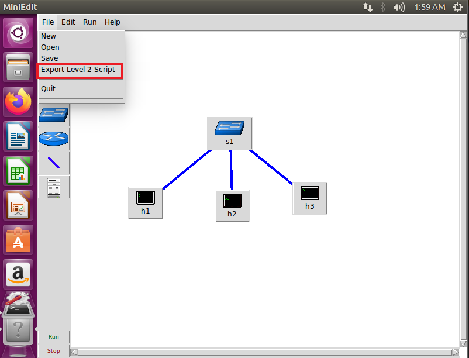

# Miniedit & 期中作業
使用Miniedit可以用圖形化介面建置出實驗拓撲，方便初學者能夠進行操作

## 操作介面


>* 可以在**mininet/example**中找到檔案執行
> 
>* mininet中的功能較為簡單，若要更進階的功能的話要使用**mininet-wifi**

## 實驗一
> 使用**LegacySwitch**

### 實驗環境


### 將拓撲匯出

* 點擊 **/File/Export Level 2 Script**進行儲存
  


* 欲儲存檔案將會儲存為python檔


### 程式碼內容

```sh
#!/usr/bin/env python

from mininet.net import Mininet
from mininet.node import Controller, RemoteController, OVSController
from mininet.node import CPULimitedHost, Host, Node
from mininet.node import OVSKernelSwitch, UserSwitch
from mininet.node import IVSSwitch
from mininet.cli import CLI
from mininet.log import setLogLevel, info
from mininet.link import TCLink, Intf
from subprocess import call

def myNetwork():

    net = Mininet( topo=None,
                   build=False,
                   ipBase='10.0.0.0/8')

    info( '*** Adding controller\n' )
    info( '*** Add switches\n')

    # 此設定會使此環境中的交換機與傳統的交換機功能較為相似
    s1 = net.addSwitch('s1', cls=OVSKernelSwitch, failMode='standalone')

    info( '*** Add hosts\n')
    h3 = net.addHost('h3', cls=Host, ip='10.0.0.3', defaultRoute=None)
    h2 = net.addHost('h2', cls=Host, ip='10.0.0.2', defaultRoute=None)
    h4 = net.addHost('h4', cls=Host, ip='10.0.0.4', defaultRoute=None)
    h1 = net.addHost('h1', cls=Host, ip='10.0.0.1', defaultRoute=None)

    info( '*** Add links\n')
    net.addLink(s1, h1)
    net.addLink(s1, h2)
    net.addLink(s1, h3)

    info( '*** Starting network\n')
    net.build()

    #由於此拓撲中沒有controller所以可以刪除
    #info( '*** Starting controllers\n')
    #for controller in net.controllers:
    #    controller.start()

    info( '*** Starting switches\n')
    net.get('s1').start([])

    info( '*** Post configure switches and hosts\n')

    CLI(net)
    net.stop()

if __name__ == '__main__':
    setLogLevel( 'info' )
    myNetwork()

```

### 實驗結果
* h1 ping h2，並在h3開啟wireshark進行監聽
  


由於一開始s1沒有address learning，所以他必須進行broadcast來尋找h2，當h2收到封包之後將會回應s1，因此s1就會知道h1和h2的位置，進而h1和h2就能直接進行通訊

## 實驗二
>使用**LegacyRouter**

### 實驗環境


* 節點設定
  
|節點|ip address|default router|
|:--:|:--------:|:-----------:|
|h1|192.168.10.1/24|192.168.10.254|
|h2|192.168.20.1/24|192.168.20.254|
|h3|192.168.20.2/24|192.168.20.254|

* 連線設定(r1與r2)
  
|項目|數值|  
|:--:|:--:|
|bandwidth|100Mbits|
|Delay|1ms|
|Loss|0%|

> 如果要設定router的ip必須自己手動設定

### 程式碼內容

```sh
#!/usr/bin/env python

from mininet.net import Mininet
from mininet.node import Controller, RemoteController, OVSController
from mininet.node import CPULimitedHost, Host, Node
from mininet.node import OVSKernelSwitch, UserSwitch
from mininet.node import IVSSwitch
from mininet.cli import CLI
from mininet.log import setLogLevel, info
from mininet.link import TCLink, Intf
from subprocess import call

def myNetwork():

    net = Mininet( topo=None,
                   build=False,
                   ipBase='10.0.0.0/8')

    info( '*** Adding controller\n' )
    info( '*** Add switches\n')
    r2 = net.addHost('r2', ip='0.0.0.0')
    r2.cmd('sysctl -w net.ipv4.ip_forward=1')
    s3 = net.addSwitch('s3', cls=OVSKernelSwitch, failMode='standalone')
    r1 = net.addHost('r1', ip='0.0.0.0')
    r1.cmd('sysctl -w net.ipv4.ip_forward=1')

    info( '*** Add hosts\n')
    h3 = net.addHost('h3', cls=Host, ip='192.168.20.2/24', defaultRoute='via 192.168.20.254')
    h1 = net.addHost('h1', cls=Host, ip='192.168.10.1/24', defaultRoute='via 192.168.10.254')
    h2 = net.addHost('h2', cls=Host, ip='192.168.20.1/24', defaultRoute='via 192.168.20.254')

    info( '*** Add links\n')
    
    net.addLink(h1, r1)
    r1r2 = {'bw':100,'delay':'1ms','loss':0}
    net.addLink(r1, r2, cls=TCLink , **r1r2)
    net.addLink(r2, s3)
    net.addLink(s3, h2)
    net.addLink(s3, h3)

    info( '*** Starting network\n')
    net.build()
    info( '*** Starting controllers\n')
    for controller in net.controllers:
        controller.start()

    info( '*** Starting switches\n')
    net.get('s3').start([])

    info( '*** Post configure switches and hosts\n')
    r1.cmd("ifconfig r1-eth0 192.168.10.254/24")
    r1.cmd("ifconfig r1-eth1 10.0.0.1/24")
    r1.cmd("ip route add 192.168.20.0/24 via 10.0.0.2")
    r2.cmd("ifconfig r2-eth0 10.0.0.2/24")
    r2.cmd("ifconfig r2-eth1 192.168.20.254/24")
    r2.cmd("ip route add 192.168.10.0/24 via 10.0.0.1")

    CLI(net)
    net.stop()

if __name__ == '__main__':
    setLogLevel( 'info' )
    myNetwork()

```

* 補充 -- 在Linux中開啟路由方式
1. ``` echo 1 > /proc/sys/net/ipv4/ip_forward``` 
2. ``` sysctl -w net.ipv4.ip_forward=1```


### 實驗結果


## 實驗三
>使用**Switch(OpenVSwitch)**

### 實驗環境


* Controller設定
  


>Controller Type預設為**OpenFlow Reference**

### 程式碼內容

```sh
#!/usr/bin/env python

from mininet.net import Mininet
from mininet.node import Controller, RemoteController, OVSController
from mininet.node import CPULimitedHost, Host, Node
from mininet.node import OVSKernelSwitch, UserSwitch
from mininet.node import IVSSwitch
from mininet.cli import CLI
from mininet.log import setLogLevel, info
from mininet.link import TCLink, Intf
from subprocess import call

def myNetwork():

    net = Mininet( topo=None,
                   build=False,
                   ipBase='10.0.0.0/8')

    info( '*** Adding controller\n' )
    c0=net.addController(name='c0',
                      controller=Controller,
                      protocol='tcp',
                      port=6633)

    info( '*** Add switches\n')
    s1 = net.addSwitch('s1', cls=OVSKernelSwitch)
    s2 = net.addSwitch('s2', cls=OVSKernelSwitch)

    info( '*** Add hosts\n')
    h1 = net.addHost('h1', cls=Host, ip='10.0.0.1', defaultRoute=None)
    h2 = net.addHost('h2', cls=Host, ip='10.0.0.2', defaultRoute=None)

    info( '*** Add links\n')
    net.addLink(s1, s2)
    net.addLink(s2, h2)
    net.addLink(h1, s1)

    info( '*** Starting network\n')
    net.build()
    info( '*** Starting controllers\n')
    for controller in net.controllers:
        controller.start()

    info( '*** Starting switches\n')
    net.get('s1').start([c0])
    net.get('s2').start([c0])

    info( '*** Post configure switches and hosts\n')

    CLI(net)
    net.stop()

if __name__ == '__main__':
    setLogLevel( 'info' )
    myNetwork()

```

### 實驗結果

* 未執行ping之前，將不會有任何規則產生


* 執行ping之後，由於switch中沒有任何規則，因此controller會將規則下放給switch，進而讓switch能夠傳送封包
  * s1
  
  
  
  * s2
  
  

## 實驗四
> * 延續上個實驗，將Controller Type設定為**RemoteController**，並載入模組
> * 在此使用老師的虛擬機[mininet-wifidockerp4](https://webhd.ncyu.edu.tw/share.cgi?ssid=0CY94tl)

### 程式碼內容

```sh
#!/usr/bin/env python

from mininet.net import Mininet
from mininet.node import Controller, RemoteController, OVSController
from mininet.node import CPULimitedHost, Host, Node
from mininet.node import OVSKernelSwitch, UserSwitch
from mininet.node import IVSSwitch
from mininet.cli import CLI
from mininet.log import setLogLevel, info
from mininet.link import TCLink, Intf
from subprocess import call

def myNetwork():

    net = Mininet( topo=None,
                   build=False,
                   ipBase='10.0.0.0/8')

    info( '*** Adding controller\n' )
    c0=net.addController(name='c0',
                      controller=RemoteController,
                      protocol='tcp',
                      port=6633)

    info( '*** Add switches\n')
    s1 = net.addSwitch('s1', cls=OVSKernelSwitch)
    s2 = net.addSwitch('s2', cls=OVSKernelSwitch)

    info( '*** Add hosts\n')
    h1 = net.addHost('h1', cls=Host, ip='10.0.0.1', defaultRoute=None)
    h2 = net.addHost('h2', cls=Host, ip='10.0.0.2', defaultRoute=None)

    info( '*** Add links\n')
    net.addLink(s1, s2)
    net.addLink(s2, h2)
    net.addLink(h1, s1)

    info( '*** Starting network\n')
    net.build()
    info( '*** Starting controllers\n')
    for controller in net.controllers:
        controller.start()

    info( '*** Starting switches\n')
    net.get('s1').start([c0])
    net.get('s2').start([c0])

    info( '*** Post configure switches and hosts\n')

    CLI(net)
    net.stop()

if __name__ == '__main__':
    setLogLevel( 'info' )
    myNetwork()
```
### 載入模組

* 切換至```/home/user/ryu/ryu/app```資料夾中
  


> 檔名之後所代表的數字，代表版本號

* 模組載入
  
```ryu-manager simple_switch.py```


### 執行結果

* 尚未加載模組
  


* 加載模組之後
  


### 補充

由於SDN是個開放的平台，因此控制器的規則有相當多種的邏輯組合方式去實做出來，例如:如果對**python**較為熟悉，可以使用**ryu**;如果對**java**較為熟悉，可以使用**OpenDaylight**

---
## 期中作業

## 作業一
以下環境進行實作


### 程式碼內容
> 由於版本問題，因此無法執行

```sh
#!/usr/bin/env python
from mininet.cli import CLI
from mininet.net import Mininet
from mininet.link import Link,TCLink

if '__main__' == __name__:
  net = Mininet(link=TCLink)
  h1 = net.addHost('h1')
  h2 = net.addHost('h2')
  r1 = net.addHost('r1')
  r2 = net.addHost('r2')
  r3 = net.addHost('r3')
  r4 = net.addHost('r4')
  net.addLink(h1,r1)
  net.addLink(r1,r2)
  net.addLink(r1,r3)
  net.addLink(r2,r4)
  net.addLink(r3,r4)
  net.addLink(h2,r4)
  net.build()
  # clear the ip
  h1.cmd("ifconfig h1-eth0 0")
  r1.cmd("ifconfig r1-eth0 0")
  r1.cmd("ifconfig r1-eth1 0")
  r1.cmd("ifconfig r1-eth2 0")
  r2.cmd("ifconfig r2-eth0 0")
  r2.cmd("ifconfig r2-eth1 0")
  r3.cmd("ifconfig r3-eth0 0")
  r3.cmd("ifconfig r3-eth1 0")
  r4.cmd("ifconfig r4-eth0 0")
  r4.cmd("ifconfig r4-eth1 0")
  r4.cmd("ifconfig r4-eth2 0")
  h2.cmd("ifconfig h2-eth0 0")
  # add the ip
  h1.cmd("ip addr add 192.168.10.1/24 brd + dev h1-eth0")
  h1.cmd("ip route add default via 192.168.10.254")

  r1.cmd("ip addr add 192.168.10.254/24 brd + dev r1-eth0")
  r1.cmd("ip addr add 12.1.1.1/24 brd + dev r1-eth1")
  r1.cmd("ip addr add 13.1.1.1/24 brd + dev r1-eth2")
  r1.cmd("echo 1 > /proc/sys/net/ipv4/ip_forward")
  r1.cmd("ip route add 192.168.20.0/24 via 12.1.1.2")
  r1.cmd("ip route add 24.1.1.0/24 via 12.1.1.2")
  r1.cmd("ip route add 34.1.1.0/24 via 13.1.1.3")
  #r1.cmd("ip route add 192.168.20.0/24 via 13.1.1.3")
  

  r2.cmd("ip addr add 12.1.1.2/24 brd + dev r2-eth0")
  r2.cmd("ip addr add 24.1.1.2/24 brd + dev r2-eth1")
  r2.cmd("echo 1 > /proc/sys/net/ipv4/ip_forward")
  r2.cmd("ip route add 192.168.20.0/24 via 24.1.1.4")
  r2.cmd("ip route add 192.168.10.0/24 via 12.1.1.1")
  r2.cmd("ip route add 34.1.1.0/24 via 24.1.1.4")
  r2.cmd("ip route add 13.1.1.0/24 via 12.1.1.1")

  r3.cmd("ip addr add 13.1.1.3/24 brd + dev r3-eth0")
  r3.cmd("ip addr add 34.1.1.3/24 brd + dev r3-eth1")
  r3.cmd("echo 1 > /proc/sys/net/ipv4/ip_forward")
  r3.cmd("ip route add 192.168.10.0/24 via 13.1.1.1")
  r3.cmd("ip route add 192.168.20.0/24 via 34.1.1.4")
  r3.cmd("ip route add 12.1.1.0/24 via 13.1.1.1")
  r3.cmd("ip route add 24.1.1.0/24 via 34.1.1.4")
  

  r4.cmd("ip addr add 24.1.1.4/24 brd + dev r4-eth0")
  r4.cmd("ip addr add 34.1.1.4/24 brd + dev r4-eth1")
  r4.cmd("ip addr add 192.168.20.254/24 brd + dev r4-eth2")
  r4.cmd("echo 1 > /proc/sys/net/ipv4/ip_forward")
  r4.cmd("ip route add 192.168.10.0/24 via 24.1.1.2")
  #r4.cmd("ip route add 192.168.10.0/24 via 34.1.1.3")
  r4.cmd("ip route add 13.1.1.0/24 via 34.1.1.3")
  r4.cmd("ip route add 12.1.1.0/24 via 24.1.1.2")

  h2.cmd("ip addr add 192.168.20.1/24 brd + dev h2-eth0")
  h2.cmd("ip route add default via 192.168.20.254")

  CLI(net)
  net.stop()
  
```

## 作業二

以下環境進行實作


### 程式碼內容

```sh
#!/usr/bin/env python
from mininet.cli import CLI
from mininet.net import Mininet
from mininet.link import Link,TCLink,Intf
from mininet.node import Controller,RemoteController
 
if '__main__' == __name__:
  net = Mininet(link=TCLink)
  h1 = net.addHost('h1')
  h2 = net.addHost('h2')
  s1 = net.addSwitch('s1')
  s2 = net.addSwitch('s2')
  s3 = net.addSwitch('s3')
  s4 = net.addSwitch('s4')
  c0 = net.addController('c0', controller=RemoteController)
  net.addLink(h1, s1)
  net.addLink(s1, s2)
  net.addLink(s1, s3)
  net.addLink(s2, s4)
  net.addLink(s3, s4)
  net.addLink(s4, h2)
  net.build()
  c0.start()
  s1.start([c0])
  s2.start([c0])
  s3.start([c0])
  s4.start([c0])

  # rules for s1
  s1.cmd("ovs-ofctl add-flow s1 arp,arp_spa=10.0.0.1,arp_tpa=10.0.0.2,arp_op=1,actions=output:2")
  s1.cmd("ovs-ofctl add-flow s1 arp,arp_spa=10.0.0.2,arp_tpa=10.0.0.1,arp_op=2,actions=output:1")
  s1.cmd("ovs-ofctl add-flow s1 arp,arp_spa=10.0.0.2,arp_tpa=10.0.0.1,arp_op=1,actions=output:1")
  s1.cmd("ovs-ofctl add-flow s1 arp,arp_spa=10.0.0.1,arp_tpa=10.0.0.2,arp_op=2,actions=output:2")
  s1.cmd("ovs-ofctl add-flow s1 icmp,nw_src=10.0.0.1,nw_dst=10.0.0.2,icmp_type=8,icmp_code=0,actions=output:2")
  s1.cmd("ovs-ofctl add-flow s1 icmp,nw_src=10.0.0.2,nw_dst=10.0.0.1,icmp_type=0,icmp_code=0,actions=output:1")

  # rules for s2
  s2.cmd("ovs-ofctl add-flow s2 arp,arp_spa=10.0.0.1,arp_tpa=10.0.0.2,arp_op=1,actions=output:2")
  s2.cmd("ovs-ofctl add-flow s2 arp,arp_spa=10.0.0.2,arp_tpa=10.0.0.1,arp_op=2,actions=output:1")
  s2.cmd("ovs-ofctl add-flow s2 arp,arp_spa=10.0.0.2,arp_tpa=10.0.0.1,arp_op=1,actions=output:1")
  s2.cmd("ovs-ofctl add-flow s2 arp,arp_spa=10.0.0.1,arp_tpa=10.0.0.2,arp_op=2,actions=output:0")
  s2.cmd("ovs-ofctl add-flow s2 icmp,nw_src=10.0.0.1,nw_dst=10.0.0.2,icmp_type=8,icmp_code=0,actions=output:2")

  # rules for s3
  s3.cmd("ovs-ofctl add-flow s3 icmp,nw_src=10.0.0.2,nw_dst=10.0.0.1,icmp_type=0,icmp_code=0,actions=output:1")
  
  # rules for s4
  s4.cmd("ovs-ofctl add-flow s4 arp,arp_spa=10.0.0.1,arp_tpa=10.0.0.2,arp_op=1,actions=output:3")
  s4.cmd("ovs-ofctl add-flow s4 arp,arp_spa=10.0.0.2,arp_tpa=10.0.0.1,arp_op=2,actions=output:1")
  s4.cmd("ovs-ofctl add-flow s4 arp,arp_spa=10.0.0.2,arp_tpa=10.0.0.1,arp_op=1,actions=output:1")
  s4.cmd("ovs-ofctl add-flow s4 arp,arp_spa=10.0.0.1,arp_tpa=10.0.0.2,arp_op=2,actions=output:3")
  s4.cmd("ovs-ofctl add-flow s4 icmp,nw_src=10.0.0.1,nw_dst=10.0.0.2,icmp_type=8,icmp_code=0,actions=output:3")
  s4.cmd("ovs-ofctl add-flow s4 icmp,nw_src=10.0.0.2,nw_dst=10.0.0.1,icmp_type=0,icmp_code=0,actions=output:2")
  CLI(net)
  net.stop()
```
### 執行結果
* ```h1 ping h2 -c 1```
  
    * s2
  
    
    
    * s3
  
     

---
### 課程資料
* [YouTube -- mininet-miniedit 1](https://youtu.be/4uZz_9oM2T0)
* [YouTube -- mininet-miniedit 2](https://youtu.be/FnPRYnE6dzw)
