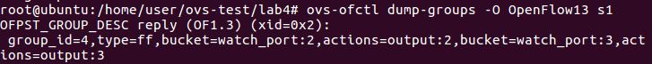
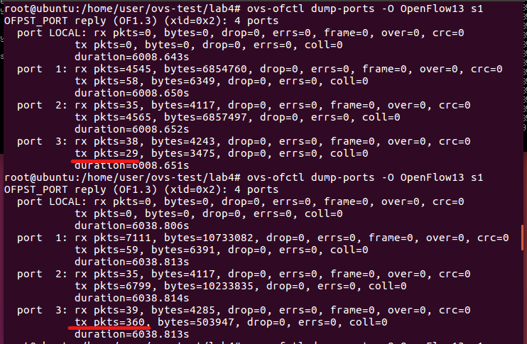

# openvswitch(3)

## group table
> 資料來源為[深入OpenFlow協定看Group Table設定流程| 網管人](https://www.netadmin.com.tw/netadmin/zh-tw/technology/9FF6A417220F400884C788AB00FA3750)

### group type

* all : 執行所有Action Buckets中的動作，通常使用mutilcast或broadcast的forwarding封包
* select : 執行一個Action Bucket中的動作，使用在負載均衡
* indirect : 執行既有定義的某個Action Bucket中的動作
* fast failover : 執行第一個Live Action Bucket中的動作，使用在fault tolerence上

## 實驗一
> 在tcp環境下，以**select**進行實驗，以此達成負載均衡的效果

### 實驗環境
讓封包傳送路徑，第一次以h1 -> s1 -> s2 -> s4 -> h2進行傳送，第二次以h1 -> s1 -> s3 -> s4 -> h2進行傳送，以此輪替下去


### 程式碼內容

* lab3.py
  
```sh
from mininet.net import Mininet
from mininet.node import Controller, RemoteController, OVSKernelSwitch, UserSwitch, OVSSwitch
from mininet.cli import CLI
from mininet.log import setLogLevel
from mininet.link import Link, TCLink

def topology():

        net = Mininet( controller=RemoteController, link=TCLink, switch=OVSKernelSwitch)

        # Add hosts and switches

        h1 = net.addHost( 'h1', mac="00:00:00:00:00:01" )
        h2 = net.addHost( 'h2', mac="00:00:00:00:00:02" )

        # 設定switch可以支援OpenFlow1.0和1.3版
        s1 = net.addSwitch( 's1', protocols=["OpenFlow10,OpenFlow13"], listenPort=6634 )
        s2 = net.addSwitch( 's2', protocols=["OpenFlow10,OpenFlow13"], listenPort=6635 )
        s3 = net.addSwitch( 's3', protocols=["OpenFlow10,OpenFlow13"], listenPort=6636 )
        s4 = net.addSwitch( 's4', protocols=["OpenFlow10,OpenFlow13"], listenPort=6637 )

        c0 = net.addController( 'c0', controller=RemoteController, ip='127.0.0.1', port=6633 )

        net.addLink( h1, s1)
        net.addLink( h2, s4)
        net.addLink( s1, s2)
        net.addLink( s1, s3)
        net.addLink( s2, s4)
        net.addLink( s3, s4)
        net.build()
        c0.start()
        s1.start( [c0] )
        s2.start( [c0] )
        s3.start( [c0] )
        s4.start( [c0] )

        print "*** Running CLI"
        CLI( net )

        print "*** Stopping network"
        net.stop()

 

if __name__ == '__main__':
    setLogLevel( 'info' )
    topology()   
```

* rule.sh
>select操作只有在OpenFlow1.3才有支援

```sh
ovs-ofctl -O OpenFlow13 add-flow s2 in_port=1,actions=output:2
ovs-ofctl -O OpenFlow13 add-flow s2 in_port=2,actions=output:1
ovs-ofctl -O OpenFlow13 add-flow s3 in_port=1,actions=output:2
ovs-ofctl -O OpenFlow13 add-flow s3 in_port=2,actions=output:1
ovs-ofctl -O OpenFlow13 add-flow s4 in_port=2,actions=output:1
ovs-ofctl -O OpenFlow13 add-flow s4 in_port=3,actions=output:1
ovs-ofctl -O OpenFlow13 add-flow s4 in_port=1,actions=output:3
ovs-ofctl -O OpenFlow13 add-flow s1 in_port=2,actions=output:1
ovs-ofctl -O OpenFlow13 add-flow s1 in_port=3,actions=output:1

# 設定group:5的group type為select，action bucket的動作在port 2和port 3之中進行
ovs-ofctl -O OpenFlow13 add-group s1 group_id=5,type=select,bucket=output:2,bucket=output:3
# 設定group，id為自訂
ovs-ofctl -O OpenFlow13 add-flow s1 in_port=1,actions=group:5
```

### 查看規則

* 執行 lab3.py
  


* 開啟rule.sh執行權限，並執行
  


* 查看規則


### 實驗結果

可以從```ovs-ofctl dump-ports -O OpenFlow13 s1```所顯示的內容數值變化進行觀察，來得知封包目前是從哪條路線進行傳送

* 執行xterm，並在h1與h2的視窗中執行以下指令
  * h1
    ```iperf -c 10.0.0.2 -t 100```
  * h2
    ```iperf -s -i```

* 在h1進行中斷再重啟，觀察數值改變
  * 初始數值
  
    
    
  * 第一次執行
    > 封包從port 3出去，傳送至s3

    

  * 第二次執行
    > 封包從port 2出去，傳送至s2

    

## 實驗二
>延續上個實驗，以udp方式進行傳送

### 實驗結果

* 執行xterm，並在h1與h2的視窗中執行以下指令
  * h1
    ```iperf -c 10.0.0.2 -t 100 -u -b 1M```
  * h2
    ```iperf -s -i -u```

* 從多次重覆在h1進行中斷再重啟，可以從中觀察到封包都從port 2出去，傳送至s2。由此可知，select只對tcp有效
  
  

## 實驗三
>與先前實驗的環境相同，但以**fast failover**進行實驗

### 實驗環境


### 程式碼內容

* rule.sh
  
```sh
ovs-ofctl -O OpenFlow13 add-flow s2 in_port=1,actions=output:2
ovs-ofctl -O OpenFlow13 add-flow s2 in_port=2,actions=output:1
ovs-ofctl -O OpenFlow13 add-flow s3 in_port=1,actions=output:2
ovs-ofctl -O OpenFlow13 add-flow s3 in_port=2,actions=output:1
ovs-ofctl -O OpenFlow13 add-flow s4 in_port=2,actions=output:1
ovs-ofctl -O OpenFlow13 add-flow s4 in_port=3,actions=output:1
ovs-ofctl -O OpenFlow13 add-flow s4 in_port=1,actions=output:3
ovs-ofctl -O OpenFlow13 add-flow s1 in_port=2,actions=output:1
ovs-ofctl -O OpenFlow13 add-flow s1 in_port=3,actions=output:1

# 設定group:4的group type=fast failover(ff)，並監控port 2與port 3，如果port 2發生錯誤，將會由port 3進行傳送，直到錯誤排除
ovs-ofctl -O OpenFlow13 add-group s1 group_id=4,type=ff,bucket=watch_port:2,output:2,bucket=watch_port:3,output:3
ovs-ofctl -O OpenFlow13 add-flow s1 in_port=1,actions=group:4
```

### 查看規則
* 執行 lab4.py
  


* 開啟 rule.sh 執行權限


* 查看規則





### 實驗結果

* 執行xterm，並在h1與h2的視窗中執行以下指令
  * h1
    ```iperf -c 10.0.0.2 -t 1000 -u -b 1M```
  * h2
    ```iperf -s -i -u```

* 觀察數值變化
  * 未中斷連線前
  > 可以從中看到封包由port 2進行傳送

    

  * 中斷連線後
  > 使用```link s1 s2 down```將連線中斷後，可以看見封包由port 2轉為port 3進行傳送

    

## 實驗四
>以group chaining進行實驗，group chaining就是將select與fast failover結合

### 實驗環境

在此環境，將port2與port4分成一組，而port3和port5為另一組。假設資料只會走port2與port4這一組，當port2和port4發生問題時，將會轉換由port3和port5進行傳輸


### 程式碼內容

* lab5.py
  
```sh
from mininet.net import Mininet
from mininet.node import Controller, RemoteController, OVSKernelSwitch, UserSwitch, OVSSwitch
from mininet.cli import CLI
from mininet.log import setLogLevel
from mininet.link import Link, TCLink

def topology():

        net = Mininet( controller=RemoteController, link=TCLink, switch=OVSKernelSwitch)

        # Add hosts and switches
        h1= net.addHost( 'h1', mac="00:00:00:00:00:01" )
        h2 = net.addHost( 'h2', mac="00:00:00:00:00:02" )
        s1 = net.addSwitch( 's1', protocols=["OpenFlow10,OpenFlow13"], listenPort=6634 )
        s2 = net.addSwitch( 's2', protocols=["OpenFlow10,OpenFlow13"], listenPort=6635 )

        c0 = net.addController( 'c0', controller=RemoteController, ip='127.0.0.1', port=6633 )
        linkopt={'bw':10}
        linkopt2={'bw':100}

        net.addLink( h1, s1, cls=TCLink, **linkopt2)
        net.addLink( h2, s2, cls=TCLink, **linkopt2)
        net.addLink( s1, s2, cls=TCLink, **linkopt)
        net.addLink( s1, s2, cls=TCLink, **linkopt)
        net.addLink( s1, s2, cls=TCLink, **linkopt)
        net.addLink( s1, s2, cls=TCLink, **linkopt)
        net.build()
        c0.start()
        s1.start( [c0] )
        s2.start( [c0] )

        print "*** Running CLI"
        # 為了方便，使用靜態設定先將arp設定好
        h1.cmd("arp -s 10.0.0.2 00:00:00:00:00:02")
        h2.cmd("arp -s 10.0.0.1 00:00:00:00:00:01")
        CLI( net )

        print "*** Stopping network"
        net.stop()

if __name__ == '__main__':
    setLogLevel( 'info' )
    topology()  
```

* rule.sh

```sh
ovs-ofctl -O OpenFlow13 add-flow s2 in_port=2,actions=output:1
ovs-ofctl -O OpenFlow13 add-flow s2 in_port=3,actions=output:1
ovs-ofctl -O OpenFlow13 add-flow s2 in_port=4,actions=output:1
ovs-ofctl -O OpenFlow13 add-flow s2 in_port=5,actions=output:1
ovs-ofctl -O OpenFlow13 add-flow s2 in_port=1,actions=output:5
ovs-ofctl -O OpenFlow13 add-flow s1 in_port=5,actions=output:1

# 將port2與port4分成一組，而port3與port5為另一組，並設定他們的group type為select
ovs-ofctl -O OpenFlow13 add-group s1 group_id=2,type=select,bucket=output:2,bucket=output:4
ovs-ofctl -O OpenFlow13 add-group s1 group_id=3,type=select,bucket=output:3,bucket=output:5

# 再將此2組打包，並設定group type為ff
ovs-ofctl -O OpenFlow13 add-group s1 group_id=1,type=ff,bucket=watch_port:2,group:2,bucket=watch_port:3,group:3
ovs-ofctl -O OpenFlow13 add-flow s1 in_port=1,actions=group:1
```
### 實驗結果

* 在h1與h2中使用iperf
  * h1
    * `iperf -c 10.0.0.2 -t 1000 -p 5555`
    * `iperf -c 10.0.0.2 -t 1000 -p 6666`
  * h2
    * `iperf -s -i 1 -p 5555`
    * `iperf -s -i 1 -p 6666`
  
* 觀察規則
  * 未中斷連線
  > 從中可以觀察到使用port2進行傳輸封包

  

  * 中斷連線後
  > 使用```ovs-ofctl mod-port s1 s1-eth2 down```使port2失效，封包將轉換回port3進行傳送

  

## 網路功能虛擬化(Network Function Virtualization,NFV)

由於像防火牆、防毒牆之類的硬體設備價格不斐，因此NFV是希望在通用硬體設備上執行相對應的軟體，讓他擁有與原先硬體上相同的功能

### 實驗環境
在h2上架設2個http server，一個開啟port8080，而另一個開啟port80。在h3上設立防火牆，只要傳送至port80的tcp封包就刪除，傳送至port8080的tcp封包就放行


### 程式碼內容

```sh
#!/usr/bin/env python
from mininet.cli import CLI
from mininet.net import Mininet
from mininet.link import Link,TCLink,Intf
from mininet.node import Controller,RemoteController
 
if '__main__' == __name__:
  net = Mininet(link=TCLink)
  h1 = net.addHost('h1', ip="10.0.0.1/24", mac="00:00:00:00:00:01")
  h2 = net.addHost('h2', ip="10.0.0.2/24", mac="00:00:00:00:00:02")
  h3 = net.addHost('h3', ip="10.0.0.3/24", mac="00:00:00:00:00:03")
  s1 = net.addSwitch('s1')
  c0 = net.addController('c0', controller=RemoteController)
  net.addLink(h1, s1)
  net.addLink(h2, s1)
  net.addLink(h3, s1)
  net.build()
  c0.start()
  s1.start([c0])

  # rules for s1
  h1.cmd("arp -s 10.0.0.2 00:00:00:00:00:02")
  h1.cmd("arp -s 10.0.0.3 00:00:00:00:00:03")
  h2.cmd("arp -s 10.0.0.1 00:00:00:00:00:01")
  h2.cmd("arp -s 10.0.0.3 00:00:00:00:00:03")
  h3.cmd("arp -s 10.0.0.1 00:00:00:00:00:01")
  h3.cmd("arp -s 10.0.0.2 00:00:00:00:00:02") 
  h3.cmd("echo 1 > /proc/sys/net/ipv4/ip_forward")

  # 允許目的地為port8080的tcp封包可以通過，而目的地為port80的tcp封包直接丟棄
  h3.cmd("iptables -A FORWARD -p tcp --destination-port 8080 -j ACCEPT")
  h3.cmd("iptables -A FORWARD -p tcp --destination-port 80 -j DROP")

  s1.cmd("ovs-ofctl add-flow s1 priority=1,in_port=1,actions=output:2")
  s1.cmd("ovs-ofctl add-flow s1 priority=1,in_port=2,actions=output:1")
  s1.cmd("ovs-ofctl add-flow s1 priority=10,ip,in_port=1,actions=mod_dl_dst=00:00:00:00:00:03,output:3")
  s1.cmd("ovs-ofctl add-flow s1 priority=10,ip,in_port=2,actions=mod_dl_dst=00:00:00:00:00:03,output:3")
  s1.cmd("ovs-ofctl add-flow s1 priority=10,ip,in_port=3,nw_dst=10.0.0.2,actions=mod_dl_dst=00:00:00:00:00:02,output:2")
  s1.cmd("ovs-ofctl add-flow s1 priority=10,ip,in_port=3,nw_dst=10.0.0.1,actions=mod_dl_dst=00:00:00:00:00:01,output:1")

  CLI(net)
  net.stop()
```

### 實驗結果

* 執行程式
* 開啟h2的xterm，並執行HTTPServer
  * `python -m SimpleHTTPServer 8080`
  * `python -m SimpleHTTPServer 80`
* 測試h1與h2的通訊是否正常
  
  

* 使用`curl`測試連線
  
  * port8080
  
  

  

  * port80
  
  

  

---
## 課程資料
* 網頁
  * [Lab 27:Test Fast-Failover Group in OpenFlow 1.3](http://csie.nqu.edu.tw/smallko/sdn/group-fastfailover.htm)
  * [Lab 28:Test Select Group in OpenFlow 1.3](http://csie.nqu.edu.tw/smallko/sdn/group-select.htm)
  * [Lab 29: Test Group Chaining in OpenFlow 1.3](http://csie.nqu.edu.tw/smallko/sdn/group_chaining.htm)
* 影片
  * [YouTube -- mininet-ovs 4](https://youtu.be/dNovnDE68Wc)
  * [YouTube -- mininet-ovs 5](https://youtu.be/4HlIRAwumlw)
  * [YouTube -- mininet-ovs 6](https://youtu.be/c5fpkUEhKlg)
